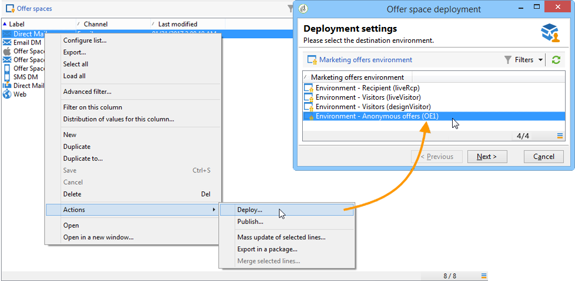

# Creación de un entorno de prueba{#creating-a-test-environment}

Para crear un entorno de prueba (modo de entorno limitado), siga los siguientes pasos:

>[!IMPORTANT]
>
>Utilice solamente este método de creación de entorno para los entornos de prueba. En todos los demás casos, utilice el asistente de asignación de destino. Para obtener más información, consulte [Creación de un entorno de ofertas](../../interaction/using/live-design-environments.md#creating-an-offer-environment).

1. Inicie el explorador de Adobe Campaign y vaya a la raíz de la instancia.
1. Haga clic con el botón derecho del ratón y añada una **[!UICONTROL Generic folder]** utilizando los menús desplegables.

   

1. A continuación, vaya a la carpeta que acaba de crear y añada un **[!UICONTROL Offer environment]** con los menús de clic con el botón derecho.

   

1. Aplique el mismo proceso para crear los elementos y las subcarpetas de entorno.
1. Una vez que haya finalizado las pruebas y desee utilizar el entorno en producción, duplique las ofertas y espacios en el entorno de diseño. (Haga clic con el botón derecho en > **[!UICONTROL Actions]** > **[!UICONTROL Deploy]** ).

   
