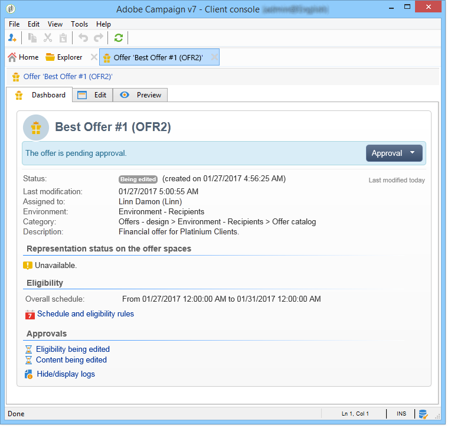

# Creación de una oferta{#creating-an-offer}

## Creación de la oferta {#creating-the-offer}

Para crear una oferta, aplique los pasos siguientes:

1. Vaya al **[!UICONTROL Campaigns]** universo y haga clic en el **[!UICONTROL Offers]** vínculo.

   

1. Haga clic en el botón **[!UICONTROL Create]**.

   

1. Cambie la etiqueta y seleccione la categoría a la que debe pertenecer la oferta.

   

1. Haga clic en **[!UICONTROL Save]** para crear la oferta.

   

   La oferta está disponible en la plataforma y se puede configurar su contenido.

   

## Configuración de la idoneidad de la oferta {#configuring-offer-eligibility}

In the **[!UICONTROL Eligibility]** tab, define the period the offer will be valid for and can be presented, the filters to apply to the target and the offer weight.

### Definición del periodo de elegibilidad de una oferta {#defining-the-eligibility-period-of-an-offer}

Para definir el periodo de elegibilidad de la oferta, utilice las listas desplegables y seleccione una fecha de inicio y de finalización en el calendario.


Fuera de estas fechas, el motor de interacción no selecciona la oferta. Si también se han configurado las fechas de idoneidad para la categoría de oferta, se aplica el período más restrictivo.

### Filtros en el destino {#filters-on-the-target}

Se puede aplicar filtros al objetivo de oferta.

To do this, click the **[!UICONTROL Edit query]** link and select the filter you want to apply. (Consulte [esta sección](../../platform/using/steps-to-create-a-query.md#step-4---filter-data)).


Si ya se han creado filtros predefinidos, puede seleccionarlos de la lista de filtros de usuario. Para obtener más información sobre esto, consulte [Creación de filtros](../../interaction/using/creating-predefined-filters.md)predefinidos.


### Ponderación de la oferta {#offer-weight}

Para permitir que el motor decida entre varias ofertas para las que el objetivo es apto, se debe asignar una o más ponderaciones a la oferta. Asimismo, se puede aplicar filtros al destino si es necesario o restringir el espacio de oferta al que se aplicará la ponderación. Se prefiere una oferta con una ponderación más significativa sobre una oferta con menos ponderación.

Se puede configurar múltiples ponderaciones para la misma oferta, por ejemplo, para distinguir subperiodos, objetivos específicos o incluso un espacio de oferta.

Por ejemplo, una oferta puede tener una ponderación de A para los contactos de 18 a 25 años de edad y una ponderación de B para los contactos que se encuentran por encima de dicho rango. Si una oferta es apta para todos los verano, también puede tener una ponderación de A en julio y un ponderación de B en agosto.

>[!NOTE]
>
>Las ponderación asignada se puede modificar de forma temporal de acuerdo con los parámetros de la categoría a la que pertenece la oferta. Para obtener más información sobre esto, consulte [Creación de categorías](../../interaction/using/creating-offer-categories.md)de ofertas.

Para crear una ponderación en una oferta, siga los siguientes pasos:

1. Haga clic **[!UICONTROL Add]**.

   

1. Cambie la etiqueta y asigne un peso. De forma predeterminada, se establece en 1.

   

   >[!CAUTION]
   >
   >Si no se introduce ningún peso (0), el objetivo no se considera apto para la oferta.

1. Si desea que el peso se aplique durante un período determinado, defina las fechas de idoneidad.

   

1. Si es necesario, limite el peso a un espacio de oferta específico.

   

1. Aplicar un filtro a un destino.

   

1. Haga clic **[!UICONTROL OK]** para guardar el peso.

   

   >[!NOTE]
   >
   >Si un objetivo es apto para múltiples pesos para una oferta seleccionada, el motor mantiene el mejor peso (más alto). Al llamar al motor de oferta, se selecciona una oferta por un máximo de una vez por contacto.

### Un resumen de las reglas de idoneidad para la oferta {#a-summary-of-offer-eligibility-rules}

Una vez completada la configuración, se encontrará disponible un resumen de las reglas de elegibilidad en el panel de ofertas.

Para verlo, haga clic en el **[!UICONTROL Schedule and eligibility rules]** vínculo.


## Creación de contenidos de las ofertas {#creating-the-offer-content}

1. Haga clic en la **[!UICONTROL Edit]** ficha y, a continuación, haga clic en la **[!UICONTROL Content]** ficha.

   

1. Complete los distintos campos del contenido de la oferta.

   * **[!UICONTROL Title]** : especifique el título que desea que aparezca en la oferta. Warning: this is not referring to the offer&#39;s label, which is defined in the **[!UICONTROL General]** tab.
   * **[!UICONTROL Destination URL]** :: especifique la dirección URL de la oferta. Para ser procesada correctamente, debe comenzar con “http://” o “https://”.
   * **[!UICONTROL Image URL]** :: especifique una dirección URL o una ruta de acceso a la imagen de la oferta.
   * **[!UICONTROL HTML content]** / **[!UICONTROL Text content]** : escriba el cuerpo de la oferta en la ficha que desee. To generate tracking, the **[!UICONTROL HTML content]** must be composed of HTML elements that can be enclosed in a `<div>` type element. For example, the result of a `<table>` element in the HTML page will be as followed:

   ```
      <div> 
       <table>
        <tr>
         <th>Month</th>
         <th>Savings</th>   
        </tr>   
        <tr>    
         <td>January</td>
         <td>$100</td>   
        </tr> 
       </table> 
      </div>
   ```

   La definición de la URL de aceptación se presenta en la sección [Configuración del estado cuando se acepta](../../interaction/using/creating-offer-spaces.md#configuring-the-status-when-the-proposition-is-accepted) la propuesta.

   

   To find the required fields as they were defined during offer space configuration, click the **[!UICONTROL Content definitions]** link to display the list. Para obtener más información sobre esto, consulte [Creación de espacios](../../interaction/using/creating-offer-spaces.md)de ofertas.

   

   En este ejemplo, la oferta debe incluir un título, una imagen, contenido HTML y una dirección URL de destino.

## Previsualización de la oferta {#previewing-the-offer}

Tan pronto como se haya configurado el contenido de la oferta, obtiene una vista previa de la oferta tal y como aparece para su destinatario. Para ello:

1.  Haga clic en la **[!UICONTROL Preview]** ficha.

   

1. Seleccione la representación de la oferta que desee ver.

   

1. Si ha personalizado el contenido de la oferta, seleccione el objetivo de la oferta para ver la personalización.

   

## Creación de una hipótesis sobre una oferta {#creating-a-hypothesis-on-an-offer}

Puede crear hipótesis en sus propuestas de oferta. Esto le permite determinar el impacto de las ofertas en las compras realizadas para el producto.

>[!NOTE]
>
>Estas hipótesis se llevan a cabo mediante el Administrador de respuestas. Compruebe el acuerdo de licencia.

Hypotheses carried out on an offer proposition are referenced in their **[!UICONTROL Measure]** tab.

La creación de la hipótesis se detalla en [esta página](../../campaign/using/about-response-manager.md).


