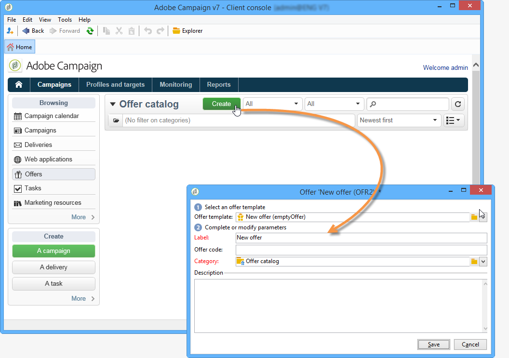

# Creación de una oferta{#creating-an-offer}

## Creación de la oferta {#creating-the-offer}

Para crear una oferta, aplique los pasos siguientes:

1. Vaya a la pestaña **[!UICONTROL Campaigns]** y haga clic en el vínculo **[!UICONTROL Offers]**.

   

1. Haga clic en el botón **[!UICONTROL Create]**.

   

1. Cambie la etiqueta y seleccione la categoría a la que debe pertenecer la oferta.

   

1. Haga clic en **[!UICONTROL Save]** para crear la oferta.

   

   La oferta está disponible en la plataforma y se puede configurar su contenido.

   

## Configuración de la idoneidad de la oferta {#configuring-offer-eligibility}

En la pestaña **[!UICONTROL Eligibility]**, defina el periodo de validez y de presentación de la oferta, los filtros que se desea aplicar al objetivo y a la ponderación de la oferta.

### Definición del periodo de elegibilidad de una oferta {#defining-the-eligibility-period-of-an-offer}

Para definir el periodo de elegibilidad de la oferta, utilice las listas desplegables y seleccione una fecha de inicio y de finalización en el calendario.


Fuera de estas fechas, el motor de interacción no selecciona la oferta. Si también se han configurado las fechas de idoneidad para la categoría de oferta, se aplica el periodo más restrictivo.

### Filtros en el destino {#filters-on-the-target}

Se puede aplicar filtros al objetivo de oferta.

Para ello, haga clic en el vínculo **[!UICONTROL Edit query]** y seleccione el filtro que desea aplicar. (Consulte [esta sección](../../platform/using/steps-to-create-a-query.md#step-4---filter-data)).


Si ya se han creado filtros predefinidos, puede seleccionarlos de la lista de filtros de usuario. Para obtener más información, consulte [esta página](../../interaction/using/creating-predefined-filters.md),


### Ponderación de la oferta {#offer-weight}

Para permitir que el motor decida entre varias ofertas para las que el objetivo es apto, se debe asignar una o más ponderaciones a la oferta. Asimismo, se puede aplicar filtros al destino si es necesario o restringir el espacio de oferta al que se aplicará la ponderación. Se prefiere una oferta con una ponderación más significativa sobre una oferta con menos ponderación.

Se puede configurar múltiples ponderaciones para la misma oferta, por ejemplo, para distinguir subperiodos, objetivos específicos o incluso un espacio de oferta.

Por ejemplo, una oferta puede tener una ponderación de A para los contactos de 18 a 25 años de edad y una ponderación de B para los contactos que se encuentran por encima de dicho rango. Si una oferta es apta para todos los verano, también puede tener una ponderación de A en julio y un ponderación de B en agosto.

>[!NOTE]
>
>La ponderación asignada se puede modificar de forma temporal de acuerdo con los parámetros de la categoría a la que pertenece la oferta. Para obtener más información, consulte [Creación de categorías de oferta](../../interaction/using/creating-offer-categories.md).

Para crear una ponderación en una oferta, siga los siguientes pasos:

1. Haga clic en **[!UICONTROL Add]**.

   

1. Cambie la etiqueta y asigne un peso. De forma predeterminada, se establece en 1.

   

   >[!IMPORTANT]
   >
   >Si no se introduce ningún peso (0), el objetivo no se considera apto para la oferta.

1. Si desea que el peso se aplique durante un periodo determinado, defina las fechas de idoneidad.

   

1. Si es necesario, limite el peso a un espacio de oferta específico.

   

1. Aplicar un filtro a un destino.

   

1. Haga clic en **[!UICONTROL OK]** para guardar la ponderación.

   

   >[!NOTE]
   >
   >Si un objetivo es apto para múltiples pesos para una oferta seleccionada, el motor mantiene el mejor peso (más alto). Al llamar al motor de oferta, se selecciona una oferta por un máximo de una vez por contacto.

### Resumen de las reglas de idoneidad para la oferta {#a-summary-of-offer-eligibility-rules}

Una vez completada la configuración, se encontrará disponible un resumen de las reglas de elegibilidad en el panel de ofertas.

Para visualizarlo, haga clic en el vínculo **[!UICONTROL Schedule and eligibility rules]**.


## Creación de contenidos de las ofertas {#creating-the-offer-content}

1. Haga clic en la pestaña **[!UICONTROL Edit]** y luego en la pestaña **[!UICONTROL Content]**.

   

1. Complete los distintos campos del contenido de la oferta.

   * **[!UICONTROL Title]** : especifique el título que desea que aparezca en la oferta. Advertencia: esto no hace referencia a la etiqueta de la oferta, la cual se define en la pestaña **[!UICONTROL General]**.
   * **[!UICONTROL Destination URL]**: especifique la URL de la oferta. Para ser procesada correctamente, debe comenzar con “http://” o “https://”.
   * **[!UICONTROL Image URL]**: especifique una dirección URL o un trazado de acceso a la imagen de la oferta.
   * **[!UICONTROL HTML content]** / **[!UICONTROL Text content]** : introduzca el cuerpo de la oferta en la pestaña que desee. Para generar un seguimiento, el **[!UICONTROL HTML content]** debe estar compuesto por elementos HTML que se puedan incluir en un elemento de tipo `<div>` Por ejemplo, el resultado de un elemento en la página HTML estará seguido por:`<table>`

   ```
      <div> 
       <table>
        <tr>
         <th>Month</th>
         <th>Savings</th>   
        </tr>   
        <tr>    
         <td>January</td>
         <td>$100</td>   
        </tr> 
       </table> 
      </div>
   ```

   La definición de la URL de aceptación se presenta en la sección [Configuring the status when the proposition is accepted](../../interaction/using/creating-offer-spaces.md#configuring-the-status-when-the-proposition-is-accepted).

   

   Para buscar los campos requeridos tal y como estaban definidos durante la configuración del espacio de oferta, haga clic en el vínculo **[!UICONTROL Content definitions]** para mostrar la lista. Para obtener más información, consulte [Creación de espacios de ofertas](../../interaction/using/creating-offer-spaces.md).

   

   En este ejemplo, la oferta debe incluir un título, una imagen, contenido HTML y una dirección URL de destino.

## Previsualización de la oferta {#previewing-the-offer}

Tan pronto como se haya configurado el contenido de la oferta, obtiene una vista previa de la oferta tal y como aparece para su destinatario. Para ello:

1. Seleccione la pestaña **[!UICONTROL Preview]**.

   

1. Seleccione la representación de la oferta que desee ver.

   

1. Si ha personalizado el contenido de la oferta, seleccione el objetivo de la oferta para ver la personalización.

   

## Creación de una hipótesis sobre una oferta {#creating-a-hypothesis-on-an-offer}

Puede crear hipótesis en sus propuestas de oferta. Esto le permite determinar el impacto de las ofertas en las compras realizadas para el producto.

>[!NOTE]
>
>Estas hipótesis se llevan a cabo mediante el Administrador de respuestas. Compruebe el acuerdo de licencia.

Se hace referencia a las hipótesis realizadas en una propuesta de oferta en la pestaña **[!UICONTROL Measure]**.

La creación de la hipótesis se detalla en [esta página](../../campaign/using/about-response-manager.md).


