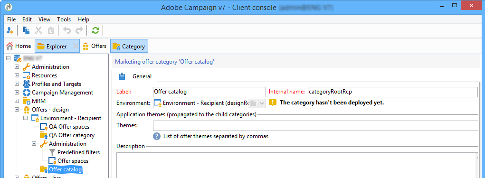

# Creación de categorías de oferta{#creating-offer-categories}

La creación de categorías de ofertas solo puede realizarse en el entorno **[!UICONTROL Design]**. Se implementan automáticamente en el entorno **[!UICONTROL Live]** (es decir, están disponibles) cuando se aprueban las ofertas creadas o modificadas que contienen. De forma predeterminada, el entorno **[!UICONTROL Design]** una categoría para recibir todas las ofertas. Se puede crear subcategorías para añadir jerarquía a las ofertas del catálogo.

Para cada categoría, se pueden definir las fechas de idoneidad, es decir, un punto más allá del cual las ofertas contenidas en la categoría ya no puedan presentarse al objetivo. Si se desea que las ofertas de una categoría específica se seleccionen como una prioridad por el motor de oferta, para exponer mejor un producto por ejemplo, se puede aumentar sus ponderaciones para un periodo determinado añadiendo una ponderación de multiplicación a la categoría.

Para crear una categoría adicional, siga los siguientes pasos:

1. Vaya a la carpeta **[!UICONTROL Offer catalog]**.

   

1. Right click and select **[!UICONTROL Create a new "Offer category" folder]** from the drop-down list.

   

1. Cambie el nombre de la categoría. Se puede editar la etiqueta más adelante mediante la pestaña **[!UICONTROL General]**.

   

   >[!NOTE]
   >
   >Repita estos pasos para crear tantas categorías como sea necesario.

   A continuación, según sea necesario, se puede:

   * Assign eligibility dates from the **[!UICONTROL Eligibility]** tab.

      

   * Enter key words that may be used to select offers from within this category, using the **[!UICONTROL Themes]** field.

      

      >[!NOTE]
      >
      >Al llamar al motor de oferta, solo se selecciona la parte del catálogo en la que coinciden los temas o categorías con los parámetros.

   * Temporarily &quot;boost&quot; the offer weight of a category for a given period via the **[!UICONTROL Multiplier weight]** field.

      

Un resumen de las reglas de idoneidad está disponible en el panel de las ofertas incluidas en la categoría. Para vista, haga clic en el **[!UICONTROL Schedule and eligibility rules of the offer]** vínculo.

