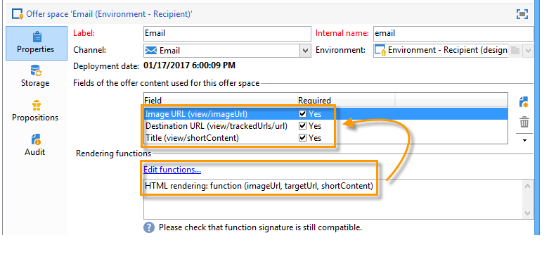
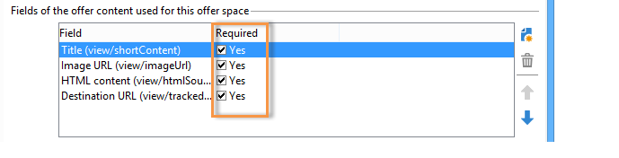

# Creación de espacios de oferta{#creating-offer-spaces}

La creación del espacio de ofertas sólo se puede realizar mediante un **technical administrator** con acceso a la subcarpeta del espacio de oferta. Los espacios de ofertas solo se pueden crear en el entorno de diseño y se duplican automáticamente en el entorno interactivo durante la aprobación de la oferta.

El contenido del catálogo de ofertas se configura en los espacios de oferta. De forma predeterminada, el contenido puede incluir los campos siguientes: **[!UICONTROL Title]**, **[!UICONTROL Destination URL]**, **[!UICONTROL Image URL]**, **[!UICONTROL HTML content]** y **[!UICONTROL Text content]**. La secuencia de campos se configura en el espacio de oferta.

Los parámetros avanzados permiten especificar una clave de identificación de contacto (que puede estar formada por varios elementos, el campo de nombre y de correo electrónico al mismo tiempo, por ejemplo). Para obtener más información, consulte la sección [Presentación de una oferta identificada](../../interaction/using/integration-via-javascript--client-side-.md#presenting-an-identified-offer).

La renderización HTML o XML se crea mediante una función de renderización. La secuencia de los campos definidos en la función de renderización debe ser idéntica a la secuencia configurada en el contenido.



Para crear un grupo de operadores nuevo, siga el proceso a continuación:

1. Vaya a la lista de espacios de ofertas y haga clic en **[!UICONTROL New]**.

   

1. Seleccione el canal que desee utilizar y cambie la etiqueta del espacio de oferta.

   

1. Marque la casilla **[!UICONTROL Enable unitary mode]** si se aplica uno de los siguientes casos:

   * Se utiliza la interacción con el centro de mensajes
   * Se utiliza el modo unitario de interacción (interacciones entrantes)

1. Vaya a la ventana **[!UICONTROL Content field]** y haga clic en **[!UICONTROL Add]**.

   

1. Vaya al nodo **[!UICONTROL Content]** y seleccione los campos en el siguiente orden: **[!UICONTROL Title]**, luego **[!UICONTROL Image URL]**, **[!UICONTROL HTML content]**, y **[!UICONTROL Destination URL]**.

   

1. Marque la casilla **[!UICONTROL Required]** para que cada campo sea obligatorio.

   >[!NOTE]
   >
   >Esta configuración se utiliza en la vista previa y ofrece espacios de oferta no válidos al publicar si falta uno de los elementos obligatorios en la oferta en cuestión. Sin embargo, si una oferta ya está en directo en un espacio de oferta, estos criterios no se tienen en cuenta.

   

1. Haga clic en **[!UICONTROL Edit functions]** para crear una función de renderización.

   Estas funciones se utilizan para generar representaciones de oferta en un espacio de oferta. Existen varios formatos posibles: HTML o texto para interacciones salientes y XML para interacciones entrantes.

   

1. Vaya a la pestaña **[!UICONTROL HTML rendering]** y seleccione **[!UICONTROL Overload the HTML rendering function]**.
1. Inserte la función de renderización.

   

Si es necesario, se puede sobrecargar las funciones de renderización XML para las interacciones entrantes. También se puede sobrecargar las funciones de renderización de texto y HTML para las interacciones salientes. Para más información, consulte [Acerca de los canales entrantes](../../interaction/using/about-inbound-channels.md).

## Estados de propuesta de oferta {#offer-proposition-statuses}

Una propuesta de oferta puede tener varios estados en función de las interacciones con la población de destino. La interacción viene con un conjunto de valores que pueden aplicarse a la propuesta de oferta a lo largo de su ciclo de vida. Sin embargo, se debe configurar la plataforma para que el estado cambie cuando se cree y acepte la propuesta de oferta.

>[!NOTE]
>
>El estado de la propuesta de oferta no se actualiza inmediatamente. Se lleva a cabo mediante el flujo de trabajo de seguimiento, que se activa cada hora.

### Lista de estado {#status-list}

La interacción viene con los siguientes valores que pueden utilizarse para calificar el estado de una propuesta de oferta:

* **[!UICONTROL Accepted]**.
* **[!UICONTROL Scheduled]**.
* **[!UICONTROL Generated]**.
* **[!UICONTROL Interested]**.
* **[!UICONTROL Presented]**.
* **[!UICONTROL Rejected]**.

Estos valores no se aplican de forma predeterminada: tienen que configurarse.

>[!NOTE]
>
>El estado de una propuesta de oferta se cambia automáticamente a “Presented” si la oferta está vinculada a una entrega con el estado “Sent”.

### Configuración del estado cuando se crea la propuesta {#configuring-the-status-when-the-proposition-is-created}

Cuando el motor de interacción crea una propuesta de oferta, su estado cambia, ya sea una interacción entrante o saliente. La elección entre estos dos valores depende de la forma en que se configuren los espacios de oferta en el entorno **[!UICONTROL Design]**.

Para cada espacio, se puede configurar el estado que se desee aplicar cuando se cree una propuesta, según la información que se desee mostrar en los informes de oferta.

Para ello, utilice el proceso siguiente:

1. Vaya a la pestaña **[!UICONTROL Storage]** del espacio deseado.
1. Seleccione el estado que desea aplicar a la propuesta cuando se cree.

   

### Configuración del estado cuando se acepta la propuesta {#configuring-the-status-when-the-proposition-is-accepted}

Una vez aceptada la propuesta de oferta, se puede utilizar uno de los valores proporcionados de forma predeterminada para configurar el nuevo estado de la propuesta. La actualización es efectiva cuando un destinatario hace clic en un vínculo de la oferta, lo cual llama al motor de interacción.

Para ello, utilice el proceso siguiente:

1. Vaya a la pestaña **[!UICONTROL Storage]** del espacio deseado.
1. Seleccione el estado que desea aplicar a la propuesta cuando se acepte.

   

**Interacción entrante**

La pestaña **[!UICONTROL Storage]** permite definir los estados para oferta **proposed** y **accepted** únicamente. Para la interacción entrante, el estado de las propuestas de oferta debe especificarse directamente en la dirección URL para llamar al motor de oferta, en lugar de a través de la interfaz. De este modo, se puede especificar qué estado aplicar en otros casos, por ejemplo si se rechaza una propuesta de oferta.

```
<BASE_URL>?a=UpdateStatus&p=<PRIMARY_KEY_OF_THE_PROPOSITION>&st=<NEW_STATUS_OF_THE_PROPOSITION>&r=<REDIRECT_URL>
```

Por ejemplo, la propuesta (identificador **40004**) que coincide con la oferta de **Home insurance** mostrada en el sitio **Neobank** contiene la siguiente dirección URL:

```
<BASE_URL>?a=UpdateStatus&p=<40004>&st=<3>&r=<"http://www.neobank.com/insurance/subscribe.html">
```

En cuanto un visitante hace clic en la oferta y, por lo tanto, en la dirección URL, el estado **[!UICONTROL Accepted]** (valor **3**) se aplica a la propuesta y el visitante se redirige a una nueva página del sitio **Neobank** para obtener el contrato de seguro.

>[!NOTE]
>
>Si se desea especificar otro estado en la dirección URL (por ejemplo, si se rechaza una propuesta de oferta), se debe utilizar el valor correspondiente al estado deseado. Ejemplo: **[!UICONTROL Rejected]** = &quot;5&quot;, **[!UICONTROL Presented]** = &quot;1&quot; y así sucesivamente.
>
>Los estados y sus valores se pueden recuperar en el esquema de datos **[!UICONTROL Offer propositions (nms)]**. Para obtener más información, consulte [esta página](../../configuration/using/data-schemas.md).

**Interacción saliente**

Si se trata de una interacción saliente, se puede aplicar automáticamente el estado **[!UICONTROL Interested]** a una propuesta de oferta cuando la entrega contiene un vínculo. Simplemente añada el valor **_urlType=&quot;11&quot;** al vínculo:

```
<a _urlType="11" href="<DEST_URL>">Link inserted into the delivery</a>
```

## Vista previa de oferta por espacio {#offer-preview-per-space}

En esta pestaña, se puede ver las ofertas para las que el destinatario es elegible mediante un método elegido. En el siguiente ejemplo, el destinatario es elegible para las tres propuestas de oferta por correo electrónico.


Si un destinatario no es elegible para ninguna oferta, esto se muestra en la vista previa.


La vista previa puede omitir los contextos cuando están restringidos a un espacio. Este es el caso cuando el esquema de interacción se ha ampliado para añadir campos a los que se hace referencia en un espacio mediante un canal entrante (para más información, consulte [Ejemplo de ampliación](../../interaction/using/extension-example.md)).
