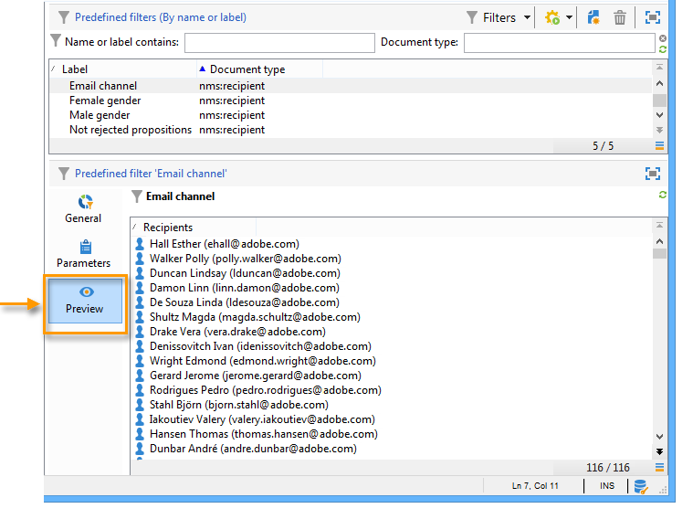

# Creación de filtros predefinidos{#creating-predefined-filters}

Los filtros predefinidos permiten crear reglas de idoneidad para la población de destino que se puede reutilizar fácilmente durante la creación de la oferta. Son específicos a cada entorno y toman en cuenta los parámetros de oferta.

Para crear un filtro, siga los siguientes pasos:

1. Vaya a la carpeta **[!UICONTROL Administration]** y seleccione **[!UICONTROL Pre-defined offer filters]**.

   

1. Haga clic en **[!UICONTROL New]**.

   

1. Cambie la etiqueta para poder identificar el filtro más adelante.

   

1. Seleccione el campo va a corresponder a la condición de filtrado.

   

1. Seleccione un operador y un valor si es necesario y, luego, guarde la consulta.

   

1. Haga clic en **[!UICONTROL Preview]** para ver el resultado del filtro.

   
