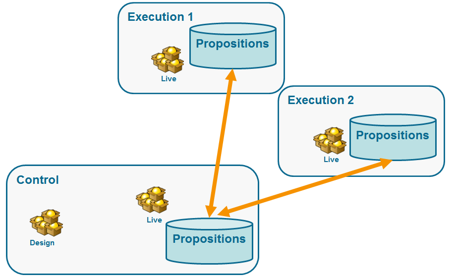

# Arquitecturas distribuidas{#distributed-architectures}

## Principio {#principle}

Para poder admitir la escalabilidad y proporcionar un servicio de 24 horas al día en el canal entrante, se puede utilizar la interacción con una arquitectura distribuida. Este tipo de arquitectura ya se utiliza con el centro de mensajes y se compone de varias instancias:

* una o varias instancias de control dedicadas al canal saliente y que contienen la base de diseño de entorno y mercadotecnia.
* una o varias instancias de ejecución dedicadas al canal entrante


>[!NOTE]
>
>Las instancias de control están dedicadas al canal entrante y contienen la versión en línea del catálogo. Cada instancia de ejecución es independiente y está dedicada a un segmento de contacto (por ejemplo, una instancia de ejecución por país). Las llamadas al motor de oferta deben realizarse directamente en la ejecución (una dirección URL específica por instancia de ejecución). Como la sincronización entre instancias no es automática, las interacciones del mismo contacto deben enviarse a través de la misma instancia.

## Sincronización de propuestas {#proposition-synchronization}

La sincronización de ofertas se lleva a cabo mediante paquetes. En instancias de ejecución, todos los objetos de catálogo están prefijados con el nombre de cuenta externo. Esto significa que se pueden admitir varias instancias de control (instancias de desarrollo y producción por ejemplo) en una misma instancia de ejecución.

>[!IMPORTANT]
>
>Se recomienda utilizar nombres internos cortos y explícitos.

Las ofertas se implementan automáticamente y se publican en instancias de ejecución y control.

Las ofertas eliminadas en el entorno de diseño se desactivan en todas las instancias en línea. Las propuestas y ofertas obsoletas se eliminan automáticamente en todas las instancias después del periodo de depuración (especificado en el asistente de implementación de cada instancia) y de deslizamiento (especificado en las reglas de tipología de propuestas entrantes).



Se crea un flujo de trabajo para cada entorno y cuenta externa para la sincronización de propuestas. La frecuencia de sincronización se puede ajustar para cada entorno y cuenta externa.

## Limitaciones {#limitations}

* Si se utiliza la función de reserva de un entorno anónimo a un entorno identificado, estos dos entornos deben estar en la misma instancia de ejecución.
* La sincronización entre varias instancias de ejecución no se realiza en tiempo real. Las interacciones del mismo contacto deben enviarse a la misma instancia. La instancia de control debe estar dedicada al canal saliente (sin tiempo real).
* La base de datos de mercadotecnia no se sincroniza automáticamente. Los datos de mercadotecnia utilizados en las ponderaciones y reglas de elegibilidad deben duplicarse en las instancias de ejecución. Este proceso no se considera estándar, se debe desarrollarlo durante el periodo de integración.
* La sincronización de propuestas se realiza exclusivamente mediante la conexión FDA.
* Si se utiliza interacción y centro de mensajes en la misma instancia, la sincronización se va a producir mediante el protocolo FDA en ambos casos.

## Configuración de paquetes {#packages-configuration}

Las extensiones de esquema directamente vinculadas a **interaction** (ofertas, propuestas, destinatarios, etc.) deben implementarse en las instancias de ejecución.

El paquete de interacción debe estar instalado en todas las instancias (control y ejecución). Hay dos paquetes adicionales disponibles: un paquete que se va a instalar en las instancias de control y otro que se va a instalar en cada instancia de ejecución.

>[!NOTE]
>
>Al instalar el paquete, los campos de tipo **long** de la tabla **nms:proposition**, como el ID de la propuesta, se convierten en campos de tipo **int64.** Esta tipo de datos se detalla en [esta sección](../../configuration/using/schema-structure.md#mapping-the-types-of-adobe-campaign-dbms-data).

La duración de la retención de datos debe configurarse en cada instancia (a través de la ventana **[!UICONTROL Data purge]** en el asistente de implementación). En instancias de ejecución, este periodo debe corresponder a la profundidad histórica necesaria para las reglas de tipología (punto de deslizamiento) y para las reglas de idoneidad que se van a calcular.

En las instancias de control:

1. Cree una cuenta externa mediante la instancia de ejecución:

   

   * Complete la etiqueta y añada un nombre interno corto y explícito.
   * Seleccione el **[!UICONTROL Execution instance]**.
   * Marque la opción **[!UICONTROL Enabled]**.
   * Complete los parámetros de conexión para la instancia de ejecución.
   * Cada instancia de ejecución debe estar vinculada a una ID. Esta ID se asigna al hacer clic en el botón **[!UICONTROL Initialize connection]**.
   * Compruebe el tipo de aplicación utilizada:  **[!UICONTROL Message Center]**, **[!UICONTROL Interaction]** o ambas.
   * Introduzca la cuenta de FDA utilizada. Se debe crear un operador en las instancias de ejecución y debe tener los siguientes derechos de lectura y escritura en la base de datos de la instancia en cuestión:

      ```
      grant SELECT ON nmspropositionrcp, nmsoffer, nmsofferspace, xtkoption, xtkfolder TO user;
      grant DELETE, INSERT, UPDATE ON nmspropositionrcp TO user;
      ```
   >[!NOTE]
   >
   >La dirección IP de la instancia de control debe estar autorizada en las instancias de ejecución.

1. Configure el entorno:

   

   * Añada la lista de instancias de ejecución.
   * Para cada uno, especifique el periodo de sincronización y los criterios de filtro (por ejemplo, por país).

      >[!NOTE]
      >
      >Si aparece un error, se puede consultar los flujos de trabajo de sincronización y ofrecer notificaciones. Se pueden encontrar en los flujos de trabajo técnicos de la aplicación.

Si, por razones de optimización, solo parte de la base de datos de mercadotecnia se duplica en las instancias de ejecución, se puede especificar un esquema restringido vinculado al entorno para permitir que los usuarios solo utilicen los datos disponibles en las instancias de ejecución. Se puede crear una oferta mediante datos que no estén disponibles en instancias de ejecución. Para ello, se debe desactivar la regla en los demás canales limitando esta regla en el canal saliente (campo **[!UICONTROL Taken into account if]**).


## Opciones de mantenimiento {#maintenance-options}

A continuación, se muestra una lista de opciones de mantenimiento disponibles en la instancia de control:

>[!IMPORTANT]
>
>Estas opciones solo deben utilizarse para casos de mantenimiento específicos.

* **`NmsInteraction_LastOfferEnvSynch_<offerEnvId>_<executionInstanceId>`**: la última fecha en la que se sincronizó un entorno en una instancia determinada.
* **`NmsInteraction_LastPropositionSynch_<propositionSchema>_<executionInstanceIdSource>_<executionInstanceIdTarget>`**: la última fecha en que se sincronizaron propuestas de un esquema determinado desde una instancia a otra.
* **`NmsInteraction_MapWorkflowId`**: una opción que contiene la lista de todos los flujos de trabajo de sincronización generados.

La siguiente opción está disponible en instancias de ejecución:

**NmsExecutionInstanceId**: opción que contiene la ID de instancia.

## Instalación de paquetes {#packages-installation}

Si la instancia no ha tenido el paquete de interacción anteriormente, no es necesario realizar ninguna migración. De forma predeterminada, la tabla de propuestas se encuentra en 64 bits después de instalar los paquetes.

>[!IMPORTANT]
>
>En función del volumen de las propuestas existentes en la instancia, esta operación puede tardar unos minutos.

* Si la instancia tiene pocas propuestas o ninguna, no es necesario realizar ninguna modificación manual de la tabla de propuestas. La modificación se realiza cuando se instalan los paquetes.
* Si la instancia tiene muchas propuestas, es mejor cambiar la estructura de la tabla de propuestas antes de instalar los paquetes de control y ejecutarlos. Se recomienda ejecutar las consultas durante un periodo de baja actividad.

>[!NOTE]
>
>Si se ha realizado configuraciones específicas en la tabla de propuestas, adapte las consultas según corresponda.

### PostgreSQL {#postgresql}

Existen dos modos: El primero (con una tabla de trabajo) es ligeramente más rápido.

**Tabla de trabajo**

```
CREATE TABLE NmsPropositionRcp_tmp AS SELECT * FROM nmspropositionrcp WHERE 0=1;
ALTER TABLE nmspropositionrcp_tmp
  ALTER COLUMN ipropositionid TYPE bigint,
  ALTER COLUMN iinteractionid TYPE bigint;
INSERT INTO nmspropositionrcp_tmp SELECT * FROM nmspropositionrcp;
DROP TABLE nmspropositionrcp;
CREATE INDEX proposition_id ON NmsPropositionRcp (ipropositionid);
CREATE INDEX nmspropositionrcp_deliveryid ON NmsPropositionRcp (ideliveryid);
CREATE INDEX nmspropositionrcp_lastmodified ON NmsPropositionRcp (tslastmodified);
CREATE INDEX nmspropositionrcp_offerid ON NmsPropositionRcp (iofferid);
CREATE INDEX nmspropositionrcp_offerspaceid ON NmsPropositionRcp (iofferspaceid);
CREATE INDEX nmspropositionrcp_recipientidid ON NmsPropositionRcp (irecipientid);
ALTER TABLE nmspropositionrcp_tmp RENAME TO nmspropositionrcp;
```

**Modificar tabla**

```
ALTER TABLE nmspropositionrcp
  ALTER COLUMN ipropositionid TYPE bigint,
  ALTER COLUMN iinteractionid TYPE bigint;
```

### Oracle {#oracle}

La edición del tamaño de un tipo **Number** no da lugar a valores o a que se reescriba el índice. Por lo tanto, es inmediato.

La consulta que se va a ejecutar es la siguiente:

```
ALTER TABLE nmspropositionrcp MODIFY (
ipropositionid NUMBER(19, 0),
iinteractionid NUMBER(19, 0)
);
```

### MSSQL {#mssql}

Las consultas que se van a ejecutar son las siguientes:

```
SELECT * INTO NmsPropositionRcp_tmp FROM NmsPropositionRcp WHERE 1 = 0;
GO
ALTER TABLE NmsPropositionRcp_tmp ALTER COLUMN ipropositionid BIGINT;
GO
ALTER TABLE NmsPropositionRcp_tmp ALTER COLUMN iinteractionid BIGINT;
GO
INSERT INTO NmsPropositionRcp_tmp SELECT * FROM NmsPropositionRcp;
GO
DROP TABLE NmsPropositionRcp;
GO
sp_rename 'NmsPropositionRcp_tmp', NmsPropositionRcp
GO
ALTER TABLE NmsPropositionRcp ADD DEFAULT ((0)) FOR dWeight
GO
ALTER TABLE NmsPropositionRcp ADD DEFAULT ((0)) FOR iDeliveryId
GO
ALTER TABLE NmsPropositionRcp ADD DEFAULT ((0)) FOR iEngineType
GO
ALTER TABLE NmsPropositionRcp ADD DEFAULT ((0)) FOR iInteractionId
GO
ALTER TABLE NmsPropositionRcp ADD DEFAULT ((0)) FOR iOfferId
GO
ALTER TABLE NmsPropositionRcp ADD DEFAULT ((0)) FOR iOfferSpaceId
GO
ALTER TABLE NmsPropositionRcp ADD DEFAULT ((0)) FOR iPropositionId
GO
ALTER TABLE NmsPropositionRcp ADD DEFAULT ((0)) FOR iRank
GO
ALTER TABLE NmsPropositionRcp ADD DEFAULT ((0)) FOR iRecipientId
GO
ALTER TABLE NmsPropositionRcp ADD DEFAULT ((0)) FOR iStatus
GO
CREATE NONCLUSTERED INDEX NmsPropositionRcp_deliveryId ON NmsPropositionRcp (iDeliveryId)
GO
CREATE NONCLUSTERED INDEX NmsPropositionRcp_eventDate ON NmsPropositionRcp (tsEvent)
GO
CREATE UNIQUE NONCLUSTERED INDEX NmsPropositionRcp_id ON NmsPropositionRcp (iPropositionId)
GO
CREATE NONCLUSTERED INDEX NmsPropositionRcp_lastModified ON NmsPropositionRcp (tsLastModified)
GO
CREATE NONCLUSTERED INDEX NmsPropositionRcp_offerId ON NmsPropositionRcp (iOfferId)
GO
CREATE NONCLUSTERED INDEX NmsPropositionRcp_offerSpaceI ON NmsPropositionRcp (iOfferSpaceId)
GO
CREATE NONCLUSTERED INDEX NmsPropositionRcp_recipientId ON NmsPropositionRcp (iRecipientId)
GO
```

