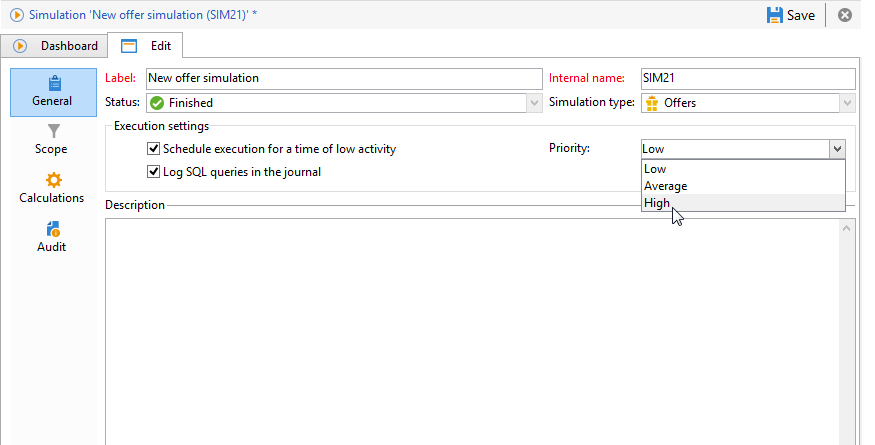

# Configuración de ejecución{#execution-settings}

En caso necesario, se pueden especificar los ajustes de ejecución al crear la simulación. Estos ajustes permiten ejecutar la simulación durante un periodo de baja actividad en función de su prioridad o guardar consultas SQL en el registro. Este paso es opcional.

Estos ajustes se pueden cambiar posteriormente en la pestaña **[!UICONTROL General]** de la ventana de simulación.

* **[!UICONTROL Schedule execution for a time of low activity]**: permite programar la simulación en función de la prioridad elegida (baja, media o alta) para optimizar el rendimiento de Adobe Campaign.
* **[!UICONTROL Priority]**: este es el nivel que se aplica a la simulación para programarla. Cuando se marca la opción **[!UICONTROL Schedule execution for a time of low activity]**, el flujo de trabajo del procesamiento de la campaña selecciona un periodo de actividad baja para iniciarla.
* **[!UICONTROL Log SQL queries in the journal]**: esta opción solo es para usuarios expertos. Permite añadir una pestaña al registro que muestra las consultas SQL para detectar los posibles fallos de funcionamiento, en caso de que la simulación termine con errores.
