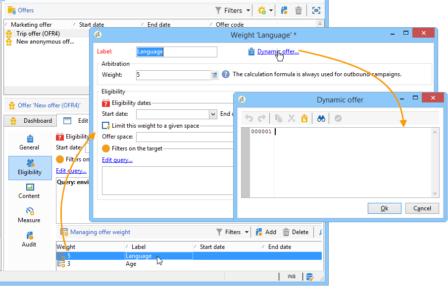

# Enlaces{#hooks}

Los vínculos en interacción permiten modificar el **comportamiento del motor estándar**.

Los vínculos **[!UICONTROL Target loading]** y **[!UICONTROL Proposition post-processing]** están configurados, en Adobe Campaign, en el espacio de oferta:


El vínculo **[!UICONTROL Dynamic offer]** se configura con la ponderación de oferta en Adobe Campaign:



## Carga de objetivos {#target-loading}

Este vínculo permite enriquecer el perfil del contacto (que ha cargado la consulta predeterminada) con datos adicionales de un sistema externo.

Los datos recopilados deben insertarse en el nodo de datos de llamada (nodo interacción). El integrador debe haber ampliado el esquema de datos de llamada previamente para definir la estructura de los datos recopilados. El usuario puede acceder a estos datos del mismo modo que para los datos de llamadas estándar (a nivel de reglas de idoneidad y de personalización).

**Parámetros de entrada:**

* xmlInteraction (tipo xml): nodo de interacción
* aTargetId (tipo de tabla): identificador de destino
* sUuid230 (tipo de cadena): valor de la cookie permanente uuid230
* sNlid (tipo de cadena): valor de la cookie de sesión nlid

**Parámetros de devolución:**

* nodo de interacción enriquecido (primer parámetro de este vínculo)

>[!NOTE]
>
>El parámetro **xmlInteraction** contiene los datos de llamada y el perfil del contacto que ha cargado la consulta predeterminada.

**Ejemplo:**

```
// Call an external system to get additional data for the target
  var additionalData  = getUrl("https://EXTERNAL_SYSTEM?target=" + encodeURIComponent(aTargetId.join("|")));
  // Enrich the context with this data
  interaction.@additionalData = additionalData;
```

## Procesamiento posterior de la propuesta {#proposition-post-processing-}

Este vínculo permite comprobar la consistencia y la compatibilidad de las propuestas aptas en una interacción determinada. También permite definir una nueva funcionalidad de cálculo de puntuación o de probabilidad.

Ejemplo de utilización de reglas de coherencia:

* Limitación del número de propuestas en la misma llamada, vinculadas al mismo producto o a la misma categoría.
* Presentación solamente de ofertas relacionadas con un producto en la misma interacción.

El procesamiento posterior se ejecuta después de la aplicación de reglas tipología y de la clasificación de propuestas aptas y antes del paso de priorización.

**Parámetros de entrada:**

* aProposition: tabla de propuestas elegibles. Aquí se muestra un ejemplo de la estructura de un elemento de esta tabla.

   ```
   { offer_id:1234,
     weight:2}
   ```

* dicOffer (tipo xml): diccionario de todos los atributos de ofertas aptas (código de oferta, identificación de categoría, nombre completo de categoría, fecha de inicio, fecha de finalización, etiqueta, nombre interno, ID de oferta, campos de oferta adicional). Por ejemplo:

   ```
   { "1242": <offer category-id="61242" categoryFullName="/FULL/PATH/TO/CATEGORY/" code="CODE" endDate="" id="62473" label="LABEL" name="OFR38_OE4" product-id="43" startDate=""/>,
     "1243": ...}
   ```

* xmlTarget (tipo xml): nodo de datos de perfil
* xmlInteraction (tipo xml): nodo de datos de llamada
* iPropNumber (tipo entero): número de ofertas esperadas

**Parámetros de devolución:**

* Lista de propuestas modificadas (primer parámetro del vínculo)
* nodo de interacción modificado

**Ejemplo:**

```
var aReturnedProps = [];

if( aProposition.length > 0 )
{
  var iReturnedProps = 0;
  for( var iPropIdx = 0; iPropIdx < aProposition.length && iReturnedProps < iPropNumber; iPropIdx ++ )
  {
    // Check a consistency rule for instance
    if( true )
    {
      aReturnedProps.push(aProposition[iPropIdx]);
      iReturnedProps++;
    }
  }
}

return aReturnedProps;
```

## Oferta dinámica {#dynamic-offer}

Este vínculo permite realizar una llamada a un motor externo para seleccionar una lista de productos vinculados a una oferta. Se configura en la oferta después de las reglas de idoneidad y antes de la aplicación de reglas de tipología.

Primero, el integrador debe ampliar el esquema **PropositionRcp** de propuestas con la información adicional del producto. Para especificar dónde se van a almacenar los datos, hay un vínculo **[!UICONTROL Proposition being processed]** disponible en la pestaña **[!UICONTROL Storage]** del espacio


**Parámetros de entrada:**

* xmlOffer (tipo xml): oferta (código de oferta, identificación de categoría, nombre completo de categoría, fecha de inicio, fecha de finalización, etiqueta, nombre interno, identificación de oferta, campos de oferta adicionales)
* dWeight: ponderación de contexto (tipo doble)
* xmlTarget (tipo xml): nodo de datos de perfil
* xmlInteraction (tipo xml): nodo de datos de llamada

**Parámetros de devolución:**

Se devuelve una tabla de propuestas por generar. Cada elemento de esta tabla consta de la siguiente información:

* identificador de oferta
* datos adicionales del producto (código de producto, por ejemplo)
* ponderación

>[!NOTE]
>
>El sistema comprueba si la id de oferta es el mismo para los parámetros de entrada y de devolución.

**Ejemplo:**

```
var product = getUrl("https://EXTERNAL_SYSTEM?offerCode=" + encodeURIComponent(xmlOffer.@code));
if( product )
  return [{offer_id: parseInt(String(xmlOffer.@id)), weight: dWeight, productId: product}];
```
