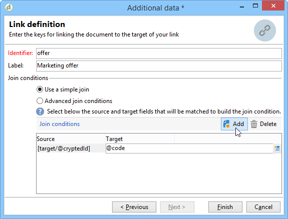
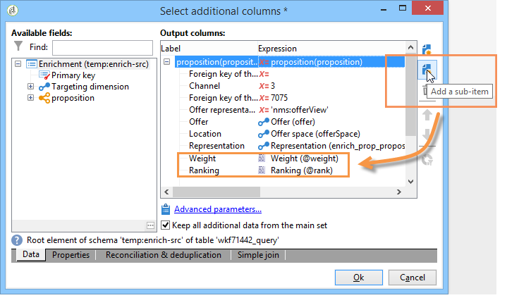

# Integración de una oferta mediante un flujo de trabajo{#integrating-an-offer-via-a-workflow}

Fuera de la actividad de la entrega, varias actividades de flujo de trabajo permiten definir la forma en que se presentan las ofertas:

* Descripción de la entrega
* Enriquecimiento
* Motor de oferta
* Ofertas por celda

## Descripción de la entrega {#delivery-outline}

La actividad de descripción de entrega, disponible en los flujos de trabajo de la campaña, permite presentar ofertas especificadas en una descripción de entrega de la campaña en curso.

1. En un flujo de trabajo, añada una actividad de descripción de la entrega antes de añadir una de entrega.
1. En la actividad del esquema de entrega, especifique el que desee utilizar.

   Para obtener más información sobre la descripción de envíos específicos, consulte la guía [Campaign - MRM](../../campaign/using/marketing-campaign-deliveries.md#associating-and-structuring-resources-linked-via-a-delivery-outline).

1. Rellene los campos disponibles en función de la entrega.
1. Hay dos casos posibles:

   * Si desea acceder al motor de oferta, marque la casilla **[!UICONTROL Restrict the number of propositions selected]**. Especifique el espacio de oferta y el número de propuestas que se presentarán en la entrega.

      El motor de oferta tendrá en cuenta las normas de idoneidad y las consideraciones de oferta.

   * Si no selecciona la casilla, todas las ofertas del esquema de entrega se presentarán sin recurrir al motor de oferta.
   >[!NOTE]
   >
   >La vista previa tiene en cuenta el número de ofertas especificadas en la entrega. Cuando se ejecuta un flujo de trabajo, se tiene en cuenta el número especificado en el esquema de entrega.

   

## Enriquecimiento {#enrichment}

La actividad de enriquecimiento permite añadir ofertas o vínculos a ofertas para los destinatarios de la entrega.

>[!NOTE]
>
>Para obtener más información sobre la actividad de enriquecimiento, consulte la documentación correspondiente en la [guía sobre flujos de trabajo](../../workflow/using/enrichment.md).

Por ejemplo, puede ampliar los datos de una consulta al destinatario antes de una entrega.

Existen dos métodos para especificar propuestas de oferta.

* Especificación de una oferta o acceso al motor de oferta.
* Referencia al vínculo de una oferta.

### Especificación de una oferta o acceso al motor de ofertas {#specifying-an-offer-or-a-call-to-the-offer-engine}

Después de configurar la consulta (consulte la [guía sobre flujos de trabajo](../../workflow/using/query.md)).

1. Añada y abra una actividad de enriquecimiento.
1. En la pestaña **[!UICONTROL Enrichment]**, seleccione **[!UICONTROL Add data]**.
1. Seleccione **[!UICONTROL An offer proposition]** en los tipos de datos que desea añadir.

   

1. Especifique un identificador y una etiqueta para la propuesta a añadir.
1. Especifique la selección de la oferta. Hay dos formas de hacerlo:

   * **[!UICONTROL Search for the best offer in a category]**: marque esta opción y especifique los parámetros de recurso del motor de oferta (espacio de oferta, categoría o temas, fecha de contacto, cantidad de ofertas que desea mantener). Según estos parámetros, el motor calculará automáticamente las ofertas a agregar. Se recomienda completar el campo **[!UICONTROL Category]** o el campo **[!UICONTROL Theme]** en vez de ambos al mismo tiempo.

      

   * **[!UICONTROL A predefined offer]** : marque esta opción y especifique un espacio de oferta, una oferta específica y una fecha de contacto para configurar directamente la oferta que desee añadir, sin recurrir al motor de oferta.

      

1. A continuación, configure una actividad de entrega que corresponda al canal elegido. Para obtener más información sobre esto, consulte la sección [Inserción de una propuesta de oferta en una sección de entrega](../../interaction/using/integrating-an-offer-via-the-wizard.md#inserting-an-offer-proposition-into-a-delivery).

   >[!NOTE]
   >
   >El número de propuestas disponibles para la vista previa depende de la configuración realizada en la actividad de enriquecimiento y no de cualquier configuración realizada directamente en la entrega.

### Referencia al vínculo de una oferta {#referencing-a-link-to-an-offer}

También puede hacer referencia a un vínculo de oferta en una actividad de ampliación.

Para ello, utilice el proceso siguiente:

1.  En la pestaña **[!UICONTROL Enrichment]** de la actividad, seleccione **[!UICONTROL Add data]**.
1. En la ventana donde se elige el tipo de datos a añadir, seleccione **[!UICONTROL A link]**.
1. Seleccione el tipo de vínculo que desea establecer y su destino. En este caso, el destino es el esquema de oferta.

   

1. Especifique el vínculo entre los datos de la lista entrante en la actividad de ampliación (lista de destinatarios) y la lista de oferta. Por ejemplo, se puede vincular un código de oferta a un destinatario.

   

1. A continuación, configure una actividad de entrega que corresponda al canal elegido. Para obtener más información sobre esto, consulte la sección [Inserción de una propuesta de oferta en una sección de entrega](../../interaction/using/integrating-an-offer-via-the-wizard.md#inserting-an-offer-proposition-into-a-delivery).

   >[!NOTE]
   >
   >El número de propuestas disponibles para la vista previa depende de la configuración realizada en la entrega.

### Almacenamiento de calificaciones y consideraciones de oferta {#storing-offer-rankings-and-weights}

De forma predeterminada, cuando se utiliza una actividad **enrichment** para entregar ofertas, sus calificaciones y sus consideraciones no se almacenan en la lista de propuestas.

>[!NOTE]
>
>Recuerde: La actividad **[!UICONTROL Offer engine]** almacena esta información de forma predeterminada.

Sin embargo, se puede almacenar esta información de la siguiente manera:

1. Cree un recurso al motor de oferta en una actividad ampliada colocada después de una consulta y antes de una actividad de entrega. Consulte la sección [Especificación de una oferta o acceso al motor de ofertas](../../interaction/using/integrating-an-offer-via-a-workflow.md#specifying-an-offer-or-a-call-to-the-offer-engine). 
1. En la ventana principal de la actividad, seleccione **[!UICONTROL Edit additional data...]**

   

1. Añada las columnas **[!UICONTROL @rank]** para la clasificación y **[!UICONTROL @weight]** para las ponderaciones de la oferta.

   

1. Confirme su adición y guarde el flujo de trabajo.

La entrega almacena automáticamente la clasificación y las consideraciones de las ofertas. Esta información está visible en la pestaña de la entrega **[!UICONTROL Offers]**.

## Motor de oferta {#offer-engine}

La actividad **[!UICONTROL Offer engine]** también permite definir el acceso al motor de oferta antes de una entrega.

Esta actividad funciona con el mismo principio que la actividad de enriquecimiento con acceso al motor, enriquece los datos de población entrantes con una oferta calculada por el motor antes de una entrega.

Después de configurar la consulta (consulte la [guía sobre flujos de trabajo](../../workflow/using/query.md)).

1. Añada y abra una actividad **[!UICONTROL Offer engine]**.
1. Complete los diferentes campos disponibles para especificar el uso de los parámetros del motor de oferta (ofrecer espacio, categoría o tema, fecha de contacto, número de ofertas que desea mantener). Según estos parámetros, el motor calculará automáticamente las ofertas a agregar.

   >[!NOTE]
   >
   >Advertencia: Si utiliza esta actividad, solo se almacenará la oferta que se haya utilizado en la entrega.

   

1. A continuación, configure una actividad de entrega que corresponda al canal elegido. Para obtener más información sobre esto, consulte la sección [Inserción de una propuesta de oferta en una sección de entrega](../../interaction/using/integrating-an-offer-via-the-wizard.md#inserting-an-offer-proposition-into-a-delivery).

## Ofertas por celda {#offers-by-cell}

La actividad **[!UICONTROL Offers by cell]** permite distribuir la población entrante (desde una consulta por ejemplo) en varios segmentos y especificar una oferta para presentar a cada uno de estos segmentos.

Para ello, utilice el proceso siguiente:

1. Una vez que haya especificado la población destinataria, añada la actividad **[!UICONTROL Offers by cell]** y ábrala.
1. En la pestaña **[!UICONTROL General]**, seleccione el espacio de oferta en el que desea presentar las ofertas.
1. En la pestaña **[!UICONTROL Cells]**, especifique los diferentes subconjuntos con el botón **[!UICONTROL Add]**:

   * Especifique la población del subconjunto utilizando las reglas de filtrado y limitación disponibles.
   * A continuación, seleccione la oferta que desea presentar al subconjunto. Las ofertas disponibles son las admitidas en el entorno de oferta seleccionado en el paso anterior.

      

1. A continuación, configure una actividad de entrega que corresponda al canal elegido. Para obtener más información sobre esto, consulte la sección [Inserción de una propuesta de oferta en una sección de entrega](../../interaction/using/integrating-an-offer-via-the-wizard.md#inserting-an-offer-proposition-into-a-delivery).

