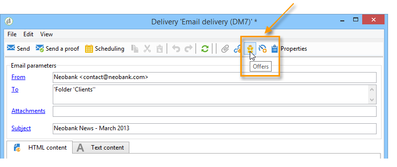
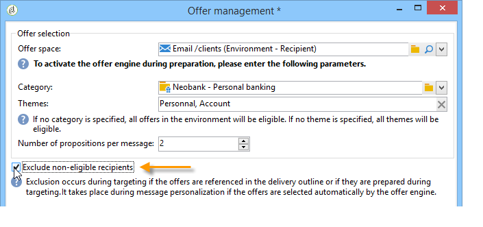

# Integración de una oferta mediante el asistente{#integrating-an-offer-via-the-wizard}

Al crear un envío, existen dos métodos posibles para la integración de ofertas:

* Visualizar el motor de oferta en el cuerpo de un envío.
* Hacer referencia a ofertas a través de las descripciones del envío de una campaña. Este método se utiliza generalmente para campañas en papel.

## Envío con visualización del motor de oferta {#delivering-with-a-call-to-the-offer-engine}

Para presentar una oferta durante una campaña de marketing, simplemente cree una acción de envío clásica basada en el canal elegido. The offer engine is called up when the delivery content is defined, by clicking the **[!UICONTROL Offers]** icon available in the toolbar.

Para obtener más información sobre los envíos y las campañas de marketing, consulte [Envío](../../delivery/using/about-direct-mail-channel.md) y [Campaña](../../campaign/using/setting-up-marketing-campaigns.md).

### Pasos principales para insertar una oferta en un envío {#main-steps-for-inserting-an-offer-into-a-delivery}

Para insertar las propuestas de oferta en un envío, siga los siguientes pasos:

1. En la ventana de envío, haga clic en el icono Ofertas.

   

1. Seleccione el espacio que coincida con el entorno de la oferta.

   

1. Para perfeccionar la elección de las ofertas de motor, seleccione la categoría desde la que se presentan las ofertas, o bien uno o varios temas. Solo se recomienda utilizar uno de estos campos a la vez para evitar sobrecargar las restricciones.

   

   

1. Especifique el número de ofertas que desea insertar en el cuerpo del envío.

   

1. Seleccione la **[!UICONTROL Exclude non-eligible recipients]** opción si es necesario. Para obtener más información sobre esto, consulte [Parámetros para llamar al motor](#parameters-for-calling-offer-engine)de ofertas.

   

1. Si es necesario, seleccione la **[!UICONTROL Do not display anything if no offers are selected]** opción. Para obtener más información sobre esto, consulte [Parámetros para llamar al motor](#parameters-for-calling-offer-engine)de ofertas.

   

1. Inserte las propiedades en el contenido del envío mediante los campos combinados. El número de propuestas disponibles depende del modo en que se configura la visualización del motor y su orden depende de la prioridad de las ofertas.

   

1. Finalice el contenido y realice el envío de la forma habitual.

   

### Parámetros para llamar al motor de oferta {#parameters-for-calling-offer-engine}

* **[!UICONTROL Space]** :: espacio del entorno de ofertas que debe seleccionarse para activar el motor de ofertas.
* **[!UICONTROL Category]** :: carpeta específica en la que se ordenan las ofertas. Si no se especifica ninguna categoría, el motor de oferta llevará a cabo todas las ofertas contenidas en el entorno, a menos que se seleccione un tema.
* **[!UICONTROL Themes]** :: palabras clave definidas en las categorías de arriba. Estos actúan como un filtro y permiten refinar la cantidad de ofertas que se presentarán seleccionándolas de un conjunto de categorías.
* **[!UICONTROL Number of propositions]** :: número de ofertas devueltas por el motor que se pueden insertar en el cuerpo de entrega. Si no se insertan en el mensaje, las ofertas se generarán, pero no se presentarán.
* **[!UICONTROL Exclude non-eligible recipients]** : esta opción permite activar o desactivar la exclusión de destinatarios para los que no haya suficientes ofertas aptas. El número de propuestas puede ser inferior al número solicitado de propuestas. Si se selecciona este cuadro, los destinatarios que no tengan suficientes propuestas se excluirán del envío. Si no selecciona esta opción, estos destinatarios no se excluirán, pero no tendrán el número solicitado de propuestas.
* **[!UICONTROL Do not display anything if no offer is selected]** :: esta opción le permite elegir cómo se procesará el mensaje en caso de que una de las propuestas no exista. Cuando se activa esta casilla, no se muestra la representación de la propuesta que falta y no aparecerá ningún contenido en el mensaje para esta propuesta. Si el cuadro no está activado, el mensaje en sí se cancela durante el envío y los destinatarios ya no recibirán ningún mensaje.

### Inserción de una propuesta de oferta en un envío.{#inserting-an-offer-proposition-into-a-delivery}

La descripción de las ofertas a presentar se inserta en el cuerpo del envío a través de los campos combinados. El número de propuestas se define en los parámetros de acceso al motor de oferta.

El envío se puede personalizar utilizando los campos de la oferta o, en el caso de un email, en las funciones de renderización.

## Entrega con descripción del envío {#delivering-with-delivery-outlines}

También se pueden presentar ofertas en un envío utilizando la descripción del envío.

Para obtener más información sobre la descripción de los envíos, consulte la guía [Campaign - MRM](../../campaign/using/marketing-campaign-deliveries.md#associating-and-structuring-resources-linked-via-a-delivery-outline).

1. Cree una nueva campaña o acceda a una campaña existente.
1. Acceda a los contornos de entrega a través de la ficha **[!UICONTROL Edit]** > **[!UICONTROL Documents]** de la campaña.
1. Add an outline then insert as many offers as you like into it by right-clicking on the outline and selecting **[!UICONTROL New]** > **[!UICONTROL Offer]**, then save the campaign.

   

1. Cree un envío que tenga acceso a la descripción del mismo (por ejemplo, un envío de correo postal).
1. Al editar la entrega, haga clic en **[!UICONTROL Select a delivery outline]**.

   >[!NOTE]
   >
   >Depending on the type of delivery, this option can be found in the **[!UICONTROL Properties]** > **[!UICONTROL Advanced]** menu (for email deliveries for example).

   

1. Using the **[!UICONTROL Offers]** button, you can then configure the offer space as well as the number of offers to present in the delivery.

   

1. Add the propositions into the delivery body using the personalization fields (for more on this, refer to the [Inserting an offer proposition into a delivery](#inserting-an-offer-proposition-into-a-delivery) section), or in the case of a direct mail delivery, by editing the extraction file format.

   Las propuestas se seleccionan entre las ofertas especificadas en la descripción del envío.

   >[!NOTE]
   >
   >La información relativa a las clasificaciones y relevancia de la oferta solo se guarda en la lista de propuestas si las ofertas son generadas directamente en el envío.

