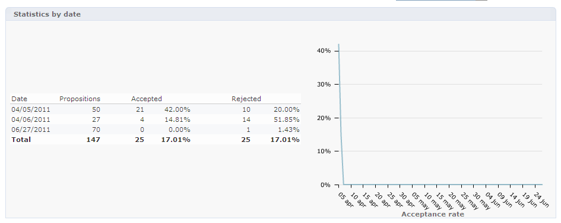

# Informe de análisis de oferta{#offer-analysis-report}

El informe **[!UICONTROL Offer analysis]** proporciona un resumen del número de las propuestas aceptadas o rechazadas.

>[!NOTE]
>
>Esta funcionalidad solo es visible en línea y solo para el gestor de entregas.

Las estadísticas se clasifican según tres criterios:

* Por fecha:

   

* Por espacio:

   

* Por entrega:

   

Los datos se pueden filtrar según los distintos criterios disponibles en la sección superior del informe. Una vez que haya seleccionado los criterios deseados, haga clic en el enlace **[!UICONTROL Refresh]** para aplicarlos al informe.

