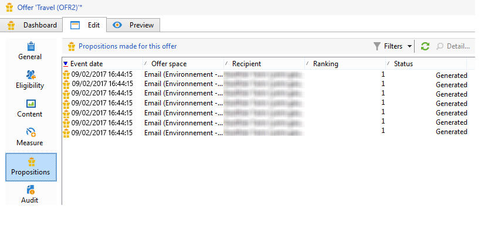
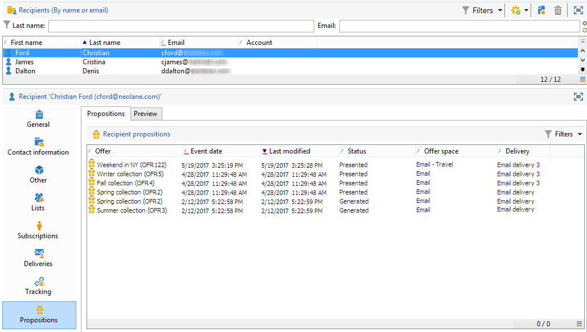
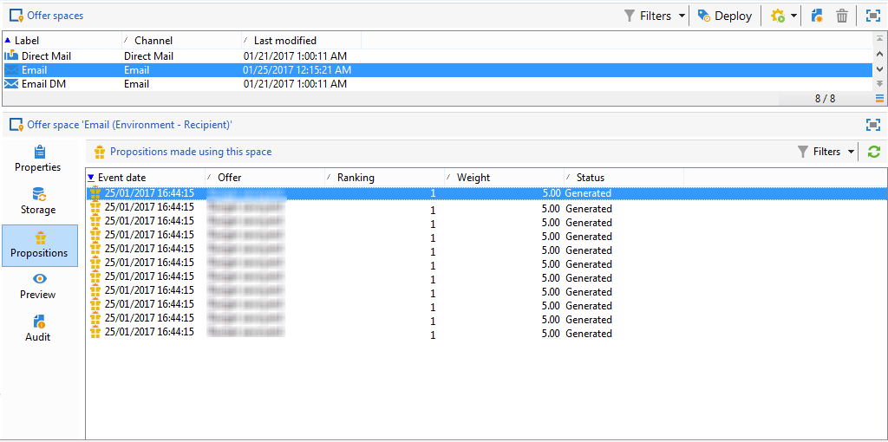

# Historial de propuesta de oferta{#offer-proposition-history}

Una vez que se hayan realizado las propuestas de oferta, podrá visualizar el historial de presentación.

>[!NOTE]
>
>Esta funcionalidad solo es visible en línea y solo para el gestor de entregas.

* En el nivel de oferta, en la pestaña **[!UICONTROL Edit]**, haga clic en **[!UICONTROL Propositions]**.

  

* En el perfil de un destinatario, haga clic en la pestaña **[!UICONTROL Propositions]**.

  

* En el nivel de espacio de oferta, haga clic en la pestaña **[!UICONTROL Propositions]**.

  
