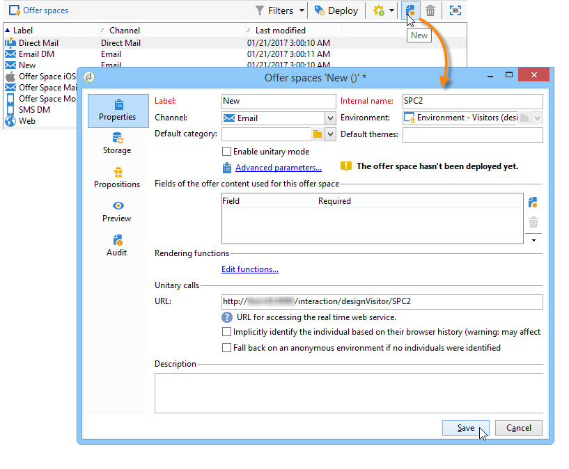
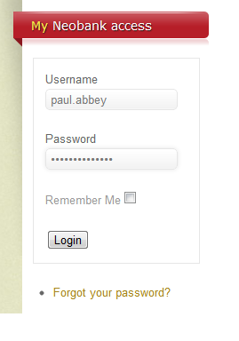

# Ofertas en un canal entrante{#offers-on-an-inbound-channel}

## Presentación de una oferta a un visitante anónimo {#presenting-an-offer-to-an-anonymous-visitor}

El sitio de Neobank desea mostrar una oferta en su sitio web destinado a visitantes sin identificar que exploran la página.

Para configurar esta interacción, vamos a:

1. [Crear un entorno anónimo](#creating-an-anonymous-environment)
1. [Crear espacios de oferta anónimos](#creating-anonymous-offer-spaces)
1. [Crear una categoría de oferta y un tema](#creating-an-offer-category-and-a-theme)
1. [Crear ofertas anónimas.](#creating-anonymous-offers)
1. [Configurar los espacios de ofertas en la web en el sitio web](#configure-the-web-offer-space-on-the-website)

### Creación de un entorno anónimo {#creating-an-anonymous-environment}

Siga el procedimiento detallado en [Crear un entorno de oferta](../../interaction/using/live-design-environments.md#creating-an-offer-environment) para crear su entorno anónimo basado en las dimensiones de los **Visitantes**.

Se obtiene una estructura de árbol que contiene el nuevo entorno:


### Creación de espacios de oferta anónimos {#creating-anonymous-offer-spaces}

1. En su entorno anónimo (**Visitantes**) vaya al nodo **[!UICONTROL Administration]** > **[!UICONTROL Spaces]**.
1. Haga clic en **[!UICONTROL New]** para crear canales de llamada.

   

   >[!NOTE]
   >
   >El espacio se relaciona automáticamente con el entorno anónimo.

1. Cambie la etiqueta y seleccione el canal **[!UICONTROL Inbound Web]**. También tiene que marcar la casilla **[!UICONTROL Enable unitary mode]**.

   

1. Seleccione los campos de contenido de ofertas utilizados para el espacio y especifíquelos como necesarios marcando la casilla correspondiente.

   De este modo, cualquier oferta que no tenga alguno de los siguientes elementos no será apta para este espacio:

   * Título
   * Contenido HTML
   * URL con imagen
   * URL de destino

   

1. Edite la función de procesamiento HTML, por ejemplo:

   ```
   function (imageUrl, targetUrl, shortContent, htmlSource){
         var html = "<p><b>" + shortContent + "</b></p>";
         html += "<p>" + htmlSource + "</p>";
         html += "<a _urlType='11' href='" + targetUrl + "'></a>";
         return html;
       }   
   ```

   >[!IMPORTANT]
   >
   >La función de procesamiento debe asignar un nombre a los campos utilizados para el espacio en el orden en que se seleccionaron anteriormente para que las ofertas se muestren correctamente.

   

1. Guarde el espacio de ofertas.

### Creación de una categoría de oferta y un tema {#creating-an-offer-category-and-a-theme}

1.  Dentro del entorno que acaba de crear, vaya al nodo **[!UICONTROL Offer catalog]**.
1. Haga clic con el botón derecho del ratón en el nodo **[!UICONTROL Offer catalog]** y seleccione **[!UICONTROL Create a new 'Offer category' folder]**.

   Asigne un nombre a la nueva categoría, por ejemplo, **Productos financieros**.

1. Vaya a la pestaña **[!UICONTROL Eligibility]** de la categoría e introduzca **financiación** como tema; luego, guarde los cambios.

   

### Creación de ofertas anónimas {#creating-anonymous-offers}

1. Vaya a la categoría que acaba de crear.
1. Haga clic **[!UICONTROL New]**.

   

1. Seleccione desde la plantilla de oferta anónima preestablecida o una plantilla creada previamente.

   

1. Cambie la etiqueta y guarde la oferta.

   

1. Vaya a la pestaña **[!UICONTROL Eligibility]** y especifique el peso de las ofertas según sus contextos de aplicación.

   En este ejemplo, la oferta se configura para que se muestre en la página principal del sitio como una prioridad hasta el final del año.

   

1. Vaya a la pestaña **[!UICONTROL Content]** y defina el contenido de la oferta.

   >[!NOTE]
   >
   >Puede seleccionar **[!UICONTROL Content definitions]** para mostrar la lista de elementos necesarios para el espacio web.

   

1. Cree una segunda oferta.

   

1. Vaya a la pestaña **[!UICONTROL Eligibility]** y aplique el mismo peso que para la primera oferta.
1. Ejecute el ciclo de aprobación para cada oferta de forma que, al igual que los espacios de oferta aprobados, estén disponibles en el entorno en línea.

### Configuración del espacio de ofertas web en el sitio web {#configure-the-web-offer-space-on-the-website}

Para que las ofertas que acaba de configurar estén visibles en el sitio web, inserte un código JavaScript en la página HTML del sitio para visualizar el motor de interacción (para obtener más información, consulte [Acerca de los canales entrantes](../../interaction/using/about-inbound-channels.md)).

1. Vaya a la página HTML e inserte un atributo @id con un valor que coincida con el nombre interno del espacio de oferta anónimo creado anteriormente (consulte [Crear espacios de oferta anónimos](#creating-anonymous-offer-spaces)), precedido por **i_**.

   

1. Inserte la dirección URL a visualizar.

   

   Los cuadros de URL azules de arriba corresponden al nombre de la instancia, el nombre interno del entorno (consulte [Creación de un entorno anónimo](#creating-an-anonymous-environment)) y el tema vinculado a la categoría ([Creación de una categoría de oferta y un tema](#creating-an-offer-category-and-a-theme)). Esto último es opcional.

Cuando un visitante accede a la página principal del sitio web, las ofertas con el tema de **financiación** se muestran según lo configurado en la página HTML.


Un usuario que visita la página varias veces verá una de las ofertas o las demás en la categoría ya que a ambas se les ha asignado al mismo peso.

## Cambio a un entorno anónimo en caso de contactos no identificados {#switching-to-an-anonymous-environment-in-case-of-unidentified-contacts}

La empresa Neobank desea crear ofertas de marketing para dos objetivos diferentes. Desea mostrar las ofertas genéricas para los navegadores anónimos del sitio web. Si uno de estos usuarios se considera un cliente con identificadores proporcionados por Neobank, la empresa desea que reciban ofertas personalizadas tan pronto como inicien sesión.

Este caso práctico se basa en el siguiente escenario:

1. Un visitante explora el sitio web de Neobank sin iniciar sesión.

   

   Se muestran tres ofertas anónimas en la página: dos ofertas **mejores ofertas** para productos Neobank y una oferta de un socio de Neobank.

   

1. El usuario, un cliente de Neobank, inicia sesión con sus credenciales.

   

   Se muestran tres ofertas personalizadas.

   

Para implementar este caso práctico, necesita contar con dos entornos de ofertas: uno para interacciones anónimas y otro con ofertas configuradas especialmente para contactos identificados. El entorno de oferta identificado se configurará para cambiar al entorno de oferta anónimo automáticamente si el contacto no ha iniciado sesión y, por lo tanto, no se identifica.

Siga estos pasos:

* Cree un catálogo de ofertas específicas para interacciones de entrada anónimas mediante los pasos siguientes:

   1. [Creación de un entorno para contactos anónimos](#creating-an-environment-for-anonymous-contacts)
   1. [Configuración de los espacios de ofertas para el entorno anónimo](#configuring-offer-spaces-for-the-anonymous-environment)
   1. [Creación de categorías de oferta en un entorno anónimo](#creating-offer-categories-in-an-anonymous-environment)
   1. [Creación de ofertas para visitantes anónimos](#creating-offers-for-anonymous-visitors)

* Cree un catálogo de ofertas específicas para las interacciones de entrada identificadas mediante los pasos siguientes:

   1. [Configuración de los espacios de oferta en el entorno identificado](#configure-the-offer-spaces-in-the-identified-environment)
   1. [Creación de categorías de oferta en un entorno identificado](#creating-offer-categories-in-an-identified-environment)
   1. [Creación de ofertas personalizadas](#creating-personalized-offers)

* Configure la visualización del motor de ofertas:

   1. [Configuración de los espacios de oferta en la página web](#configuring-offer-spaces-on-the-web-page)
   1. [Especificación de la configuración avanzada de los espacios de oferta identificados](#specifying-the-advanced-settings-of-the-identified-offer-spaces)

### Creación de un entorno para contactos anónimos {#creating-an-environment-for-anonymous-contacts}

1. Cree un entorno de oferta para interacciones de entrada anónimas mediante el asistente de asignación de entregas (asignación de **visitantes).** Para obtener más información, consulte [Creación de un entorno de ofertas](../../interaction/using/live-design-environments.md#creating-an-offer-environment).

   

### Configuración de los espacios de ofertas para el entorno anónimo {#configuring-offer-spaces-for-the-anonymous-environment}

Las ofertas que se deben presentar en el sitio web pertenecen a dos categorías diferentes: **Mejor oferta** y **Socio**. En este ejemplo, vamos a crear un espacio de oferta específico para cada categoría.

Para crear el espacio de oferta que coincida con la categoría **Mejor oferta**, siga este proceso:

1. En el árbol de Adobe Campaign, vaya al entorno anónimo que acaba de crear y añada un espacio de oferta.

   

1. Cree un nuevo espacio de tipo **[!UICONTROL Inbound web]**.

   

1. Escriba una etiqueta para él: **Mejor oferta anónima web**, por ejemplo.
1. Añada los campos de contenido de oferta utilizados para este espacio de oferta y configure las funciones de procesamiento.

   

   >[!IMPORTANT]
   >
   >La función de procesamiento debe asignar un nombre a los campos utilizados para el espacio en el orden en que se seleccionaron anteriormente para que las ofertas se muestren correctamente.

1. Utilice el mismo proceso para crear un espacio de oferta de canal web entrante que coincida con la categoría de **Socio**.

   

### Creación de categorías de oferta en un entorno anónimo {#creating-offer-categories-in-an-anonymous-environment}

Comience creando dos categorías de oferta: la categoría **Mejor oferta** y la categoría **Socio.** Cada categoría incluirá dos ofertas para los contactos anónimos.

1. En el entorno anónimo que acaba de crear, vaya a **[!UICONTROL Offer catalog]**.
1. Añada una carpeta de **[!UICONTROL Offer category]** con la etiqueta **Mejor oferta**.

   

1. Cree una segunda categoría con **Socio** como etiqueta.

   

### Creación de ofertas para visitantes anónimos {#creating-offers-for-anonymous-visitors}

Ahora vamos a crear dos ofertas en cada una de las categorías creadas anteriormente.

1. Vaya a la categoría **Mejor oferta** y cree una oferta anónima.

   

1. Vaya a la pestaña **[!UICONTROL Eligibility]** y especifique el peso de las ofertas según sus contextos de aplicación.

   

1. Vaya a la pestaña **[!UICONTROL Content]** y defina el contenido de la oferta.

   

1. Cree una segunda oferta en la categoría **Mejor oferta**.

   

1. Vaya a la categoría **Socio** y cree una oferta anónima.
1. Vaya a la pestaña **[!UICONTROL Content]** y defina el contenido de la oferta.

   

1. Vaya a la pestaña **[!UICONTROL Eligibility]** y especifique el peso de las ofertas según sus contextos de aplicación.

   

1. Cree una segunda oferta para la categoría **Socio**.

   

1. Vaya a la pestaña **[!UICONTROL Eligibility]** y aplique el mismo peso que aplicó a la primera oferta de esta categoría, de modo que las ofertas se muestren sucesivamente en el sitio web.

   

1. Ejecute el ciclo de aprobación para cada oferta para que comiencen a mostrarse en vivo. Al aprobar el contenido, active el espacio de oferta **Socio** o **Mejor oferta**, según la oferta.

### Configuración de los espacios de oferta en el entorno identificado {#configure-the-offer-spaces-in-the-identified-environment}

Las ofertas que va a presentar en el sitio web se toman de dos categorías diferentes **Mejor oferta** y **Socio**. En este ejemplo, queremos crear un espacio específico para cada categoría.

Para crear los dos espacios de oferta, siga el mismo procedimiento que para los espacios de oferta anónimos. [Configuración de los espacios de ofertas para el entorno anónimo](#configuring-offer-spaces-for-the-anonymous-environment).

1. En el árbol de Adobe Campaign, vaya al entorno que acaba de crear y añada los espacios de oferta de **Mejor oferta** y **Socio**.
1. Aplique el proceso detallado en [Configuración de espacios de oferta para el entorno anónimo](#configuring-offer-spaces-for-the-anonymous-environment).

   

1. Seleccione la opción **[!UICONTROL Fall back on an anonymous environment if no individuals were identified]**.

   

1. Mediante la lista desplegable, seleccione el espacio de oferta web anónimo creado anteriormente (consulte [Configuración de espacios de oferta para el entorno anónimo](#configuring-offer-spaces-for-the-anonymous-environment)).

   

### Especificación de la configuración avanzada de los espacios de oferta identificados {#specifying-the-advanced-settings-of-the-identified-offer-spaces}

En este ejemplo, la identificación de los contactos tiene lugar gracias a la dirección de correo electrónico de la base de datos de Adobe Campaign. Para añadir el correo electrónico del destinatario al espacio, siga este proceso:

1. En el entorno identificado, vaya a la carpeta de espacio de ofertas.
1. Seleccione el espacio de oferta **Best offer** y haga clic en **[!UICONTROL Advanced parameters]**.

   

1. En la pestaña **[!UICONTROL Target identification]**, haga clic en **[!UICONTROL Add]**.

   

1. Haga clic en **[!UICONTROL Edit expression]**, vaya a la tabla de destinatarios y seleccione el campo **[!UICONTROL Email]**.

   

1. Haga clic en **[!UICONTROL OK]** para cerrar la ventana **[!UICONTROL Advanced parameters]** y finalizar la configuración del espacio de oferta **Best offer**.
1. Siga el mismo proceso para el espacio de oferta de **Partner**.

   

### Creación de categorías de oferta en un entorno identificado {#creating-offer-categories-in-an-identified-environment}

Va a crear dos categorías independientes: la categoría **Mejor oferta** y la categoría **Socios**, cada una con dos ofertas personalizadas.

1.  En el entorno identificado, vaya al nodo **[!UICONTROL Offer catalogs]**.
1. En el entorno anónimo, añada dos carpetas de **[!UICONTROL Offer category]** con las etiquetas **Mejor oferta** y **Socio**.

   

### Creación de ofertas personalizadas {#creating-personalized-offers}

Queremos crear dos ofertas personalizadas para cada categoría, es decir, cuatro ofertas.

1. Vaya a la categoría **Mejor oferta** y cree una primera oferta personalizada.

   

1. Vaya a la pestaña **[!UICONTROL Eligibility]** y especifique el peso de las ofertas según sus contextos de aplicación.

   

1. Vaya a la pestaña **[!UICONTROL Content]** y defina el contenido de la oferta.

   

1. Cree una segunda oferta en la categoría **Mejor oferta**.

   

1. Vaya a la categoría **Socios** y cree una oferta personalizada.

   

1. Vaya a la pestaña **[!UICONTROL Eligibility]** y especifique el peso de las ofertas según sus contextos de aplicación.

   

1. Cree una segunda oferta para la categoría **Socio**.

   

1. Vaya a la pestaña **[!UICONTROL Eligibility]** y aplique el mismo peso que aplicó a la primera oferta de esta categoría, de modo que las ofertas se muestren sucesivamente en el sitio web.
1. Ejecute el ciclo de aprobación para cada oferta a fin de empezar a actualizarlas. Durante la aprobación del contenido, active los espacios de ofertas de **Socio** o **Mejor oferta**.

### Configuración de los espacios de oferta en la página web {#configuring-offer-spaces-on-the-web-page}

El sitio web de la empresa Neobank tiene tres espacios para ofertas: dos para ofertas relacionadas con el banco de la categoría **Mejor oferta** y otra para las ofertas de la categoría **Socios**.


Para configurar estos espacios de oferta en la página HTML del sitio web, siga este proceso:

1. En el contenido de la página HTML, inserte tres

   elementos con un atributo @id cuyo valor nos permitirá llamar a las ofertas en los distintos espacios de ofertas del sitio web.

   

1. A continuación, inserte el script para definir los valores de atributo.

   

   En este ejemplo, **ContBO1** y **ContBO2** reciben el valor **OsWebBestOfferIdentified**, por ejemplo, el nombre interno del espacio de oferta de **Mejor oferta** creado anteriormente en el entorno identificado. Los valores **CatBestOffer** y **CatBestOfferAnonym** coinciden con el nombre interno de las categorías de **Mejor oferta** para los entornos anónimos y los identificados.

   

   Del mismo modo, **ContPtn** recibe el valor **OSWebPartnerIdentified**, que coincide con el nombre interno del espacio de ofertas **Socio** creado en el entorno identificado. **CatPartner** y **CatPartnerAnonym** coinciden con el nombre interno de las categorías de **Socio** para los entornos anónimos y los identificados.

   

1. Asigne la información que le permitirá identificar a la persona que inicia sesión en el sitio Neobank a la variable **interactionTarget**.

   

   La identificación de la persona puede basarse en una cookie del navegador, un parámetro de lectura en la dirección URL, el correo electrónico o el identificador de la persona. Si se utiliza un campo de la tabla de destinatarios que no sea la clave principal, debe definirse en los parámetros avanzados del espacio (consulte [Especificar la configuración avanzada de los espacios de oferta identificados](#specifying-the-advanced-settings-of-the-identified-offer-spaces)).

1. Inserte la dirección URL a visualizar.

   

   La URL contiene **EnvNeobankRecip**, el nombre interno del entorno identificado.

Al abrir la página web, la secuencia de comandos permite visualizar al motor de interacción para mostrar el contenido de las ofertas en los espacios relevantes de la página web. Con una sola visualización del servidor de Adobe Campaign, el motor determina el entorno, el espacio de oferta y las categorías que se deben seleccionar.

En este ejemplo, el motor reconoce el entorno identificado (**EnvNeobankIdnRecip**). Identifica el espacio de oferta (**OSWebBestOfferIdentified**) y la categoría **Mejor oferta** (**CatBestOffer**) para el primer y el segundo espacio de oferta de la página web, así como el espacio de oferta (**OSWebPartnerIdentified**) y la categoría **Socio** (**CatPartner**) para el tercer espacio de oferta del sitio.

Si el motor no puede identificar al destinatario, cambia a los espacios de oferta anónimos a los que se hace referencia en los espacios de oferta identificados y hacia las categorías anónimas (**CatPartner** y **CatPartnerAnonym**), según se especifique en la secuencia de comandos.
