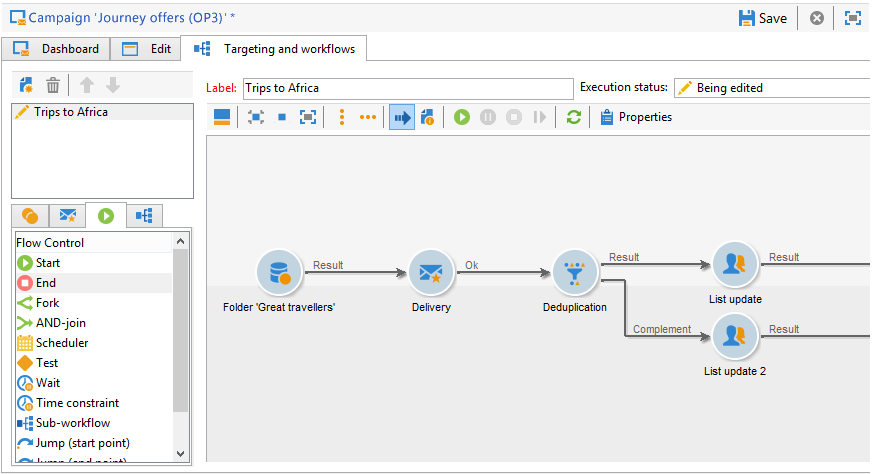
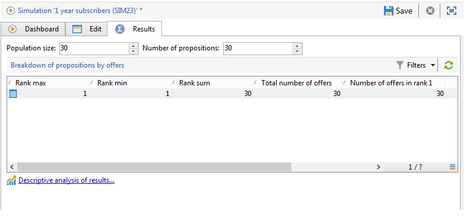

# Ofertas en un canal saliente{#offers-on-an-outbound-channel}

## Envío de ofertas por correo electrónico {#email-offer-delivery}

En nuestra base de datos, existe una categoría de ofertas de viajes a África. Se han configurado los requisitos, los contextos y las representaciones de cada oferta. Ahora queremos crear una campaña para presentar las ofertas por correo electrónico.

1. Cree una campaña de marketing y los flujos de trabajo de segmentación.

   

1. Edit the email delivery and click the **[!UICONTROL Offers]** icon.

   

1. Elija el espacio del correo electrónico para el entorno de la oferta que coincida con los días festivos.

   

1. Elija la categoría que contiene las ofertas de viajes de África.

   

1. Defina el número de ofertas en el envío a dos.

   

1. Cierre la ventana de administración de ofertas y cree el contenido de su envío.

   

1. Utilice los menús para insertar una primera propuesta de oferta y elija la función de procesamiento HTML.

   

1. Inserte la segunda propuesta de oferta.

   

1. Click **[!UICONTROL Preview]** to preview your offers in the delivery then select a recipient to preview the offers as they will receive them.

   

1. Guarde el envío e inicie el flujo de trabajo de objetivos.
1. Open your delivery and click the **[!UICONTROL Audit]** tab of your delivery: you can see that the offer engine has selected the propositions to be made from the various offers in the catalog.

   

## Realizar una simulación de oferta {#perform-an-offer-simulation}

1. En el **[!UICONTROL Profiles and Targets]** universo, haga clic en el **[!UICONTROL Simulations]** vínculo y, a continuación, haga clic en el **[!UICONTROL Create]** botón .

   

1. Elija una etiqueta y especifique la configuración de ejecución si es necesario.

   

1. Guarde la simulación. A continuación, se abre en una nueva pestaña.

   

1. Haga clic en la **[!UICONTROL Edit]** ficha y, a continuación, **[!UICONTROL Scope]**.

   

1. Elija la categoría para la que desea simular las ofertas.

   

1. Seleccione el espacio de oferta que se utilizará para la simulación.

   

1. Introduzca las fechas de validez. Debe introducir al menos una fecha de inicio. Esto permite que el filtro del motor de ofertas ofrezca y elija las que son válidas en una fecha determinada.
1. Si es necesario, especifique uno o varios temas para restringir el número de ofertas a aquellas que contengan una palabra clave en su configuración.

   En nuestro ejemplo, la categoría **Viaje** contiene dos subcategorías con dos temas independientes. Queremos ejecutar una simulación para las ofertas con el tema de los **clientes>1 año**.

   

1. Elija los destinatarios a los que desea destinarlas.

   

1. Configure el número de ofertas que se enviarán a cada destinatario.

   En nuestro ejemplo, el motor de oferta elegirá las 3 ofertas con el peso más alto para cada destinatario.

   

1. Save your settings, then click **[!UICONTROL Start]** in the **[!UICONTROL Dashboard]** tab to run the simulation.

   

1. Once the simulation is finished, consult the **[!UICONTROL Results]** for a detailed breakdown of propositions per offer.

   En nuestro ejemplo, el motor de oferta basa el desglose de las ofertas en 3 propuestas.

   

1. Display the **[!UICONTROL Breakdown of offers by rank]** to view the list of offers selected by the offer engine.

   

1. If necessary, you can change the scope settings and run the simulation again by clicking **[!UICONTROL Start simulation]**.

   

1. Para guardar los datos de simulación, utilice las funciones del historial o de exportación disponibles en el informe.

   

