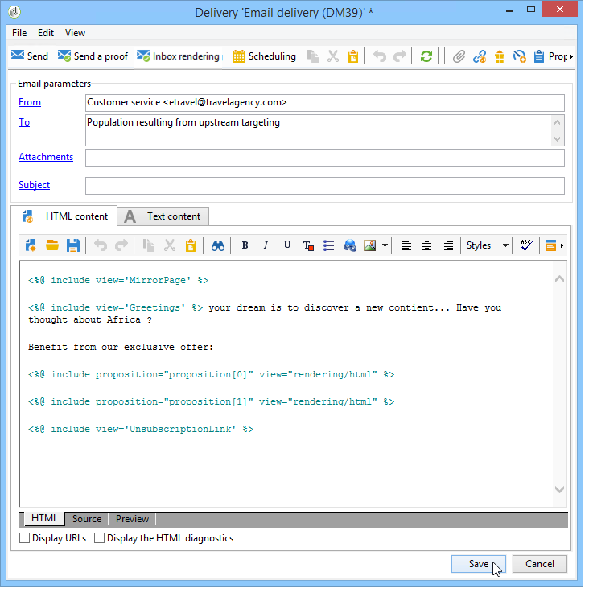

# Ofertas en un canal saliente{#offers-on-an-outbound-channel}

## Envío de ofertas por correo electrónico {#email-offer-delivery}

En nuestra base de datos, existe una categoría de ofertas de viajes a África. Se han configurado los requisitos, los contextos y las representaciones de cada oferta. Ahora queremos crear una campaña para presentar las ofertas por correo electrónico.

1. Cree una campaña de marketing y los flujos de trabajo de segmentación.

   

1. Edite la entrega por correo electrónico y haga clic en el icono **[!UICONTROL Offers]**.

   

1. Elija el espacio del correo electrónico para el entorno de la oferta que coincida con los días festivos.

   

1. Elija la categoría que contiene las ofertas de viajes de África.

   

1. Defina el número de ofertas en la entrega a dos.

   

1. Cierre la ventana de administración de ofertas y cree el contenido de su envío.

   

1. Utilice los menús para insertar una primera propuesta de oferta y elija la función de procesamiento HTML.

   

1. Inserte la segunda propuesta de oferta.

   

1. Haga clic en **[!UICONTROL Preview]** para previsualizar las ofertas de la entrega y, a continuación, seleccione un destinatario para previsualizar las ofertas a medida que las reciban.

   

1. Guarde la entrega e inicie el flujo de trabajo de objetivos.
1. Abra la entrega y haga clic en la pestaña **[!UICONTROL Audit]** de la entrega: puede ver que el motor de ofertas ha seleccionado las propuestas que se realicen desde las diferentes ofertas del catálogo.

   

## Realizar una simulación de oferta {#perform-an-offer-simulation}

1. En el entorno **[!UICONTROL Profiles and Targets]**, haga clic en el vínculo **[!UICONTROL Simulations]**, luego, haga clic en **[!UICONTROL Create]**.

   

1. Elija una etiqueta y especifique la configuración de ejecución si es necesario.

   

1. Guarde la simulación. A continuación, se abre en una nueva pestaña.

   

1. Haga clic en la pestaña **[!UICONTROL Edit]** luego en **[!UICONTROL Scope]**.

   

1. Elija la categoría para la que desea simular las ofertas.

   

1. Seleccione el espacio de oferta que se utilizará para la simulación.

   

1. Introduzca las fechas de validez. Debe introducir al menos una fecha de inicio. Esto permite que el filtro del motor de ofertas ofrezca y elija las que son válidas en una fecha determinada.
1. Si es necesario, especifique uno o varios temas para restringir el número de ofertas a aquellas que contengan una palabra clave en su configuración.

   En nuestro ejemplo, la categoría **Viaje** contiene dos subcategorías con dos temas independientes. Queremos ejecutar una simulación para las ofertas con el tema de los **clientes>1 año**.

   

1. Elija los destinatarios a los que desea destinarlas.

   

1. Configure el número de ofertas que se enviarán a cada destinatario.

   En nuestro ejemplo, el motor de oferta elegirá las 3 ofertas con el peso más alto para cada destinatario.

   

1. Guarde la configuración y, en la pestaña **[!UICONTROL Start]**, haga clic en **[!UICONTROL Dashboard]** para ejecutar la simulación.

   

1. Una vez finalizada la simulación, consulte **[!UICONTROL Results]** para obtener un desglose detallado de las propuestas por oferta.

   En nuestro ejemplo, el motor de oferta basa el desglose de las ofertas en 3 propuestas.

   

1. Despliegue **[!UICONTROL Breakdown of offers by rank]** para ver la lista de ofertas seleccionadas por el motor de ofertas.

   

1. Si es necesario, puede cambiar la configuración del ámbito y ejecutar otra vez la simulación haciendo clic en **[!UICONTROL Start simulation]**.

   

1. Para guardar los datos de simulación, utilice las funciones del historial o de exportación disponibles en el informe.

   

