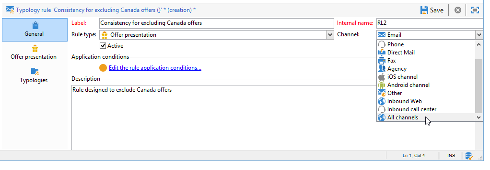
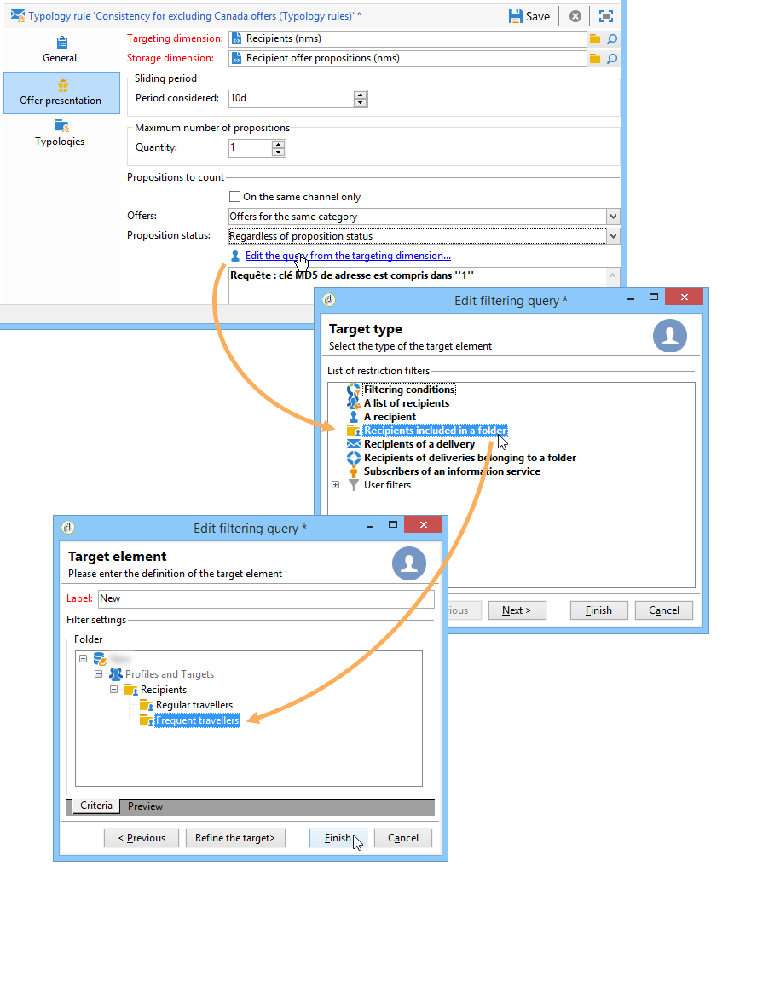
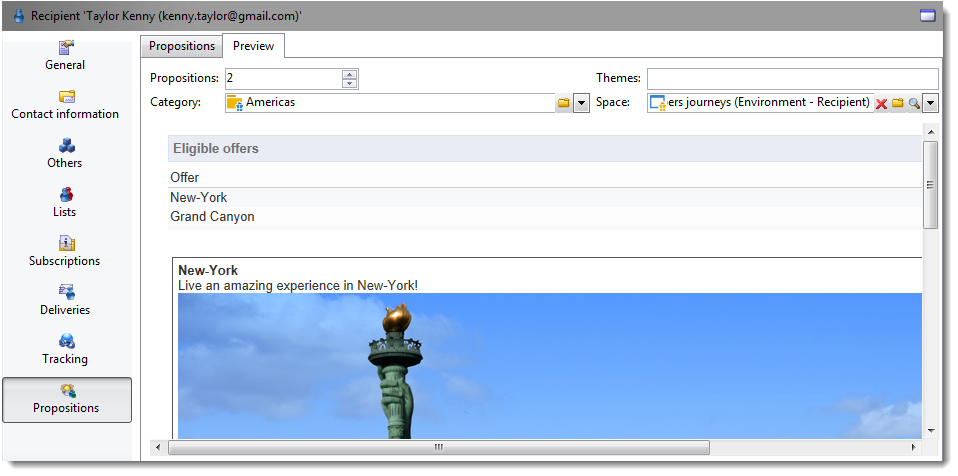

# Reglas de presentación{#presentation-rules}

## Creación de una regla de presentación {#creating-a-presentation-rule}

En nuestra base de datos existen varias ofertas de viajes para Europa, África, Estados Unidos y Canadá. Queremos enviar ofertas para un viaje a Canadá, pero si el destinatario rechaza este tipo de oferta, no queremos enviarlas de nuevo.

Vamos a configurar nuestra regla para que el viaje a Canadá se ofrezca solo una vez por destinatario y no se ofrezca nuevamente si se rechaza.

1. En el árbol de Adobe Campaign, vaya al nodo **[!UICONTROL Administration]** > **[!UICONTROL Campaign management]** > **[!UICONTROL Typology management]** > **[!UICONTROL Typology rules]**.
1. Cree una nueva regla de tipo **[!UICONTROL Offer presentation]**.

   

1. Cambie la etiqueta y la descripción si es necesario.

   

1. Elija la opción **[!UICONTROL All channels]** para ampliar la regla a todos los canales.

   

1. Haga clic en el vínculo **[!UICONTROL Edit expression]** y elija el nodo **[!UICONTROL Category]** como una expresión.

   

1. Seleccione la categoría que coincida con la oferta de viajes para Canadá y haga clic en **[!UICONTROL OK]** para cerrar la ventana de consultas.

   

1. En la pestaña **[!UICONTROL Offer presentation]**, elija las mismas dimensiones que las configuradas en el entorno.

   

1. Indique el periodo durante el que se aplica la regla.

   

1. Limite la propuesta a una de forma que los destinatarios que ya hayan rechazado el viaje a Canadá no reciban otra oferta similar.

   

1. Seleccione el filtro **[!UICONTROL Offers for the same category]** para excluir todas las ofertas de la categoría **Canada**.

   

1. Seleccione el filtro **[!UICONTROL Rejected propositions]** que tendrá en cuenta solo propuestas que el destinatario rechace.

   

1. Indique los destinatarios para los cuales se asigna la regla.

   En nuestro ejemplo, elegimos los destinatarios **viajeros frecuentes**.

   

1. Cite la regla en la tipología de ofertas.

   

1. Vaya al entorno de ofertas (**Environment - Recipient** en este caso) y cite la nueva tipología creada con la lista desplegable de la pestaña **[!UICONTROL Eligibility]**.

   

## Aplicación de la regla de presentación {#applying-the-presentation-rule}

A continuación se muestra un ejemplo de aplicación de la regla de tipología creada anteriormente.

Queremos enviar una primera propuesta de oferta perteneciente a la categoría Canadá. Si la oferta se rechaza una vez por cualquiera de los destinatarios, no se ofrece de nuevo.

1. En la carpeta de destinatario **Frequent travelers**, elija uno de los perfiles para comprobar las ofertas para las que cumplen los requisitos: haga clic en la pestaña **[!UICONTROL Propositions]** y, a continuación, en la pestaña **[!UICONTROL Preview]**.

   En nuestro ejemplo, **Tim Ramsey** es apto para una oferta que forma parte de la categoría **América**.

   

1. Comience creando una entrega por correo electrónico dirigido a sus destinatarios **viajeros frecuentes** con ofertas.
1. Seleccione los parámetros para visualizar el motor de ofertas.

   En nuestro ejemplo, se elige la categoría **Viaje en América**, que contiene las subcategorías de **Canadá** y **Estados Unidos**.

   

1. Inserte sus ofertas en el cuerpo del mensaje y mande la entrega. Para obtener más información, consulte [Sobre canales salientes](../../interaction/using/about-outbound-channels.md).

   El destinatario recibió la oferta para la cual es apto.

1. El destinatario rechazó la oferta de Canadá como se muestra en el historial de propuestas.

   

1. Compruebe las ofertas para las que ahora son aptos.

   Podemos ver que no se han elegido ofertas para Canadá.

   

**Temas relacionados**

* [Administre ofertas y controle la redundancia entre canales](https://helpx.adobe.com/es/campaign/kb/simplifying-campaign-management-acc.html#Manageoffersandcontrolredundancyacrosschannels)
