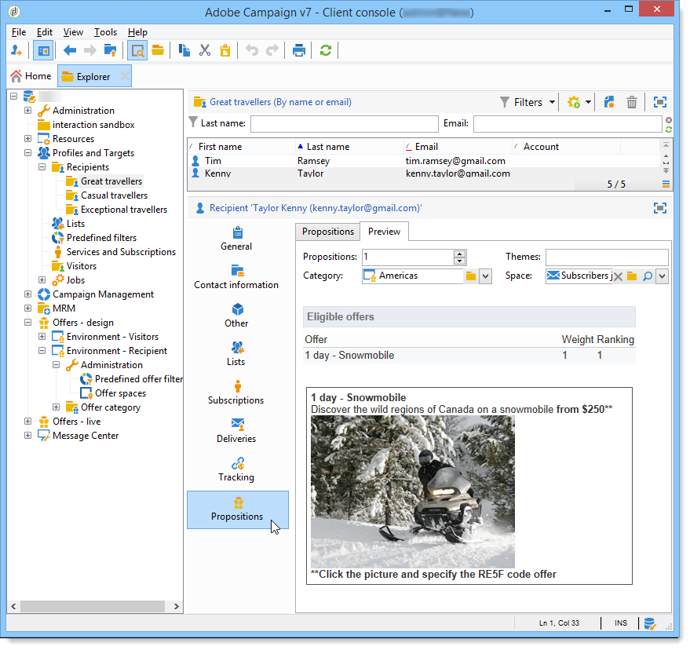

# Reglas de presentación{#presentation-rules}

## Creación de una regla de presentación {#creating-a-presentation-rule}

En nuestra base de datos existen varias ofertas de viajes para Europa, África, Estados Unidos y Canadá. Queremos enviar ofertas para un viaje a Canadá, pero si el destinatario rechaza este tipo de oferta, no queremos enviarlas de nuevo.

Vamos a configurar nuestra regla para que el viaje a Canadá se ofrezca solo una vez por destinatario y no se ofrezca nuevamente si se rechaza.

1. En el árbol de Adobe Campaign, vaya al nodo **[!UICONTROL Administration]** > **[!UICONTROL Campaign management]** > **[!UICONTROL Typology management]** > **[!UICONTROL Typology rules]** .
1. Cree una nueva regla **[!UICONTROL Offer presentation]** de tipo.

   

1. Cambie la etiqueta y la descripción si es necesario.

   

1. Choose the **[!UICONTROL All channels]** option to extend the rule to all channels.

   

1. Haga clic en el **[!UICONTROL Edit expression]** vínculo y elija el **[!UICONTROL Category]** nodo como expresión.

   

1. Choose the category that matches your travel offer for Canada and click **[!UICONTROL OK]** to close the query window.

   

1. In the **[!UICONTROL Offer presentation]** tab, choose the same dimensions as those configured in the environment.

   

1. Indique el período durante el que se aplica la regla.

   

1. Limite la propuesta a una de forma que los destinatarios que ya hayan rechazado el viaje a Canadá no reciban otra oferta similar.

   

1. Select the **[!UICONTROL Offers for the same category]** filter to exclude all offers from the **Canada** category.

   

1. Select the **[!UICONTROL Rejected propositions]** filter to take into account only propositions rejected by the recipient.

   

1. Indique los destinatarios para los cuales se asigna la regla.

   En nuestro ejemplo, elegimos los destinatarios **viajeros frecuentes**.

   

1. Cite la regla en la tipología de ofertas.

   

1. Go to the offer environment, (**Environment - Recipient** in this case) and reference the new typology just created using the drop-down list in the **[!UICONTROL Eligibility]** tab.

   

## Aplicación de la regla de presentación {#applying-the-presentation-rule}

A continuación se muestra un ejemplo de aplicación de la regla de tipología creada anteriormente.

Queremos enviar una primera propuesta de oferta perteneciente a la categoría Canadá. Si la oferta se rechaza una vez por cualquiera de los destinatarios, no se ofrece de nuevo.

1. In the **Frequent travelers** recipient folder, choose one of the profiles to check the offers for which they are eligible: click the **[!UICONTROL Propositions]** tab, then the **[!UICONTROL Preview]** tab.

   En nuestro ejemplo, **Tim Ramsey** es apto para una oferta que forma parte de la categoría **América**.

   

1. Comience creando un envío por correo electrónico dirigido a sus destinatarios **viajeros frecuentes** con ofertas.
1. Seleccione los parámetros para visualizar el motor de ofertas.

   En nuestro ejemplo, se elige la categoría **Viaje en América**, que contiene las subcategorías de **Canadá** y **Estados Unidos**.

   

1. Inserte sus ofertas en el cuerpo del mensaje y mande el envío. For more on this, refer to [About outbound channels](../../interaction/using/about-outbound-channels.md).

   El destinatario recibió la oferta para la cual es apto.

1. El destinatario rechazó la oferta de Canadá como se muestra en el historial de propuestas.

   

1. Compruebe las ofertas para las que ahora son aptos.

   Podemos ver que no se han elegido ofertas para Canadá.

   

**Tema relacionado**

* [Administre ofertas y controle la redundancia entre canales](https://helpx.adobe.com/campaign/kb/simplifying-campaign-management-acc.html#Manageoffersandcontrolredundancyacrosschannels)