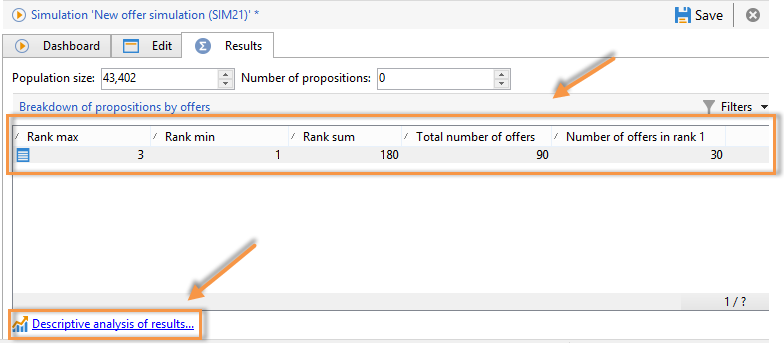

# Seguimiento de la simulación{#simulation-tracking}

Una vez finalizada la simulación, se puede analizar su resultado mediante la pestaña **[!UICONTROL Results]** añadida a la ventana de simulación y el informe **[!UICONTROL Breakdown of offers by rank]** disponible en el panel de control.

Los resultados de la simulación contienen un desglose de las propuestas por rango y destinatario. Los ejes del sistema de informes también se tienen en cuenta y se muestran en esta pestaña.

En caso necesario, se pueden guardar estos resultados y exportarlos creando un análisis descriptivo de los mismos. Para ello, haga clic en la ventana correspondiente de la barra de herramientas.

Consulte [esta sección](../../reporting/using/about-descriptive-analysis.md) para obtener más información sobre el asistente de análisis descriptivo.

Una tabla dinámica proporciona una vista rápida de los desgloses de la oferta en función de su rango. Al igual que todos los informes de Adobe Campaign, puede exportarlos, imprimirlos, archivarlos o visualizarlos en un navegador web.

Para obtener más información, consulte [esta sección](../../reporting/using/actions-on-reports.md).

