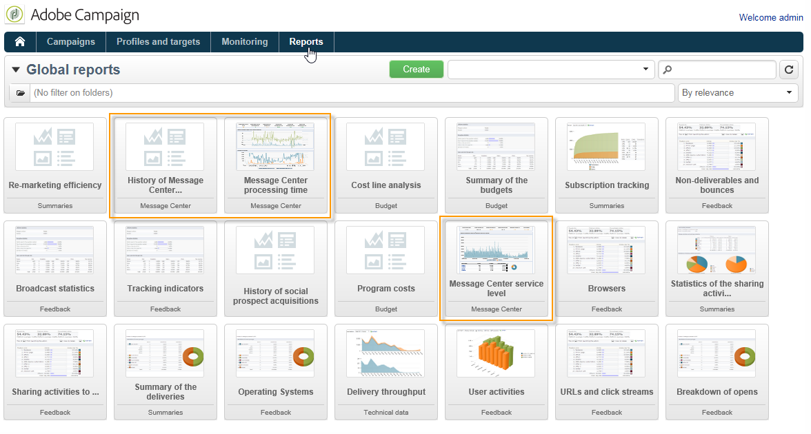

# Acceso a los informes de mensajería transaccional {#about-transactional-messaging-reports}

Adobe Campaign ofrece varios informes que permiten controlar la actividad y la ejecución continua de las instancias de ejecución.

Se puede acceder a estos informes del centro de mensajería desde la pestaña **[!UICONTROL Reports]****de la instancia de control**.

