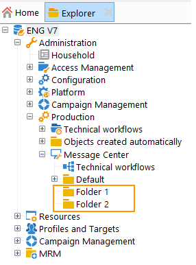

# Configurar instancias {#creating-a-shared-connection}

Para utilizar las funcionalidades de mensajería transaccional, debe configurar las instancias de control y ejecución. Puede utilizar:
* [Una instancia de control ](#control-instance) asociada a una o varias instancias de ejecución
* [Varias instancias de control ](#using-several-control-instances) asociadas con varias instancias de ejecución

>[!IMPORTANT]
>
>Las extensiones de esquema afectaron a los recursos utilizados por los [flujos de trabajo técnicos del centro de mensajes](../../message-center/using/additional-configurations.md#technical-workflows) en cualquiera de las instancias de control o ejecución deben duplicarse en las demás instancias utilizadas por el módulo de mensajería transaccional.

También debe especificar y conectar las instancias de ejecución a las instancias de control.

En esta sección se describen todos los pasos necesarios para configurar y conectar las instancias de control y ejecución.

>[!IMPORTANT]
>
>La instancia de control y las instancias de ejecución deben estar instaladas en diferentes equipos. No pueden compartir la misma instancia de Campaign.

## Configurar la instancia de control {#control-instance}

Para conectar la instancia de control y las instancias de ejecución, primero debe crear y configurar una cuenta externa de tipo **[!UICONTROL Execution instance]** **en la instancia de control**. Por lo tanto, una vez [publicado](../../message-center/using/publishing-message-templates.md#template-publication), las plantillas de mensajes transaccionales se pueden implementar en las instancias de ejecución.

Si utiliza varias instancias de ejecución, debe crear tantas cuentas externas como instancias de ejecución.

>[!NOTE]
>
>Cuando varias instancias de control utilizan instancias de ejecución, los datos se pueden dividir por carpeta y por operador. Para obtener más información, consulte [Uso de varias instancias de control](#using-several-control-instances).

### Crear una cuenta externa

>[!NOTE]
>
>Los pasos siguientes deben realizarse **en la instancia de control**.

Para crear una cuenta externa de tipo **[!UICONTROL Execution instance]** , aplique lo siguiente:

1. Vaya a la carpeta **[!UICONTROL Administration > Platform > External accounts]**.
1. Seleccione una de las cuentas externas de tipo instancia de ejecución proporcionadas previamente con Adobe Campaign, haga clic con el botón derecho del ratón y elija **[!UICONTROL Duplicate]**.

   

1. Cambie la etiqueta según sus necesidades.

   

1. Seleccione la opción **[!UICONTROL Enabled]** para hacer que la cuenta externa sea operativa.

   

1. Especifique la dirección del servidor en el que está instalada la instancia de ejecución.

   

1. La cuenta debe coincidir con el agente de centro de mensajes definido en la carpeta del operador. Por defecto, la cuenta predeterminada que proporciona Adobe Campaign es **[!UICONTROL mc]**.

   

1. Introduzca la contraseña de la cuenta tal como se define en la carpeta del operador.

   >[!NOTE]
   >
   >Para evitar introducir una contraseña cada vez que se inicia sesión en la instancia, se puede especificar la dirección IP de la instancia de control en la instancia de ejecución. Para obtener más información sobre esto, consulte [Configuración de las instancias de ejecución](#execution-instance).

1. Especifique el método de recuperación que utilizará la instancia de ejecución. Los datos que se recuperan se transfieren a la instancia de control mediante la instancia de la ejecución, para añadir al mensaje transaccional y los archivos de eventos.

   

   La recopilación de datos se produce mediante un servicio web que utiliza el acceso HTTP/HTTPS o a través del módulo de acceso a datos federados (FDA).

   >[!NOTE]
   >
   >Tenga en cuenta que cuando se utiliza FDA sobre HTTP, solo se admiten instancias de ejecución que utilicen una base de datos PostgreSQL. No se admiten bases de datos MSSQL u Oracle.

   Se recomienda el segundo método (FDA) si la instancia de control tiene acceso directo a la base de datos de las instancias de ejecución. De lo contrario, seleccione el acceso al servicio web. La cuenta FDA que debe especificar coincide con la conexión a las bases de datos de las distintas instancias de ejecución creadas en la instancia de control.

   

   Para obtener más información sobre el acceso de datos federado (FDA), consulte [esta sección](../../installation/using/about-fda.md).

1. Haga clic en **[!UICONTROL Test the connection]** para asegurarse de que la instancia de control y la instancia de ejecución estén relacionadas.

   

Cuando utilice varias instancias de ejecución, repita estos pasos para crear tantas cuentas externas como instancias de ejecución.

### Identificación de instancias de ejecución {#identifying-execution-instances}

Cada instancia de ejecución debe asociarse con un identificador único para diferenciar el historial de cada instancia de ejecución al visualizarlas en la instancia de control.

Este identificador se puede atribuir en cada instancia de ejecución **manualmente**. En este caso, este paso debe realizarse **en cada instancia de ejecución**. Para ello, utilice el asistente de implementación como se detalla a continuación:

1. Abra el asistente de implementación en una instancia de ejecución.
1. Vaya a la ventana **[!UICONTROL Message Center]** .
1. Asigne el identificador seleccionado a la instancia.

   

1. Repita los pasos anteriores en cada instancia de ejecución.

El identificador también puede atribuirse **automáticamente**. Para ello, vaya a la **instancia de control** y haga clic en el botón **[!UICONTROL Initialize connection]**.

## Configurar las instancias de ejecución {#execution-instance}

>[!NOTE]
>
>Los pasos siguientes deben realizarse **en las instancias de ejecución**.

Para conectar las instancias de ejecución a la instancia de control, siga los pasos a continuación.

Para que la instancia de control pueda conectarse a la instancia de ejecución sin tener que proporcionar una contraseña, simplemente introduzca la dirección IP de la instancia de control en la sección de derechos de acceso del **Centro de mensajes**. Sin embargo, las contraseñas vacías están prohibidas de forma predeterminada.

Para utilizar una contraseña vacía, vaya a las instancias de ejecución y defina una zona de seguridad limitada a la dirección IP del sistema de información que envía los eventos. Esta zona de seguridad debe permitir contraseñas vacías y aceptar conexiones tipo `<identifier> / <password>`. Para obtener más información, consulte [esta sección](../../installation/using/security-zones.md).

>[!NOTE]
>
>Cuando varias instancias de control utilizan instancias de ejecución, los datos se pueden dividir por carpeta y por operador. Para obtener más información, consulte [Uso de varias instancias de control](#using-several-control-instances).

1. En una instancia de ejecución, vaya a la carpeta del operador ( **[!UICONTROL Administration > Access management > Operators]** ).
1. Seleccione el agente del **Message Center**.

   

1. Seleccione la pestaña **[!UICONTROL Edit]**, haga clic en **[!UICONTROL Access rights]** y, luego, en el enlace **[!UICONTROL Edit the access parameters...]**.

   

1. En la ventana **[!UICONTROL Access settings]**, haga clic en el vínculo **[!UICONTROL Add a trusted IP mask]** y añada la dirección IP de la instancia de control.

   

Cuando utilice varias instancias de ejecución, repita estos pasos para cada instancia de ejecución.

## Usar varias instancias de control {#using-several-control-instances}

Se puede compartir un clúster de ejecución con varias instancias de control. Este tipo de arquitectura requiere la configuración siguiente.

Por ejemplo, imaginemos que su empresa administra dos marcas, cada una con su propia instancia de control: **Control 1** y **Control 2**. También se utilizan dos instancias de ejecución. Debe introducir un operador de centro de mensajes diferente para cada instancia de control: un operador **mc1** para la instancia de **Control 1** y un operador **mc2** para la instancia de **Control 2**.

En el árbol de todas las instancias de ejecución, cree una carpeta por cada operador (**Folder 1** y **Folder 2**) y limite el acceso a los datos de cada operador a su carpeta.

### Configurar instancias de control {#configuring-control-instances}

>[!NOTE]
>
>Los pasos siguientes deben realizarse **en las instancias de control**.

1. En la instancia de control **Control 1** , cree una cuenta externa por cada instancia de ejecución e introduzca el operador **mc1** en cada cuenta externa. El operador **mc1** se crea posteriormente en todas las instancias de ejecución (consulte [Configurar instancias de ejecución](#configuring-execution-instances)).

   

1. En la instancia de control **Control 2**, cree una cuenta externa por cada instancia de ejecución e introduzca el operador **mc2** en cada cuenta externa. El operador **mc2** se crea posteriormente en todas las instancias de ejecución (consulte [Configurar instancias de ejecución](#configuring-execution-instances)).

   

   >[!NOTE]
   >
   >Para obtener más información sobre la configuración de una instancia de control, consulte [esta sección](#control-instance).

### Configurar instancias de ejecución {#configuring-execution-instances}

>[!NOTE]
>
>Los pasos siguientes deben realizarse **en las instancias de ejecución**.

Para utilizar varias instancias de control, esta configuración debe realizarse en TODAS las instancias de ejecución.

1. Cree una carpeta por operador en el nodo **[!UICONTROL Administration > Production > Message Center]** : **Folder 1** y **Folder 2**. Para obtener más información sobre la creación de carpetas y vistas, consulte esta [página](../../platform/using/access-management-folders.md).

   

1. Cree los operadores **mc1** y **mc2** duplicando el operador de centro de mensajes proporcionado de forma predeterminada (**mc**). Para obtener más información sobre la creación de operadores, consulte [esta sección](../../platform/using/access-management-operators.md).

   

   >[!NOTE]
   >
   >Los operadores **mc1** y **mc2** deben tener derechos de **[!UICONTROL Message Center execution]** y no pueden tener acceso a la consola del cliente de Adobe Campaign. Un operador siempre debe estar vinculado a una zona de seguridad. Para obtener más información, consulte [esta sección](../../installation/using/security-zones.md).

1. Para cada operador, marque la casilla **[!UICONTROL Restrict to information found in sub-folders of]** y seleccione la carpeta correspondiente (**Folder 1** para el operador **mc1** y **Folder 2** para el operador **mc2**).

   

1. Asigne a cada operador permisos de lectura y escritura para su carpeta. Para ello, haga clic con el botón derecho del ratón en la carpeta y seleccione **[!UICONTROL Properties]**. A continuación, seleccione la pestaña **[!UICONTROL Security]** y añada el operador correspondiente (**mc1** para **Folder 1** y **mc2** para **Folder 2**). Asegúrese de que las casillas **[!UICONTROL Read/Write data]** estén marcadas.

   
