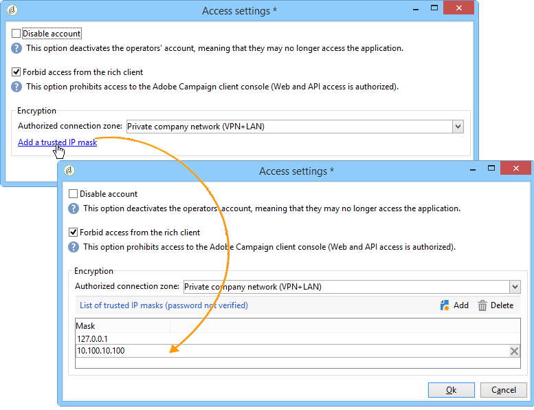

# Creación de una conexión compartida{#creating-a-shared-connection}

>[!CAUTION]
>
>* Las extensiones de esquema realizadas en los esquemas utilizados por [flujos de trabajo técnicos del centro de mensajes](../../message-center/using/technical-workflows.md) en cualquiera de las instancias de control o de ejecución deben duplicarse en las demás instancias que utiliza el módulo de mensajería transaccional de Adobe Campaign.
>* La instancia de control y las instancias de ejecución deben estar instaladas en diferentes equipos. No pueden compartir la misma instancia de Campaign.
>

## Instancia de control {#control-instance}

Si tiene una arquitectura desglosada, es necesario 
                 especificar las instancias de ejecución vinculadas a la instancia de control y conectarlas. Las plantillas de mensajes transaccionales se implementan en las instancias de ejecución. The connection between the control instance and the execution instances is created by configuring the **[!UICONTROL Execution instance]** type external accounts. Debe crear tantas cuentas externas como instancias de ejecución existentes.

>[!NOTE]
>
>Cuando varias instancias de control utilizan instancias de ejecución, los datos se pueden dividir por carpeta y por operador. Para obtener más información sobre esto, consulte [Uso de varias instancias](#using-several-control-instances)de control.

Para crear una cuenta externa de tipo instancia de ejecución, siga los siguientes pasos:

1. Vaya a la **[!UICONTROL Administration > Platform > External accounts]** carpeta.
1. Select one of the execution instance type external accounts provided out-of-the-box with Adobe Campaign, right-click and choose **[!UICONTROL Duplicate]** .

   

1. Cambie la etiqueta según sus necesidades.

   

1. Select the **[!UICONTROL Enabled]** option to make the external account operational.

   

1. Especifique la dirección del servidor en el que está instalada la instancia de ejecución.

   

1. La cuenta debe coincidir con el agente de centro de mensajes definido en la carpeta del operador. By default, the out-of-the-box account provided by Adobe Campaign is **[!UICONTROL mc]** .

   

1. Introduzca la contraseña de la cuenta tal como se define en la carpeta del operador.

   >[!NOTE]
   >
   >Para evitar introducir una contraseña cada vez que se inicia sesión en la instancia, se puede especificar la dirección IP de la instancia de control en la instancia de ejecución. For more on this, refer to [Execution instance](#execution-instance).

1. Especifique el método de recuperación que utilizará la instancia de ejecución.

   Los datos que se recuperan se transfieren a la instancia de control mediante la instancia de la ejecución, para añadir al mensaje transaccional y los archivos de eventos.

   

   La recopilación de datos se produce mediante un servicio web que utiliza el acceso HTTP/HTTPS o a través del módulo de acceso a datos federados (FDA).

   >[!NOTE]
   >
   >Tenga en cuenta que cuando se utiliza FDA sobre HTTP, solo se admiten instancias de ejecución que utilicen una base de datos Postgres. No se admiten bases de datos MSSQL u Oracle.

   Se recomienda el segundo método si la instancia de control tiene acceso directo a la base de datos de las instancias de ejecución. De lo contrario, seleccione el acceso al servicio web. La cuenta FDA que debe especificar coincide con la conexión a las bases de datos de las distintas instancias de ejecución creadas en la instancia de control.

   

   Para obtener más información sobre el acceso a datos federados (FDA), consulte [Acceso a una base de datos externa](../../platform/using/about-fda.md).

1. Click **[!UICONTROL Test the connection]** to make sure the control instance and the execution instance are linked up.

   

1. Cada instancia de ejecución debe asociarse con un identificador. This identifier can be attributed on each execution instance either manually, by using the deployment wizard (refer to [Identifying execution instances](../../message-center/using/identifying-execution-instances.md)), or automatically, by clicking the **Initialize connection** button from the control instance.

   

## Instancia de ejecución {#execution-instance}

Para que la instancia de control pueda conectarse a la instancia de ejecución sin tener que proporcionar una contraseña, simplemente introduzca la dirección IP de la instancia de control en la sección de derechos de acceso del **centro de mensajes.** Sin embargo, las contraseñas vacías están prohibidas de forma predeterminada.

Para utilizar una contraseña vacía, vaya a las instancias de ejecución y defina una zona de seguridad limitada a la dirección IP del sistema de información que envía los eventos. This security zone must allow empty passwords and accept `<identifier> / <password>` type connections. Para obtener más información, consulte [esta sección](../../installation/using/configuring-campaign-server.md#defining-security-zones).

>[!NOTE]
>
>Cuando varias instancias de control utilizan instancias de ejecución, los datos se pueden dividir por carpeta y por operador. Para obtener más información sobre esto, consulte [Uso de varias instancias](#using-several-control-instances)de control.

1. Go to the operator folder in the execution instance ( **[!UICONTROL Administration > Access management > Operators]** ).
1. Seleccione el agente del **centro** de mensajes.

   

1. Seleccione la **[!UICONTROL Edit]** ficha, haga clic en **[!UICONTROL Access rights]** y, a continuación, haga clic en el **[!UICONTROL Edit the access parameters...]** vínculo.

   

1. En la **[!UICONTROL Access settings]** ventana, haga clic en el **[!UICONTROL Add a trusted IP mask]** vínculo y agregue la dirección IP de la instancia de control.

   

## Uso de varias instancias de control {#using-several-control-instances}

Se puede compartir un clúster de ejecución con varias instancias de control. Este tipo de arquitectura requiere la configuración siguiente.

For example if your company manages two brands, each with its own control instance: **Control 1** and **Control 2**. También se utilizan dos instancias de ejecución. Debe introducir un operador de centro de mensajes diferente para cada instancia de control: un operador **mc1** para la instancia de **Control 1** y un operador **mc2** para la instancia de **Control 2**.

En el árbol de todas las instancias de ejecución, cree una carpeta por cada operador (**Folder 1** y **Folder 2**) y limite el acceso a los datos de cada operador a su carpeta.

### Configuración de instancias de control {#configuring-control-instances}

1. En la instancia de control **Control 1**, cree una cuenta externa por cada instancia de ejecución e introduzca el operador **mc1** en cada cuenta externa. The **mc1** operator will thereafter be created on all the execution instances (refer to [Configuring execution instances](#configuring-execution-instances)).

   

1. En la instancia de control **Control 2**, cree una cuenta externa por cada instancia de ejecución e introduzca el operador **mc2** en cada cuenta externa. The **mc2** operator will thereafter be created on all the execution instances (refer to [Configuring execution instances](#configuring-execution-instances)).

   

   >[!NOTE]
   >
   >For more on configuring a control instance, refer to [Control instance](#control-instance).

### Configuración de instancias de ejecución {#configuring-execution-instances}

Para utilizar varias instancias de control, esta configuración debe realizarse en TODAS las instancias de ejecución.

1. Cree una carpeta por operador en el **[!UICONTROL Administration > Production > Message Center]** nodo: **Carpeta 1** y **Carpeta 2**. Para obtener más información sobre la creación de carpetas y vistas, consulte la [Plataforma](../../platform/using/access-management.md#folders-and-views).

   

1. Cree los operadores **mc1** y **mc2** duplicando el operador de centro de mensajes proporcionado de forma predeterminada (**mc**). Para obtener más información sobre la creación de operadores, consulte [esta sección](../../platform/using/access-management.md#operators).

   

   >[!NOTE]
   >
   >**los operadores mc1** y **mc2** deben tener **[!UICONTROL Message Center execution]** derechos y no pueden tener acceso a la consola de cliente de Adobe Campaign. Un operador siempre debe estar vinculado a una zona de seguridad. Para obtener más información, consulte [esta sección](../../installation/using/configuring-campaign-server.md#defining-security-zones).

1. For each operator, check the **[!UICONTROL Restrict to information found in sub-folders of]** box, and select the relevant folder (**Folder 1** for the **mc1** operator and **Folder 2** for the **mc2** operator).

   

1. Asigne a cada operador permisos de lectura y escritura para su carpeta. To do this, right-click the folder and select **[!UICONTROL Properties]** . Then select the **[!UICONTROL Security]** tab and add the relevant operator (**mc1** for **Folder 1** and **mc2** for **Folder 2**). Asegúrese de que las **[!UICONTROL Read/Write data]** casillas están marcadas.

   

