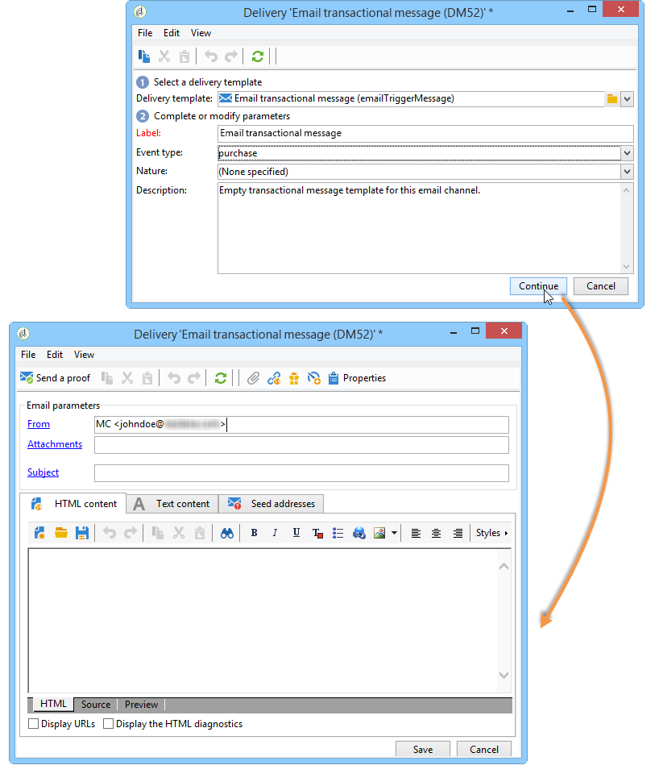

# Diseño de plantillas de mensajes transaccionales {#creating-the-message-template}

Para asegurarse de que cada evento se pueda cambiar a un mensaje personalizado, debe crear una plantilla de mensaje para que coincida con cada tipo de evento.

>[!IMPORTANT]
>
>Los tipos de evento deben crearse de antemano. Para obtener más información, consulte [Creación de tipos de eventos](../../message-center/using/creating-event-types.md).

Las plantillas de mensajes transaccionales contienen la información necesaria para personalizar el mensaje transaccional. También puede utilizar plantillas para probar la previsualización del mensaje y enviar pruebas utilizando las direcciones semilla antes de su entrega al destinatario final. Para obtener más información, consulte [Prueba de plantillas de mensajes transaccionales](../../message-center/using/testing-message-templates.md).

## Creación de la plantilla del mensaje {#creating-message-template}

1. Vaya a la carpeta **[!UICONTROL Message Center >Transactional message templates]** en el árbol de Adobe Campaign.

1. En la lista de las plantillas de mensajes transaccionales, haga clic con el botón derecho y seleccione **[!UICONTROL New]** en el menú desplegable o haga clic en el botón **[!UICONTROL New]** situado sobre la lista de las plantillas de mensajes transaccionales.

   

1. En la ventana de envío, seleccione la plantilla de envío adecuada para el canal que desee utilizar.

   

1. Cambie la etiqueta si es necesario.

1. Seleccione el tipo de evento que coincida con el mensaje que desea enviar.

   

   Es necesario crear previamente los tipos de eventos en la consola. Para obtener más información, consulte[Creación de tipos de eventos](../../message-center/using/creating-event-types.md).

   >[!IMPORTANT]
   >
   >Un tipo de evento no puede vincularse con más de una plantilla.

1. Introduzca una característica y una descripción y, a continuación, haga clic en **[!UICONTROL Continue]** para crear el cuerpo del mensaje (consulte [Creación de contenido del mensaje](#creating-message-content)).

   

## Creación del contenido del mensaje {#creating-message-content}

La definición del contenido de mensajería transaccional es la misma que para las entregas normales en Adobe Campaign. Por ejemplo, para una entrega de correo electrónico, puede crear contenido en formato HTML o texto, añadir archivos adjuntos o personalizar el objeto de envío. Para obtener más información, consulte el capítulo [Entrega de correo electrónico](../../delivery/using/about-email-channel.md).

>[!IMPORTANT]
>
>Las imágenes incluidas en el mensaje deben ser de fácil acceso público. Adobe Campaign no proporciona ningún mecanismo de carga de imágenes para los mensajes transaccionales.\
>A diferencia de JSSP o webApp, `<%=` no tiene ninguna omisión predeterminada.
>
>En este caso, tiene que omitir correctamente todos los datos procedentes del evento. Esta omisión depende de cómo se utilice este campo. Por ejemplo, dentro de una URL, utilice encodeURIComponent. Para mostrar en HTML, puede utilizar escapeXMLString.

Una vez definido el contenido del mensaje, puede integrar la información del evento en el cuerpo del mensaje y personalizarlo. La información del evento se inserta en el cuerpo del texto gracias a las etiquetas de personalización.

* Todos los campos de personalización proceden de la carga útil.
* Es posible hacer referencia a uno o varios bloques de personalización en un mensaje transaccional. El contenido del bloque se agrega al contenido de la envío durante la publicación en la instancia de ejecución.

Para insertar etiquetas de personalización en el cuerpo de un mensaje de correo electrónico, aplique los siguientes pasos:

1. En la plantilla de mensaje, haga clic en la pestaña que coincida con el formato de correo electrónico (HTML o texto).

1. Introduzca el cuerpo del mensaje.

1. En el cuerpo del texto, inserte la etiqueta utilizando el menú **[!UICONTROL Real time events > Event XML]**.

   

1. Complete la etiqueta con la siguiente sintaxis: **element name**.@**attribute name** como se muestra a continuación.

   

1. Guarde el contenido.

El mensaje ya está listo para [probarse](../../message-center/using/testing-message-templates.md).
