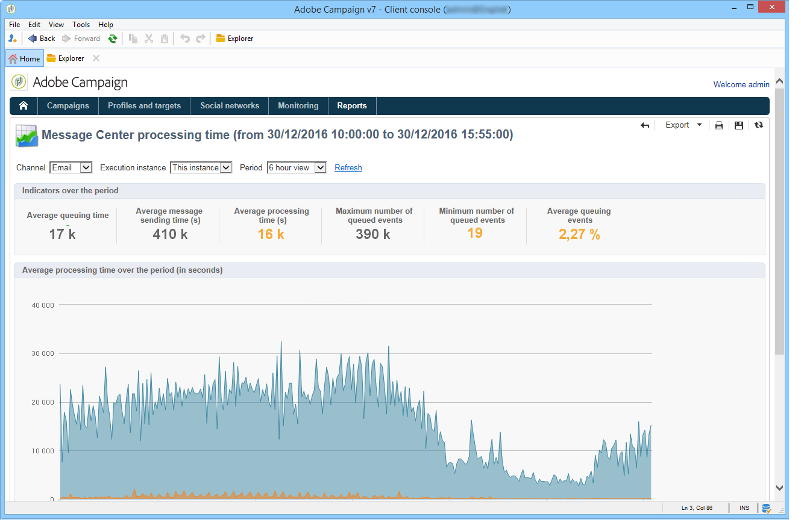

# Tiempo de procesamiento del Centro de mensajería {#message-center-processing-time}

Este informe muestra los indicadores principales relacionados con la cola de tiempo real.

También se puede acceder a este informe, dirigido a los administradores técnicos, a través de la pestaña **[!UICONTROL Monitoring]** en la instancia de control.

Al igual que para el informe **[!UICONTROL Message Center service level]**, puede elegir mostrar las estadísticas generales o las relativas a una instancia de ejecución determinada. También puede filtrar los datos por canal y por un periodo específico.

Los indicadores que se muestran en la sección **[!UICONTROL Indicators over the period]** se calculan en el periodo seleccionado:

* **[!UICONTROL Average queuing time]**: el tiempo promedio que permanecen los eventos procesados correctamente en el Centro de mensajes. Solo se tiene en cuenta el tiempo de procesamiento.
* **[!UICONTROL Average message sending time (s)]**: el tiempo promedio que permanecen los eventos procesados correctamente en el Centro de mensajes. Solo se tiene en cuenta el tiempo de envío de mta.
* **[!UICONTROL Average processing time (s)]**: el tiempo promedio que permanecen los eventos procesados correctamente en el Centro de mensajes. El cálculo toma en cuenta el tiempo de procesamiento y el tiempo de envío de mta.
* **[!UICONTROL Maximum number of queued events]**: número máximo de eventos presentes en la cola del Centro de mensajes en un momento determinado.
* **[!UICONTROL Minimum number of queued events]**: número mínimo de eventos presentes en la cola del Centro de mensajes en un momento determinado.
* **[!UICONTROL Average number of queued events]**: número promedio de eventos presentes en la cola del Centro de mensajes en un momento determinado.

>[!NOTE]
>
>Los umbrales de los indicadores de advertencia (naranja) y alerta (rojo) pueden configurarse en el Asistente para la implementación de Adobe Campaign. Consulte [Umbrales de monitorización](../../message-center/using/additional-configurations.md#monitoring-thresholds).
