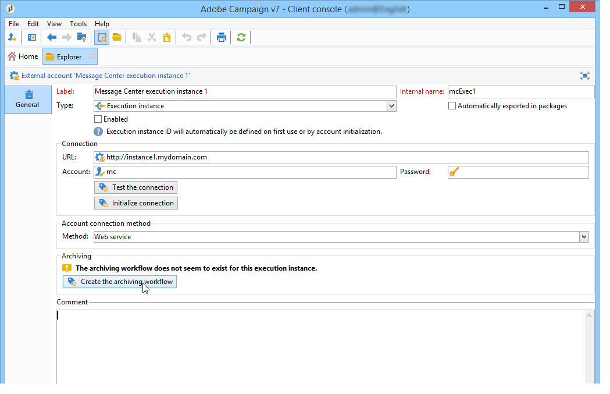

# Flujos de trabajo técnicos{#technical-workflows}

Debe asegurarse de que los flujos de trabajo técnicos de la instancia de control y de las diferentes instancias de ejecución se hayan creado e iniciado antes de implementar cualquier plantilla de mensaje transaccional.

Los distintos flujos de trabajo técnicos relacionados con los mensajes transaccionales (centro de mensajes) se desglosan entre la instancia de control y la instancia de ejecución.

## Flujos de trabajo de instancias de control {#control-instance-workflows}

En la instancia de control, tanto si tiene una o varias instancias de ejecución registradas, debe crear un flujo de trabajo de archivado para cada cuenta externa de la **[!UICONTROL Message Center execution instance]**. Haga clic en el botón **[!UICONTROL Create the archiving workflow]** para crear e iniciar el flujo de trabajo.

A continuación, se puede acceder a estos flujos de trabajo de archivado desde la carpeta **Administration > Production > Message Center**. Una vez creados, los flujos de trabajo de archivado se inician automáticamente.

<!--**Minimal architecture**

Once the control and execution modules are installed on the same instance, you must create the archiving workflow using the deployment wizard. Click the **[!UICONTROL Create the archiving workflow]** button to create and start the workflow.

-->

## Flujos de trabajo de instancias de ejecución {#execution-instance-workflows}

En la instancia de ejecución, se puede acceder a los flujos de trabajo técnicos para la mensajería transaccional desde la carpeta **Administration > Production > Message Center.** Solo tiene que iniciarlos. Los flujos de trabajo de la lista son:

* **[!UICONTROL Processing batch events]** (internal name: **[!UICONTROL batchEventsProcessing]**): este flujo de trabajo permite desglosar eventos por lote en cola antes de relacionarlos con una plantilla de mensaje.
* **[!UICONTROL Processing real time events]** (internal name: **[!UICONTROL rtEventsProcessing]**): este flujo de trabajo permite desglosar eventos en tiempo real en cola antes de relacionarlos con una plantilla de mensaje.
* **[!UICONTROL Update event status]** (internal name: **[!UICONTROL updateEventStatus]**): este flujo de trabajo le permite atribuir un estado al evento.

   Los siguientes estados de eventos están disponibles:

   * **[!UICONTROL Pending]**: el evento está en cola. Aún no se le ha asignado ninguna plantilla de mensaje.
   * **[!UICONTROL Pending delivery]**: el evento está en cola, se le ha asignado una plantilla de mensaje y la entrega lo está procesando.
   * **[!UICONTROL Sent]** : este estado se copia desde los registros de envío. Significa que la entrega se realizó.
   * **[!UICONTROL Ignored by the delivery]** : este estado se copia desde los registros de envío. Significa que la entrega se ha omitido.
   * **[!UICONTROL Delivery failed]** : este estado se copia desde los registros de envío. Significa que la entrega ha fallado.
   * **[!UICONTROL Event not taken into account]**: el evento no se ha podido relacionar con una plantilla de mensaje. El evento no se va a procesar.
