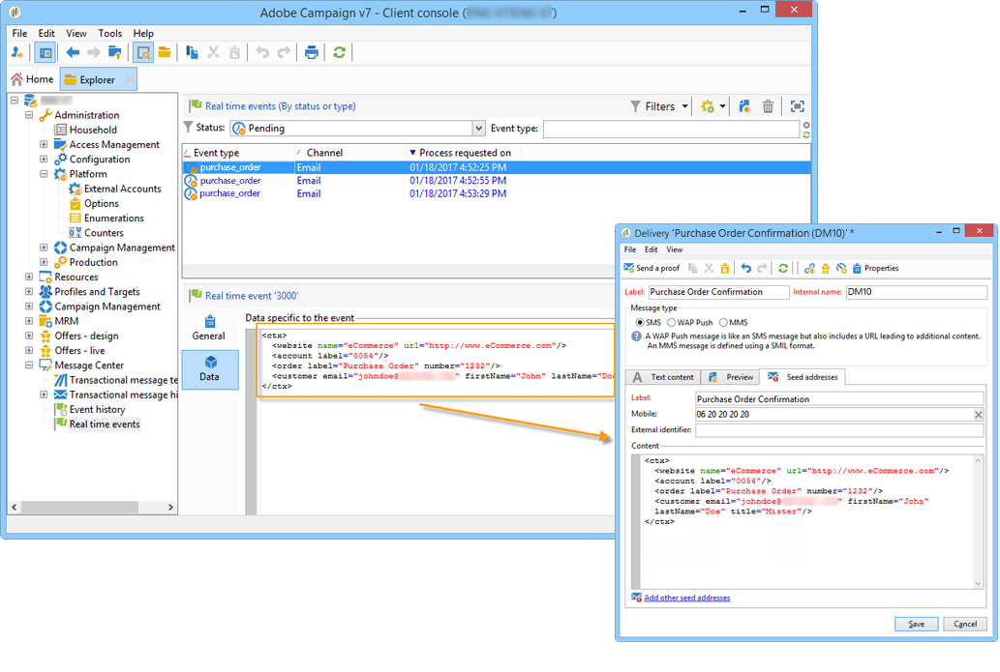

# Probar las plantillas de mensajes transaccionales {#testing-message-templates}

Una vez que la [plantilla de mensaje](../../message-center/using/creating-the-message-template.md) esté lista, siga los pasos a continuación para previsualizarla y probarla.

## Administración de direcciones semilla en mensajes transaccionales {#managing-seed-addresses-in-transactional-messages}

Una dirección semilla permite mostrar una vista previa del mensaje, enviar una prueba y probar la personalización del mensaje antes de enviarlo por correo electrónico o SMS. Las direcciones semilla están vinculadas a la entrega y no se pueden utilizar para otros envíos.

Para crear direcciones semilla en un mensaje transaccional, siga los pasos a continuación:

1. En la plantilla de mensaje transaccional, haga clic en la pestaña **[!UICONTROL Seed addresses]**.

   

1. Asigne una etiqueta para facilitar la selección posterior.

   

1. Introduzca la dirección semilla (correo electrónico o teléfono móvil en función del canal de comunicación).

   

1. Introduzca el identificador externo: este campo opcional permite introducir una clave comercial (ID única, nombre + correo electrónico, etc.) que es común a todas las aplicaciones del sitio web y es utilizada para identificar los perfiles. Si este campo también está presente en la base de datos de marketing de Adobe Campaign, puede conciliar un evento con un perfil de la base de datos.

   

1. Inserte datos de prueba (consulte [Datos de personalización](#personalization-data)).

   

   <!--## Creating several seed addresses {#creating-several-seed-addresses}-->
1. Haga clic en el vínculo **[!UICONTROL Add other seed addresses]** y luego en el botón **[!UICONTROL Add]**.

   

   <!--1. Follow the configuration steps for a seed address detailed in the [Creating a seed address](#creating-a-seed-address) section.-->
1. Repita el proceso para crear todas las direcciones que sean necesarias.

   

Una vez creadas las direcciones, puede mostrar su vista previa y personalización. Consulte [Vista previa de mensajes transaccionales](#transactional-message-preview).

## Datos de personalización {#personalization-data}

Es posible utilizar los datos en la plantilla de mensaje para probar la personalización del mensaje transaccional. Esta funcionalidad se utiliza para generar una vista previa o enviar una prueba. También puede mostrar la renderización del mensaje para varios proveedores de acceso a Internet. Para obtener más información, consulte [renderización de la bandeja de entrada](../../delivery/using/inbox-rendering.md).

La finalidad de estos datos es probar los mensajes antes de la entrega final. Estos mensajes no coinciden con los datos reales que se van a procesar. Sin embargo, la estructura XML debe ser idéntica a la del evento almacenado en la instancia de ejecución, como se muestra a continuación:

Esta información le permite personalizar el contenido del mensaje mediante etiquetas de personalización (para obtener más información, consulte [Creación del contenido del mensaje](../../message-center/using/creating-the-message-template.md#creating-message-content)).

1. Seleccione la plantilla de mensaje transaccional.

1. En la plantilla , haga clic en la pestaña **[!UICONTROL Seed addresses]** .

1. En el contenido del evento, introduzca la información de prueba en formato XML.

   

1. Haga clic en **[!UICONTROL Save]**.

## Vista previa del mensaje transaccional {#transactional-message-preview}

Una vez que haya creado una o varias direcciones semilla y el cuerpo del mensaje, puede obtener una vista previa del mensaje y comprobar su personalización.

1. En la plantilla del mensaje, haga clic en la pestaña **[!UICONTROL Preview]**.

   

1. Seleccione **[!UICONTROL A seed address]** de la lista desplegable.

   

1. Seleccione la dirección semilla creada anteriormente para mostrar el mensaje personalizado.

   

Con las direcciones semilla, también se puede mostrar la renderización del mensaje para varios proveedores de acceso a Internet. Para obtener más información, consulte [renderización de la bandeja de entrada](../../delivery/using/inbox-rendering.md).

## Envío de una prueba {#sending-a-proof}

Puede probar la entrega de mensajes enviando una prueba a una dirección semilla creada anteriormente.

El envío de una prueba implica realizar el mismo proceso que para un [envío normal](../../delivery/using/steps-validating-the-delivery.md#sending-a-proof). Sin embargo, con la mensajería transaccional, debe llevar a cabo las siguientes operaciones de antemano:

* Cree una o más [direcciones semilla](#managing-seed-addresses-in-transactional-messages) con [datos de personalización](#personalization-data).
* [Cree el contenido del mensaje](../../message-center/using/creating-the-message-template.md#creating-message-content).

Para enviar la prueba:

1. Haga clic en el botón **[!UICONTROL Send a proof]** de la ventana envío.
1. Analice la entrega.
1. Corrija los errores y confirme la entrega.

   

1. Compruebe que el mensaje se haya enviado a la dirección semilla y que su contenido cumpla con su configuración.

   

Se puede acceder a las pruebas en cada plantilla a través de la pestaña **[!UICONTROL Audit]**. Para obtener más información sobre esto, consulte [Envío de una prueba](../../delivery/using/steps-validating-the-delivery.md#sending-a-proof).

La plantilla de mensaje ya está lista para [publicado](../../message-center/using/publishing-message-templates.md).