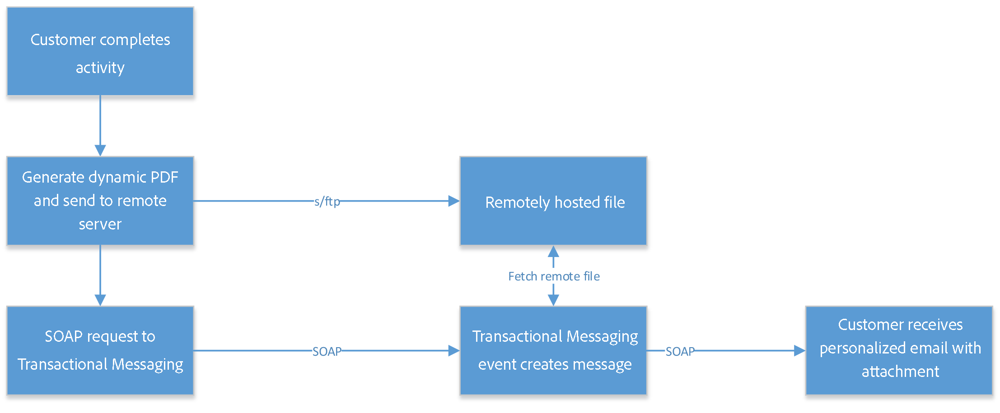

# Caso de uso: envío de correos electrónicos transaccionales con archivos adjuntos{#transactional-email-with-attachments}

El propósito de este caso de uso es añadir archivos adjuntos de los correos electrónicos sobre la marcha a las entregas salientes.

## Pasos clave {#key-steps}

En este escenario, veremos cómo enviar correos electrónicos de transacciones con archivos adjuntos individuales o personalizados. Los archivos adjuntos no se precargan en el servidor de mensajería transaccional sino que se generan sobre la marcha.

Al capturar las interacciones o los detalles del cliente, es posible que necesite volver a enviar esta información al cliente al final del proceso, por ejemplo, en un archivo PDF adjunto a un correo electrónico.

A continuación se muestran los pasos principales de este escenario:

1. El cliente introduce el sitio web y busca el producto que desea comprar.
1. El cliente selecciona el producto y personaliza algunas opciones.
1. El cliente completa la transacción.
1. Se envía un correo electrónico al cliente que confirma la transacción. Dado que no se recomienda enviar la información PII (Información de identificación personal) en el correo electrónico, se genera un PDF seguro y se adjunta al correo electrónico.
1. El cliente recibe el correo electrónico y su archivo adjunto que contiene los datos relevantes.

En este caso, los archivos adjuntos no se generan previamente sino que se añaden sobre la marcha a los correos electrónicos salientes, lo que ofrece los siguientes beneficios:

* Esto también permite personalizar el contenido del archivo adjunto.
* Si el archivo adjunto está asociado con una transacción (como en el ejemplo descrito anteriormente), puede contener datos dinámicos que se generan durante el proceso del cliente.
* Al adjuntar archivos PDF, se optimiza la seguridad, ya que se puede codificar y enviarlos a través de HTTPS.

>[!NOTE]
>
>Para evitar problemas de rendimiento, si incluye imágenes descargadas sobre la marcha desde una URL personalizada como datos adjuntos, cada tamaño de imagen no debe superar los 100.000 bytes de forma predeterminada. Este umbral recomendado se puede configurar desde [la lista de opciones de Campaign Classic](../../installation/using/configuring-campaign-options.md#delivery).

## Recomendaciones {#important-notes}

Antes de implementar este escenario, lea atentamente las directrices siguientes:

* Las instancias de mensajería transaccional no deben utilizarse para almacenar, exportar o cargar archivos o datos. Solo se pueden utilizar para datos de evento e información relacionada. No deben considerarse como un sistema de almacenamiento de archivos.
* Dado que no hay acceso directo a las instancias o al servidor de mensajería transaccional fuera de Adobe, no hay una forma estándar de insertar dichos archivos en estos servidores (sin acceso a FTP).
* No es correcto contractualmente utilizar el espacio en disco en instancias de mensaje transaccional para almacenar archivos de cualquier tipo, ni siquiera para los archivos adjuntos.
* Para hospedar estos archivos debe utilizar otro sistema de discos en línea. Necesita un acceso FTP a este sistema y poder escribir y eliminar archivos.

>[!NOTE]
>
>Para evitar problemas de rendimiento, se recomienda no incluir más de un archivo adjunto por correo electrónico. El umbral recomendado se puede configurar desde [la lista de opciones de Campaign Classic](../../installation/using/configuring-campaign-options.md#delivery).

## Implementación {#implementation}

El diagrama siguiente muestra los diferentes pasos para implementar este escenario:



Para añadir archivos adjuntos de correo electrónico sobre la marcha a un mensaje transaccional, siga los pasos a continuación:

1. Primero, diseñe el archivo adjunto. Para obtener más información, consulte [esta sección](../../delivery/using/attaching-files.md#attach-a-personalized-file).

   Esto permite adjuntar archivos a un correo electrónico, incluso si no están hospedados en la instancia de ejecución.

1. Puede enviar correos electrónicos a través de un activador de mensaje SOAP. En la llamada SOAP, hay un parámetro de URL (attachmentURL).

   Para obtener más información sobre las solicitudes SOAP, consulte [Descripción de eventos](../../message-center/using/event-description.md).

1. Al diseñar el correo electrónico, haga clic en **[!UICONTROL Attachment]**.

1. En la pantalla de **[!UICONTROL Attachment definition]** introduzca el parámetro de archivo adjunto SOAP:

   ```
   <%= rtEvent.ctx.attachementUrl %>
   ```

1. Cuando se procesa el mensaje, el sistema obtiene el archivo desde la ubicación remota (servidor de terceros) y lo adjunta al mensaje individual.

   Dado que este parámetro puede ser una variable, debe aceptar la variable URL remota completamente formada del archivo, enviada a través de la llamada SOAP.

   
