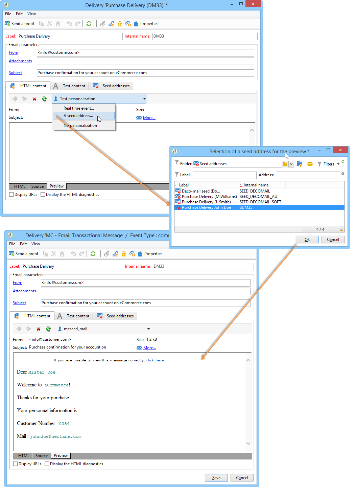

# Vista previa del mensaje transaccional{#transactional-message-preview}

Una vez que haya creado una o varias direcciones semilla y el cuerpo del mensaje, puede obtener una vista previa del mensaje y comprobar su personalización.

1. En la plantilla del mensaje, haga clic en la pestaña **[!UICONTROL Preview]**.

   

1. Seleccione **[!UICONTROL A seed address]** de la lista desplegable.

   

1. Seleccione la dirección semilla creada anteriormente para mostrar el mensaje personalizado.

   
