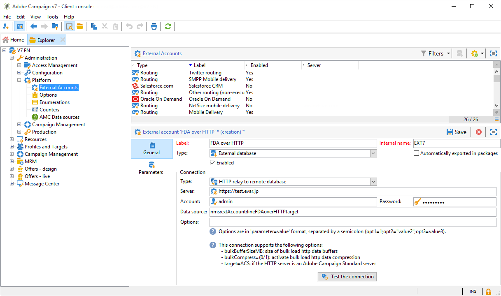

# Arquitectura de mensajería transaccional {#transactional-messaging-architecture}

La mensajería transaccional se basa en una arquitectura específica, que consta de varias instancias:

* Una **instancia de control**, en la que se crean las plantillas de mensaje.

* Una o más **instancias de ejecución**, que reciben eventos y envían mensajes.


| Instancia de control | Instancia de ejecución |
|--- |--- |
| Los usuarios de Adobe Campaign inician sesión en la instancia de control para: <ul><li>Crear plantillas de mensaje transaccional</li><li>Generar la vista previa del mensaje mediante una lista de reasignación</li><li>Mostrar informes</li><li>Monitorización de las instancias de ejecución</li></ul> | Las instancias de ejecución están aquí para: <ul><li>Recibir eventos</li><li>Vincularlos a plantillas de mensajes transaccionales</li><li>Enviar un mensaje personalizado a cada destinatario</li></ul> |

## Instancias de instalación {#installing-instances}

Para instalar los paquetes de mensajes transaccionales deben tomarse varias precauciones. Adobe recomienda trabajar en un entorno de prueba antes de realizar la producción. También necesita disponer de una licencia compatible con Adobe Campaign. Para obtener más información, póngase en contacto con su administrador de cuentas de Adobe.

>[!IMPORTANT]
>
>La instancia de control y las instancias de ejecución deben estar instaladas en diferentes equipos. No pueden compartir la misma instancia de Campaign.

Si necesita utilizar varios canales, debe instalar y configurar los paquetes relacionados antes de instalar los paquetes de los mensajes transaccionales. Para obtener más información, consulte [Adición de un canal de envío](#adding-a-delivery-channel).

## Instancia de control {#control-instance}

Para instalar la instancia de control en el equipo, seleccione el paquete **[!UICONTROL Transactional message control]** mediante el menú **[!UICONTROL Tools]** > **[!UICONTROL Advanced]** > **[!UICONTROL Import package]**. Para obtener más información, consulte [Instalación de paquetes estándar de Campaign Classic](../../installation/using/installing-campaign-standard-packages.md).


Los pasos detallados para configurar la instancia de control se presentan en [esta sección](../../message-center/using/configuring-instances.md#control-instance).

### Admite varias instancias de control {#supporting-several-control-instances}

>[!IMPORTANT]
>
>El uso compartido de un clúster de ejecución con varias instancias de control solo se admite en entornos locales.

Es posible compartir un clúster de ejecución entre varias instancias de control. Por ejemplo, si gestiona varias tiendas especializadas, puede configurar una instancia de control por cada marca y vincular todo al mismo clúster de ejecución.


>[!NOTE]
>
>Para obtener más información sobre la configuración necesaria, consulte [Usar varias instancias de control](../../message-center/using/configuring-instances.md#using-several-control-instances).

## Instancia de ejecución {#execution-instance}

Para instalar una instancia de ejecución en el equipo, seleccione el paquete **[!UICONTROL Transactional message execution]** mediante el menú **[!UICONTROL Tools]** > **[!UICONTROL Advanced]** > **[!UICONTROL Import package]**. Para obtener más información, consulte [Instalación de paquetes estándar de Campaign Classic](../../installation/using/installing-campaign-standard-packages.md).


Los pasos detallados para configurar una instancia de ejecución se describen en [esta sección](../../message-center/using/configuring-instances.md#execution-instance).

## Canales de envío disponibles

El canal de correo electrónico está disponible de forma predeterminada. Para enviar los mensajes transaccionales en varios canales, puede agregar otros canales (canal móvil, canal de aplicación móvil, etc.).

>[!IMPORTANT]
>
>La adición de un canal de entrega (canal móvil, canal de aplicación móvil, etc.) debe realizarse antes de instalar el paquete de mensajes transaccionales.

### Añadir un canal de envío {#adding-a-delivery-channel}

Adobe recomienda **añadir siempre el paquete del canal de envío antes de instalar el paquete de mensajes transaccionales**.

Si ha iniciado un proyecto de mensajería transaccional en el canal de correo electrónico, y decide durante el proyecto agregar un canal nuevo, debe seguir estos pasos.

>[!NOTE]
>
>Este procedimiento solo se aplica a los clientes que utilizan un servidor NLServer de Windows instalado en el mismo equipo en el que están trabajando.

1. Instale el canal que necesita, por ejemplo, el **Canal móvil**, mediante el asistente de importación de paquetes (**[!UICONTROL Tools > Advanced > Import package... > Adobe Campaign Package]**).
1. Realice una importación de archivos (**[!UICONTROL Tools > Advanced > Import package... > File]**) y seleccione el archivo **datakitnms **`[Your language]`**packagemessageCenter.xml**.
1. En **[!UICONTROL XML content of the data to import]**, conserve solo la plantilla de envíos que corresponde al canal añadido. Por ejemplo, si ha añadido el **canal móvil**, conserve solamente el elemento **entidades** que corresponda a **[!UICONTROL Mobile transactional message]** (smsTriggerMessage). Si ha añadido el **canal de aplicación móvil**, mantenga únicamente el **mensaje transaccional de iOS** (iosTriggerMessage) y el **mensaje transaccional de Android** (androidTriggerMessage).

   

<!--## Transactional messages and inbound Interaction {#transactional-messages-and-inbound-interaction}

When combined with the Inbound Interaction module, transactional messaging enables you to insert a marketing offer dedicated to the recipient into the message.

>[!NOTE]
>
>The Interaction module is detailed in [Interaction](../../interaction/using/interaction-and-offer-management.md).

To use transactional messaging with Interaction, you need to apply the following configurations:

* Install the **Interaction** package onto the control instance and configure your offer catalog.

  >[!IMPORTANT]
  >
  >Do not replicate the offers onto the execution instances.

* The event must include an identifier linked to the recipients, for personalizing offers. The **@externalId** attribute must contain the value of this identifier. **Interaction** is configured by default to identify the recipient of the primary key:

  ```
  <rtEvent type="order_confirmation" email="john.doe@adobe.com" externalId="1242"> 
  ```

  You can configure **Interaction** so that identification takes place in the field of your choice, for example on the email address:

  ```
  <rtEvent type="order_confirmation" email="john.doe@adobe.com" externalId="john.doe@yahoo.com"> 
  ```

Create your delivery templates the way you would for an email campaign:

* Add the offer to your transactional message template.
* Check the preview, send a proof and publish the template.

You also have to enable the unitary mode on your offer spaces. For more on this, refer to [this section](../../interaction/using/creating-offer-spaces.md).-->

### Notificaciones push transaccionales {#transactional-messaging-and-push-notifications}

Cuando se combina con el módulo de canal de aplicaciones móviles, la mensajería transaccional permite enviar mensajes transaccionales mediante notificaciones en dispositivos móviles.

>[!NOTE]
>
>El canal de la aplicación móvil se encuentra detallado en [esta sección](../../delivery/using/about-mobile-app-channel.md).

Para utilizar módulos de mensaje transaccional con el canal de aplicaciones móviles, debe aplicar las siguientes configuraciones:

1. Instale el paquete del **Mobile App Channel** en las instancias de control y ejecución.
1. Repita el servicio tipo de **Mobile application** de Adobe Campaign, así como las aplicaciones móviles que contiene en las instancias de ejecución.

El evento debe contener los siguientes elementos:

* La ID del dispositivo móvil (**registrationId** para Android y **deviceToken** para iOS). Esta ID representa la “dirección” a la que se envía la notificación.
* El vínculo a la aplicación móvil o clave de integración (**uuid**) que permite recuperar la información de conexión específica de la aplicación.
* El canal al que se enviará la notificación (**wishedChannel**): 41 para iOS y 42 para Android
* Todos los datos son útiles para la personalización.

A continuación se muestra un ejemplo de un evento que contiene esta información:

```
<SOAP-ENV:Envelope xmlns:xsd="http://www.w3.org/2001/XMLSchema" xmlns:xsi="http://www.w3.org/2001/XMLSchema-instance" xmlns:SOAP-ENV="http://schemas.xmlsoap.org/soap/envelope/">
   <SOAP-ENV:Body>
     <urn:PushEvent>
         <urn:sessiontoken>mc/</urn:sessiontoken>
         <urn:domEvent>

              <rtEvent wishedChannel="41" type="DELIVERY" registrationToken="2cefnefzef758398493srefzefkzq483974">
                <mobileApp _operation=”none” uuid="com.adobe.NeoMiles"/>
                <ctx>
                    <deliveryTime>1:30 PM</deliveryTime>
                    <url>http://www.adobe.com</url>
                </ctx>
              </rtEvent>

         </urn:domEvent>
     </urn:PushEvent>           
   </SOAP-ENV:Body>
</SOAP-ENV:Envelope>
```

>[!NOTE]
>
>La creación de las plantillas de mensajes sigue siendo la misma.

### Mensajería transaccional y LINE {#transactional-messaging-and-line}

Combinados con el canal LINE, los mensajes transaccionales le permiten enviar mensajes en tiempo real en la aplicación LINE instalada en los dispositivos de los consumidores. Se utiliza para enviar el mensaje de bienvenida cuando un usuario de LINE añade la página de la marca.

Para utilizar el módulo de mensaje transaccional con LINE, se necesitan los siguientes elementos para la configuración de la instancia de **marketing** y la instancia de **ejecución**:

* Instale el paquete **[!UICONTROL LINE Connect]** en ambas instancias.
* Instale el paquete **[!UICONTROL Transactional message control]** en la instancia de marketing y el paquete **[!UICONTROL Transactional message execution]** en la instancia de ejecución.
* Cree una **cuenta externa** y un **servicio** de LINE en ambas instancias con un nombre idéntico para que se sincronicen. Para obtener más información sobre cómo crear una cuenta externa y un servicio de LINE, consulte esta [página](../../delivery/using/line-channel.md#creating-a-line-account-and-an-external-account-).

A continuación, desde **[!UICONTROL Explorer]**, en **[!UICONTROL Platform]** > **[!UICONTROL External account]**, debe configurar diferentes cuentas externas en ambas instancias:

1. Cree una cuenta externa **[!UICONTROL External database]** en la instancia de **ejecución** con la configuración siguiente:

   

   * **[!UICONTROL Label]** y **[!UICONTROL Internal name]**: cambie el nombre de la cuenta externa según sea necesario.
   * **[!UICONTROL Type]**: Seleccione **[!UICONTROL External database]**.
   * La casilla **[!UICONTROL Enabled]** debe estar activada.

   De la categoría **[!UICONTROL Connection]**:

   * **[!UICONTROL Type]** : seleccione el servidor de la base de datos, por ejemplo PostgresSQL.
   * **[!UICONTROL Server]** : introduzca la URL del servidor de la base de datos.
   * **[!UICONTROL Account]** : introduzca su cuenta de la base de datos.

      >[!NOTE]
      >
      >El usuario de la base de datos necesita tener derechos de lectura en las siguientes tablas para la conexión FDA: XtkOption, NmsVisitor, NmsVisitorSub, NmsService, NmsBroadLogRtEvent, NmsBroadLogBatchEvent, NmsTrackingLogRtEvent, NmsTrackingLogBatchEvent, NmsRtEvent, NmsBatchEvent, NmsBroadLogMsg NmsTrackingUrl, NmsDelivery, NmsWebTrackingLogXtkFolder.

   * **[!UICONTROL Password]** : introduzca la contraseña de la cuenta de la base de datos.
   * **[!UICONTROL Database]** : introduzca el nombre de la base de datos de la instancia de ejecución.
   * La casilla **[!UICONTROL Target of an HTTP relay to remote database's account]** debe estar activada.


1. Cree una cuenta **[!UICONTROL External Database]** en la instancia de **marketing** con la configuración siguiente:

   

   * **[!UICONTROL Label]** y **[!UICONTROL Internal name]**: cambie el nombre de la cuenta externa según sea necesario.
   * **[!UICONTROL Type]**: Seleccione **[!UICONTROL External database]**.
   * La casilla “Activada” debe estar seleccionada.

   De la categoría **[!UICONTROL Connection]**:

   * **[!UICONTROL Type]**: Seleccione **[!UICONTROL HTTP relay to remote Database]**.
   * **[!UICONTROL Server]** : introduzca la URL del servidor de la campaña de la instancia de ejecución.
   * **[!UICONTROL Account]** : introduzca la cuenta utilizada para acceder a la instancia de ejecución.
   * **[!UICONTROL Password]** : introduzca la contraseña de la cuenta utilizada para acceder a la instancia de ejecución.
   * **[!UICONTROL Data Source]**: Introduzca la sintaxis siguiente **[!UICONTROL nms:extAccount:ID of your external database account in the execution instance]**.


1. Cree una cuenta externa **[!UICONTROL Execution instance]** en la instancia de **marketing** mediante la configuración siguiente para crear el flujo de trabajo de la sincronización de datos:

   

   * **[!UICONTROL Label]** y **[!UICONTROL Internal name]**: cambie el nombre de la cuenta externa según sea necesario.
   * **[!UICONTROL Type]**: Seleccione **[!UICONTROL Execution instance]**.
   * La casilla “Activada” debe estar seleccionada.

   Desde la categoría **[!UICONTROL Connection]**:

   * **[!UICONTROL URL]**: introduzca la URL de la instancia de ejecución.
   * **[!UICONTROL Account]**: introduzca la cuenta utilizada para acceder a la instancia de ejecución.
   * **[!UICONTROL Password]** : introduzca la contraseña de la cuenta utilizada para acceder a la instancia de ejecución.

   Desde la categoría **[!UICONTROL Account connection method]**:

   * **[!UICONTROL Method]**: Seleccione **[!UICONTROL Federated Data Access (FDA)]**.
   * **[!UICONTROL FDA account]** : seleccione su cuenta de FDA de la lista desplegable.
   * Haga clic en el botón **[!UICONTROL Create the archiving workflow]**.
   * Haga clic en el botón **[!UICONTROL Create data synchronization workflow]** para crear el flujo de trabajo de la sincronización de datos LINE.


1. Ahora puede empezar a crear mensajes transaccionales. Para obtener más información, consulte [esta página](../../message-center/using/creating-the-message-template.md).
