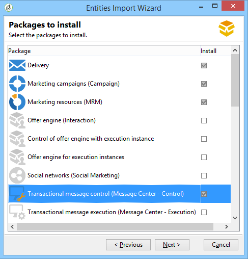

# Arquitectura de mensajería transaccional{#transactional-messaging-architecture}

## Acerca de las instancias de ejecución y control {#about-execution-and-control-instances}

En Adobe Campaign, las funcionalidades de la mensajería transaccional (también conocidas como Centro de Mensajes) se diseñaron para apoyar la escalabilidad y proporcionar un servicio de 24 horas al día. Están formadas por varias instancias:

* una instancia de control, en la que se crean las plantillas de mensajes,
* una o más instancias de ejecución que reciben eventos y envían mensajes.

Para utilizar estas funcionalidades, los usuarios de Adobe Campaign inician sesión en la instancia de control para crear plantillas de mensajes transaccionales, generar la vista previa del mensaje utilizando una lista de semilla, mostrar informes y supervisar instancias de ejecución.

Las instancias de ejecución reciben eventos, los vinculan a plantillas de mensajes transaccionales y envían un mensaje personalizado a cada destinatario.


## Soporte de varias instancias de control {#supporting-several-control-instances}

>[!CAUTION]
>
>El uso compartido de un clúster de ejecución con varias instancias de control solo se admite en entornos locales.

Es posible compartir un clúster de ejecución entre varias instancias de control. Por ejemplo, si gestiona varias tiendas especializadas, puede configurar una instancia de control por cada marca y vincular todo al mismo clúster de ejecución.


>[!NOTE]
>
>Para obtener más información sobre la configuración necesaria, consulte [Usar varias instancias de control](../../message-center/using/creating-a-shared-connection.md#using-several-control-instances).

## Instalación de instancias {#installing-instances}

Para instalar los paquetes de mensajes transaccionales deben tomarse varias precauciones. Adobe recomienda trabajar en un entorno de prueba antes de realizar la producción. También necesita disponer de una licencia compatible con Adobe Campaign. Para obtener más información, póngase en contacto con su administrador de cuentas de Adobe.

>[!CAUTION]
>
>La instancia de control y las instancias de ejecución deben estar instaladas en diferentes equipos. No pueden compartir la misma instancia de Campaign.

Si necesita utilizar varios canales, debe instalar y configurar los paquetes relacionados antes de instalar los paquetes de los mensajes transaccionales. Consulte [Añadir un canal de entrega](#adding-a-delivery-channel).

* Para instalar la instancia de control en el equipo, seleccione el módulo **[!UICONTROL Control de mensajes transaccionales]**.

   

* Para instalar la instancia de ejecución en el equipo, seleccione el módulo **[!UICONTROL Ejecución de mensajes transaccionales]**.

   

## Adición de un canal de entrega {#adding-a-delivery-channel}

La adición de un canal de entrega (canal móvil, canal de aplicación móvil, etc.) debe realizarse antes de instalar el paquete de mensajes transaccionales. Si ha iniciado un proyecto de mensajería transaccional en el canal de correo electrónico, y decide durante el proyecto agregar un canal nuevo, debe seguir estos pasos:

1. Instale el canal que necesita, por ejemplo, el **canal móvil**, mediante el asistente de importación de paquetes (**[!UICONTROL Tools > Advanced > Import package... > Adobe Campaign Package]**).
1. Realice una importación de archivos (**[!UICONTROL Tools > Advanced > Import package... > File]**) y seleccione el archivo ****`[Your language]`**datakitnmspackagemessageCenter.xml**.
1. En el **[!UICONTROL Contenido XML de los datos a importar]** mantenga solo la plantilla de entrega que corresponde al canal añadido. Por ejemplo, si ha añadido el **Canal móvil**, conserve solamente el elemento **entidades** que corresponda a **[!UICONTROL Mensaje transaccional móvil]** (smsTriggerMessage). Si ha añadido el **canal de aplicación móvil**, mantenga únicamente el **mensaje transaccional de iOS** (iosTriggerMessage) y el **mensaje transaccional de Android** (androidTriggerMessage).

   

## Mensajes transaccionales e interacción entrante {#transactional-messages-and-inbound-interaction}

Cuando se combina con el módulo Interacción entrante, los mensajes transaccionales permiten insertar una oferta de marketing dedicada al destinatario del mensaje.

>[!NOTE]
>
>El módulo Interacción se detalla en [Interacción](../../interaction/using/interaction-and-offer-management.md).

Para utilizar mensajes transaccionales con Interacción, debe aplicar las siguientes configuraciones:

* Instale el paquete **Interacción** en la instancia de control y configure el catálogo de ofertas.

   >[!CAUTION]
   >
   >No se deben replicar las ofertas en las instancias de ejecución.

* El evento debe incluir un identificador vinculado a los destinatarios para personalizar las ofertas. El atributo **@externalId** debe contener el valor de este identificador. La **interacción** se configura de forma predeterminada para identificar el destinatario de la clave principal:

   ```
   <rtEvent type="order_confirmation" email="john.doe@adobe.com" externalId="1242"> 
   ```

   Puede configurar la **interacción** de modo que la identificación tenga lugar en el campo de su elección, por ejemplo en la dirección de correo electrónico:

   ```
   <rtEvent type="order_confirmation" email="john.doe@adobe.com" externalId="john.doe@yahoo.com"> 
   ```

Cree las plantillas de entrega como lo haría para una campaña por correo electrónico:

* Añada la oferta a la plantilla de mensaje transaccional.
* Compruebe la vista previa, envíe una prueba y publique la plantilla.

También tiene que activar el modo unitario a los espacios de oferta. Para obtener más información, consulte [esta sección](../../interaction/using/creating-offer-spaces.md).

## Mensajería transaccional y notificaciones “push”{#transactional-messaging-and-push-notifications}

Cuando se combina con el módulo de canal de aplicaciones móviles, la mensajería transaccional permite enviar mensajes transaccionales mediante notificaciones en dispositivos móviles.

>[!NOTE]
>
>El canal de la aplicación móvil se encuentra detallado en [esta sección](../../delivery/using/about-mobile-app-channel.md).

Para utilizar módulos de mensaje transaccional con el canal de aplicaciones móviles, debe aplicar las siguientes configuraciones:

1. Instale el paquete del **Mobile App Channel** en las instancias de control y ejecución.
1. Repita el servicio tipo de **Mobile application** de Adobe Campaign, así como las aplicaciones móviles que contiene en las instancias de ejecución.

El evento debe contener los siguientes elementos:

* La ID del dispositivo móvil (**registrationId** para Android y **deviceToken** para iOS). Esta ID representa la “dirección” a la que se envía la notificación.
* El vínculo a la aplicación móvil o clave de integración (**uuid**) que permite recuperar la información de conexión específica de la aplicación.
* El canal al que se enviará la notificación (**wishedChannel**): 41 para iOS y 42 para Android
* Todos los datos son útiles para la personalización.

A continuación se muestra un ejemplo de un evento que contiene esta información:

```
<SOAP-ENV:Envelope xmlns:xsd="http://www.w3.org/2001/XMLSchema" xmlns:xsi="http://www.w3.org/2001/XMLSchema-instance" xmlns:SOAP-ENV="http://schemas.xmlsoap.org/soap/envelope/">
   <SOAP-ENV:Body>
     <urn:PushEvent>
         <urn:sessiontoken>mc/</urn:sessiontoken>
         <urn:domEvent>

              <rtEvent wishedChannel="41" type="DELIVERY" registrationToken="2cefnefzef758398493srefzefkzq483974">
                <mobileApp _operation=”none” uuid="com.adobe.NeoMiles"/>
                <ctx>
                    <deliveryTime>1:30 PM</deliveryTime>
                    <url>http://www.adobe.com</url>
                </ctx>
              </rtEvent>

         </urn:domEvent>
     </urn:PushEvent>           
   </SOAP-ENV:Body>
</SOAP-ENV:Envelope>
```

>[!NOTE]
>
>La creación de las plantillas de mensajes sigue siendo la misma.

## Mensajería transaccional y LINE {#transactional-messaging-and-line}

Combinados con el canal LINE, los mensajes transaccionales le permiten enviar mensajes en tiempo real en la aplicación LINE instalada en los dispositivos de los consumidores. Se utiliza para enviar el mensaje de bienvenida cuando un usuario de LINE añade la página de la marca.

Para utilizar el módulo de mensaje transaccional con LINE, se necesitan los siguientes elementos para la configuración de la instancia de **marketing** y la instancia de **ejecución**:

* Instalar el paquete **[!UICONTROL Conectar LINE]** en ambas instancias.
* Instalar el paquete **[!UICONTROL Control de mensajes transaccionales]** en la instancia de marketing y el paquete **[!UICONTROL Ejecución de mensajes transaccionales]** en la instancia de ejecución.
* Cree una **cuenta externa** y un **servicio** de LINE en ambas instancias con un nombre idéntico para que se sincronicen. Para obtener más información sobre cómo crear una cuenta externa y un servicio de LINE, consulte esta [página](../../delivery/using/line-channel.md#creating-a-line-account-and-an-external-account-).

A continuación, desde **[!UICONTROL Explorador]** en **[!UICONTROL Plataforma]** > **[!UICONTROL Cuenta externa]**, debe configurar diferentes cuentas externas en ambas instancias:

1. Cree una cuenta externa en la **[!UICONTROL Base de datos externa]** en la instancia de **ejecución** con la configuración siguiente:

   

   * **[!UICONTROL Etiqueta]** y **[!UICONTROL Nombre interno]**: nombre su cuenta externa según sea necesario.
   * **[!UICONTROL Tipo]** : seleccione **[!UICONTROL Base de datos externa]**.
   * **[!UICONTROL La casilla “Activada” debe estar seleccionada.]**
   Desde la categoría **[!UICONTROL Conexión]**:

   * **[!UICONTROL Tipo]**: seleccione el servidor de la base de datos, por ejemplo PostgresSQL.
   * **[!UICONTROL Servidor]**: introducir la URL del servidor de la base de datos.
   * **[!UICONTROL Cuenta]**: introducir su cuenta de la base de datos.

      >[!NOTE]
      >
      >El usuario de la base de datos necesita tener derechos de lectura en las siguientes tablas para la conexión FDA: XtkOption, NmsVisitor, NmsVisitorSub, NmsService, NmsBroadLogRtEvent, NmsBroadLogBatchEvent, NmsTrackingLogRtEvent, NmsTrackingLogBatchEvent, NmsRtEvent, NmsBatchEvent, NmsBroadLogMsg NmsTrackingUrl, NmsDelivery, NmsWebTrackingLogXtkFolder.

   * **[!UICONTROL Contraseña]**: introduzca la contraseña de la cuenta de la base de datos.
   * **[!UICONTROL Base de Datos]**: introducir el nombre de la base de datos de la instancia de ejecución.
   * **[!UICONTROL Se debe marcar el destino de un reenvío HTTP a la cuenta]** de la base de datos remota.


1. Crear una cuenta **[!UICONTROL Base de datos externa]** en la instancia de **marketing** con la configuración siguiente.

   

   * **[!UICONTROL Etiqueta]** y **[!UICONTROL Nombre interno]**: nombre su cuenta externa según sea necesario.
   * **[!UICONTROL Tipo]** : seleccione **[!UICONTROL Base de datos externa]**.
   * La casilla “Activada” debe estar seleccionada.
   Desde la categoría **[!UICONTROL Conexión]**:

   * **[!UICONTROL Tipo]** : seleccionar **[!UICONTROL el relé HTTP a la base de datos remota]**.
   * **[!UICONTROL Servidor]**: introducir la URL del servidor de la campaña de la instancia de ejecución.
   * **[!UICONTROL Cuenta]**: introducir la cuenta utilizada para acceder a la instancia de ejecución.
   * **[!UICONTROL Contraseña]**: introducir la contraseña de la cuenta utilizada para acceder a la instancia de ejecución.
   * **[!UICONTROL Fuente de datos]**: introduzca la siguiente sintaxis **[!UICONTROL nms:extAccount:ID de su cuenta de base de datos externa en la instancia de ejecución]**.


1. Crear una cuenta externa en la **[!UICONTROL Instancia de ejecución]** en la instancia de **marketing** mediante la configuración siguiente para crear el flujo de trabajo de la sincronización de datos:

   

   * **[!UICONTROL Etiqueta]** y **[!UICONTROL Nombre interno]**: nombre su cuenta externa según sea necesario.
   * **[!UICONTROL Tipo]** : seleccione **[!UICONTROL Instancia de ejecución]**.
   * La casilla “Activada” debe estar seleccionada.
   Desde la categoría **[!UICONTROL Conexión]**:

   * **[!UICONTROL URL]**: introducir la URL de la instancia de ejecución.
   * **[!UICONTROL Cuenta]**: introducir la cuenta utilizada para acceder a la instancia de ejecución.
   * **[!UICONTROL Contraseña]**: introducir la contraseña de la cuenta utilizada para acceder a la instancia de ejecución.
   Desde la categoría **[!UICONTROL Método de conexión de cuenta]**:

   * **[!UICONTROL Método]** : seleccione **[!UICONTROL Acceso a datos federados (FDA)]**.
   * **[!UICONTROL Cuenta de FDA]**: seleccione su cuenta de FDA de la lista desplegable.
   * Haga clic en el botón **[!UICONTROL Crear flujo de trabajo de archivado]**.
   * Haga clic en el botón **[!UICONTROL Crear flujo de trabajo de sincronización de datos]** para crear el flujo de trabajo de sincronización de datos LINE.


1. Ahora puede empezar a crear mensajes transaccionales. Para obtener más información, consulte [esta página](../../message-center/using/introduction.md).
