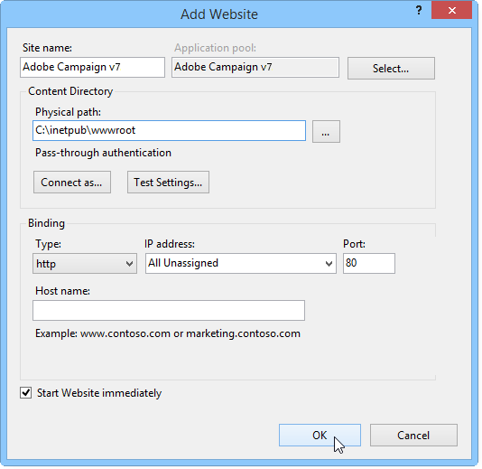

# Migración en Windows para Adobe Campaign 7{#migrating-in-windows-for-adobe-campaign}

## Procedimiento general {#general-procedure}

Para Windows, los pasos de migración son los siguientes:

1. Detener servicios: consulte [Service stop](#service-stop).
1. Haga una copia de seguridad de la base de datos: consulte [Copia de seguridad de la base de datos y la instalación actual](#back-up-the-database-and-the-current-installation).
1. Migrar la plataforma: consulte [Implementación de Adobe Campaign v7](#deploying-adobe-campaign-v7).
1. Migrar el servidor de redirección (IIS): consulte [Migración del servidor de redirección (IIS)](#migrating-the-redirection-server--iis-).
1. Reiniciar servicio: consulte [Reinicio de los servicios](#re-starting-the-services).
1. Eliminar y limpiar la versión anterior de Adobe Campaign: consulte [Eliminación y limpieza de la versión anterior de Adobe Campaign](#deleting-and-cleansing-adobe-campaign-previous-version).

## Interrupción del servicio {#service-stop}

En primer lugar, detenga todos los procesos con acceso a la base de datos en todos los equipos correspondientes.

1. Todos los servidores que utilicen el módulo de redirección (**webmdl** servicio) deben detenerse. Para IIS, ejecute el siguiente comando:

   ```
   iisreset /stop
   ```

1. El módulo **mta** y sus módulos secundarios (**mtachild**) deben detenerse utilizando los siguientes comandos:

   ```
   nlserver stop mta@<instance name>
   nlserver stop mtachild@<instance name>
   ```

1. Detenga los servicios de Adobe Campaign en todos los servidores. Inicie sesión con derechos de administrador y ejecute el siguiente comando:

   ```
   net stop nlserver6
   ```

   Si va a migrar desde la versión 5.11, ejecute el siguiente comando:

   ```
   net stop nlserver5
   ```

1. Para cada servidor, asegúrese de que los servicios de Adobe Campaign estén correctamente detenidos. Inicie sesión con derechos de administrador y ejecute el siguiente comando:

   ```
   tasklist /FI "IMAGENAME eq nlserver*"
   ```

   Se muestra la lista de procesos activos junto con su ID (PID).

   ```
   Image Name                     PID Session Name        Session#    Mem Usage
   ========================= ======== ================ =========== ============
   nlserver.exe                  3192 Console                    1     13,108 K
   ```

1. Si uno o más procesos de Adobe Campaign siguen activos o bloqueados después de unos minutos, mátelos. Inicie sesión con derechos de administrador y ejecute el siguiente comando:

   ```
   taskkill /IM nlserver* /T
   ```

1. Si algunos procesos siguen activos después de unos minutos, puede forzarlos a cerrar con el comando :

   ```
   taskkill /F /IM nlserver* /T
   ```

## Haga una copia de seguridad de la base de datos y la instalación actual {#back-up-the-database-and-the-current-installation}

El procedimiento depende de la versión anterior de Adobe Campaign.

### Migración desde Adobe Campaign v5.11 {#migrating-from-adobe-campaign-v5-11}

1. Haga una copia de seguridad de la base de datos de Adobe Campaign.
1. Realice una copia de seguridad del directorio **Neolane v5** utilizando el siguiente comando:

   ```
   ren "Neolane v5" "Neolane v5.back"
   ```

   >[!IMPORTANT]
   >
   >Como medida de precaución, le recomendamos que comprima la carpeta **Neolane v5.back** y la guarde en otra ubicación segura que no sea el servidor.

1. En la consola de administración de servicios de windows, deshabilite el inicio automático del servicio del servidor de aplicaciones 5.11. También puede utilizar el siguiente comando:

   ```
   sc config nlserver5 start= disabled
   ```

1. Edite el **config-`<instance name>`.xml** (en el **Neolane v5. back** folder) para evitar las **mta**, **wfserver**, **stat**, etc. de inicio automático. Por ejemplo, reemplace **autoStart** por **_autoStart**.

   ```
   <?xml version='1.0'?>
   <serverconf>
     <shared>
       <dataStore hosts="myServer*" lang="en_US">
         <dataSource name="default">
           <dbcnx encrypted="1" login="myLogin" password="myPassword"  provider="postgresql" server="myServer"/>
         </dataSource>
       </dataStore>
     </shared>
   
     <mta _autoStart="true" statServerAddress="myStatServer"/>
     <stat _autoStart="true"/>
     <wfserver _autoStart="true"/>
     <inMail _autoStart="true"/>
     <sms _autoStart="false"/>
   </serverconf>
   ```

### Migración desde Adobe Campaign v6.02 {#migrating-from-adobe-campaign-v6-02}

1. Haga una copia de seguridad de la base de datos de Adobe Campaign.
1. Realice una copia de seguridad del directorio **Neolane v6** utilizando el siguiente comando:

   ```
   ren "Neolane v6" "Neolane v6.back"
   ```

   >[!IMPORTANT]
   >
   >Como medida de precaución, le recomendamos que comprima la carpeta **Neolane v6.back** y la guarde en otra ubicación segura que no sea el servidor.

1. En el administrador de servicios de Windows, desactive el inicio automático del servidor de aplicaciones 6.02. También puede utilizar el siguiente comando:

   ```
   sc config nlserver6 start= disabled
   ```

1. Edite el **config-`<instance name>`.xml** (en el **Neolane v6. back** folder) para evitar las **mta**, **wfserver**, **stat**, etc. de inicio automático. Por ejemplo, reemplace **autoStart** por **_autoStart**.

   ```
   <?xml version='1.0'?>
   <serverconf>
     <shared>
       <dataStore hosts="myServer*" lang="en_US">
         <dataSource name="default">
           <dbcnx encrypted="1" login="myLogin" password="myPassword" provider="postgresql" server="myServer"/>
         </dataSource>
       </dataStore>
     </shared>
   
     <mta _autoStart="true" statServerAddress="myStatServer"/>
     <stat _autoStart="true"/>
     <wfserver _autoStart="true"/>
     <inMail _autoStart="true"/>
     <sms _autoStart="false"/>
   </serverconf>
   ```

### Migración desde Adobe Campaign v6.1 {#migrating-from-adobe-campaign-v6-1}

1. Haga una copia de seguridad de la base de datos de Adobe Campaign.
1. Realice una copia de seguridad del directorio **Adobe Campaign v6** utilizando el siguiente comando:

   ```
   ren "Adobe Campaign v6" "Adobe Campaign v6.back"
   ```

   >[!IMPORTANT]
   >
   >Como medida de precaución, le recomendamos que comprima la carpeta **Adobe Campaign v6.back** y la guarde en otra ubicación segura que no sea el servidor.

1. En la consola de administración de servicios de windows, deshabilite el inicio automático del servicio del servidor de aplicaciones 6.11. También puede utilizar el siguiente comando:

   ```
   sc config nlserver6 start= disabled
   ```

## Implementación de Adobe Campaign v7 {#deploying-adobe-campaign-v7}

La implementación de Adobe Campaign consta de dos etapas:

* Instalación de la versión 7: esta operación debe realizarse en cada servidor.
* La actualización posterior: este comando debe iniciarse en cada instancia.

Para implementar Adobe Campaign, siga los siguientes pasos:

1. Instale la versión más reciente de Adobe Campaign v7 ejecutando el archivo de instalación **setup.exe**. Para obtener más información sobre la instalación del servidor Adobe Campaign en Windows, consulte [esta sección](../../installation/using/installing-the-server.md).

   

   >[!NOTE]
   >
   >Adobe Campaign v7 se instala de forma predeterminada en el directorio **C:\Program Files\Adobe\Adobe Campaign v7**.

1. Para que el programa de instalación de la consola del cliente esté disponible, copie el archivo **setup-client-7.0.XXXX.exe** en el directorio de instalación de Adobe Campaign: **C:\Program Files\Adobe\Adobe Campaign v7\datakit\nl\eng\jsp**.

   >[!NOTE]
   >
   >Para obtener más información sobre la instalación de Adobe Campaign en Windows, consulte [esta sección](../../installation/using/installing-the-server.md).

1. Inicie la instancia para el primer uso con los siguientes comandos:

   ```
   net start nlserver6-v7
   net stop nlserver6-v7
   ```

   >[!NOTE]
   >
   >Estos comandos le permiten crear el sistema de archivos interno de Adobe Campaign v7: Directorio **conf** (con los archivos **config-default.xml** y **serverConf.xml**), **var**, etc.

1. Copie y pegue (sobrescriba) los archivos de configuración y subcarpetas de cada instancia a través del archivo de copia de seguridad **Neolane v5.back**, **Neolane v6.back** o **Adobe Campaign v6.back** (según la versión desde la que esté migrando, consulte [esta sección](#back-up-the-database-and-the-current-installation)).
1. Según la versión desde la que esté migrando, ejecute los siguientes comandos:

   ```
   copy "Neolane v5.back"/conf/config-<instance name>.xml "Adobe Campaign v7"/conf/
   copy "Neolane v5.back"/customers/* "Adobe Campaign v7"/customers/
   copy "Neolane v5.back"/var/* "Adobe Campaign v7"/var/
   ```

   ```
   copy "Neolane v6.back"/conf/config-<instance name>.xml "Adobe Campaign v7"/conf/
   copy "Neolane v6.back"/customers/* "Adobe Campaign v7"/customers/
   copy "Neolane v6.back"/var/* "Adobe Campaign v7"/var/
   ```

   ```
   copy "Adobe Campaign v6.back"/conf/config-<instance name>.xml "Adobe Campaign v7"/conf/
   copy "Adobe Campaign v6.back"/customers/* "Adobe Campaign v7"/customers/
   copy "Adobe Campaign v6.back"/var/* "Adobe Campaign v7"/var/
   ```

   >[!IMPORTANT]
   >
   >Para el primer comando anterior, no copie el archivo **config-default.xml**.

1. En los archivos **serverConf.xml** y **config-default.xml** de Adobe Campaign v7, aplique las configuraciones específicas que tenía en la versión anterior de Adobe Campaign. Para el archivo **serverConf.xml**, utilice el archivo **Neolane v5/conf/serverConf.xml.diff**, **Neolane v6/conf/serverConf.xml.diff** o **Adobe Campaign v6/conf/serverConf.xml.diff**.

   >[!NOTE]
   >
   >Cuando genere informes de configuraciones desde la versión anterior de Adobe Campaign a Adobe Campaign v7, asegúrese de que las rutas a los directorios físicos llevan a Adobe Campaign v7 (y no a Neolane v5, Neolane v6 o Adobe Campaign v6).

1. Vuelva a cargar la configuración de Adobe Campaign v7 con el siguiente comando:

   ```
   nlserver config -reload
   ```

1. Inicie el proceso posterior a la actualización mediante el siguiente comando:

   ```
   nlserver config -postupgrade -instance:<instance name>
   ```

>[!IMPORTANT]
>
>No inicie los servicios de Adobe Campaign aún: es necesario realizar algunos cambios en IIS.

## Migración del servidor de redirección (IIS) {#migrating-the-redirection-server--iis-}

En este momento, el servidor IIS debe detenerse. Consulte [Service stop](#service-stop).

1. Abra la consola **Administrador de servicios de información de Internet (IIS)**.
1. Cambie los enlaces (puertos de escucha) del sitio utilizado para la versión anterior de Adobe Campaign:

   * Haga clic con el botón derecho en el sitio utilizado para la versión anterior de Adobe Campaign y seleccione **[!UICONTROL Edit bindings]**.
   * Para cada tipo de puerto de escucha (**[!UICONTROL http]** o **[!UICONTROL https]**), seleccione la línea adecuada y haga clic en **[!UICONTROL Edit]**.
   * Introduzca un puerto diferente. De forma predeterminada, el puerto de escucha es 80 para http y 443 para https. Compruebe que el nuevo puerto esté disponible.

      

      >[!NOTE]
      >
      >Si el servidor IIS incluye varios sitios web para Adobe Campaign con una configuración avanzada (puerto compartido y direcciones IP diferentes), póngase en contacto con el administrador.

1. Cree un nuevo sitio web para Adobe Campaign v7:

   * Haga clic con el botón derecho en la carpeta **[!UICONTROL Sites]** y seleccione **[!UICONTROL Add Web Site...]**.

      

   * Introduzca el nombre del sitio, **Adobe Campaign v7** por ejemplo.
   * No se utiliza la ruta de acceso al directorio básico del sitio web, pero se debe introducir el campo **[!UICONTROL Physical access path]**. Introduzca la ruta de acceso predeterminada de IIS: **C:\inetpub\wwwroot**.
   * Haga clic en el botón **[!UICONTROL Connect as...]** as y asegúrese de que la opción **[!UICONTROL Application user]** está seleccionada.
   * Puede dejar los valores predeterminados en los campos **[!UICONTROL IP address]** y **[!UICONTROL Port]**. Si desea utilizar otros valores, asegúrese de que la dirección IP o el puerto estén disponibles.
   * Marque la casilla **[!UICONTROL Start Web site immediately]**.

      

1. Ejecute el script **iis_neolane_setup.vbs** para configurar automáticamente los recursos utilizados por el servidor de Adobe Campaign en el directorio virtual creado anteriormente.

   * Este archivo se encuentra en el directorio **`[Adobe Campaign v7]`\conf**, donde **`[Adobe Campaign v7]`** es la ruta de acceso al directorio de instalación de Adobe Campaign. El comando para ejecutar la secuencia de comandos es el siguiente (para administradores):

      ```
      cd C:\Program Files (x86)\Adobe Campaign\Adobe Campaign v7\conf
      cscript iis_neolane_setup.vbs
      ```

   * Haga clic en **[!UICONTROL OK]** para confirmar la ejecución de la secuencia de comandos.

      

   * Introduzca el número del sitio web creado anteriormente para Adobe Campaign v7 y haga clic en **[!UICONTROL OK]**.

      

   * Debería aparecer un mensaje de confirmación:

      

   * En la pestaña **[!UICONTROL Content view]**, asegúrese de que la configuración del sitio web esté correctamente configurada con los recursos de Adobe Campaign:

      

      >[!NOTE]
      >
      >Si no se muestra la estructura de árbol, reinicie IIS.
      >
      >Los siguientes pasos de configuración de IIS se detallan en [esta sección](../../installation/using/integration-into-a-web-server-for-windows.md#configuring-the-iis-web-server).

## Zonas de seguridad {#security-zones}

Si va a migrar desde la versión 6.02 o anterior, debe configurar las zonas de seguridad antes de iniciar los servicios. Para obtener más información, consulte [Seguridad](../../migration/using/general-configurations.md#security).

## Reinicio de los servicios {#re-starting-the-services}

Inicie los servicios de IIS y Adobe Campaign en cada uno de los servidores siguientes:

1. Servidor de seguimiento y redirección.
1. Servidor intermediario.
1. Servidor de marketing.

Antes de continuar con el siguiente paso, ejecute una prueba completa de la nueva instalación, asegúrese de que no haya regresiones y de que todo funcione siguiendo todas las recomendaciones de la sección [Configuraciones generales](../../migration/using/general-configurations.md).

## Eliminación y limpieza de la versión anterior de Adobe Campaign {#deleting-and-cleansing-adobe-campaign-previous-version}

El procedimiento depende de la versión anterior de Adobe Campaign.

### Adobe Campaign v5 {#adobe-campaign-v5}

Antes de eliminar y limpiar la instalación de Adobe Campaign v5, debe aplicar las siguientes recomendaciones:

* Haga que los equipos funcionales ejecuten una comprobación completa de la nueva instalación.
* Solo desinstale Adobe Campaign v5 cuando esté seguro de que no es necesario realizar ninguna reversión.

1. En IIS, elimine el sitio web **Neolane v5** y, a continuación, el grupo de aplicaciones **Neolane v5**.
1. Cambie el nombre de la carpeta **Neolane v5.back** como **Neolane v5**.
1. Desinstale Adobe Campaign v5 mediante el asistente Agregar/quitar componentes .

   

1. Elimine el servicio **nlserver5** Windows mediante el siguiente comando:

   ```
   sc delete nlserver5
   ```

1. Vuelva a iniciar el servidor.

### Adobe Campaign v6.02 {#adobe-campaign-v6-02}

Antes de eliminar y limpiar la instalación de Adobe Campaign v6.02, debe aplicar las siguientes recomendaciones:

* Haga que los equipos funcionales ejecuten una comprobación completa de la nueva instalación.
* Solo desinstale Adobe Campaign v6.02 cuando esté seguro de que no es necesario realizar ninguna reversión.

1. En IIS, elimine el sitio web **Neolane v6** y, a continuación, el grupo de aplicaciones **Neolane v6**.
1. Cambie el nombre de la carpeta **Neolane v6.back** como **Neolane v6**.
1. Desinstale Adobe Campaign v6.02 con el asistente Agregar/quitar componentes .

   

1. Vuelva a iniciar el servidor.

### Adobe Campaign v6.1 {#adobe-campaign-v6-1}

Antes de eliminar y limpiar la instalación de Adobe Campaign v6, debe aplicar las siguientes recomendaciones:

* Haga que los equipos funcionales ejecuten una comprobación completa de la nueva instalación.
* Solo desinstale Adobe Campaign v6 cuando esté seguro de que no es necesario realizar ninguna reversión.

1. En IIS, elimine el sitio web **Adobe Campaign v6** y, a continuación, el grupo de aplicaciones **Adobe Campaign v6**.
1. Cambie el nombre de la carpeta **Adobe Campaign v6.back** como **Adobe Campaign v6**.
1. Desinstale Adobe Campaign v6 mediante el asistente Agregar/quitar componentes .

   

1. Vuelva a iniciar el servidor.
