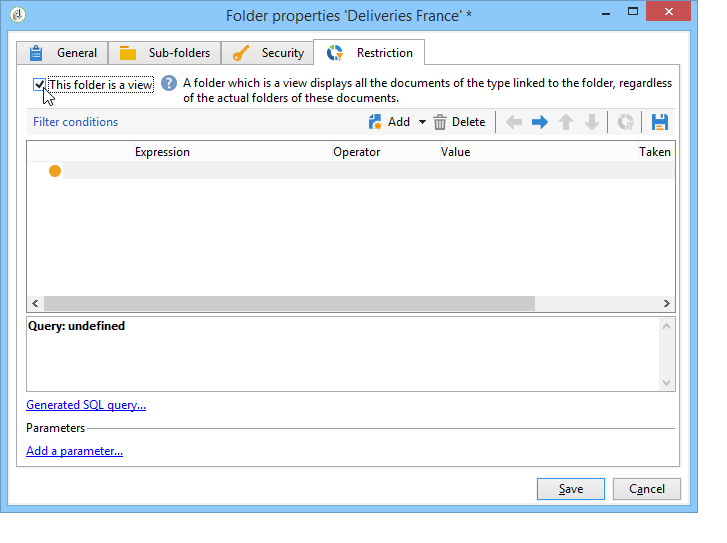

# Administrar el acceso a las carpetas{#folder-access-management}

Cada carpeta del árbol de navegación del Explorador tiene asociados derechos de acceso de lectura, escritura y eliminación. Para acceder a un archivo, un operador o un grupo de operadores deben tener al menos acceso de lectura.

## Carpetas y vistas {#folders-and-views}

### Qué es una carpeta {#about-folders}

Las carpetas son nodos del árbol de Adobe Campaign. Estos nodos se crean haciendo clic con el botón derecho en el árbol, a través del menú **[!UICONTROL Add new folder]**. De forma predeterminada, el primer menú permite añadir la carpeta correspondiente al contexto actual.

Puede personalizar el árbol de navegación del Explorador. Conozca los pasos de configuración y las prácticas recomendadas [en esta sección](adobe-campaign-workspace.md).

### Qué es una vista {#about-views}

Además, puede crear vistas para restringir el acceso a los datos y organizar el contenido del árbol para adaptarlo a sus necesidades. A continuación, puede asignar derechos a las vistas.

Una vista es una carpeta que muestra registros almacenados físicamente en una o más carpetas del mismo tipo. Por ejemplo, si se crea una carpeta de campañas que sea una vista, esta muestra todas las campañas contenidas en la base de datos de manera predeterminada, independientemente de su origen. Estos datos se pueden filtrar.

Cuando se convierte una carpeta en una vista, todos los datos correspondientes al tipo de carpeta presentes en la base de datos se muestran en la vista, independientemente de la carpeta en la que se guarde. A continuación, puede filtrarlos para restringir la lista de datos mostrados.

>[!IMPORTANT]
>
>Las vistas contienen datos y permiten el acceso a ellos, pero los datos no se almacenan físicamente en la carpeta de vista. El operador debe tener los derechos adecuados para la acción deseada en las carpetas de origen de los datos (acceso de lectura, como mínimo).
>
>Para conceder acceso a una vista sin conceder acceso a la carpeta de origen, no asigne acceso de lectura al nodo principal de la carpeta de origen.

Para distinguir vistas de carpetas, el nombre de cada vista se muestra en un color diferente (cian oscuro).

### Añadir carpetas y crear vistas {#adding-folders-and-creating-views}

En el ejemplo siguiente, se muestra cómo crear nuevas carpetas para mostrar datos específicos:

1. Cree una nueva carpeta **[!UICONTROL Deliveries]** y asígnele el nombre **entregas Francia**.
1. Haga clic con el botón derecho en esta carpeta y seleccione **[!UICONTROL Properties...]**.

   

1. En la pestaña **[!UICONTROL Restriction]**, seleccione **[!UICONTROL This folder is a view]**. Eso hace que se muestren todas las entregas de la base de datos.

   

1. Defina los criterios del filtro de entregas desde el editor de consultas en la sección central de la ventana: esto muestra las campañas correspondientes al filtro definido.

   >[!NOTE]
   >
   >El editor de consultas se muestra en [esta sección](../../platform/using/about-queries-in-campaign.md).

   Con las siguientes condiciones de filtro:

Las siguientes entregas se muestran en la vista:

>[!NOTE]
>
>Al administrar eventos [de mensajería transaccional](../../message-center/using/about-transactional-messaging.md), las carpetas **[!UICONTROL Real time events]** o **[!UICONTROL Batch events]** no deben configurarse como vistas en las instancias de ejecución, ya que esto podría generar problemas de derechos de acceso. Para obtener más información sobre la colección de eventos, consulte [esta sección](../../message-center/using/event-collection.md).

## Permisos en una carpeta

### Edición de permisos en una carpeta {#edit-permissions-on-a-folder}

Para editar los permisos en una carpeta específica del árbol, siga los pasos siguientes:

1. Haga clic con el botón derecho en la carpeta y seleccione **[!UICONTROL Properties...]**.

   

1. Haga clic en la pestaña **[!UICONTROL Security]** para ver las autorizaciones de esta carpeta.

   

### Modificar permisos {#modify-permissions}

Para modificar los permisos, puede:

* **Reemplazar un grupo o un operador**. Para ello, haga clic en uno de los grupos (u operadores) con derechos sobre la carpeta y seleccione un nuevo grupo (o un operador nuevo) en la lista desplegable:

   

* **Autorizar un grupo o un operador**. Para ello, haga clic en el botón **[!UICONTROL Add]** y seleccione el grupo u operador al que desea conceder autorizaciones sobre esta carpeta.
* **Prohibir un grupo o un operador**. Para ello, haga clic en **[!UICONTROL Delete]** y seleccione el grupo u operador cuya autorización sobre esta carpeta desea eliminar.
* **Seleccione los derechos asignados a un grupo o a un operador**. Para ello, haga clic en el grupo u operador respectivo y, a continuación, seleccione los derechos de acceso que desee conceder y desmarque los demás.

   

### Propagación de permisos {#propagate-permissions}

Se puede propagar autorizaciones y derechos de acceso. Para ello, seleccione la opción **[!UICONTROL Propagate]** en las propiedades de la carpeta.

Las autorizaciones definidas en esta ventana se aplican a todas las subcarpetas del nodo actual. A continuación, se pueden sobrecargar estas autorizaciones para cada una de las subcarpetas.

>[!NOTE]
>
>Borrar esta opción para una carpeta no la borra automáticamente para las subcarpetas. Debe borrarla específicamente en relación con cada una de las subcarpetas.

### Concesión de acceso a todos los operadores {#grant-access-to-all-operators}

En la pestaña **[!UICONTROL Security]**, si la opción **[!UICONTROL System folder]** está seleccionada, se concede acceso a estos datos a todos los operadores, independientemente de sus derechos. Si se borra esta opción, se debe añadir explícitamente el operador (o su grupo) a la lista de autorizaciones para que tengan acceso.

