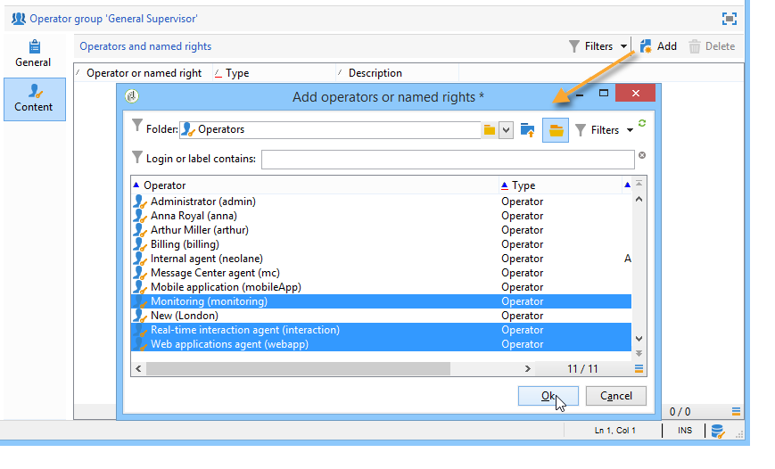

# Creación y administración de grupos de operadores {#operator-groups}

>[!NOTE]
>
>Estos procedimientos solo se aplican a los operadores que se conectan a Campaign con la **autenticación nativa heredada**. A partir de la versión 7.3.1 de Campaign Classic, todos los operadores deben utilizar el [sistema de administración de identidades (IMS) de Adobe](https://helpx.adobe.com/es/enterprise/using/identity.html){target="_blank"} para conectarse a Campaign. [Más información](../../technotes/using/migrate-users-to-ims.md)
>
>Al conectarse a Campaign con su Adobe ID, la siguiente sección ya no se aplica. Obtenga información sobre cómo configurar permisos con Adobe IMS en la [documentación de Campaign v8](https://experienceleague.adobe.com/docs/campaign/campaign-v8/admin/permissions/gs-permissions.html?lang=es){target="_blank"}.

Los grupos de operadores se crean mediante el nodo **[!UICONTROL Administration > Access management > Operator groups]** del árbol.

## Creación de un grupo de operadores nuevo {#creating-a-new-operator-group}

Para crear un grupo de operadores nuevo, siga estos pasos:

1. Haga clic en el botón **[!UICONTROL New]** situado a la derecha de la lista de grupos o haga clic con el botón derecho en la lista y elija **[!UICONTROL New]**.
1. En la parte inferior de la ventana, en la pestaña **[!UICONTROL General]**, introduzca el nombre y una descripción para este grupo en los campos correspondientes.

   

1. Haga clic en la pestaña **[!UICONTROL Content]** para definir las autorizaciones de este grupo.
1. Haga clic en el botón **[!UICONTROL Add]** para seleccionar un derecho o un operador designado para asociarlo al grupo.
1. Haga clic en la lista desplegable o en la carpeta situada a la derecha del campo **[!UICONTROL Folder]** para localizar los derechos u operadores designados para asociar a este grupo.
1. Seleccione los derechos u operadores que desee añadir y haga clic en **[!UICONTROL OK]** para validar.

   

   Repita esta operación para añadir otros derechos u operadores.

1. Haga clic en el botón **[!UICONTROL Save]** para añadir el grupo a la lista.

## Grupos predeterminados {#default-groups}

Los grupos de operadores predeterminados son:

1. **[!UICONTROL Administrator]**

   Los operadores de este grupo tienen acceso completo a la instancia. Los administradores son usuarios que pueden acceder a las partes más técnicas de la interfaz. Tienen la función **[!UICONTROL Administration]** y se aseguran de que la plataforma esté configurada.

   Este grupo contiene el siguiente derecho asignado:

   * **[!UICONTROL ADMINISTRATION]**: derecho a ejecutar, crear, editar o eliminar cualquier objeto, como flujo de trabajo, envío, secuencias de comandos, etc.

1. **[!UICONTROL Delivery operators]**

   Los operadores de este grupo están a cargo de la administración de las entregas: permiten el acceso a los recursos principales necesarios para crear y preparar entregas (tipologías de campaña, asignaciones de entregas, plantillas predeterminadas, bloques de personalización, etc.).

   Este grupo contiene los siguientes derechos asignados:

   * **[!UICONTROL PREPARE DELIVERIES]**: derecho a crear, editar e iniciar el análisis de envíos.
   * **[!UICONTROL START DELIVERIES]**: derecho a aprobar los envíos analizados previamente.

1. **[!UICONTROL Campaign managers]**

   Los operadores de este grupo pueden administrar las campañas de marketing: le permiten acceder a los objetos vinculados a campañas (planes, programas, flujos de trabajo, presupuestos, etc.)dentro del marco de **[!UICONTROL Campaign]** (módulo de Adobe Campaign opcional).

   Este grupo contiene los siguientes derechos asignados:

   * **[!UICONTROL INSERT FOLDERS]**: derecho a insertar carpetas en el árbol de Adobe Campaign (siempre que tenga derechos de edición para las ramas correspondientes).
   * **[!UICONTROL WORKFLOW]**: derecho a utilizar flujos de trabajo.

   >[!NOTE]
   >
   >Este grupo no permite a los operadores iniciar entregas.

1. **[!UICONTROL Content contributors]**

   Los operadores de este grupo pueden acceder a las carpetas de contenido, dentro del marco de **[!UICONTROL Content management]** (módulo opcional de Adobe Campaign). Este grupo no otorga derechos adicionales.

1. **[!UICONTROL Access to reports]**

   Este grupo está reservado para operadores externos, con el fin de habilitar los iconos Informe, Programación y Foro en el panel de control de campañas para un operador específico.

1. **[!UICONTROL Workflow execution]**

   Este grupo permite asignar a operadores el derecho para administrar los flujos de trabajo que no están relacionados con las campañas.

1. **[!UICONTROL Workflow supervisors]**

   Los operadores de este grupo reciben una notificación por correo electrónico en caso de alertas relacionadas con los flujos de trabajo de campañas.

1. Administración local/central

   Estos grupos permiten utilizar **[!UICONTROL Distributed marketing]** (módulo opcional de Adobe Campaign).

1. **[!UICONTROL Offer managers]**

   Los operadores de este grupo pueden crear y mantener ofertas. Para obtener más información, consulte esta [página](../../interaction/using/operator-profiles.md).
Este grupo contiene los siguientes derechos asignados:

   * **[!UICONTROL INSERT FOLDERS]**: derecho a insertar carpetas en el árbol de Adobe Campaign (siempre que tenga derechos de edición para las ramas correspondientes).
   * **[!UICONTROL EDIT FOLDERS]**: Derecho a modificar propiedades de carpeta como nombre interno, etiqueta, imagen asociada, orden de subcarpeta, etc.
