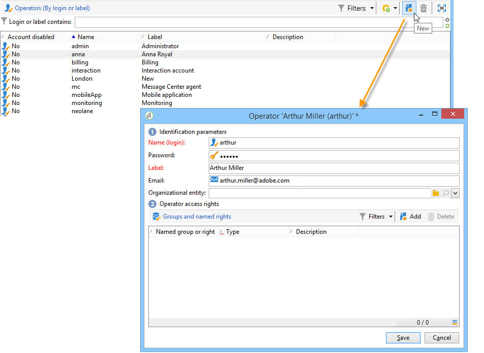
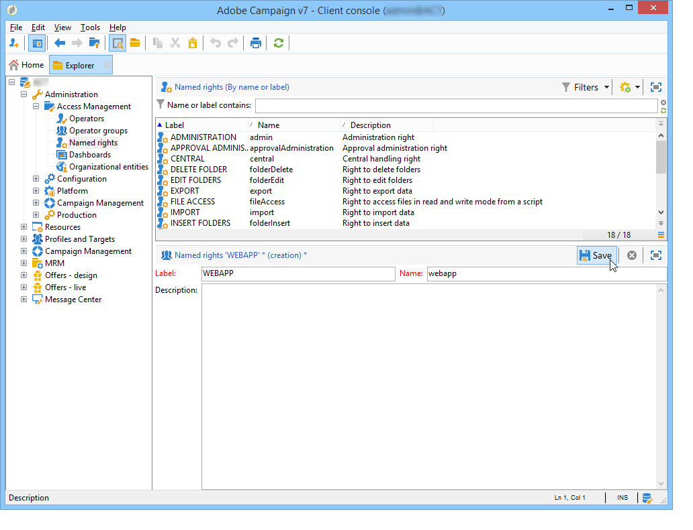

# Creación y administración de operadores {#operators}

## Introducción a los operadores de Campaign {#about-operators}

Un operador es un usuario de Adobe Campaign que tiene permisos para iniciar sesión y realizar acciones.

De forma predeterminada, los operadores se almacenan en el nodo **[!UICONTROL Administration > Access management > Operators]**.

Los operadores se pueden crear manualmente o asignar en un directorio LDAP existente.

En [esta página](#creating-an-operator) se describe el procedimiento completo para crear un operador.

Para más información sobre la integración de Adobe Campaign y LDAP, consulte [esta página](../../installation/using/connecting-through-ldap.md).

>[!IMPORTANT]
>
>Los operadores deben vincularse a una zona de seguridad para iniciar sesión en una instancia. Para más información sobre las zonas de seguridad en Adobe Campaign, consulte [esta página](../../installation/using/security-zones.md).

Los usuarios también pueden conectarse directamente a Adobe Campaign utilizando su Adobe ID. Para obtener más información, consulte [esta página](../../integrations/using/about-adobe-id.md).

## Creación de un operador {#creating-an-operator}

Para crear un operador nuevo y conceder permisos, siga los pasos a continuación:

1. Haga clic en el botón **[!UICONTROL New]** situado encima de la lista de operadores e introduzca los detalles del operador nuevo.

   

1. Especifique los **[!UICONTROL Identification parameters]** del usuario: su nombre de inicio de sesión, contraseña y nombre. El operador utiliza el nombre de inicio de sesión y la contraseña para iniciar sesión en Adobe Campaign. Una vez que el usuario ha iniciado sesión, puede cambiar su contraseña mediante el menú **[!UICONTROL Tools > Change password]**. El correo electrónico del operador es esencial, ya que permite que el operador reciba notificaciones, por ejemplo, cuando se procesan las aprobaciones.

   Esta sección también permite vincular un operador a una entidad organizativa. Para obtener más información, consulte [esta página](../../campaign/using/about-distributed-marketing.md).

1. Seleccione los permisos otorgados al operador en la sección **[!UICONTROL Operator access rights]**.

   Para asignar derechos al operador, haga clic en el botón **[!UICONTROL Add]** situado encima de la lista de derechos y seleccione un grupo de operadores de la lista de grupos disponibles:

   

   También puede seleccionar uno o varios derechos asignados (consulte [Derechos de nombre](#named-rights)). Para ello, haga clic en la flecha a la derecha del campo **[!UICONTROL Folder]** y seleccione **[!UICONTROL Named rights]**:

   

   Seleccione los grupos o los derechos asignados que desea asignar y haga clic **[!UICONTROL OK]** para validar.

1. Haga clic en **[!UICONTROL Ok]** para crear el operador: el perfil se añade a la lista de operadores existentes.

   

>[!NOTE]
>
>Puede organizar los operadores según sus necesidades creando nuevas carpetas de operadores. Para ello, haga clic con el botón derecho en la carpeta del operador y seleccione **[!UICONTROL Add an 'Operators' folder]**.

Una vez que se ha creado el perfil del operador, puede agregar o actualizar su información. Para ello, haga clic en la pestaña **[!UICONTROL Edit]**.

>[!NOTE]
>
>El campo **[!UICONTROL Session timeout]** permite ajustar el retraso antes del tiempo de espera de sesión FDA. Para más información, consulte [Acerca del acceso de datos federado](../../installation/using/about-fda.md).

## Definición de la zona horaria del operador {#time-zone-of-the-operator}

En la ficha **[!UICONTROL General]**, se puede seleccionar la zona horaria del operador. De forma predeterminada, los operadores funcionan en la zona horaria del servidor. Sin embargo, es posible seleccionar otra zona horaria con la lista desplegable.

La configuración de las zonas horarias se describe en [esta página](../../installation/using/time-zone-management.md).

>[!NOTE]
>
>Las colaboraciones en diferentes zonas horarias requieren el almacenamiento de fechas en UTC. Las fechas se convierten a la zona horaria apropiada en los siguientes contextos: cuando se muestra una fecha en la zona horaria del usuario, cuando se importan y exportan archivos, cuando se programa una entrega de correo electrónico, cuando se programan actividades en un flujo de trabajo (programador, espera, restricción de tiempo, etc.).
>
>Las restricciones y recomendaciones vinculadas a estos contextos se presentan en secciones relacionadas de la documentación de Adobe Campaign.

Además, la lista desplegable **[!UICONTROL Regional settings]** permite seleccionar el formato para mostrar las fechas y los números.

## Adición de permisos {#access-rights-options}

Utilice la pestaña **[!UICONTROL Access rights]** para actualizar los grupos y los derechos asignados vinculados al operador.

El enlace **[!UICONTROL Edit the access parameters...]** permite acceder a las siguientes opciones:

* La opción **[!UICONTROL Disable account]** permite desactivar la cuenta del operador: este deja de tener acceso a Adobe Campaign.

   >[!NOTE]
   >
   >Aunque su cuenta esté deshabilitada, el operador puede recibir alertas o notificaciones de Campaign. Para dejar de enviar notificaciones de Campaign a este operador, Adobe recomienda eliminar la dirección de correo electrónico de su perfil.

* La opción **[!UICONTROL Forbid access from the rich client]** permite restringir el uso de Adobe Campaign al [acceso Web](../../platform/using/adobe-campaign-workspace.md#console-and-web-access) o a través de API: el acceso a la consola del cliente de Adobe Campaign ya no está disponible.
* Es posible vincular una zona de seguridad al operador. Para obtener más información, consulte [esta página](../../installation/using/security-zones.md).
* También puede definir una máscara IP de confianza mediante el vínculo apropiado.

   El operador puede conectarse a Adobe Campaign sin introducir su contraseña si su dirección IP está en la lista.

   También se puede especificar un conjunto de direcciones IP autorizado que pueden conectarse sin contraseña, como en el siguiente ejemplo:

   

   >[!NOTE]
   >
   >Para mantener el acceso a su plataforma segura, esta opción debe utilizarse con cuidado.

* La opción **[!UICONTROL Restrict to information found in sub-folders of:]** permite limitar los derechos atribuidos al operador de una carpeta. El usuario solo puede ver las subcarpetas del nodo especificado en esta opción:

   

   >[!IMPORTANT]
   >
   >Se trata de una restricción muy estricta y debe utilizarse con precaución. Un operador registrado con este tipo de derechos puede ver el contenido de la carpeta especificada y no tiene acceso a ningún otro nodo del árbol mediante el navegador. Sin embargo, según las funcionalidades a las que tenga acceso (por ejemplo: flujos de trabajo), puede mostrar datos que normalmente se almacenan en nodos que no puede ver.

### Comprobación de configuración {#check-settings}

La pestaña **[!UICONTROL Audit]** permite ver información relacionada con el operador. Las distintas pestañas se añaden automáticamente en función de la configuración definida en el área de intervención del operador.

Puede acceder a:

* La lista de derechos en carpetas vinculadas al operador.

   

   >[!NOTE]
   >
   >Para obtener más información, consulte [Administración de acceso a carpetas](#folder-access-management),

* El registro de aprobaciones del operador.

   

* La lista de foros de debate a los que están suscritas.
* Los eventos en el calendario.
* La lista de tareas asignadas a ellas.

## Operadores predeterminados {#default-operators}

Adobe Campaign utiliza operadores técnicos con perfiles configurados de forma predeterminada: Administrador (&#39;admin&#39;), Facturación (&#39;facturación&#39;), Supervisión, Agente de aplicaciones web (&#39;webapp&#39;), etc. Algunas de ellas dependen de las aplicaciones y opciones instaladas en la plataforma: Los operadores &#39;central&#39; y &#39;local&#39;, por ejemplo, solo son visibles si está instalada la opción Marketing distribuido.

>[!IMPORTANT]
>
>Se notifica a estos operadores técnicos de forma predeterminada cuando la plataforma devuelve mensajes de información. Recomendamos que proporcione un correo electrónico de contacto para ellos.
>
>Para asegurarse de que las aplicaciones Web funcionan correctamente, se recomienda no definir la configuración regional específica para el operador “webapp”.

De forma predeterminada, el operador técnico “webapp” tiene el derecho asignado ADMINISTRACIÓN, que puede generar riesgos de seguridad. Para solucionar este problema, se recomienda eliminar este derecho. Para ello:

1. En el nodo **[!UICONTROL Administration > Access management > Named rights]**, haga clic en **[!UICONTROL New]** para crear un derecho y asígnele el nombre WEBAPP.

   

   Los derechos asignados aparecen detallados en la sección [Derechos de nombre](#named-rights).

1. En el nodo **[!UICONTROL Administration > Access management > Operators]**, seleccione el operador de agente de aplicaciones Web (“webapp”).

   Seleccione la pestaña **[!UICONTROL Edit]** y, a continuación, la pestaña **[!UICONTROL Access rights]** y elimine el derecho asignado ADMINISTRACIÓN directamente desde la lista.

   

   Haga clic en **[!UICONTROL Add]** y seleccione el derecho WEBAPP que acaba de crear y, a continuación, guarde los cambios.

   

1. Asigne los derechos de acceso a los datos de lectura y escritura del operador “webapp” en las carpetas correspondientes a dicho operador, principalmente en las carpetas de “Destinatario”.

   

   La modificación de los derechos del árbol de carpetas se encuentra detallada en la sección [Administración de acceso a carpetas](#folder-access-management).

>[!NOTE]
>
>Para obtener más información sobre pautas de seguridad consulte la [Lista de comprobación de configuración de seguridad de Adobe Campaign](https://helpx.adobe.com/es/campaign/kb/acc-security.html).
