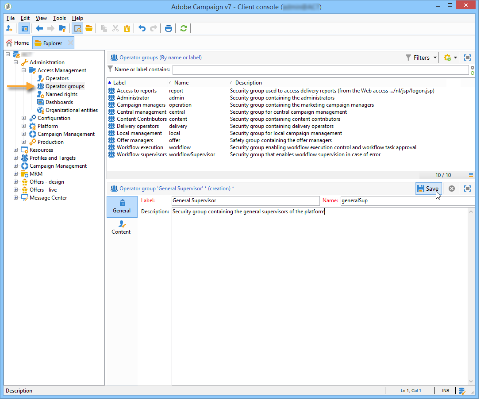
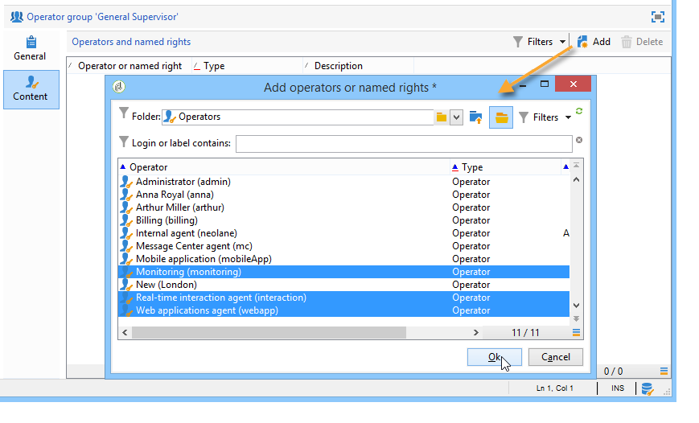

# Gestión de acceso{#access-management}

## Acerca de los permisos {#about-permissions}

Adobe Campaign le permite definir y administrar los derechos asignados a los distintos operadores. Se trata de un conjunto de derechos y restricciones que autorizan o niegan:

* Acceso a determinadas funciones (a través de los derechos asignados),
* Acceso a determinados registros,
* Creación, modificación y eliminación de registros (acciones, contactos, campañas, grupos, etc.).

Los permisos se aplican a perfiles de operador o grupos de operadores.

Se completan por parámetros de seguridad vinculados al modo de conexión del operador a Adobe Campaign. Para obtener más información, consulte [esta página](../../installation/using/configuring-campaign-server.md#defining-security-zones).

Existen dos tipos de permisos que puede conceder a un usuario:

* Puede definir grupos de operadores a los que desee atribuir derechos y luego asociar los operadores con uno o varios grupos. Esto permite reutilizar derechos y hacer que los perfiles de operador sean más coherentes. También facilita la administración y el mantenimiento de los perfiles. La creación y la gestión de grupos se presentan en [Grupos de operadores](#operator-groups).
* Puede atribuir los derechos asignados directamente a los usuarios, en algunos casos para sobrecargar los derechos asignados a través de grupos. Estos derechos se presentan en [Named rights](#named-rights).

>[!NOTE]
>
>Antes de empezar a definir permisos, Adobe recomienda leer la [lista de comprobación de configuración de seguridad](https://helpx.adobe.com/es/campaign/kb/acc-security.html).

## Operadores {#operators}

### Acerca de los operadores {#about-operators}

Un operador es un usuario de Adobe Campaign que tiene permisos para iniciar sesión y realizar acciones.

De forma predeterminada, los operadores se almacenan en el nodo **[!UICONTROL Administration > Access management > Operators]**.

Los operadores se pueden crear manualmente o asignar en un directorio LDAP existente.

En [esta página](#creating-an-operator) se describe el procedimiento completo para crear un operador.

Para más información sobre la integración de Adobe Campaign y LDAP, consulte [esta página](../../installation/using/connecting-through-ldap.md).

>[!IMPORTANT]
>
>Los operadores deben vincularse a una zona de seguridad para iniciar sesión en una instancia. Para más información sobre las zonas de seguridad en Adobe Campaign, consulte [esta página](../../installation/using/configuring-campaign-server.md#defining-security-zones).

Los usuarios también pueden conectarse directamente a Adobe Campaign utilizando su Adobe ID. Para obtener más información, consulte [esta página](../../integrations/using/about-adobe-id.md).

### Creación de un operador {#creating-an-operator}

Para crear un operador nuevo y conceder permisos, siga los pasos a continuación:

1. Haga clic en el botón **[!UICONTROL New]** situado encima de la lista de operadores e introduzca los detalles del operador nuevo.

   

1. Especifique los **[!UICONTROL Identification parameters]** del usuario: su nombre de inicio de sesión, contraseña y nombre. El operador utiliza el nombre de inicio de sesión y la contraseña para iniciar sesión en Adobe Campaign. Una vez que el usuario ha iniciado sesión, puede cambiar su contraseña mediante el menú **[!UICONTROL Tools > Change password]**. El correo electrónico del operador es esencial, ya que permite que el operador reciba notificaciones, por ejemplo, cuando se procesan las aprobaciones.

   Esta sección también permite vincular un operador a una entidad organizativa. Para obtener más información, consulte [esta página](../../campaign/using/about-distributed-marketing.md).

1. Seleccione los permisos otorgados al operador en la sección **[!UICONTROL Operator access rights]**.

   Para asignar derechos al operador, haga clic en el botón **[!UICONTROL Add]** situado encima de la lista de derechos y seleccione un grupo de operadores de la lista de grupos disponibles:

   

   También puede seleccionar uno o varios derechos asignados (consulte [Derechos de nombre](#named-rights)). Para ello, haga clic en la flecha a la derecha del campo **[!UICONTROL Folder]** y seleccione **[!UICONTROL Named rights]**:

   

   Seleccione los grupos o los derechos asignados que desea asignar y haga clic **[!UICONTROL OK]** para validar.

1. Haga clic en **[!UICONTROL Ok]** para crear el operador: el perfil se añade a la lista de operadores existentes.

   

>[!NOTE]
>
>Puede organizar los operadores según sus necesidades creando nuevas carpetas de operadores. Para ello, haga clic con el botón derecho en la carpeta del operador y seleccione **[!UICONTROL Add an 'Operators' folder]**.

Una vez que se ha creado el perfil del operador, puede agregar o actualizar su información. Para ello, haga clic en la pestaña **[!UICONTROL Edit]**.

>[!NOTE]
>
>El campo **[!UICONTROL Session timeout]** permite ajustar el retraso antes del tiempo de espera de sesión FDA. Para más información, consulte [Acerca del acceso de datos federado](../../installation/using/about-fda.md).

### Zona horaria del operador {#time-zone-of-the-operator}

En la ficha **[!UICONTROL General]**, se puede seleccionar la zona horaria del operador. De forma predeterminada, los operadores funcionan en la zona horaria del servidor. Sin embargo, es posible seleccionar otra zona horaria con la lista desplegable.

La configuración de las zonas horarias se describe en [esta página](../../installation/using/time-zone-management.md).

>[!NOTE]
>
>Las colaboraciones en diferentes zonas horarias requieren el almacenamiento de fechas en UTC. Las fechas se convierten a la zona horaria apropiada en los siguientes contextos: cuando se muestra una fecha en la zona horaria del usuario, cuando se importan y exportan archivos, cuando se programa una entrega de correo electrónico, cuando se programan actividades en un flujo de trabajo (programador, espera, restricción de tiempo, etc.).
>
>Las restricciones y recomendaciones vinculadas a estos contextos se presentan en secciones relacionadas de la documentación de Adobe Campaign.

Además, la lista desplegable **[!UICONTROL Regional settings]** permite seleccionar el formato para mostrar las fechas y los números.

### Opciones de derechos de acceso {#access-rights-options}

Utilice la pestaña **[!UICONTROL Access rights]** para actualizar los grupos y los derechos asignados vinculados al operador.

El enlace **[!UICONTROL Edit the access parameters...]** permite acceder a las siguientes opciones:

* La opción **[!UICONTROL Disable account]** permite desactivar la cuenta del operador: este deja de tener acceso a Adobe Campaign.

   >[!NOTE]
   >
   >Aunque su cuenta esté deshabilitada, el operador puede recibir alertas o notificaciones de Campaña. Para dejar de enviar notificaciones de Campaña a este operador, Adobe recomienda eliminar la dirección de correo electrónico de su perfil.

* La opción **[!UICONTROL Forbid access from the rich client]** permite restringir el uso de Adobe Campaign al [acceso Web](../../platform/using/adobe-campaign-workspace.md#console-and-web-access) o a través de API: el acceso a la consola del cliente de Adobe Campaign ya no está disponible.
* Es posible vincular una zona de seguridad al operador. Para obtener más información, consulte [esta página](../../installation/using/configuring-campaign-server.md#defining-security-zones).
* También puede definir una máscara IP de confianza mediante el vínculo apropiado.

   El operador puede conectarse a Adobe Campaign sin introducir su contraseña si su dirección IP está en la lista.

   También se puede especificar un conjunto de direcciones IP autorizado que pueden conectarse sin contraseña, como en el siguiente ejemplo:

   

   >[!NOTE]
   >
   >Para mantener el acceso a su plataforma segura, esta opción debe utilizarse con cuidado.

* La opción **[!UICONTROL Restrict to information found in sub-folders of:]** permite limitar los derechos atribuidos al operador de una carpeta. El usuario solo puede ver las subcarpetas del nodo especificado en esta opción:

   

   >[!IMPORTANT]
   >
   >Se trata de una restricción muy estricta y debe utilizarse con precaución. Un operador registrado con este tipo de derechos puede ver el contenido de la carpeta especificada y no tiene acceso a ningún otro nodo del árbol mediante el navegador. Sin embargo, según las funcionalidades a las que tenga acceso (por ejemplo: flujos de trabajo), puede mostrar datos que normalmente se almacenan en nodos que no puede ver.

### Carpetas, aprobación y tareas de un operador {#folders--approval-and-tasks-of-an-operator}

La pestaña **[!UICONTROL Audit]** permite ver información relacionada con el operador. Las distintas pestañas se añaden automáticamente en función de la configuración definida en el área de intervención del operador.

Puede acceder a:

* La lista de derechos en carpetas vinculadas al operador.

   

   >[!NOTE]
   >
   >Para obtener más información, consulte [Administración de acceso a carpetas](#folder-access-management),

* El registro de aprobaciones del operador.

   

* La lista de foros de debate a los que están suscritas.
* Los eventos en el calendario.
* La lista de tareas asignadas a ellas.

### Operadores predeterminados {#default-operators}

Adobe Campaign utiliza operadores técnicos con perfiles configurados de forma predeterminada: Administrador (&#39;admin&#39;), Facturación (&#39;facturación&#39;), Supervisión, Agente de aplicaciones web (&#39;webapp&#39;), etc. Algunas de ellas dependen de las aplicaciones y opciones instaladas en la plataforma: Los operadores &#39;central&#39; y &#39;local&#39;, por ejemplo, solo son visibles si está instalada la opción Marketing distribuido.

>[!IMPORTANT]
>
>Se notifica a estos operadores técnicos de forma predeterminada cuando la plataforma devuelve mensajes de información. Recomendamos que proporcione un correo electrónico de contacto para ellos.
>
>Para asegurarse de que las aplicaciones Web funcionan correctamente, se recomienda no definir la configuración regional específica para el operador “webapp”.

De forma predeterminada, el operador técnico “webapp” tiene el derecho asignado ADMINISTRACIÓN, que puede generar riesgos de seguridad. Para solucionar este problema, se recomienda eliminar este derecho. Para ello:

1. En el nodo **[!UICONTROL Administration > Access management > Named rights]**, haga clic en **[!UICONTROL New]** para crear un derecho y asígnele el nombre WEBAPP.

   

   Los derechos asignados aparecen detallados en la sección [Derechos de nombre](#named-rights).

1. En el nodo **[!UICONTROL Administration > Access management > Operators]**, seleccione el operador de agente de aplicaciones Web (“webapp”).

   Seleccione la pestaña **[!UICONTROL Edit]** y, a continuación, la pestaña **[!UICONTROL Access rights]** y elimine el derecho asignado ADMINISTRACIÓN directamente desde la lista.

   

   Haga clic en **[!UICONTROL Add]** y seleccione el derecho WEBAPP que acaba de crear y, a continuación, guarde los cambios.

   

1. Asigne los derechos de acceso a los datos de lectura y escritura del operador “webapp” en las carpetas correspondientes a dicho operador, principalmente en las carpetas de “Destinatario”.

   

   La modificación de los derechos del árbol de carpetas se encuentra detallada en la sección [Administración de acceso a carpetas](#folder-access-management).

>[!NOTE]
>
>Para obtener más información sobre pautas de seguridad consulte la [Lista de comprobación de configuración de seguridad de Adobe Campaign](https://helpx.adobe.com/campaign/kb/acc-security.html).

## Grupos de operadores {#operator-groups}

Los grupos de operadores se crean mediante el nodo **[!UICONTROL Administration > Access management > Operator groups]** del árbol.

### Creación de un grupo de operadores nuevo {#creating-a-new-operator-group}

Para crear un grupo de operadores nuevo siga los siguientes pasos:

1. Haga clic en el botón **[!UICONTROL New]** situado a la derecha de la lista de grupos o haga clic con el botón derecho en la lista y elija **[!UICONTROL New]**.
1. En la parte inferior de la ventana, en la pestaña **[!UICONTROL General]**, introduzca el nombre y una descripción para este grupo en los campos correspondientes.

   

1. Haga clic en la pestaña **[!UICONTROL Content]** para definir las autorizaciones de este grupo.
1. Haga clic en el botón **[!UICONTROL Add]** para seleccionar un derecho o un operador designado para asociarlo al grupo.
1. Haga clic en la lista desplegable o en la carpeta situada a la derecha del campo **[!UICONTROL Folder]** para localizar los derechos u operadores designados para asociar a este grupo.
1. Seleccione los derechos u operadores que desee añadir y haga clic en **[!UICONTROL OK]** para validar.

   

   Repita esta operación para añadir otros derechos u operadores.

1. Haga clic en el botón **[!UICONTROL Save]** para añadir el grupo a la lista.

### Grupos predeterminados {#default-groups}

Los grupos de operadores predeterminados son:

1. **[!UICONTROL Administrator]**

   Los operadores de este grupo tienen acceso completo a la instancia. Los administradores son usuarios que pueden acceder a las partes más técnicas de la interfaz. Tienen la función **[!UICONTROL Administration]** y se aseguran de que la plataforma esté configurada.

   Este grupo contiene el siguiente derecho asignado:

   * **[!UICONTROL ADMINISTRATION]**: derecho a ejecutar, crear, editar o eliminar cualquier objeto, como flujo de trabajo, envío, secuencias de comandos, etc.

1. **[!UICONTROL Delivery operators]**

   Los operadores de este grupo están a cargo de la administración de las entregas: permiten el acceso a los recursos principales necesarios para crear y preparar entregas (tipologías de campaña, asignaciones de entregas, plantillas predeterminadas, bloques de personalización, etc.).

   Este grupo contiene los siguientes derechos asignados:

   * **[!UICONTROL PREPARE DELIVERIES]**: derecho a crear, editar e iniciar el análisis de envíos.
   * **[!UICONTROL START DELIVERIES]**: derecho a aprobar los envíos analizados previamente.

1. **[!UICONTROL Campaign managers]**

   Los operadores de este grupo pueden administrar las campañas de marketing: permite acceder a los objetos vinculados a campañas (planes, programas, flujos de trabajo, presupuestos, etc.) en el marco de **[!UICONTROL Campaign]** (módulo Adobe Campaign opcional).

   Este grupo contiene los siguientes derechos asignados:

   * **[!UICONTROL INSERT FOLDERS]**: derecho a insertar carpetas en el árbol de Adobe Campaign (siempre que tenga derechos de edición para las ramas correspondientes).
   * **[!UICONTROL WORKFLOW]**: derecho a utilizar flujos de trabajo.

   >[!NOTE]
   >
   >Este grupo no permite a los operadores iniciar entregas.

1. **[!UICONTROL Content contributors]**

   Los operadores de este grupo pueden acceder a las carpetas de contenido, dentro del marco de **[!UICONTROL Content management]** (módulo opcional de Adobe Campaign). Este grupo no otorga derechos adicionales.

1. **[!UICONTROL Access to reports]**

   Este grupo está reservado para operadores externos, para acceder a los informes de entrega a través de un acceso Web.

1. **[!UICONTROL Workflow execution]**

   Este grupo permite asignar a operadores el derecho para administrar los flujos de trabajo que no están relacionados con las campañas.

1. **[!UICONTROL Workflow supervisors]**

   Los operadores de este grupo reciben una notificación por correo electrónico en caso de alertas relacionadas con los flujos de trabajo de campañas.

1. Administración local/central

   Estos grupos permiten utilizar **[!UICONTROL Distributed marketing]** (módulo opcional de Adobe Campaign).

1. **[!UICONTROL Offer managers]**

   Los operadores de este grupo pueden crear y mantener ofertas. Para obtener más información, consulte esta [página](../../interaction/using/operator-profiles.md).
Este grupo contiene los siguientes derechos asignados:

   * **[!UICONTROL INSERT FOLDERS]**: derecho a insertar carpetas en el árbol de Adobe Campaign (siempre que tenga derechos de edición para las ramas correspondientes).
   * **[!UICONTROL EDIT FOLDERS]**: Derecho a modificar propiedades de carpeta como nombre interno, etiqueta, imagen asociada, orden de subcarpeta, etc.

## Derechos asignados {#named-rights}

De forma predeterminada, Adobe Campaign propone un conjunto de derechos asignados que permiten definir las autorizaciones asignadas a operadores y grupos de operadores. Estos derechos se pueden editar desde el nodo **[!UICONTROL Administration > Access management > Named rights]** del árbol.

Estos derechos son los siguientes:

* **[!UICONTROL ADMINISTRATION]**: Los operadores con el derecho de **[!UICONTROL ADMINISTRATION]** tienen acceso total a la instancia. Los usuarios administradores pueden ejecutar, crear, editar o eliminar cualquier objeto, como flujo de trabajo, envío, secuencias de comandos, etc.

* **[!UICONTROL APPROVAL ADMINISTRATION]**: Puede definir varios pasos de aprobación dentro de flujos de trabajo y envíos para asegurarse de que un operador o grupo asignado ha aprobado el estado actual. Los usuarios con el derecho de **[!UICONTROL APPROVAL ADMINISTRATION]** pueden definir los pasos de aprobación y también asignar un operador o grupo de operadores que deben aprobar dichos pasos.

* **[!UICONTROL CENTRAL]**: derecho para la administración central (Marketing distribuido).

* **[!UICONTROL DELETE FOLDER]**: derecho para eliminar carpetas. Con este derecho, los usuarios pueden eliminar carpetas de la vista del explorador.

* **[!UICONTROL EDIT FOLDERS]**: Derecho a modificar propiedades de carpeta como nombre interno, etiqueta, imagen asociada, orden de subcarpeta, etc.

* **[!UICONTROL EXPORT]**: Los usuarios pueden exportar datos de sus instancias de Adobe Campaign a un archivo del servidor o del equipo local mediante la actividad de flujo de trabajo **[!UICONTROL EXPORT]**.

* **[!UICONTROL FILES ACCESS]**: Derecho de lectura y escritura de archivos mediante una secuencia de comandos que se puede escribir en la actividad de flujo de trabajo **[!UICONTROL JavaScript]** para leer y escribir archivos en un servidor. 

* **[!UICONTROL IMPORT]**: derecho para importar datos genéricos. **[!UICONTROL IMPORT]** permite importar datos en cualquier otra tabla, mientras que el derecho de **[!UICONTROL RECIPIENT IMPORT]** permite importarlos únicamente en la tabla de destinatarios.

* **[!UICONTROL INSERT FOLDERS]**: derecho para insertar carpetas. Los usuarios con el derecho de **[!UICONTROL INSERT FOLDERS]** pueden crear nuevas carpetas en el árbol de carpetas en la vista del explorador.

* **[!UICONTROL LOCAL]**: derecho para la administración local (Distributed Marketing).

* **[!UICONTROL MERGE]**: Derecho para combinar los registros seleccionados en uno. Si los destinatarios existen como duplicados, el derecho de **[!UICONTROL MERGE]** permite al usuario seleccionar los duplicados y combinarlos en un destinatario principal.

* **[!UICONTROL PREPARE DELIVERIES]**: Derecho a crear, editar y guardar un envío. Los usuarios con el derecho de **[!UICONTROL PREPARE DELIVERIES]** también pueden iniciar el proceso de análisis de envíos.

* **[!UICONTROL PRIVACY DATA RIGHT]**: Derecho a recopilar y eliminar datos de privacidad. Para obtener más información, consulte [esta página](https://helpx.adobe.com/es/campaign/kb/acc-privacy.html).

* **[!UICONTROL PROGRAM EXECUTION]**: Derecho a ejecutar comandos en diversos lenguajes de programación.

* **[!UICONTROL RECIPIENT IMPORT]**: derecho para importar destinatarios. Los usuarios con el derecho de **[!UICONTROL RECIPIENT IMPORT]** pueden importar un archivo local a la tabla de destinatarios.

* **[!UICONTROL SQL SCRIPT EXECUTION]** Derecho a ejecutar cualquier comando SQL directamente en la base de datos.

* **[!UICONTROL START DELIVERIES]**: derecho a aprobar los envíos analizados previamente. Después del análisis de envío, el envío se detiene en varios pasos de aprobación y debe aprobarse para reanudarse. Los usuarios con derecho a **[!UICONTROL START DELIVERIES]** pueden aprobar envíos.

* **[!UICONTROL USE SQL DATA MANAGEMENT ACTIVITY]**: derecho para escribir sus propias secuencias de comandos SQL con la actividad Administración de datos SQL para crear y rellenar tablas de trabajo (consulte [esta sección](../../workflow/using/sql-data-management.md)).

* **[!UICONTROL WORKFLOW]**: Derecho a ejecutar flujos de trabajo. Sin este derecho, los usuarios no pueden iniciar, detener ni reiniciar flujos de trabajo.

* **[!UICONTROL WEBAPP]**: derecho para utilizar aplicaciones web.

>[!NOTE]
>
>Esta lista puede variar según los complementos instalados en la plataforma.

## Matriz de derechos de acceso {#access-rights-matrix}

Los grupos predeterminados y los derechos asignados permiten a los operadores acceder a ciertas carpetas de la jerarquía de navegación y conceder permisos de lectura, escritura y eliminación.

La matriz de derechos de acceso a Adobe Campaign está disponible [aquí](/help/platform/using/assets/access-rights-matrix.pdf).

## Administración de acceso a carpetas {#folder-access-management}

Cada carpeta del árbol tiene asociados derechos de acceso de lectura, escritura y eliminación. Para acceder a un archivo, un operador o un grupo de operadores deben tener al menos acceso de lectura.

### Edición de permisos en una carpeta {#edit-permissions-on-a-folder}

Para editar los permisos en una carpeta específica del árbol, siga los pasos siguientes:

1. Haga clic con el botón derecho en la carpeta y seleccione **[!UICONTROL Properties...]**.

   

1. Haga clic en la pestaña **[!UICONTROL Security]** para ver las autorizaciones de esta carpeta.

   

### Modificar permisos {#modify-permissions}

Para modificar los permisos, puede:

* **Reemplazar un grupo o un operador**. Para ello, haga clic en uno de los grupos (u operadores) con derechos sobre la carpeta y seleccione un nuevo grupo (o un operador nuevo) en la lista desplegable:

   

* **Autorizar un grupo o un operador**. Para ello, haga clic en el botón **[!UICONTROL Add]** y seleccione el grupo u operador al que desea conceder autorizaciones sobre esta carpeta.
* **Prohibir un grupo o un operador**. Para ello, haga clic en **[!UICONTROL Delete]** y seleccione el grupo u operador cuya autorización sobre esta carpeta desea eliminar.
* **Seleccione los derechos asignados a un grupo o a un operador**. Para ello, haga clic en el grupo u operador respectivo y, a continuación, seleccione los derechos de acceso que desee conceder y desmarque los demás.

   

### Propagación de permisos {#propagate-permissions}

Se puede propagar autorizaciones y derechos de acceso. Para ello, seleccione la opción **[!UICONTROL Propagate]** en las propiedades de la carpeta.

Las autorizaciones definidas en esta ventana se aplican a todas las subcarpetas del nodo actual. A continuación, se pueden sobrecargar estas autorizaciones para cada una de las subcarpetas.

>[!NOTE]
>
>Borrar esta opción para una carpeta no la borra automáticamente para las subcarpetas. Debe borrarla específicamente en relación con cada una de las subcarpetas.

### Concesión de acceso a todos los operadores {#grant-access-to-all-operators}

En la pestaña **[!UICONTROL Security]**, si la opción **[!UICONTROL System folder]** está seleccionada, se concede acceso a estos datos a todos los operadores, independientemente de sus derechos. Si se borra esta opción, se debe añadir explícitamente el operador (o su grupo) a la lista de autorizaciones para que tengan acceso.

## Carpetas y vistas {#folders-and-views}

### Acerca de las carpetas {#about-folders}

Las carpetas son nodos del árbol de Adobe Campaign. Estos nodos se crean haciendo clic con el botón derecho en el árbol, a través del menú **[!UICONTROL Add new folder]**. De forma predeterminada, el primer menú permite añadir la carpeta correspondiente al contexto actual.

Puede conceder permisos a estas carpetas en todas las demás carpetas del árbol. Consulte [Administración de acceso a carpetas](#folder-access-management).

### Acerca de las vistas {#about-views}

Además, puede crear vistas para restringir el acceso a los datos y organizar el contenido del árbol para adaptarlo a sus necesidades. A continuación, puede asignar derechos a las vistas.

Una vista es una carpeta que muestra registros almacenados físicamente en una o más carpetas del mismo tipo. Por ejemplo, si se crea una carpeta de campañas que sea una vista, esta muestra todas las campañas contenidas en la base de datos de manera predeterminada, independientemente de su origen. Estos datos se pueden filtrar.

Cuando se convierte una carpeta en una vista, todos los datos correspondientes al tipo de carpeta presentes en la base de datos se muestran en la vista, independientemente de la carpeta en la que se guarde. A continuación, puede filtrarlos para restringir la lista de datos mostrados.

>[!IMPORTANT]
>
>Las vistas contienen datos y permiten el acceso a ellos, pero los datos no se almacenan físicamente en la carpeta de vista. El operador debe tener los derechos adecuados para la acción deseada en las carpetas de origen de los datos (acceso de lectura, como mínimo).
>
>Para conceder acceso a una vista sin conceder acceso a la carpeta de origen, no asigne acceso de lectura al nodo principal de la carpeta de origen.

Para distinguir vistas de carpetas, el nombre de cada vista se muestra en un color diferente (cian oscuro).

### Adición de carpetas y creación de vistas {#adding-folders-and-creating-views}

En el ejemplo siguiente, se muestra cómo crear nuevas carpetas para mostrar datos específicos:

1. Cree una nueva carpeta **[!UICONTROL Deliveries]** y asígnele el nombre **entregas Francia**.
1. Haga clic con el botón derecho en esta carpeta y seleccione **[!UICONTROL Properties...]**.

   

1. En la pestaña **[!UICONTROL Restriction]**, seleccione **[!UICONTROL This folder is a view]**. Eso hace que se muestren todas las entregas de la base de datos.

   

1. Defina los criterios del filtro de entregas desde el editor de consultas en la sección central de la ventana: esto muestra las campañas correspondientes al filtro definido.

   >[!NOTE]
   >
   >El editor de consultas se muestra en [esta sección](../../platform/using/about-queries-in-campaign.md).

   Con las siguientes condiciones de filtro:

Las siguientes entregas se muestran en la vista:

>[!NOTE]
>
>Al administrar eventos [de mensajería transaccional](../../message-center/using/about-transactional-messaging.md), las carpetas **[!UICONTROL Real time events]** o **[!UICONTROL Batch events]** no deben configurarse como vistas en las instancias de ejecución, ya que esto podría generar problemas de derechos de acceso. Para obtener más información sobre la colección de eventos, consulte [esta sección](../../message-center/using/event-collection.md).