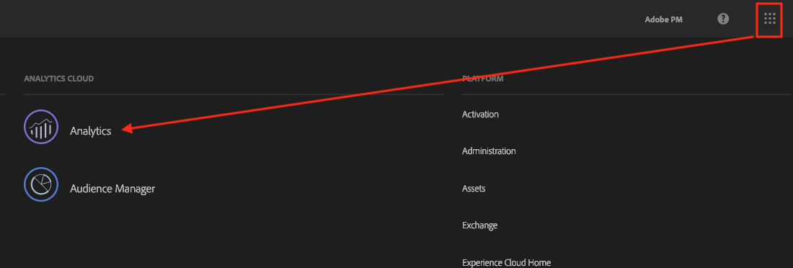
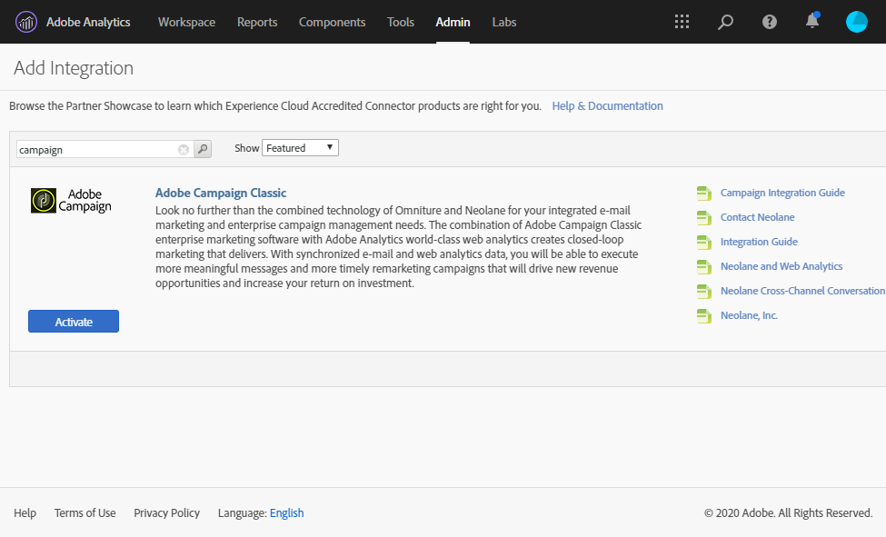
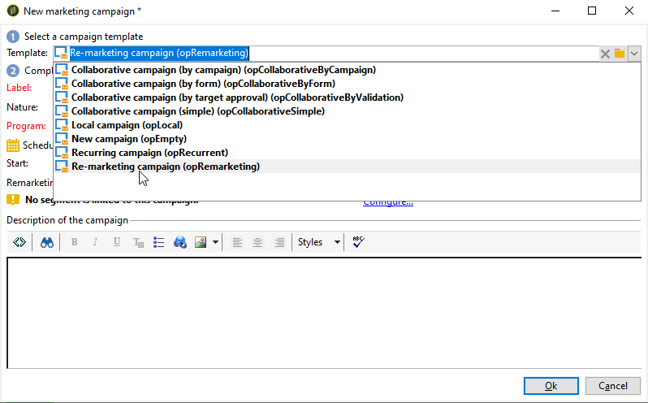

# Conector de datos de Adobe Analytics{#adobe-analytics-data-connector-legacy}

>[!IMPORTANT]
>
>El Conector de datos de Adobe Analytics ha quedado obsoleto. Las funcionalidades van a seguir estando disponibles, pero no se van a mejorar ni admitir. Obtenga más información [en esta página](../../rn/using/deprecated-features.md).

## Acerca de la integración del conector de datos {#about-data-connector-integration}

>[!IMPORTANT]
>
>El conector de datos de Adobe Analytics no es compatible con mensajes transaccionales (Centro de mensajes).

Conectores de datos (anteriormente conocido como Adobe Genesis) permite que Adobe Campaign y Adobe Analytics interactúen mediante el paquete de **conectores de Web Analytics**. Envía datos a Adobe Campaign en forma de segmentos con respecto al comportamiento del usuario tras una campaña de correo electrónico. Por el contrario, envía indicadores y atributos de las campañas de correo electrónico que envía Adobe Campaign a Adobe Analytics: conector de datos.

A través de conectores de datos, Adobe Campaign puede medir la audiencia de Internet (Web Analytics). Gracias a estas integraciones, Adobe Campaign puede recuperar los datos del comportamiento del visitante para uno o más sitios después de una campaña de marketing y (después del análisis) ejecutar nuevas campañas con la intención de convertirlos en compradores. Por el contrario, las herramientas de Web Analytics permiten que Adobe Campaign reenvíe indicadores y atributos de campaña a sus plataformas.

Para obtener más información sobre la implementación de la integración de Adobe Analytics con Adobe Campaign, consulte [esta documentación](https://helpx.adobe.com/es/marketing-cloud/how-to/analytics-ac.html).

Los campos de acción de cada herramienta son los siguientes:

* Función de Web Analytics:

   1. marca las campañas de email iniciadas con Adobe Campaign,
   1. guarda el comportamiento del destinatario en el sitio visitado después de hacer clic en el email de la campaña, en forma de segmentos. Los segmentos se refieren a productos abandonados (vistos, pero no añadidos al carro ni comprados), compras o abandonos del carro de la compra.

* Función de Adobe Campaign:

   1. envía los indicadores y atributos de campaña al conector, que a su vez los reenvía a la herramienta Web Analytics,
   1. recupera y analiza segmentos,
   1. activa una campaña de remarketing.

## Configuración de la integración {#setting-up-the-integration}

Para configurar el conector de datos, debe conectarse a la instancia de Adobe Campaign y realizar las siguientes operaciones:

* [Paso 1: Configurar la integración en Analytics](#step-1--configure-integration-in-analytics)
* [Paso 2: Crear la cuenta externa en Campaign](#step-2--create-the-external-account-in-campaign)
* [Paso 3: Sincronizar Adobe Campaign y Adobe Analytics](#step-3--synchronize-adobe-campaign-and-adobe-analytics)

### Paso 1: Configurar la integración en Analytics {#step-1--configure-integration-in-analytics}

Los pasos siguientes detallan la configuración del conector de datos mediante un asistente.

1. Inicie sesión en Adobe Experience Cloud mediante un Adobe ID o Enterprise ID.

   

1. En la lista de soluciones de Experience Cloud, seleccione **[!UICONTROL Analytics]**.

   

1. En la pestaña **[!UICONTROL Admin]**, seleccione **[!UICONTROL Data Connectors]**.

   Debe tener los siguientes permisos de herramientas de Analytics para acceder al menú **[!UICONTROL Data Connectors]**. Para obtener más información, consulte [esta página](https://experienceleague.adobe.com/docs/analytics/admin/admin-console/permissions/analytics-tools.html?lang=es)
   * Integraciones (Crear)
   * Integraciones (Actualización)
   * Integraciones (Eliminar)

   

1. En la lista de socios, seleccione **[!UICONTROL Adobe Campaign Classic]**.

   

1. En el cuadro de diálogo **[!UICONTROL Add integration]**, haga clic en **[!UICONTROL Activate]**.
1. Marque **[!UICONTROL I accept these terms and conditions]**, seleccione el **[!UICONTROL Report suite]** asociado a esta integración e introduzca la etiqueta del conector.

   Cuando termine, haga clic en **[!UICONTROL Create and configure this integration]**.

   

1. Introduzca la dirección de email a la que se deben enviar las notificaciones en nombre del conector y copie el **[!UICONTROL Account ID]** como aparece en la cuenta externa de Adobe Campaign (para obtener más información, consulte el [Paso 2: Crear la cuenta externa en Campaign](#step-2--create-the-external-account-in-campaign)).

   

1. Especifique los identificadores necesarios para medir el impacto de la campaña de email; es decir, el nombre de la campaña interna (cid) y la ID de tabla de iNmsBroadlog (bid). También debe especificar los indicadores para los eventos que se van a recopilar.
Asegúrese de que **[!UICONTROL Events]** son de tipo numérico; de lo contrario, no aparecerán en el menú desplegable.

   

1. Si es necesario, especifique los segmentos personalizados.

   

1. En **[!UICONTROL Data collection]**, seleccione un método para recuperar datos, en este caso los identificadores **[!UICONTROL cid]** y **[!UICONTROL bid]** especificados en el paso 6.

   

1. Seleccione la información que debe mostrar el tablero.

   

1. Compruebe la configuración en la página que resume los pasos anteriores.

   

1. Haga clic en **[!UICONTROL Activate Now]** para aprobar la configuración y activar el conector.

   

   Ya está configurado el conector de datos.

### Paso 2: Crear la cuenta externa en Campaign {#step-2--create-the-external-account-in-campaign}

La integración de Adobe Campaign en las plataformas de Analytics se lleva a cabo mediante un conector. Para sincronizar las aplicaciones, siga el siguiente proceso:

1. Instale el paquete de **conectores de Web Analytics** en Adobe Campaign.
1. Vaya a la carpeta **[!UICONTROL Administration > Platform > External accounts]** en el árbol de Adobe Campaign.
1. Haga clic con el botón derecho en la lista de cuentas externas y seleccione **[!UICONTROL New]** en el menú desplegable (o haga clic en el botón **[!UICONTROL New]** situado encima de la lista de cuentas externas).
1. Utilice la lista desplegable para seleccionar el tipo **[!UICONTROL Web Analytics]**.
1. Seleccione el proveedor para el conector, es decir: en este caso **[!UICONTROL Adobe Analytics - Data Connector]**.

   

1. Haga clic en el enlace **[!UICONTROL Enrich the formula...]** para cambiar la fórmula de cálculo de URL y especificar la información de integración de la herramienta de Web Analytics (ID de campaña) y los dominios de los sitios cuya actividad debe rastrearse.
1. Especifique los nombres de dominio de los sitios.

   

1. Haga clic en **[!UICONTROL Next]** y asegúrese de que los nombres de dominio se hayan guardado.

   

1. Si es necesario, debe sobrecargar la fórmula de cálculo. Para ello, marque la casilla y edite la fórmula directamente en la ventana.

   

   >[!IMPORTANT]
   >
   >Este modo de configuración está reservado para usuarios expertos: cualquier error en esta fórmula puede provocar que se detengan los envíos de email.

1. La pestaña **[!UICONTROL Advanced]** permite configurar o modificar más ajustes técnicos.

   * **[!UICONTROL Lifespan]**: permite especificar el retraso (en días) después del cual los eventos web se recuperan en Adobe Campaign mediante flujos de trabajo técnicos. Predeterminado: 180 días.
   * **[!UICONTROL Persistence]**: permite especificar el periodo durante el cual se pueden atribuir todos los eventos web (una compra, por ejemplo) a una nueva campaña de marketing. Predeterminado: 7 días.

>[!NOTE]
>
>Si utiliza varias herramientas de medición de audiencia, puede seleccionar **[!UICONTROL Other]** en la lista desplegable **[!UICONTROL Partners]** al crear la cuenta externa. Solo puede hacer referencia a una cuenta externa en las propiedades de entrega; por lo tanto, debe adaptar la fórmula de las URL rastreadas añadiendo los parámetros esperados por las herramientas de medición de Adobe y otras.

### Paso 3: Sincronizar Adobe Campaign y Adobe Analytics {#step-3--synchronize-adobe-campaign-and-adobe-analytics}

Una vez creada la cuenta externa, debe sincronizar ambas aplicaciones.

1. Vaya a la cuenta externa creada anteriormente.
1. Cambie **[!UICONTROL Label]** de la cuenta según sea necesario.
1. Cambie **[!UICONTROL Internal name]** de forma que coincida con el **[!UICONTROL Name]** seleccionado al configurar los Conectores de datos.

   

1. Haga clic en el vínculo **[!UICONTROL Approve connection]**.

   

   Asegúrese de que **[!UICONTROL Internal name]** coincida con el **[!UICONTROL Name]** especificado en el asistente de configuración de los Conectores de datos.

1. Introduzca la **[!UICONTROL Account ID]** en el asistente de configuración del Conector de datos.

   

1. Siga los pasos según la guía del asistente de Conectores de datos y vuelva a la cuenta externa en Adobe Campaign.
1. Haga clic en **[!UICONTROL Next]** para que se produzca el intercambio de datos entre Adobe Campaign y el Conector de datos de Adobe Analytics.

   La lista de segmentos se muestra una vez completada la sincronización.

   

Cuando la sincronización de datos entre Adobe Campaign y Conector de datos de Adobe Analytics haya terminado, los tres segmentos predeterminados definidos en el asistente del Conector de datos se recuperan mediante Adobe Campaign y se puede acceder a él desde la pestaña **[!UICONTROL Segments]** en la cuenta externa de Adobe Campaign.

Si se han configurado segmentos adicionales en el asistente de Conectores de datos, puede agregarlos a Adobe Campaign. Para ello, haga clic en el vínculo **[!UICONTROL Update segment list]** y siga los pasos descritos en el asistente de cuenta externa. Una vez realizada la operación, los nuevos segmentos se muestran en la lista.

### Flujos de trabajo técnicos de procesos de análisis web {#technical-workflows-of-web-analytics-processes}

El intercambio de datos entre Adobe Campaign y el conector de datos de Adobe Analytics se administra mediante cuatro flujos de trabajo técnicos que funcionan como una tarea en segundo plano.

Están disponibles en el árbol de Adobe Campaign, en la carpeta **[!UICONTROL Administration > Production > Technical workflows > Web analytics process]**.

* **[!UICONTROL Recovering of web events]**: una vez cada hora, este flujo de trabajo descarga segmentos sobre el comportamiento de los usuarios en un sitio determinado, los incluye en la base de datos de Adobe Campaign e inicia el flujo de trabajo de remarketing.
* **[!UICONTROL Event purge]**: este flujo de trabajo permite eliminar todos los eventos de la base de datos en función del periodo configurado en el campo **[!UICONTROL Lifespan]**. Para obtener más información, consulte el [Paso 2: Crear la cuenta externa en Campaign](#step-2--create-the-external-account-in-campaign).
* **[!UICONTROL Identification of converted contacts]**: directorio de los visitantes que realizaron una compra después de una campaña de remarketing. Los datos que recopila este flujo de trabajo se pueden consultar en el informe **[!UICONTROL Re-marketing efficiency]**, consulte esta [página](#creating-a-re-marketing-campaign).
* **[!UICONTROL Sending of indicators and campaign attributes]**: permite enviar indicadores de campaña de correo electrónico a través de Adobe Campaign a Adobe Experience Cloud mediante el Conector de datos de Adobe Analytics. Este flujo de trabajo se activa a las 4 de la mañana cada día y los datos pueden tardar hasta 24 horas en enviarse a Analytics.

   Tenga en cuenta que este flujo de trabajo no debe reiniciarse o volverá a enviar todos los datos anteriores, lo que puede distorsionar los resultados de Analytics.

   Los indicadores implicados son:

   * **[!UICONTROL Messages to deliver]** (@toDeliver)
   * **[!UICONTROL Processed]** (@processed)
   * **[!UICONTROL Success]** (@success)
   * **[!UICONTROL Total count of opens]** (@totalRecipientOpen)
   * **[!UICONTROL Recipients who have opened]** (@recipientOpen)
   * **[!UICONTROL Total number of recipients who clicked]** (@totalRecipientClick)
   * **[!UICONTROL People who clicked]** (@personClick)
   * **[!UICONTROL Number of distinct clicks]** (@recipientClick)
   * **[!UICONTROL Opt-Out]** (@optOut)
   * **[!UICONTROL Errors]** (@error)

   >[!NOTE]
   >
   >Los datos enviados son la información delta basada en el último resumen que puede generar un valor negativo en los datos de la métrica.

   Los atributos enviados son los siguientes:

   * **[!UICONTROL Internal name]** (@internalName)
   * **[!UICONTROL Label]** (@label)
   * **[!UICONTROL Label]** (operation/@label): sólo si está instalado el paquete de **Campaign**
   * **[!UICONTROL Nature]** (operation/@nature): solo si está instalado el paquete de **Campaign**
   * **[!UICONTROL Tag 1]** (webAnalytics/@tag1)
   * **[!UICONTROL Tag 2]** (webAnalytics/@tag2)
   * **[!UICONTROL Tag 3]** (webAnalytics/@tag3)
   * **[!UICONTROL Contact date]** (scheduling/@contactDate)

## Seguimiento de entregas en Adobe Campaign {#tracking-deliveries-in-adobe-campaign}

Para que Adobe Experience Cloud pueda rastrear la actividad en los sitios una vez Adobe Campaign ha realizado la entrega, debe hacer referencia al conector coincidente en las propiedades de entrega. Para ello, siga los siguientes pasos:

1. Abra la entrega de la campaña a rastrear.

   

1. Abra las propiedades de entrega.
1. Vaya a la pestaña **[!UICONTROL Web Analytics]** y seleccione la cuenta externa creada anteriormente. Consulte [Paso 2: Crear la cuenta externa en Campaign](#step-2--create-the-external-account-in-campaign).

   

1. Ahora puede realizar la entrega y acceder a su informe en Adobe Analytics.

## Creación de una campaña de remarketing {#creating-a-re-marketing-campaign}

Para preparar la campaña de remarketing, simplemente cree plantillas de entrega para utilizarlas en campañas de tipo de remarketing. A continuación, configure su campaña de remarketing y vincúlela a un segmento. Cada segmento debe tener una campaña de remarketing diferente.

Las campañas de remarketing se inician automáticamente una vez que Adobe Campaign ha terminado de recuperar los segmentos analizando el comportamiento de las personas a las que se dirigió la campaña inicial. En caso de abandono del carro de compras o de la visualización del producto sin compra, se realiza una entrega a los destinatarios en cuestión para que la navegación por su sitio termine en una compra.

Adobe Campaign proporciona plantillas de entrega personalizadas que puede utilizar o aplicar a bases de datos propias para preparar las campañas.

1. Desde **[!UICONTROL Explorer]**, vaya a la carpeta de Adobe Campaign **[!UICONTROL Resources > Templates > Delivery templates]**.
1. Duplique la plantilla de **[!UICONTROL Email delivery (re-marketing)]** o los ejemplos de plantilla de remarketing que ofrece Adobe Campaign.
1. Personalice la plantilla para adaptarla a sus necesidades y guárdela.

   

1. Cree una nueva campaña y seleccione la plantilla **[!UICONTROL Re-marketing campaign]** en la lista desplegable.

   

1. Haga clic en el enlace **[!UICONTROL Configure...]** para especificar el segmento y la plantilla de envíos relacionados con la campaña.
1. Seleccione la cuenta externa configurada anteriormente.

   

1. Seleccione el segmento correspondiente.

   

1. Seleccione la plantilla de entrega que prefiere usar para esta campaña de remarketing y luego haga clic en **[!UICONTROL Finish]** para cerrar la ventana.

   

1. Haga clic en **[!UICONTROL OK]** para cerrar la ventana de la campaña.

Puede acceder al informe de **[!UICONTROL Re-marketing efficiency]** a través de la página de informes globales. Permite ver la cantidad de contactos convertidos (por ejemplo: aquellos que han comprado algo) en relación con el número de abandonos del carro de la compra después del relanzamiento de la campaña de marketing de Adobe Campaign. La tasa de conversión se calcula por semana, mes o desde el inicio de la sincronización entre las herramientas de Adobe Campaign y Web Analytics.

