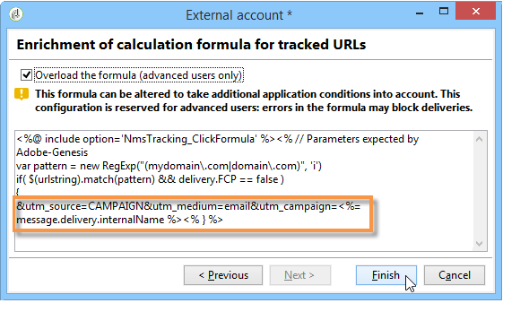

# Conectores de datos de Adobe Analytics{#adobe-analytics-data-connector}

## Acerca de la integración de conectores de datos {#about-data-connector-integration}

>[!CAUTION]
>
>El conector de datos de Adobe Analytics no es compatible 
                    con mensajes transaccionales (Centro de mensajes).

Conectores de datos (anteriormente conocido como Adobe Genesis) permite que Adobe Campaign y Adobe Analytics interactúen mediante el paquete de **conectores de Web Analytics** . Envía datos a Adobe Campaign en forma de segmentos con respecto al comportamiento del usuario tras una campaña de correo electrónico. Por el contrario, envía indicadores y atributos de las campañas de correo electrónico que envía Adobe Campaign a Adobe Analytics: conector de datos.

A través de conectores de datos, Adobe Campaign puede medir la audiencia de Internet (Web Analytics). Gracias a estas integraciones, Adobe Campaign puede recuperar los datos del comportamiento del visitante para uno o más sitios después de una campaña de marketing y (después del análisis) ejecutar nuevas campañas con la intención de convertirlos en compradores. Por el contrario, las herramientas de Web Analytics permiten que Adobe Campaign reenvíe indicadores y atributos de campaña a sus plataformas.

Para obtener más información sobre la implementación de la
                    integración de Adobe Analytics con Adobe Campaign, consulte [esta documentación](https://helpx.adobe.com/marketing-cloud/how-to/analytics-ac.html).

Los campos de acción de cada herramienta son los siguientes:

* Función de Web Analytics:

   1. marca las campañas de email iniciadas con Adobe Campaign,
   1. guarda el comportamiento del destinatario en el sitio visitado después de hacer clic en el email de la campaña, en forma de segmentos. Los segmentos se refieren a productos abandonados (vistos, pero no añadidos al carro ni comprados), compras o abandonos del carro de la compra.

* Función de Adobe Campaign:

   1. envía los indicadores y atributos de campaña al conector, que a su vez los reenvía a la herramienta Web Analytics,
   1. recupera y analiza segmentos,
   1. activa una campaña de remarketing.

## Configuración de la integración {#setting-up-the-integration}

Para configurar Data connector, debe conectarse a la instancia de Adobe Campaign y realizar las siguientes operaciones:

* [Paso 1: Configurar la integración en Analytics](#step-1--configure-integration-in-analytics)
* [Paso 2: Crear una cuenta externa en Campaign](#step-2--create-the-external-account-in-campaign)
* [Paso 3: Sincronizar Adobe Campaign y Adobe Analytics](#step-3--synchronize-adobe-campaign-and-adobe-analytics)

### Step 1: Configure integration in Analytics {#step-1--configure-integration-in-analytics}

Los pasos siguientes detallan la configuración del conector de datos mediante un asistente.

1. Inicie sesión en Adobe Experience Cloud mediante un Adobe ID
                            o Enterprise ID.

   

1. From the list of Experience Cloud solutions, select **[!UICONTROL Analytics]**.

   

1. En la **[!UICONTROL Admin]** ficha, seleccione **[!UICONTROL Data Connectors]**.

   Debe tener los siguientes permisos de herramientas de Analytics para acceder al **[!UICONTROL Data Connectors]** menú. Para obtener más información, consulte [esta página](https://docs.adobe.com/content/help/en/analytics/admin/admin-console/permissions/analytics-tools.html)
   * Integraciones (Crear)
   * Integraciones (actualización)
   * Integraciones (Eliminar)
   

1. En la lista de socios, seleccione **[!UICONTROL Neolane - Enterprise Marketing Platform]**.

   

1. En el **[!UICONTROL Add integration]** cuadro de diálogo, haga clic en **[!UICONTROL Activate]**.
1. Check **[!UICONTROL I accept these terms and conditions]** and select the **[!UICONTROL Report suite]** linked to this integration and enter the connector label.

   Cuando termine, haga clic en **[!UICONTROL Create and configure this integration]**.

   

1. Enter the email address that will receive the notifications on behalf of the connector, then copy the **[!UICONTROL Account ID]** as it appears in the external Adobe Campaign account (for more on this, refer to the [Step 2: Create the external account in Campaign](#step-2--create-the-external-account-in-campaign)).

   

1. Especifique los identificadores necesarios para medir el impacto de la campaña de email; es decir, el nombre de la campaña interna (cid) y la ID de tabla de iNmsBroadlog (bid). También debe especificar los indicadores para los eventos que se van a recopilar.
Asegúrese de que **[!UICONTROL Events]** son de tipo numérico; de lo contrario, no aparecerán en el menú desplegable.

   

1. Si es necesario, especifique los segmentos personalizados.

   

1. In **[!UICONTROL Data collection]**, select a method for recovering data, in this case the **[!UICONTROL cid]** and **[!UICONTROL bid]** identifiers specified in step 6.

   

1. Seleccione la información que debe mostrar el tablero.

   

1. Compruebe la configuración en la página que resume los pasos anteriores.

   

1. Click **[!UICONTROL Activate Now]** to approve configuration and activate the connector.

   

   Ya está configurado el conector de datos.

### Step 2: Create the external account in Campaign {#step-2--create-the-external-account-in-campaign}

La integración de Adobe Campaign en las plataformas de Analytics 
                    se lleva a cabo mediante un conector. Para sincronizar las aplicaciones, siga el siguiente proceso:

1. Instale el paquete de **conectores de Web Analytics** en Adobe Campaign.
1. Go to the **[!UICONTROL Administration > Platform > External accounts]** folder of the Adobe Campaign tree.
1. Right-click the list of external accounts and select **[!UICONTROL New]** in the drop-down menu (or click the **[!UICONTROL New]** button above the list of external accounts).
1. Use the drop-down list to select the **[!UICONTROL Web Analytics]** type.
1. Select the provider for the connector, i.e. **[!UICONTROL Adobe Analytics - Data Connector]** in this case.

   

1. Click the **[!UICONTROL Enrich the formula...]** link to change the URL calculation formula to specify the Web analytics tool integration information (campaign IDs) and the domains of the sites whose activity must be tracked.
1. Especifique los nombres de dominio de los sitios.

   

1. Click **[!UICONTROL Next]** and make sure the domain names have been saved.

   

1. Si es necesario, debe sobrecargar la fórmula de cálculo. Para ello, marque la casilla y edite la fórmula directamente en la ventana.

   

   >[!CAUTION]
   >
   >Este modo de configuración está reservado para usuarios expertos: cualquier error en esta fórmula puede provocar que se detengan los envíos de email.

1. The **[!UICONTROL Advanced]** tab lets you configure or modify more technical settings.

   * **[!UICONTROL Lifespan]**:: permite especificar la demora (en días_ después de la cual los eventos web se recuperaron en Adobe Campaign mediante flujos de trabajo técnicos. Predeterminado: 180 días.
   * **[!UICONTROL Persistence]**:: le permite el período durante el cual todos los eventos Web (por ejemplo, una compra) se pueden atribuir a una campaña de remercadotecnia, Predeterminado: 7 días.

>[!NOTE]
>
>If you are using several audience measuring tools, you can select **[!UICONTROL Other]** in the **[!UICONTROL Partners]** drop-down list when creating the external account. Solo puede hacer referencia a una cuenta externa en las propiedades de envío: por lo tanto, debe adaptar la fórmula de URL rastreadas agregando los parámetros esperados por las herramientas de medición de Adobe y otras herramientas.

### Step 3: Synchronize Adobe Campaign and Adobe Analytics {#step-3--synchronize-adobe-campaign-and-adobe-analytics}

Una vez creada la cuenta externa, debe sincronizar ambas aplicaciones.

1. Vaya a la cuenta externa creada anteriormente.
1. Change the account **[!UICONTROL Label]** as needed.
1. Change the **[!UICONTROL Internal name]** so that it matches the **[!UICONTROL Name]** chosen while configuring the Data Connector.

   

1. Haga clic en el **[!UICONTROL Approve connection]** vínculo.

   

   Make sure the **[!UICONTROL Internal name]** matches the **[!UICONTROL Name]** specified in the Data Connector configuration wizard.

1. Enter the **[!UICONTROL Account ID]** in the Data Connector configuration wizard.

   

1. Siga los pasos según la guía del asistente de Conectores de datos y vuelva a la cuenta externa en Adobe Campaign.
1. Click **[!UICONTROL Next]** in order for the data exchange to take place between Adobe Campaign and Adobe Analytics - Data connector.

   La lista de segmentos se muestra una vez completada la sincronización.

   

When the synchronization of data between Adobe Campaign and Adobe Analytics - Data connector is effective, the three default segments defined in the Data Connector wizard are recovered by Adobe Campaign and become accessible in the **[!UICONTROL Segments]** tab of the Adobe Campaign external account.

Si se han configurado segmentos adicionales en el asistente de Conectores de datos, puede agregarlos a Adobe Campaign. To do this, click the **[!UICONTROL Update segment list]** link and follow the steps outlined in the external account wizard. Una vez realizada la operación, los nuevos segmentos se muestran en la lista.

### Flujos de trabajo técnicos de procesos de Web Analytics {#technical-workflows-of-web-analytics-processes}

El intercambio de datos entre Adobe Campaign y Conectores de datos de Adobe Analytics se administra mediante cuatro flujos de trabajo técnicos que funcionan como una tarea en segundo plano.

Están disponibles en el árbol de Adobe Campaign, en la **[!UICONTROL Administration > Production > Technical workflows > Web analytics process]** carpeta.

* **[!UICONTROL Recovering of web events]**:: una vez por hora, este flujo de trabajo descarga segmentos sobre el comportamiento de los usuarios en un sitio determinado, los incluye en la base de datos de Adobe Campaign e inicia el flujo de trabajo de remercadotecnia.
* **[!UICONTROL Event purge]**:: este flujo de trabajo le permite eliminar todos los eventos de la base de datos en función del período configurado en el **[!UICONTROL Lifespan]** campo. Para obtener más información sobre esto, consulte el [Paso 2: Cree la cuenta externa en Campaign](#step-2--create-the-external-account-in-campaign).
* **[!UICONTROL Identification of converted contacts]**:: directorio de los visitantes que realizaron una compra tras una campaña de remercadotecnia. The data collected by this workflow is accessible in the **[!UICONTROL Re-marketing efficiency]** report, refer to this [page](#creating-a-re-marketing-campaign).* **[!UICONTROL Sending of indicators and campaign attributes]**: lets you send email campaign indicators via Adobe Campaign to the Adobe Experience Cloud using Adobe Analytics - Data connector. Este flujo de trabajo se activa a las 4 de la mañana cada día y los datos pueden 
                            tardar hasta 24 horas en enviarse a Analytics.

   Tenga en cuenta que este flujo de trabajo no debe
                            reiniciarse o volverá a enviar todos los datos anteriores, lo que puede distorsionar
                            los resultados de Analytics.

   Los indicadores implicados son:

   * **[!UICONTROL Messages to deliver]** (@toDeliver)
   * **[!UICONTROL Processed]** (@processed)
   * **[!UICONTROL Success]** (@success)
   * **[!UICONTROL Total count of opens]** (@totalRecipientOpen)
   * **[!UICONTROL Recipients who have opened]** (@recipientOpen)
   * **[!UICONTROL Total number of recipients who clicked]** (@totalRecipientClick)
   * **[!UICONTROL People who clicked]** (@personClick)
   * **[!UICONTROL Number of distinct clicks]** (@recipientClick)
   * **[!UICONTROL Opt-Out]** (@optOut)
   * **[!UICONTROL Errors]** (@error)
   >[!NOTE]
   >
   >Los datos enviados son la información delta basada en el último
                                resumen que puede generar un valor negativo en los datos de la métrica.

   Los atributos enviados son los siguientes:

   * **[!UICONTROL Internal name]** (@internalName)
   * **[!UICONTROL Label]** (@label)
   * **[!UICONTROL Label]** (operation/@label): solo si está instalado el paquete **Campaign**
   * **[!UICONTROL Nature]** (operation/@naturaleza): solo si está instalado el paquete **Campaign**
   * **[!UICONTROL Tag 1]** (webAnalytics/@tag1)
   * **[!UICONTROL Tag 2]** (webAnalytics/@tag2)
   * **[!UICONTROL Tag 3]** (webAnalytics/@tag3)
   * **[!UICONTROL Contact date]** (schedule/@contactDate)

* **Identificación de contactos convertidos**: directorio de los visitantes que realizaron una compra después de una campaña de remarketing. The data collected by this workflow is accessible in the **[!UICONTROL Re-marketing efficiency]** report (refer to this [page](../../platform/using/adobe-analytics-data-connector.md#creating-a-re-marketing-campaign)).

## Seguimiento de envíos en Adobe Campaign {#tracking-deliveries-in-adobe-campaign}

Para que Adobe Experience Cloud pueda rastrear la actividad en los sitios una vez Adobe Campaign ha realizado el envío, debe hacer referencia al conector coincidente en las propiedades de envío. Para ello, siga los siguientes pasos:

1. Abra el envío de la campaña a rastrear.

   

1. Abra las propiedades de envío.
1. Vaya a la **[!UICONTROL Web Analytics]** ficha y seleccione la cuenta externa creada anteriormente. Consulte el [paso 2: Cree la cuenta externa en Campaign](#step-2--create-the-external-account-in-campaign)).

   

1. Ahora puede realizar el envío y acceder a su informe en Adobe Analytics.

## Creación de una campaña de remarketing {#creating-a-re-marketing-campaign}

Para preparar la campaña de remarketing, simplemente cree plantillas de envío para utilizarlas en campañas de tipo de remarketing. A continuación, configure su campaña de remarketing y vincúlela a un segmento. Cada segmento debe tener una campaña de remarketing diferente.

Las campañas de remarketing se inician automáticamente una vez que Adobe Campaign ha terminado de recuperar los segmentos analizando el comportamiento de las personas a las que se dirigió la campaña inicial. En caso de abandono del carro de compras o de la visualización del producto sin compra, se realiza un envío a los destinatarios en cuestión para que la navegación por su sitio termine en una compra.

Adobe Campaign proporciona plantillas de envío personalizadas que puede utilizar o aplicar a bases de datos propias para preparar las campañas.

1. From the **[!UICONTROL Explorer]**, go to the **[!UICONTROL Resources > Templates > Delivery templates]** folder of the Adobe Campaign tree.
1. Duplicate the **[!UICONTROL Email delivery (re-marketing)]** template or the re-marketing template examples offered by Adobe Campaign.
1. Personalice la plantilla para adaptarla a sus necesidades y guárdela.

   

1. Create a new campaign and select the **[!UICONTROL Re-marketing campaign]** template from the drop-down list.

   

1. Click the **[!UICONTROL Configure...]** link to specify the segment and delivery template linked to the campaign.
1. Seleccione la cuenta externa configurada anteriormente.

   

1. Seleccione el segmento correspondiente.

   

1. Select the delivery template to be used for this re-marketing campaign, then click **[!UICONTROL Finish]** to close the window.

   

1. Click **[!UICONTROL OK]** to close the campaign window.

The **[!UICONTROL Re-marketing efficiency]** report is accessed via the global reports page. Permite ver la cantidad de contactos convertidos (por ejemplo: aquellos que han comprado algo) en relación con el número de abandonos del carro de la compra después del relanzamiento de la campaña de marketing de Adobe Campaign. La tasa de conversión se calcula por semana, mes o desde el inicio de la sincronización entre las herramientas de Adobe Campaign y Web Analytics.

