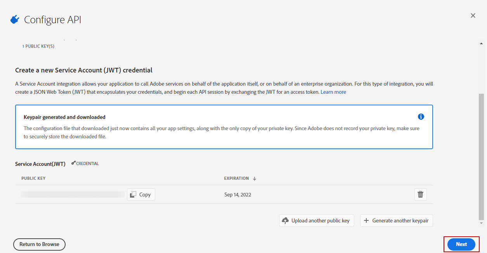

# Aprovisionamiento de conectores de Adobe Analytics {#adobe-analytics-connector-provisioning}


>[!IMPORTANT]
>
> Estos pasos solo deben realizarlos implementaciones híbridas y locales.
>
>Para implementaciones alojadas, póngase en contacto con el equipo [Adobe Customer Care](https://helpx.adobe.com/es/enterprise/admin-guide.html/enterprise/using/support-for-experience-cloud.ug.html).

La integración entre Adobe Campaign Classic y la autenticación de Adobe Analytics es compatible con el servicio Identity Management de Adobe (IMS). Debe implementar Adobe IMS y conectarse a Campaign [mediante un Adobe ID](https://experienceleague.adobe.com/docs/campaign-classic/using/installing-campaign-classic/connect-to-campaign/connecting-via-an-adobe-id/about-adobe-id.html?lang=en) antes de iniciar la implementación del conector de Analytics.

Para que esta integración funcione, debe crear un perfil de producto de Adobe Analytics que se utilice exclusivamente para el conector de Analytics. A continuación, deberá crear un proyecto de Adobe I/O.

## Creación de un perfil de producto de Adobe Analytics {#analytics-product-profile}

El perfil de producto determina el nivel de acceso que un usuario tiene a sus distintos componentes de Analytics.

Si ya tiene un perfil de producto de Analytics, debe crear un nuevo perfil de producto de Adobe Analytics utilizado exclusivamente para el conector de Analytics. Esto garantizará que el perfil de producto esté configurado con los permisos correctos para esta integración.

Para obtener más información sobre los perfiles de producto, consulte la [Documentación de Admin Console](https://helpx.adobe.com/mt/enterprise/admin-guide.html).

1. En [Admin console](https://adminconsole.adobe.com/), seleccione su **[!UICONTROL Product]** de Adobe Analytics.

   

1. Haga clic en **[!UICONTROL New Profile]**.

   

1. Agregue un **[!UICONTROL Product profile name]**, sugerimos usar la siguiente sintaxis: `reserved_campaign_classic_<Company Name>`. A continuación, haga clic en **[!UICONTROL Next]**.

   Este **[!UICONTROL Product profile]** debe usarse exclusivamente en el conector de Analytics para evitar errores de configuración.

1. Abra el **[!UICONTROL Product profile]** recién creado y seleccione la pestaña **[!UICONTROL Permissions]** .

   

1. Configure las diferentes capacidades haciendo clic en **[!UICONTROL Edit]** y seleccione los permisos que desea asignar a su **[!UICONTROL Product profile]** haciendo clic en el icono de signo más (+).

   Para obtener más información sobre cómo administrar permisos, consulte la [Documentación de Admin Console](https://helpx.adobe.com/mt/enterprise/using/manage-permissions-and-roles.html).

1. Para la capacidad **[!UICONTROL Report Suites]**, añada el **[!UICONTROL Report Suites]** que debe utilizar más adelante.

   Si no tiene ningún grupo de informes, puede crearlo siguiendo [estos pasos](../../platform/using/adobe-analytics-connector.md#report-suite-analytics).

   

1. Para la capacidad **[!UICONTROL Metrics]**, añada el **[!UICONTROL Metrics]** que tendrá que configurar más adelante.

   Si es necesario, puede activar la opción Inclusión automática , que agregará todos los elementos de permisos a la lista incluida y automáticamente agregará nuevos elementos de permisos.

   

1. Para la capacidad **[!UICONTROL Dimensions]**, añada el **[!UICONTROL Dimensions]** que tendrá que configurar más adelante.

1. Para la capacidad **[!UICONTROL Report Suite Tools]**, agregue los siguientes permisos:

   * **[!UICONTROL Report suite Mgmt]**
   * **[!UICONTROL Conversion variables]**
   * **[!UICONTROL Success events]**
   * **[!UICONTROL Custom data Warehouse report]**
   * **[!UICONTROL Data sources manager]**
   * **[!UICONTROL Classifications]**

1. Para la capacidad **[!UICONTROL Analytics Tools]**, agregue los siguientes permisos:

   * **[!UICONTROL Code Manager - Web services]**
   * **[!UICONTROL Logs - Web services]**
   * **[!UICONTROL Web services]**
   * **[!UICONTROL Web service access]**
   * **[!UICONTROL Calculated metric creation]**
   * **[!UICONTROL Segment creation]**

El perfil de producto ya está configurado. A continuación, debe crear el proyecto de Adobe I/O.

## Crear proyecto de Adobe I/O {#create-adobe-io}

1. Acceda al Adobe I/O e inicie sesión como **System Administrator** de la organización IMS.

   Para obtener más información sobre las funciones de administrador, consulte esta [página](https://helpx.adobe.com/enterprise/using/admin-roles.html).

1. Haga clic en **[!UICONTROL Create a new project]**.

   

1. Haga clic en **[!UICONTROL Add to Project]** y seleccione **[!UICONTROL API]**.

   

1. Seleccione [!DNL Adobe Analytics] y haga clic en **[!UICONTROL Next]**.

   

1. Elija **[!UICONTROL Service Account (JWT)]** como tipo de autenticación y haga clic en **[!UICONTROL Next]**.

   

1. Seleccione la opción **[!UICONTROL Option 1: Generate a Key-Pair]** y haga clic en **[!UICONTROL Generate a Key-Pair]**.

   A continuación, el archivo config.zip se descargará automáticamente.

   

1. Haga clic en **[!UICONTROL Next]**.

   

1. Seleccione el **[!UICONTROL Product profile]** creado en los pasos anteriores detallados en esta [sección](#analytics-product-profile).

1. A continuación, haga clic en **[!UICONTROL Save Configured API]**.

   

1. En el proyecto, seleccione [!DNL Adobe Analytics] y copie la siguiente información en **[!UICONTROL Service Account (JWT)]**:

   * **[!UICONTROL Client ID]**
   * **[!UICONTROL Client Secret]**
   * **[!UICONTROL Technical account ID]**
   * **[!UICONTROL Organization ID]**

   

1. Pegue estas credenciales de cuenta de servicio en nlserver con el siguiente comando:

   ```
   nlserver config -instance:<instanceName> -setimsjwtauth::<ImsOrgId>/<ClientId>/<TechnicalAccountId>/<ClientSecret>/<$(base64 -w0 /path/to/private.key)>
   ```

Ahora puede empezar a utilizar el conector de Analytics y realizar un seguimiento de los comportamientos de los clientes.
