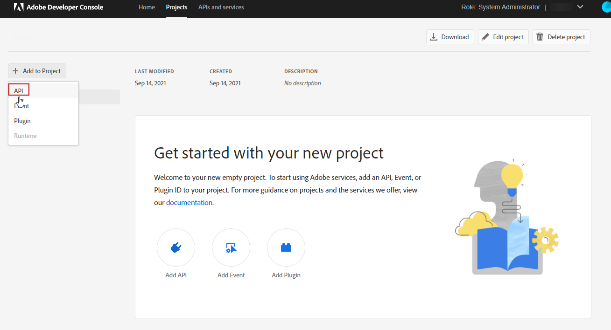

# Aprovisionamiento del Conector de Adobe Analytics {#adobe-analytics-connector-provisioning}

>[!IMPORTANT]
>
> Estos pasos solo corresponden a las implementaciones híbridas y locales.
>
>Para implementaciones alojadas, póngase en contacto con el equipo de [Servicio de atención al cliente de Adobe](https://helpx.adobe.com/es/enterprise/admin-guide.html/enterprise/using/support-for-experience-cloud.ug.html).

La integración entre Adobe Campaign Classic y la autenticación de Adobe Analytics es compatible con el servicio Identity Management de Adobe (IMS):

* Si administra una cuenta externa migrada, debe implementar Adobe IMS y conectarse a Adobe Campaign a través de un Adobe ID. El usuario que haya iniciado sesión mediante el IMS de Adobe ID debe ser el propietario de la cuenta del **Conector de datos** en Adobe Analytics y tener un conjunto de permisos para el **Perfil del producto** mencionado a continuación.

* Si va a implementar un conector nuevo, la implementación de Adobe IMS es opcional. Sin un usuario de Adobe ID, Adobe Campaign utilizará un usuario técnico para sincronizar con Adobe Analytics.

Para que esta integración funcione, debe crear un perfil de producto de Adobe Analytics que se utilice exclusivamente para el conector de Analytics. A continuación, deberá crear un proyecto de Adobe I/O.

<!--
>[!AVAILABILITY]
>
> JWT (JSON Web Tokens) is currently in the process of depreciation and is being replaced with OAuth. The transition is being carried out progressively within Campaign's upcoming releases and documentation will be updated to reflect these updates.
-->

## Creación de un perfil de producto de Adobe Analytics {#analytics-product-profile}

El perfil de producto determina el nivel de acceso que un usuario tiene a sus distintos componentes de Analytics.

Si ya tiene un perfil de producto de Analytics, debe crear otro que utilice exclusivamente para el conector de Analytics. Esto garantizará que el perfil de producto esté configurado con los permisos correctos para esta integración.

Para obtener más información acerca de los perfiles de producto, consulte la [documentación de Admin Console](https://helpx.adobe.com/mt/enterprise/admin-guide.html).

1. En [Admin Console](https://adminconsole.adobe.com/), seleccione su **[!UICONTROL Product]** de Adobe Analytics.

   

1. Haga clic en **[!UICONTROL New Profile]**.

   

1. Añada un **[!UICONTROL Product profile name]**, sugerimos usar la siguiente sintaxis: `reserved_campaign_classic_<Company Name>`. A continuación, haga clic en **[!UICONTROL Next]**.

   Este **[!UICONTROL Product profile]** debe usarse exclusivamente en el Conector de Analytics para evitar errores de configuración.

1. Abra el **[!UICONTROL Product profile]** recién creado y seleccione la pestaña **[!UICONTROL Permissions]**.

   

1. Configure las diferentes capacidades haciendo clic en **[!UICONTROL Edit]** y seleccione los permisos que desea asignar a su **[!UICONTROL Product profile]** haciendo clic en el icono de signo más (+).

   Para obtener más información sobre cómo administrar permisos, consulte la [Documentación de Admin Console](https://helpx.adobe.com/mt/enterprise/using/manage-permissions-and-roles.html).

1. Para la capacidad **[!UICONTROL Report Suites]**, añada el **[!UICONTROL Report Suites]** que debe utilizar más adelante.

   Si no tiene ningún grupo de informes, puede crearlo siguiendo [estos pasos](../../platform/using/adobe-analytics-connector.md#report-suite-analytics).

   

1. Para la capacidad **[!UICONTROL Metrics]**, añada el **[!UICONTROL Metrics]** que tendrá que configurar más adelante.

   Si es necesario, puede activar la opción Inclusión automática, que añadirá todos los elementos de permisos a la lista incluida y automáticamente agregará nuevos elementos de permisos.

   

1. Para el **[!UICONTROL Dimensions]** capacidad, añada el **[!UICONTROL Dimensions]** necesario para la configuración futura.

   Asegúrese de que los Dimension seleccionados coinciden con los que se van a configurar en la [Cuenta externa](adobe-analytics-connector.md#external-account-classic) y se alinean con el número de eVars correspondiente de [Adobe Analytics](adobe-analytics-connector.md#configure-conversion-success).

1. Para la capacidad **[!UICONTROL Report Suite Tools]**, agregue los siguientes permisos:

   * **[!UICONTROL Report suite Mgmt]**
   * **[!UICONTROL Conversion variables]**
   * **[!UICONTROL Success events]**
   * **[!UICONTROL Custom data Warehouse report]**
   * **[!UICONTROL Data sources manager]**
   * **[!UICONTROL Classifications]**

1. Para la capacidad **[!UICONTROL Analytics Tools]**, agregue los siguientes permisos:

   * **[!UICONTROL Code Manager - Web services]**
   * **[!UICONTROL Logs - Web services]**
   * **[!UICONTROL Web services]**
   * **[!UICONTROL Web service access]**
   * **[!UICONTROL Calculated metric creation]**
   * **[!UICONTROL Segment creation]**

El perfil de producto ya está configurado. A continuación, debe crear el proyecto de Adobe I/O.

## Creación de un proyecto de Adobe I/O {#create-adobe-io}

1. Acceda a Adobe I/O e inicie sesión como el **Administrador del sistema** de la organización.

   Para obtener más información acerca de las funciones de administrador, consulte esta [página](https://helpx.adobe.com/es/enterprise/using/admin-roles.html).

1. Haga clic en **[!UICONTROL Create a new project]**.

   

1. Haga clic en **[!UICONTROL Add to Project]** y seleccione **[!UICONTROL API]**.

   

1. Seleccione [!DNL Adobe Analytics] y haga clic en **[!UICONTROL Next]**.

   

1. Elija **[!UICONTROL Service Account (JWT)]** como tipo de autenticación y haga clic en **[!UICONTROL Next]**.

   

1. Seleccione la opción **[!UICONTROL Option 1: Generate a Key-Pair]** y haga clic en **[!UICONTROL Generate a Key-Pair]**.

   A continuación, el archivo config.zip se descargará automáticamente.

   

1. Haga clic en **[!UICONTROL Next]**.

   

1. Seleccione el **[!UICONTROL Product profile]** creado en los pasos anteriores detallados en esta [sección](#analytics-product-profile).

1. A continuación, haga clic en **[!UICONTROL Save Configured API]**.

   

1. En el proyecto, seleccione [!DNL Adobe Analytics] y copie la siguiente información en **[!UICONTROL Service Account (JWT)]**:

   * **[!UICONTROL Client ID]**
   * **[!UICONTROL Client Secret]**
   * **[!UICONTROL Technical account ID]**
   * **[!UICONTROL Organization ID]**

   

1. Utilice la clave privada generada en el paso 6.

   Si ya ha configurado activadores con estas credenciales, la clave privada debe ser la misma para esta configuración del conector.

1. Codifique la clave privada mediante el siguiente comando: `base64 ./private.key > private.key.base64`. Esto guardará el contenido de base64 en un nuevo archivo `private.key.base64`.

   >[!NOTE]
   >
   >A veces, se pueden añadir automáticamente líneas adicionales al copiar/pegar la clave privada. Recuerde eliminarlas antes de codificar la clave privada.

1. Copie el contenido del archivo `private.key.base64`.

1. Inicie sesión mediante SSH en cada contenedor donde esté instalada la instancia de Adobe Campaign y añada las credenciales del proyecto en Adobe Campaign ejecutando el siguiente comando como usuario `neolane`. Esto insertará las credenciales **[!UICONTROL Technical Account]** en el archivo de configuración de instancia.

   ```
   nlserver config -instance:<instance name> -setimsjwtauth:Organization_Id/Client_Id/Technical_Account_ID/<Client_Secret>/<Base64_encoded_Private_Key>
   ```

Ahora puede empezar a utilizar el conector de Analytics y realizar un seguimiento de los comportamientos de los clientes.
