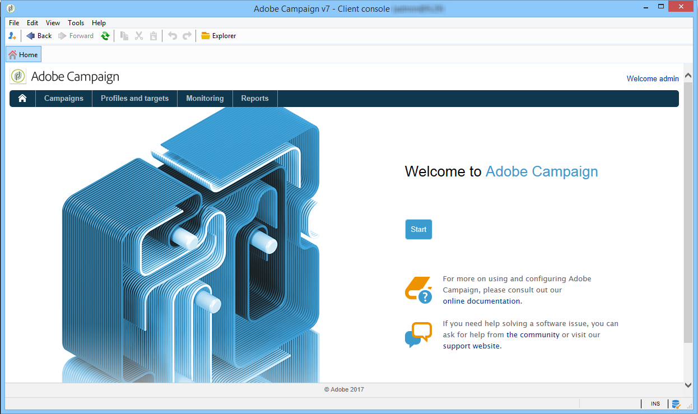
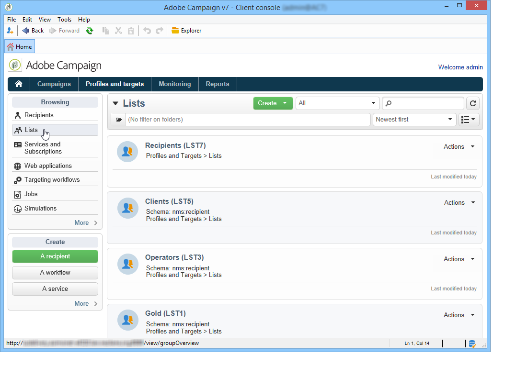

# Espacio de trabajo de Adobe Campaign{#adobe-campaign-workspace}

## Explore la interfaz de Adobe Campaign {#about-adobe-campaign-interface}

Una vez que esté conectado a la base de datos, accederá a la página principal de Adobe Campaign, que es un panel compuesto por vínculos y accesos directos que permiten acceder a las funcionalidades, según la instalación y las configuraciones de la plataforma general.

Desde la sección central de la página principal, puede utilizar vínculos para acceder al portal de documentación en línea de Campaign, al foro y al sitio web de soporte técnico.

 Descubra el espacio de trabajo de Campaign en [el vídeo](#video)

>[!NOTE]
>
>Las funcionalidades de Adobe Campaign disponibles en su instancia dependen de los módulos y complementos instalados. Algunos de ellos pueden no estar disponibles, dependiendo de los permisos y configuraciones específicas.
>
>Antes de instalar cualquier módulo o complemento, debe comprobar el acuerdo de licencia o ponerse en contacto con el ejecutivo de cuenta de Adobe.

### Acceso a la consola y a la web {#console-and-web-access}

La plataforma de Adobe Campaign es accesible a través de una consola o a través de un explorador de Internet.

El acceso web proporciona una interfaz similar a la consola pero con un conjunto reducido de funcionalidades.

Por ejemplo, para un operador determinado, una campaña se mostrará con las siguientes opciones en la consola:

Mientras que con el acceso web, las opciones permiten principalmente la visualización de:

### Idiomas {#languages}

El idioma se selecciona al instalar la instancia de Adobe Campaign Classic.

Puede elegir entre cinco idiomas diferentes:

* Inglés (RU)
* Inglés (EE. UU.)
* Francés
* Alemán
* Japonés

El idioma elegido para la instancia de Adobe Campaign Classic puede afectar los formatos de fecha y hora. Para obtener más información, consulte [esta sección](../../platform/using/adobe-campaign-workspace.md#date-and-time).

Para obtener más información sobre cómo crear una instancia, consulte esta [página](../../installation/using/creating-an-instance-and-logging-on.md).

>[!CAUTION]
>
>No se puede cambiar el idioma después de la creación de la instancia.

## Conceptos básicos de navegación {#navigation-basics}

### Examen de páginas {#browsing-pages}

Las distintas funcionalidades de la plataforma se dividen en funcionalidades principales (utilice los vínculos que ve en la sección superior de la interfaz para acceder a ellas).

La lista de funcionalidades principales a las que puede acceder depende de los paquetes y complementos instalados y de los derechos de acceso.

Cada funcionalidad incluye un conjunto de funcionalidades basadas en las necesidades relacionadas con tareas y en el contexto de uso. Por ejemplo, el vínculo **[!UICONTROL Profiles and targets]** le lleva a las listas de destinatarios, los servicios de suscripción, los flujos de trabajo de objetivos existentes y los accesos directos para crear estos elementos.

Las listas están disponibles a través del vínculo **[!UICONTROL Lists]** en la sección izquierda de la interfaz **[!UICONTROL Profiles and Targets]**.

### Uso de pestañas {#using-tabs}

* Al hacer clic en una funcionalidad principal o en un vínculo, la página correspondiente reemplaza a la página actual. Para volver a la página anterior, haga clic en el botón **[!UICONTROL Back]** de la barra de herramientas. Para volver a la página principal, haga clic en el botón **[!UICONTROL Home]**.

   

* En el caso de un menú o acceso directo a una pantalla de visualización (como una aplicación web, programa, entrega, informe, etc.), la página coincidente se muestra en otra pestaña. Esto permite navegar desde una página a otra mediante las pestañas.

   

### Creación de un elemento {#creating-an-element}

Cada sección de la funcionalidad principal le permite navegar entre los elementos disponibles. Para ello, utilice los accesos directos de la sección **[!UICONTROL Browsing]**. El vínculo **[!UICONTROL Other choices]** le permite acceder a todas las demás páginas, independientemente del entorno.

Puede crear un nuevo elemento (envío, aplicación web, flujo de trabajo, etc.) mediante los accesos directos en la sección **[!UICONTROL Create]** que se encuentra a la izquierda de la pantalla. Utilice el botón **[!UICONTROL Create]** situado encima de la lista para añadir nuevos elementos a la lista.

Por ejemplo, en la página de entrega, utilice el botón **[!UICONTROL Create]** para crear una nueva entrega.

## Uso del explorador de Adobe Campaign {#using-adobe-campaign-explorer}

Es posible acceder al explorador de Adobe Campaign mediante el icono de la barra de herramientas. Le permite acceder a todas las funcionalidades de Adobe Campaign, a las pantallas de configuración y a una vista más detallada de algunos de los elementos de la plataforma.

El espacio de trabajo de **[!UICONTROL Explorer]** se divide en tres zonas:

**1 - Árbol**: Puede personalizar el contenido del árbol (añadir, mover o eliminar nodos). Este procedimiento está diseñado para usuarios expertos. Para obtener más información, consulte [esta sección](#about-navigation-hierarchy)).

**2 - Lista**: Puede filtrar esta lista, ejecutar búsquedas, añadir información u ordenar datos. [Más información](adobe-campaign-ui-lists.md).

**3 - Detalles**: Puede mostrar los detalles del elemento seleccionado. El icono de la sección superior derecha le permite mostrar esta información en formato de pantalla completa.

### Carpetas y árbol de navegación{#about-navigation-hierarchy}

El árbol de navegación funciona como un explorador de archivos (por ejemplo, el Explorador de Windows). Las carpetas pueden contener subcarpetas. Al seleccionar un nodo, se muestra la vista correspondiente al nodo.

La vista mostrada es una lista asociada con un esquema y un formulario de entrada para editar la línea seleccionada.

Para añadir una carpeta nueva al árbol, haga clic con el botón derecho en la carpeta de la rama en la que desea insertar una carpeta y seleccione **[!UICONTROL Add new folder]**. En el menú contextual, seleccione el tipo de archivo que desea crear.

Aprenda a configurar el árbol de navegación de Campaign [en esta sección](../../configuration/using/configuration.md).

Aprenda a configurar permisos en carpetas [en esta sección](access-management-folders.md).

### Prácticas recomendadas para la configuración de carpetas

* **Uso de carpetas integradas**

   El uso de las carpetas integradas facilita a las personas que no participan en el proyecto el uso, el mantenimiento y la resolución de problemas de la aplicación. No debe crear estructuras de carpetas personalizadas para destinatarios, listas, envíos, etc., sino utilizar las carpetas estándar como Administración, Perfiles y Objetivos, y Administración de campaña.

* **Creación de subcarpetas**

   Coloque los flujos de trabajo técnicos en la carpeta estándar: Administración/Producción/Flujos de trabajo técnicos y cree subdirectorios por tipo de flujo de trabajo.

* **Definición de una convención de nombres**

   Por ejemplo, puede asignar un nombre a los flujos de trabajo en orden alfabético, de modo que aparezcan ordenados en orden de ejecución.

   Por ejemplo:

   * A1 – importar destinatarios, comienza a las 10:00;
   * A2 – importar tickets, empieza a las 11:00.

* **Creación de plantillas para que los usuarios empiecen con ellas**

   Cree plantillas de envío, plantillas de flujo de trabajo y plantillas de campaña específicas para los usuarios. Esta estructura puede ahorrar tiempo y garantizar que se utilicen la asignación de envíos y las tipologías adecuadas para cada usuario.

### Resolución de la pantalla {#screen-resolution}

Para conseguir la mejor navegación y una gran facilidad de uso, Adobe recomienda utilizar una resolución de pantalla mínima de 1600x900 píxeles.

>[!CAUTION]
>
>Adobe Campaign admite resoluciones inferiores a 1600x900 píxeles.

En el espacio de trabajo de **[!UICONTROL Explorer]**, si algunas partes de la zona de **[!UICONTROL Details]** aparecen truncadas, puede expandirlas utilizando la flecha situada en la parte superior de la zona o haciendo clic en el botón **[!UICONTROL Enlarge]**.

### Examen y personalización de listas {#browsing-lists}

Aprenda a examinar, administrar y personalizar listas [en esta sección](adobe-campaign-ui-lists.md).

## Formatos y unidades {#formats-and-units}

### Fecha y hora {#date-and-time}

El idioma de la instancia de Adobe Campaign Classic afecta los formatos de fecha y hora.

El idioma se selecciona al instalar Campaign y no se puede modificar posteriormente. Puede seleccionar: Inglés (EE.UU.), inglés (EN), francés, alemán o japonés. Para obtener más información, consulte [esta página](../../installation/using/creating-an-instance-and-logging-on.md).

Las principales diferencias entre el inglés de EE. UU. y el inglés de Reino Unido son:

<table> 
 <thead> 
  <tr> 
   <th> Formato  </th> 
   <th> Inglés (EE. UU.)  </th> 
   <th> Inglés (EN)  </th> 
  </tr> 
 </thead> 
 <tbody> 
  <tr> 
   <td> Fecha  </td> 
   <td> La semana empieza el domingo  </td> 
   <td> La semana empieza el lunes  </td> 
  </tr> 
  <tr> 
   <td> Fecha corta  </td> 
   <td> 
%2M%2D/%4Y

<strong>ex: 25/09/2018</strong>
 </td> 
   <td> 
%2D/%2M/%4Y

<strong>ex: 25/09/2018</strong>
 </td> 
  </tr> 
  <tr> 
   <td> Fecha corta con hora  </td> 
   <td> 
%2M/%2D/%4Y %I:%2N:%2S %P

<strong>ex: 25/09/2018 10:47:25 PM</strong>
 </td> 
   <td> 
%2D/%2M/%4Y %2H:%2N:%2S

<strong>ex: 25/09/2018 22:47:25</strong>
 </td> 
  </tr> 
 </tbody> 
</table>

### Añadir valores en una enumeración {#add-values-in-an-enumeration}

Utilizando los campos de entrada con una lista desplegable, puede introducir un valor de enumeración, que se puede almacenar y, a continuación, ofrecerse como una opción en la lista desplegable. Por ejemplo, en el campo **[!UICONTROL City]** de la ficha **[!UICONTROL General]** de un perfil de destinatario, puede introducir Londres. Cuando presione Introducir para confirmar este valor, aparecerá un mensaje en el que se le preguntará si desea guardar este valor para la enumeración asociada al campo.

Si hace clic en **[!UICONTROL Yes]**, este valor va a estar disponible en el cuadro combinado del campo correspondiente (en este caso **[!UICONTROL London]**).

>[!NOTE]
>
>El administrador gestiona las enumeraciones (también conocidas como “listas desglosadas”) mediante la sección **[!UICONTROL Administration > Platform > Enumerations]** Para obtener más información, consulte [Administración de enumeraciones](../../platform/using/managing-enumerations.md).

### Unidades predeterminadas {#default-units}

En los campos que expresan una duración (por ejemplo, un periodo de validez de los recursos de una entrega, un plazo de aprobación para una tarea, etc.), el valor se puede expresar en las siguientes **unidades**:

* **[!UICONTROL s]** para segundos,
* **[!UICONTROL mn]** para minutos,
* **[!UICONTROL h]** para horas,
* **[!UICONTROL d]** para días.

## Vídeo tutorial {#video}

Este vídeo presenta el espacio de trabajo de Campaign Classic.

>[!VIDEO](https://video.tv.adobe.com/v/35130?quality=12)

Puede encontrar disponibles más vídeos de procedimientos para Campaign Classic [aquí](https://experienceleague.adobe.com/docs/campaign-classic-learn/tutorials/overview.html?lang=es).
