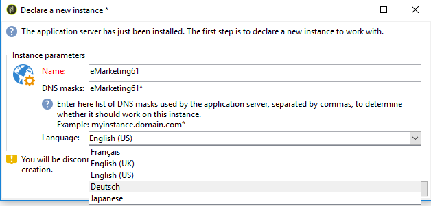

# Espacio de trabajo de Adobe Campaign{#adobe-campaign-workspace}

## Explore la interfaz de Adobe Campaign {#about-adobe-campaign-interface}

Una vez que esté conectado a la base de datos, accederá a la página principal de Adobe Campaign, que es un panel de control compuesto por vínculos y accesos directos que permiten acceder a las funcionalidades, según la instalación y las configuraciones de la plataforma general.

Desde la sección central de la página principal, puede utilizar vínculos para acceder al portal de documentación en línea de Campaign, al foro y al sitio web de soporte técnico.

 Descubra el espacio de trabajo de Campaign en [el vídeo](#video)

>[!NOTE]
>
>Las funcionalidades de Adobe Campaign disponibles en su instancia dependen de los módulos y complementos instalados. Algunos de ellos pueden no estar disponibles, dependiendo de los permisos y configuraciones específicas.
>
>Antes de instalar cualquier módulo o complemento, debe comprobar el acuerdo de licencia o ponerse en contacto con el ejecutivo de cuenta de Adobe.

### Acceso a la consola y a la web {#console-and-web-access}

La plataforma de Adobe Campaign es accesible a través de una consola o a través de un explorador de Internet. Consulte los exploradores compatibles en la [matriz de compatibilidad](../../rn/using/compatibility-matrix.md#Browsers).

La interfaz de acceso web es similar a la interfaz de la consola. Desde un explorador, puede utilizar las mismas funciones de navegación y visualización que en la consola, pero solo puede realizar un conjunto reducido de acciones en las campañas. Por ejemplo, puede ver y cancelar campañas, pero no puede modificarlas. Para un operador determinado, una campaña se mostrará con las siguientes opciones en la consola:

Mientras que con el acceso web, las opciones permiten principalmente la visualización de:

Más información sobre el [uso de la interfaz web](../../campaign/using/accessing-marketing-campaigns.md#using-the-web-interface-).

### Idiomas {#languages}

El idioma se selecciona al instalar la instancia de Adobe Campaign Classic.

Puede elegir entre cinco idiomas diferentes:

* Inglés (RU)
* Inglés (EE. UU.)
* Francés
* Alemán
* Japonés

El idioma elegido para la instancia de Adobe Campaign Classic puede afectar los formatos de fecha y hora. Para obtener más información, consulte la [documentación de Campaign v8 (consola)](https://experienceleague.adobe.com/es/docs/campaign/campaign-v8/new/campaign-ui){target=_blank}.

Para obtener más información sobre cómo crear una instancia, consulte esta [página](../../installation/using/creating-an-instance-and-logging-on.md).

>[!CAUTION]
>
>No se puede cambiar el idioma después de la creación de la instancia.

## Conceptos básicos de navegación {#navigation-basics}

### Examen de páginas {#browsing-pages}

Las distintas funcionalidades de la plataforma se dividen en funcionalidades principales (utilice los vínculos que ve en la sección superior de la interfaz para acceder a ellas).

La lista de funcionalidades principales a las que puede acceder depende de los paquetes y complementos instalados y de los derechos de acceso.

Cada funcionalidad incluye un conjunto de funcionalidades basadas en las necesidades relacionadas con tareas y en el contexto de uso. Por ejemplo, el vínculo **[!UICONTROL Profiles and targets]** le lleva a las listas de destinatarios, los servicios de suscripción, los flujos de trabajo de objetivos existentes y los accesos directos para crear estos elementos.

Las listas están disponibles a través del vínculo **[!UICONTROL Lists]** en la sección izquierda de la interfaz **[!UICONTROL Profiles and Targets]**.

### Uso de pestañas {#using-tabs}

* Al hacer clic en una funcionalidad principal o en un vínculo, la página correspondiente reemplaza a la página actual. Para volver a la página anterior, haga clic en el botón **[!UICONTROL Back]** de la barra de herramientas. Para volver a la página principal, haga clic en el botón **[!UICONTROL Home]**.

  

* En el caso de un menú o acceso directo a una pantalla de visualización (como una aplicación web, programa, entrega, informe, etc.), la página coincidente se muestra en otra pestaña. Esto permite navegar desde una página a otra mediante las pestañas.

  

### Creación de un elemento {#creating-an-element}

Cada sección de la funcionalidad principal le permite navegar entre los elementos disponibles. Para ello, utilice los accesos directos de la sección **[!UICONTROL Browsing]**. El vínculo **[!UICONTROL Other choices]** le permite acceder a todas las demás páginas, independientemente del entorno.

Puede crear un nuevo elemento (envío, aplicación web, flujo de trabajo, etc.) utilizando los accesos directos de la sección **[!UICONTROL Create]** a la izquierda de la pantalla. Utilice el botón **[!UICONTROL Create]** situado encima de la lista para añadir nuevos elementos a la lista.

Por ejemplo, en la página de entrega, utilice el botón **[!UICONTROL Create]** para crear una nueva entrega.

## Uso de Adobe Campaign Explorer {#using-adobe-campaign-explorer}

Es posible acceder a Adobe Campaign Explorer mediante el icono de la barra de herramientas. Le permite acceder a todas las funcionalidades de Adobe Campaign, a las pantallas de configuración y a una vista más detallada de algunos de los elementos de la plataforma.

Para obtener más información sobre el explorador de Adobe Campaign, consulte estas páginas en la documentación de Campaign v8 (consola):

* [Descripción general de la interfaz de usuario de Campaign](https://experienceleague.adobe.com/es/docs/campaign/campaign-v8/new/campaign-ui#ac-explorer-ui){target=_blank}

* [Configuración de la interfaz de usuario de Campaign](https://experienceleague.adobe.com/es/docs/campaign/campaign-v8/config/configuration/ui-settings){target=_blank}

* [Administrar carpetas y vistas en el explorador](https://experienceleague.adobe.com/es/docs/campaign/campaign-v8/config/configuration/folders-and-views){target=_blank}.

## Trabajo con listas {#manage-and-customize-lists}

En la consola del cliente de Campaign, los datos se muestran en listas. Puede adaptar estas listas a sus necesidades. Por ejemplo, puede añadir columnas, filtrar datos, contar registros, y guardar y compartir su configuración.

>[!NOTE]
>
>Para aprender a administrar y personalizar listas en Adobe Campaign, consulte la [documentación de Campaign v8 (consola)](https://experienceleague.adobe.com/es/docs/campaign/campaign-v8/config/configuration/ui-settings#customize-lists){target=_blank}.

## Administración de enumeraciones{#managing-enumerations}

Una lista desglosada (también denominada lista detallada) es una lista predefinida de valores que se pueden utilizar para rellenar determinados campos. Las listas desglosadas ayudan a estandarizar los valores de campo, lo que hace que la entrada de datos sea más coherente y simplifica las consultas.

Cuando se definen, los valores se muestran en una lista desplegable. Puede seleccionar un valor directamente o introducirlo mediante una entrada predictiva, que sugiere y completa entradas coincidentes. Algunos campos incluyen listas desglosadas predefinidas y se pueden crear listas desglosadas adicionales si es necesario.

Obtenga más información sobre cómo **trabajar con listas desglosadas** en la [documentación de la versión 8 de Adobe Campaign (consola)](https://experienceleague.adobe.com/es/docs/campaign/campaign-v8/config/settings/enumerations){target=_blank}.

## Tutorial en vídeo {#video}

Este vídeo presenta el espacio de trabajo de Campaign Classic.

>[!VIDEO](https://video.tv.adobe.com/v/35130?quality=12)
