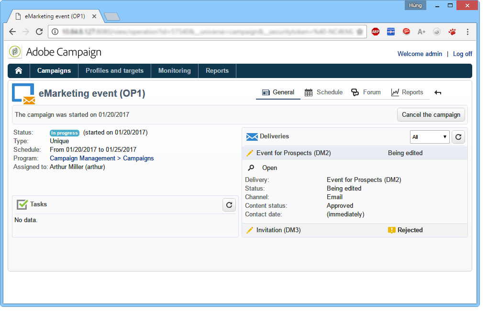

# Espacio de trabajo de Adobe Campaign {#adobe-campaign-workspace}

## Explore la interfaz de Adobe Campaign {#about-adobe-campaign-interface}

Una vez que esté conectado a la base de datos, acceda a la página de inicio de Adobe Campaign. Esta página es su panel: se compone de vínculos y accesos directos que le permiten acceder a las funcionalidades, según la instalación y las configuraciones de la plataforma general.

Desde la sección central de la página de inicio, puede utilizar vínculos para acceder al portal de documentación de Campaign, a la comunidad y al sitio web del servicio de atención al cliente.

 Descubra el espacio de trabajo de Campaign en [el vídeo](#video)

>[!NOTE]
>
>Las funcionalidades de Adobe Campaign disponibles en su instancia dependen de los módulos y complementos instalados. Algunos de ellos pueden no estar disponibles, dependiendo de los permisos y configuraciones específicas.
>
>Antes de instalar cualquier módulo o complemento, debe comprobar el acuerdo de licencia o ponerse en contacto con el ejecutivo de cuenta de Adobe.

### Acceso a la consola y a la web {#console-and-web-access}

La plataforma de Adobe Campaign es accesible a través de una consola o a través de un explorador de Internet. Consulte los exploradores compatibles en la [matriz de compatibilidad](../../rn/using/compatibility-matrix.md#Browsers).

La interfaz de acceso web es similar a la interfaz de la consola. Desde un explorador, puede utilizar las mismas funciones de navegación y visualización que en la consola, pero solo puede realizar un conjunto reducido de acciones en las campañas. Por ejemplo, puede ver y cancelar campañas, pero no puede modificarlas. Para un operador determinado, una campaña se mostrará con las siguientes opciones en la consola:

Mientras que con el acceso web, las opciones permiten principalmente la visualización de:

Obtenga más información sobre el uso de la interfaz web en la [documentación de la versión 8 de Campaign](https://experienceleague.adobe.com/docs/campaign/automation/campaign-orchestration/marketing-campaign-create.html?lang=es#use-the-web-interface-){target=_blank}.

### Idiomas {#languages}

El idioma se selecciona al instalar la instancia de Adobe Campaign Classic.

Puede elegir entre estos idiomas:

* Inglés (RU)
* Inglés (EE. UU.)
* Francés
* Alemán
* Japonés

El idioma elegido para la instancia de Adobe Campaign Classic puede afectar los formatos de fecha y hora. Para obtener más información, consulte la [documentación de Campaign v8 (consola)](https://experienceleague.adobe.com/es/docs/campaign/campaign-v8/new/campaign-ui){target=_blank}.

Para obtener más información sobre cómo crear una instancia, consulte esta [página](../../installation/using/creating-an-instance-and-logging-on.md).

>[!CAUTION]
>
>No se puede cambiar el idioma después de la creación de la instancia.

## Conceptos básicos de navegación {#navigation-basics}

Las distintas funcionalidades de la plataforma se dividen en funcionalidades principales (utilice los vínculos que ve en la sección superior de la interfaz para acceder a ellas).

La lista de funcionalidades principales a las que puede acceder depende de los paquetes y complementos instalados y de los derechos de acceso.

### Examen de páginas {#browsing-pages}

Cada funcionalidad incluye un conjunto de funcionalidades basadas en las necesidades relacionadas con tareas y en el contexto de uso. Por ejemplo, el vínculo **[!UICONTROL Profiles and targets]** le lleva a las listas de destinatarios, los servicios de suscripción, los flujos de trabajo de objetivos existentes y los accesos directos para crear estos elementos.

Las listas están disponibles a través del vínculo **[!UICONTROL Lists]** en la sección izquierda de la interfaz **[!UICONTROL Profiles and Targets]**.

### Uso de pestañas {#using-tabs}

* Al hacer clic en una funcionalidad principal o en un vínculo, la página correspondiente reemplaza a la página actual. Para volver a la página anterior, haga clic en el botón **[!UICONTROL Back]** de la barra de herramientas. Para volver a la página principal, haga clic en el botón **[!UICONTROL Home]**.

  

* En el caso de un menú o acceso directo a una pantalla de visualización (como una aplicación web, programa, entrega, informe, etc.), la página coincidente se muestra en otra pestaña. Esto permite navegar desde una página a otra mediante las pestañas.

  

### Creación de un elemento {#creating-an-element}

Cada sección de la funcionalidad principal le permite navegar entre los elementos disponibles. Para ello, utilice los accesos directos de la sección **[!UICONTROL Browsing]**. El vínculo **[!UICONTROL Other choices]** le permite acceder a todas las demás páginas, independientemente del entorno.

Puede crear un nuevo elemento (envío, aplicación web, flujo de trabajo, etc.) utilizando los accesos directos de la sección **[!UICONTROL Create]** a la izquierda de la pantalla. Utilice el botón **[!UICONTROL Create]** situado encima de la lista para añadir nuevos elementos a la lista.

Por ejemplo, en la página de entrega, utilice el botón **[!UICONTROL Create]** para crear una nueva entrega.

## Uso de Adobe Campaign Explorer {#using-adobe-campaign-explorer}

Es posible acceder a Adobe Campaign Explorer mediante el icono de la barra de herramientas. Le permite acceder a todas las funcionalidades de Adobe Campaign, a las pantallas de configuración y a una vista más detallada de algunos de los elementos de la plataforma.

Para obtener más información sobre el explorador de Adobe Campaign, consulte estas páginas en la **documentación de Campaign v8 (consola)**:

* [Información general sobre la interfaz de usuario de Campaign](https://experienceleague.adobe.com/es/docs/campaign/campaign-v8/new/campaign-ui){target=_blank}

* [Configuración de la interfaz de usuario de Campaign](https://experienceleague.adobe.com/es/docs/campaign/campaign-v8/config/configuration/ui-settings){target=_blank}

* [Administración de carpetas y vistas en el explorador](https://experienceleague.adobe.com/es/docs/campaign/campaign-v8/config/configuration/folders-and-views){target=_blank}

## Trabajo con datos {#work-with-data}

### Filtrado de datos {#filters}

El filtrado de datos es el proceso de reducir un conjunto de datos a solo los registros que cumplen criterios específicos. A continuación, este subconjunto se puede utilizar para acciones segmentadas (como por ejemplo, actualizaciones o creación de públicos) o para el análisis.

Al navegar por Campaign, los datos se muestran en listas. Puede aplicar filtros integrados para acceder rápidamente a un subconjunto definido, como direcciones en cuarentena, destinatarios sin objetivo o registros dentro de un intervalo de edad o fecha de creación específicos. Además, puede crear filtros personalizados, guardarlos para usarlos en el futuro y compartirlos con otros usuarios de Campaign.

Aprenda a **acceder, diseñar y compartir filtros** en la [documentación de Campaign v8 (consola)](https://experienceleague.adobe.com/es/docs/campaign/campaign-v8/audience/create-filters){target=_blank}.

### Consultar la base de datos{#about-queries-in-campaign}

La herramienta de consulta está disponible en varios niveles de la aplicación y se puede utilizar para definir las poblaciones de público destinatario, segmentar clientes, extraer y filtrar registros de seguimiento, crear filtros, etc.

+++Acerca del editor de consultas genérico

Proporciona un asistente dedicado (el editor de consultas genérico) accesible desde el menú **[!UICONTROL Tools > Generic query editor...]**. Este editor permite que las consultas de base de datos extraigan, organicen, agrupen y ordenen la información. Por ejemplo, puede recuperar los destinatarios que hicieron clic más de n veces en un vínculo de Newsletter durante un periodo determinado.

El editor de consultas genérico centraliza todas las funcionalidades de consulta. Permite crear y almacenar filtros de restricción, que luego se pueden reutilizar en otros contextos, como el cuadro de consulta de un flujo de trabajo de segmentación.

+++

>[!BEGINTABS]

>[!TAB Consulta de la base de datos]

Los pasos para crear una consulta se detallan en la **[documentación de Campaign v8 (consola)](https://experienceleague.adobe.com/es/docs/campaign/campaign-v8/data/query/query-editor){target=_blank}**

{target=_blank}

>[!TAB Añadir una consulta en un flujo de trabajo]

Conozca los pasos clave relacionados con la creación de consultas en el contexto de un flujo de trabajo en la **[documentación de Campaign v8](https://experienceleague.adobe.com/es/docs/campaign/automation/workflows/wf-activities/targeting-activities/query){target=_blank}**

{target=_blank}

>[!TAB Condiciones de filtro]

Para diseñar la consulta, debe seleccionar las condiciones de filtrado en el editor de consultas. Las funcionalidades disponibles y los casos de uso se detallan en la **[documentación de Campaign v8](https://experienceleague.adobe.com/es/docs/campaign/campaign-v8/data/query/filter-conditions){target=_blank}**

{target=_blank}

>[!ENDTABS]

### Administración de listas {#manage-and-customize-lists}

En la consola del cliente de Campaign, los datos se muestran en listas. Puede adaptar estas listas a sus necesidades. Por ejemplo, puede añadir columnas, filtrar datos, contar registros, y guardar y compartir su configuración.

Obtenga información sobre cómo **administrar y personalizar listas** en la [documentación de Campaign v8 (consola)](https://experienceleague.adobe.com/es/docs/campaign/campaign-v8/config/configuration/ui-settings#customize-lists){target=_blank}.

### Administración de enumeraciones{#managing-enumerations}

Una lista desglosada (también denominada lista detallada) es una lista predefinida de valores que se pueden utilizar para rellenar determinados campos. Las listas desglosadas ayudan a estandarizar los valores de campo, lo que hace que la entrada de datos sea más coherente y simplifica las consultas.

Cuando se definen, los valores se muestran en una lista desplegable. Puede seleccionar un valor directamente o introducirlo mediante una entrada predictiva, que sugiere y completa entradas coincidentes. Algunos campos incluyen listas desglosadas predefinidas y se pueden crear listas desglosadas adicionales si es necesario.

Obtenga más información sobre cómo **trabajar con listas desglosadas** en la [documentación de Adobe Campaign v8 (consola)](https://experienceleague.adobe.com/es/docs/campaign/campaign-v8/config/settings/enumerations){target=_blank}.

## Tutorial en vídeo {#video}

Este vídeo presenta el espacio de trabajo de Campaign Classic.

>[!VIDEO](https://video.tv.adobe.com/v/35130?quality=12)
