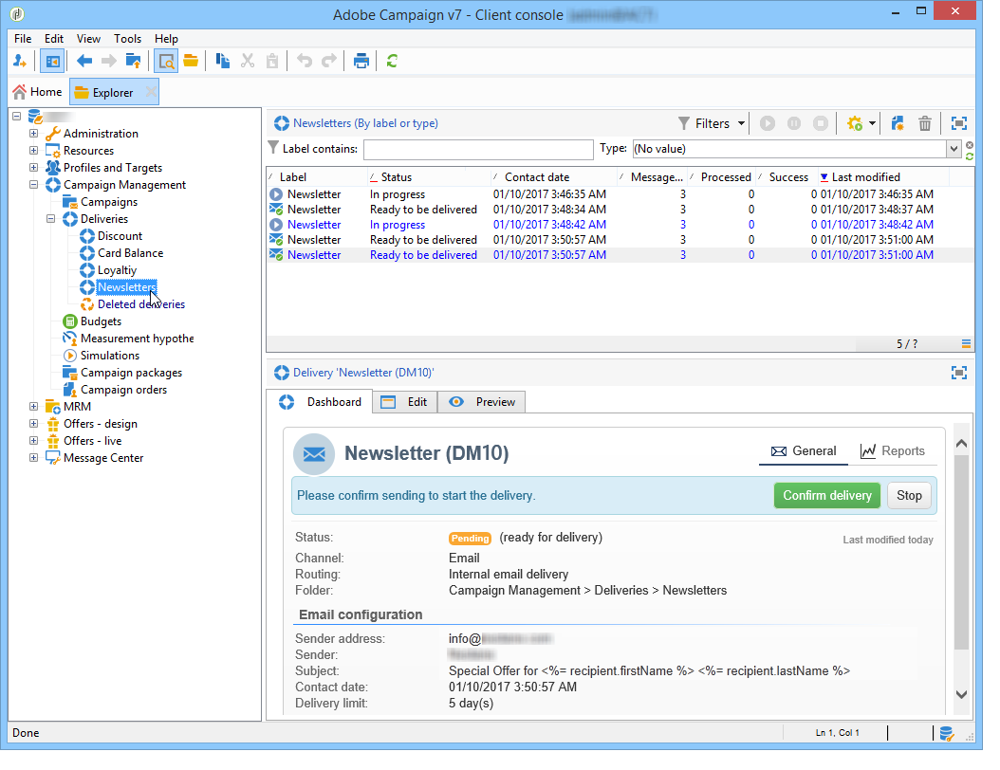
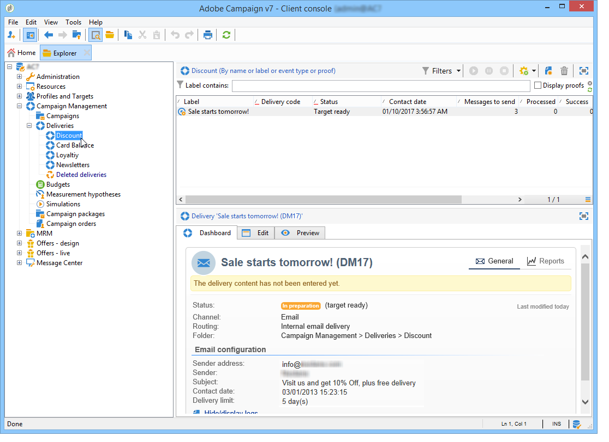

# Espacio de trabajo de Adobe Campaign{#adobe-campaign-workspace}

## Exploración de la interfaz de Adobe Campaign {#about-adobe-campaign-interface}

Una vez que esté conectado a la base de datos, accederá a la página principal de Adobe Campaign, que es un panel compuesto por vínculos y accesos directos que permiten acceder a las funcionalidades, según la instalación y las configuraciones de la plataforma general.

Desde la sección central de la página principal, puede utilizar vínculos para acceder al portal de documentación en línea de Campaign, al foro y al sitio web de soporte técnico.

 Descubra el espacio de trabajo de Campaign en [el vídeo](#video)

>[!NOTE]
>
>Las funcionalidades de Adobe Campaign disponibles en su instancia dependen de los módulos y complementos instalados. Algunos de ellos pueden no estar disponibles, dependiendo de los permisos y configuraciones específicas.
>
>Antes de instalar cualquier módulo o complemento, debe comprobar el acuerdo de licencia o ponerse en contacto con el ejecutivo de cuenta de Adobe.

### Acceso a la consola y a la web {#console-and-web-access}

La plataforma de Adobe Campaign es accesible a través de una consola o a través de un explorador de Internet.

El acceso web proporciona una interfaz similar a la consola pero con un conjunto reducido de funcionalidades.

Por ejemplo, para un operador determinado, una campaña se mostrará con las siguientes opciones en la consola:

Mientras que con el acceso web, las opciones permiten principalmente la visualización de:

### Idiomas {#languages}

El idioma se selecciona al instalar la instancia de Adobe Campaign Classic.

Puede elegir entre cinco idiomas diferentes:

* Inglés (RU)
* Inglés (EE. UU.)
* Francés
* Alemán
* Japonés

El idioma elegido para la instancia de Adobe Campaign Classic puede afectar los formatos de fecha y hora. Para obtener más información, consulte [esta sección](../../platform/using/adobe-campaign-workspace.md#date-and-time).

Para obtener más información sobre cómo crear una instancia, consulte esta [página](../../installation/using/creating-an-instance-and-logging-on.md).

>[!CAUTION]
>
>No se puede cambiar el idioma después de la creación de la instancia.

## Conceptos básicos de navegación {#navigation-basics}

### Exploración de páginas {#browsing-pages}

Las distintas funcionalidades de la plataforma se dividen en funcionalidades principales (utilice los vínculos que ve en la sección superior de la interfaz para acceder a ellas).

La lista de funcionalidades principales a las que puede acceder depende de los paquetes y complementos instalados y de los derechos de acceso.

Cada funcionalidad incluye un conjunto de funcionalidades basadas en las necesidades relacionadas con tareas y en el contexto de uso. Por ejemplo, el vínculo **[!UICONTROL Profiles and targets]** le lleva a las listas de destinatarios, los servicios de suscripción, los flujos de trabajo de objetivos existentes y los accesos directos para crear estos elementos.

Las listas están disponibles a través del vínculo **[!UICONTROL Lists]** en la sección izquierda de la interfaz **[!UICONTROL Profiles and Targets]**.

### Uso de pestañas {#using-tabs}

* Al hacer clic en una funcionalidad principal o en un vínculo, la página relevante reemplaza a la página actual. Para volver a la página anterior, haga clic en el botón **[!UICONTROL Back]** de la barra de herramientas. Para volver a la página principal, haga clic en el botón **[!UICONTROL Home]**.

   

* En el caso de un menú o acceso directo a una pantalla de visualización (como una aplicación web, programa, entrega, informe, etc.), la página coincidente se muestra en otra pestaña. Esto permite navegar desde una página a otra mediante las pestañas.

   

### Crear un elemento {#creating-an-element}

Cada sección de la funcionalidad principal le permite navegar entre los elementos disponibles. Para ello, utilice los accesos directos de la sección **[!UICONTROL Browsing]**. El vínculo **[!UICONTROL Other choices]** le permite acceder a todas las demás páginas, independientemente del entorno.

Puede crear un nuevo elemento (envío, aplicación web, flujo de trabajo, etc.) mediante los accesos directos en la sección **[!UICONTROL Create]** que se encuentra a la izquierda de la pantalla. Utilice el botón **[!UICONTROL Create]** situado encima de la lista para añadir nuevos elementos a la lista.

Por ejemplo, en la página de entrega, utilice el botón **[!UICONTROL Create]** para crear una nueva entrega.

## Uso del explorador de Adobe Campaign {#using-adobe-campaign-explorer}

### Acerca del explorador de Adobe Campaign {#about-adobe-campaign-explorer}

Es posible acceder al explorador de Adobe Campaign mediante el icono de la barra de herramientas. Le permite acceder a todas las funcionalidades de Adobe Campaign, a las pantallas de configuración y a una vista más detallada de algunos de los elementos de la plataforma.

El espacio de trabajo de **[!UICONTROL Explorer]** se divide en tres zonas:

**1 - Árbol**: Puede personalizar el contenido del árbol (añadir, mover o eliminar nodos). Este procedimiento está diseñado para usuarios expertos. Para obtener más información, consulte [esta página](../../configuration/using/about-navigation-hierarchy.md).

**2 - Lista**: Puede filtrar esta lista, ejecutar búsquedas, añadir información u ordenar datos.

**3 - Detalles**: Puede mostrar los detalles del elemento seleccionado. El icono de la sección superior derecha le permite mostrar esta información en formato de pantalla completa.

### Resolución de la pantalla {#screen-resolution}

Para conseguir la mejor navegación y una gran facilidad de uso, Adobe recomienda utilizar una resolución de pantalla mínima de 1600x900 píxeles.

>[!CAUTION]
>
>Adobe Campaign podría no admitir resoluciones inferiores a 1600x900 píxeles.

En el espacio de trabajo del **[!UICONTROL Explorer]**, si algunas partes de la zona de **[!UICONTROL Details]** aparecen truncadas, puede expandirlas utilizando la flecha situada en la parte superior de la zona o haciendo clic en el botón **[!UICONTROL Enlarge]**.

### Búsqueda en listas {#browsing-lists}

Para examinar una lista, puede utilizar **las barras de desplazamiento** (horizontal y vertical) para desplazarse por ella sin cambiar la selección del registro, **la rueda del ratón** o **las teclas de flecha**.

>[!NOTE]
>
>La configuración y personalización del contenido de la lista se presentan en [Configuración de listas](#configuring-lists).
>
>También puede ordenar y filtrar datos. Consulte las [Opciones de filtrado](../../platform/using/filtering-options.md).

### Conteo de registros {#counting-records}

De forma predeterminada, Adobe Campaign carga los 200 primeros registros de una lista. Esto significa que la vista no muestra necesariamente todos los registros de la tabla que está viendo. Puede ejecutar un recuento del número de registros en la lista y cargar más registros.

En la parte inferior derecha de la pantalla de la lista, un **[!UICONTROL counter]** muestra cuántos registros se han cargado y la cantidad total de registros en la base de datos (después de aplicar los filtros):

Si aparece un &quot;**?**&quot; en lugar del número a la derecha, haga clic en el contador para iniciar el cálculo.

### Cargar más registros {#loading-more-records}

Para cargar (y mostrar) registros adicionales (200 líneas por defecto), haga clic en **[!UICONTROL Continue loading]**.

Para cargar todos los registros, haga clic con el botón derecho en la lista y seleccione **[!UICONTROL Load all]**.

>[!CAUTION]
>
>En función del número de registros, el tiempo de carga de la lista completa puede ser largo.

### Cambiar el número predeterminado de registros {#change-default-number-of-records}

Para cambiar el número predeterminado de registros cargados, haga clic en **[!UICONTROL Configure list]** en la esquina inferior derecha de la lista.

En la ventana de configuración de la lista, haga clic en “Parámetros avanzados” (abajo a la izquierda) y cambie el número de líneas que desea recuperar.

## Configuración de listas {#configuring-lists}

### Insertar columnas {#add-columns}

Existen dos formas de añadir una columna en la lista.

Puede añadir rápidamente una columna a una lista desde el detalle de un registro. Para ello:

1. Desde una pantalla de detalles, haga clic con el botón derecho en el campo que desee mostrar en una columna.
1. Seleccione **[!UICONTROL Add in the list]**.

   La columna se añade a la derecha de las columnas existentes.

Otra forma de añadir columnas, por ejemplo, si desea mostrar datos que no se muestran en la pantalla de detalles, es utilizar la ventana de configuración de lista. Para ello:

1. Haga clic en **[!UICONTROL Configure list]** que aparece a la derecha de la lista.

   

1. En la ventana de configuración de la lista, haga doble clic en el campo que se añadirá en la lista de **[!UICONTROL Available fields]** para añadirlos a las **[!UICONTROL Output columns]**.

   

   >[!NOTE]
   >
   >De forma predeterminada, no se muestran los campos avanzados. Para mostrarlos, haga clic en **Display advanced fields** a la derecha de la lista de campos disponibles.
   >
   >Las etiquetas se muestran por tabla y luego en orden alfabético.
   >
   >Utilice el campo **Search** para realizar una búsqueda en los campos disponibles. Para obtener más información, consulte [Ordenar una lista](#sorting-a-list).
   >
   >Los campos se identifican mediante iconos específicos: Campos SQL, tablas vinculadas, campos calculados, etc. La descripción de cada campo seleccionado se muestra en la lista de campos disponibles. [Configuración de listas](#configuring-lists).
   >
   >También puede ordenar y filtrar datos. Consulte las [Opciones de filtrado](../../platform/using/filtering-options.md).

1. Repita el proceso para cada columna que desee visualizar.
1. Utilice las flechas para modificar el **orden de visualización**. La columna más alta estará a la izquierda en la lista de registros.

   

1. Si lo necesita, puede hacer clic en **[!UICONTROL Distribution of values]** para ver cómo se reparten los valores del campo seleccionado en la carpeta actual.

   

1. Haga clic en **[!UICONTROL OK]** para confirmar la configuración y mostrar el resultado.

### Crear una columna nueva {#create-a-new-column}

Puede crear nuevas columnas para mostrar campos adicionales en la lista. Para ello:

1. Haga clic en **[!UICONTROL Configure the list]** en la parte inferior derecha de la lista.
1. Haga clic en **[!UICONTROL Add]** para mostrar un nuevo campo en la lista.

### Eliminar una columna {#remove-a-column}

Puede ocultar una o varias columnas de una lista de registros usando la función **[!UICONTROL Configure list]** situada en la parte inferior derecha de la lista.

En la ventana de configuración de la lista, seleccione la columna que desea ocultar en la zona de **[!UICONTROL Output columns]** y haga clic en el botón eliminar.

Repita el proceso para cada columna que quiera ocultar. Haga clic en **[!UICONTROL OK]** para confirmar la configuración y mostrar el resultado.

### Ajustar el ancho de las columnas {#adjust-column-width}

Cuando una lista está activa, es decir, cuando se selecciona al menos una línea, puede utilizar F9 para ajustar el ancho de las columnas de modo que todas las columnas se puedan mostrar en pantalla.

### Mostrar registros de subcarpetas {#display-sub-folders-records}

Las listas pueden mostrar:

* Tanto los registros contenidos solo en la carpeta seleccionada,
* como los registros de la carpeta seleccionada y sus subcarpetas.

Para cambiar de un modo de visualización a otro, haga clic en **[!UICONTROL Display sub-levels]** en la barra de herramientas.

### Guardar una configuración de lista {#saving-a-list-configuration}

Las configuraciones de la lista se definen localmente en el nivel de la estación de trabajo. Cuando se borra la memoria caché local, las configuraciones locales se desactivan.

De forma predeterminada, los parámetros de visualización definidos se aplican a todas las listas con el tipo de carpeta correspondiente. Por lo tanto, cuando modifique cómo se muestra la lista de destinatarios desde una carpeta, esta configuración se aplicará a todas las otras carpetas de destinatarios.

No obstante, es posible guardar más de una configuración para aplicarla a distintas carpetas del mismo tipo. La configuración se guarda con las propiedades de la carpeta que contienen los datos y se puede volver a aplicar.

Por ejemplo, para una carpeta de entrega es posible configurar la siguiente visualización:

Para guardar esta configuración de lista de forma que pueda reutilizarse, siga estos pasos:

1. Haga clic con el botón derecho en la carpeta que contiene los datos mostrados.
1. Seleccione **[!UICONTROL Properties]**.
1. Haga clic en **[!UICONTROL Advanced settings]** y, a continuación, especifique un nombre en el campo **[!UICONTROL Configuration]**.

   

1. Haga clic en **[!UICONTROL OK]** y luego en **[!UICONTROL Save]**.

A continuación, puede aplicar esta configuración a otra carpeta de **entrega**:

Haga clic en **[!UICONTROL Save]** en la ventana de propiedades de la carpeta. La visualización de la lista se modifica para que coincida con la configuración especificada:

## Exportación de una lista {#exporting-a-list}

Para exportar datos de una lista, debe utilizar un asistente para exportar. Para acceder a él, seleccione los elementos que desea exportar de la lista, haga clic con el botón derecho del ratón y seleccione **[!UICONTROL Export...]**.

El uso de las funciones de importación y exportación se explica en [Importaciones y exportaciones genéricas](../../platform/using/about-generic-imports-exports.md).

>[!CAUTION]
>
>Los elementos de una lista no se deben exportar mediante la función Copiar/Pegar.

## Clasificación de una lista {#sorting-a-list}

Las listas pueden contener una gran cantidad de datos. Puede clasificar estos datos o aplicar filtros simples o avanzados. La clasificación le permite mostrar los datos en orden ascendente o descendente. Los filtros permiten definir y combinar criterios para mostrar solo los datos seleccionados.

Haga clic en el encabezado de la columna para aplicar un orden ascendente o descendente, o para cancelar la clasificación de datos. El estado de clasificación activo y el orden de clasificación se indican mediante una flecha azul antes de la etiqueta de columna. Un guion rojo antes de la etiqueta de columna significa que la ordenación se aplica a los datos indexados de la base de datos. Este método de clasificación se utiliza para optimizar los trabajos de ordenación.

También puede configurar la ordenación o combinar criterios de clasificación. Para realizar esto, siga los pasos a continuación:

1. Haga clic en **[!UICONTROL Configure list]** en la parte inferior derecha de la lista.

   

1. En la ventana de configuración de la lista, haga clic en la pestaña **[!UICONTROL Sorting]**.
1. Seleccione los campos que desea ordenar y la dirección de clasificación (ascendente o descendente).

   

1. La prioridad de ordenación se define mediante el orden de las columnas de clasificación. Para cambiar la prioridad, utilice los iconos adecuados para cambiar el orden de las columnas.

   

   La prioridad de ordenación no afecta a la visualización de las columnas de la lista.

1. Haga clic en **[!UICONTROL Ok]** para confirmar esta configuración y mostrar el resultado en la lista.

### Búsqueda de elementos {#running-a-search}

Puede ejecutar una búsqueda de los campos disponibles en un editor utilizando el campo **[!UICONTROL Search]** situado encima de la lista de campos. Presione **Enter** en el teclado o busque en la lista. Los campos que coincidan con la búsqueda tendrán etiquetas en negrita.

>[!NOTE]
>
>Puede crear filtros para mostrar solo algunos de los datos de una lista. Consulte [Creación de filtros](../../platform/using/creating-filters.md).

## Formatos y unidades {#formats-and-units}

### Fecha y hora {#date-and-time}

El idioma de la instancia de Adobe Campaign Classic afecta los formatos de fecha y hora.

El idioma se selecciona al instalar Campaign y no se puede modificar posteriormente. Puede seleccionar: Inglés (EE.UU.), inglés (EN), francés, alemán o japonés. Para obtener más información, consulte [esta página](../../installation/using/creating-an-instance-and-logging-on.md).

Las principales diferencias entre el inglés de EE. UU. y el inglés de Reino Unido son:

<table> 
 <thead> 
  <tr> 
   <th> Formato  </th> 
   <th> Inglés (EE. UU.)  </th> 
   <th> Inglés (EN)  </th> 
  </tr> 
 </thead> 
 <tbody> 
  <tr> 
   <td> Fecha  </td> 
   <td> La semana empieza el domingo  </td> 
   <td> La semana empieza el lunes  </td> 
  </tr> 
  <tr> 
   <td> Fecha corta  </td> 
   <td> 
%2M%2D/%4Y

<strong>ex: 25/09/2018</strong>
 </td> 
   <td> 
%2D/%2M/%4Y

<strong>ex: 25/09/2018</strong>
 </td> 
  </tr> 
  <tr> 
   <td> Fecha corta con hora  </td> 
   <td> 
%2M/%2D/%4Y %I:%2N:%2S %P

<strong>ex: 25/09/2018 10:47:25 PM</strong>
 </td> 
   <td> 
%2D/%2M/%4Y %2H:%2N:%2S

<strong>ex: 25/09/2018 22:47:25</strong>
 </td> 
  </tr> 
 </tbody> 
</table>

### Añadir valores en una enumeración {#add-values-in-an-enumeration}

Utilizando los campos de entrada con una lista desplegable, puede introducir un valor de enumeración, que se puede almacenar y, a continuación, ofrecerse como una opción en la lista desplegable. Por ejemplo, en el campo **[!UICONTROL City]** de la ficha **[!UICONTROL General]** de un perfil de destinatario, puede introducir Londres. Cuando presione Introducir para confirmar este valor, aparecerá un mensaje en el que se le preguntará si desea guardar este valor para la enumeración asociada al campo.

Si hace clic en **[!UICONTROL Yes]**, este valor va a estar disponible en el cuadro combinado del campo correspondiente (en este caso **[!UICONTROL London]**).

>[!NOTE]
>
>El administrador gestiona las enumeraciones (también conocidas como “listas desglosadas”) mediante la sección **[!UICONTROL Administration > Platform > Enumerations]** Para obtener más información, consulte [Administración de enumeraciones](../../platform/using/managing-enumerations.md).

### Unidades predeterminadas {#default-units}

En los campos que expresan una duración (por ejemplo, un periodo de validez de los recursos de una entrega, un plazo de aprobación para una tarea, etc.), el valor se puede expresar en las siguientes **unidades**:

* **[!UICONTROL s]** para segundos,
* **[!UICONTROL mn]** para minutos,
* **[!UICONTROL h]** para horas,
* **[!UICONTROL d]** para días.

## Vídeo tutorial {#video}

Este vídeo presenta el espacio de trabajo de Campaign Classic.

>[!VIDEO](https://video.tv.adobe.com/v/35130?quality=12)

Puede encontrar disponibles más vídeos de procedimientos para Campaign Classic [aquí](https://experienceleague.adobe.com/docs/campaign-classic-learn/tutorials/overview.html?lang=es).
