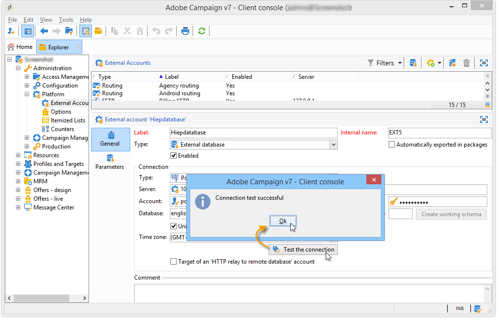

# Conexión a la base de datos {#connecting-to-the-database}

Para activar una conexión con la base de datos externa, debe indicar los parámetros de conexión, es decir, el origen de datos objetivo y el nombre de la tabla con los datos que sea necesario cargar.

>[!CAUTION]
>
>El usuario de Adobe Campaign necesita derechos específicos para la base de datos externa y el servidor de aplicaciones de Adobe Campaign para procesar datos desde una base de datos externa. Para obtener más información sobre esto, consulte la sección Derechos [de acceso a bases de datos](#remote-database-access-rights) remotas.
>
>Para evitar errores de funcionamiento, los operadores que accedan a datos compartidos remotos deben trabajar desde espacios independientes.

## Creación de una conexión compartida {#creating-a-shared-connection}

Para activar una conexión con una base de datos externa compartida, siempre y cuando esta conexión esté activa, se puede acceder a la base de datos a través de Adobe Campaign.

1. The configuration must be defined beforehand via the **[!UICONTROL Administration > Platform > External accounts]** node.
1. Haga clic en el **[!UICONTROL New]** botón y seleccione el **[!UICONTROL External database]** tipo.
1. Define the **[!UICONTROL Connection]** parameters of the external database.

   For connections to an **ODBC** type database the **[!UICONTROL Server]** field must contain the name of the ODBC data source and not the server name. Además, pueden ser necesarias determinadas configuraciones adicionales según las bases de datos utilizadas. Consulte la sección Configuraciones [específicas por tipo](#specific-configurations-by-database-type) de base de datos.

1. Once the parameters are entered, click the **[!UICONTROL Test the connection]** button to approve them.

   

1. If necessary, uncheck the **[!UICONTROL Enabled]** option to disable access to this database without deleting its configuration.
1. Para permitir que Adobe Campaign acceda a esta base de datos, debe implementar las funciones SQL. Haga clic en la **[!UICONTROL Parameters]** ficha y, a continuación, en el **[!UICONTROL Deploy functions]** botón.

   

You can define specific work tablespaces for the tables and for the index in the **[!UICONTROL Parameters]** tab.

## Creación de una conexión temporal {#creating-a-temporary-connection}

Puede definir directamente una conexión con una base de datos externa desde las actividades de flujo de trabajo. En este caso, se trata de una base de datos externa local, reservada para utilizarse dentro de un flujo de trabajo actual: no se guarda en las cuentas externas. Este tipo de conexión puntual se puede crear en diferentes actividades del flujo de trabajo, en particular la **[!UICONTROL Query]**, la **[!UICONTROL Data loading (RDBMS)]**, la **[!UICONTROL Enrichment]** actividad o la **[!UICONTROL Split]** actividad.

>[!CAUTION]
>
>No se recomienda este tipo de configuración, pero puede utilizarse periódicamente para recopilar datos. Sin embargo, debe crear una cuenta externa, como se muestra en la sección [Creación de una conexión compartida](#creating-a-shared-connection).

Por ejemplo, en la actividad de consulta, los pasos para crear una conexión periódica con una base de datos externa son los siguientes:

1. Haga clic en el **[!UICONTROL Add data...]** y seleccione las **[!UICONTROL External data]** opciones.
1. Seleccione la **[!UICONTROL Locally defining the data source]** opción.

   

1. Seleccionar el motor de base de datos de objetivo en la lista desplegable. Introducir el nombre del servidor y especificar los parámetros de autenticación.

   Especificar también el nombre de la base de datos externa.

   

   Haga clic en el botón **[!UICONTROL Next]**.

1. Seleccionar la tabla en la que se almacenan los datos.

   Puede introducir el nombre de la tabla directamente en el campo correspondiente o hacer clic en el icono de edición para acceder a la lista de las tablas de la base de datos.

   

1. Click the **[!UICONTROL Add]** button to define one or several reconciliation fields between the external database data and the data in the Adobe Campaign database. Los **[!UICONTROL Edit expression]** iconos de la tabla **[!UICONTROL Remote field]** y **[!UICONTROL Local field]** le permiten acceder a la lista de campos de cada una de las tablas.

   

1. Si es necesario, especifique una condición de filtrado y el modo de clasificación de datos.
1. Seleccione los datos adicionales que se recopilarán en la base de datos externa. To do this, double click on the fields(s) that you want to add to display them in the **[!UICONTROL Output columns]**.

   

   Haga clic **[!UICONTROL Finish]** para confirmar esta configuración.

## Conexión segura {#secure-connection}

>[!NOTE]
>
>La conexión segura solo está disponible para PostgreSQL.

Puede proteger el acceso a una base de datos externa al configurar una cuenta externa de FDA.

Para ello, añada “**:ssl**” después de la dirección del servidor y dirección del puerto utilizado. Por ejemplo: **192.168.0.52:4501:ssl**.

A continuación, los datos se envían mediante el protocolo SSL seguro.

## Configuraciones adicionales {#additional-configurations}

Si es necesario, puede crear el esquema para procesar datos en una base de datos externa. Del mismo modo, Adobe Campaign permite definir la asignación en los datos de una tabla externa. Estas configuraciones son generales y no se aplican exclusivamente a flujos de trabajo.

>[!NOTE]
>
>Para obtener más información sobre la creación de esquemas en Adobe Campaign y la definición de una nueva asignación de datos, consulte [esta página](../../configuration/using/about-schema-edition.md).