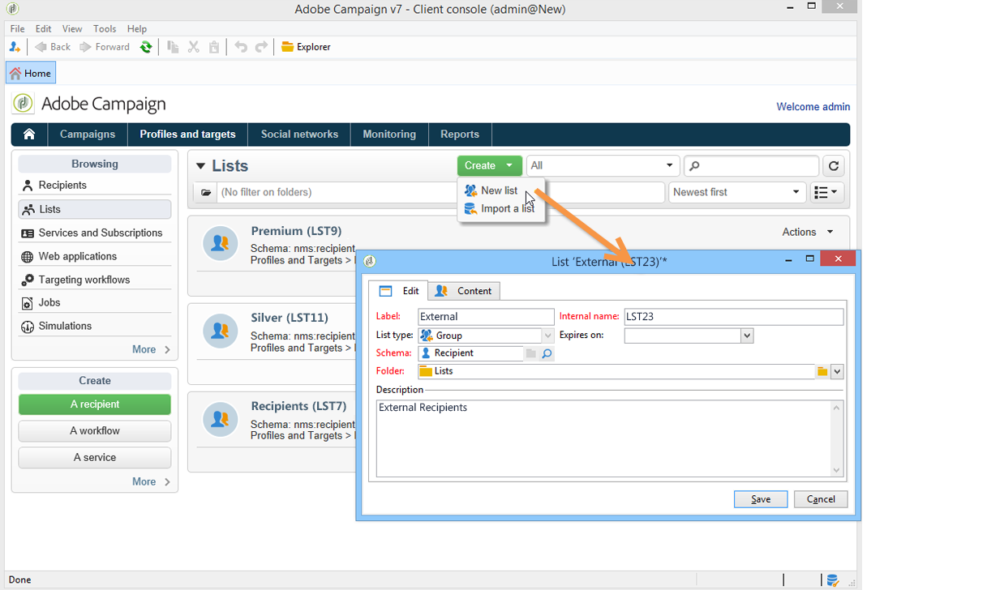
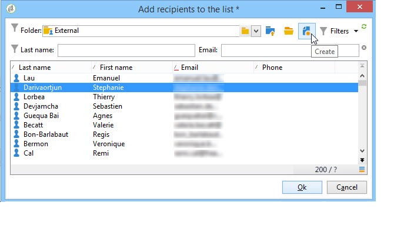

# Creación y administración de listas{#creating-and-managing-lists}

## ¿Qué es una lista? {#about-lists-in-adobe-campaign}

Una lista es un conjunto estático de perfiles que puede centrarse en acciones de envío o actualizarse durante operaciones de importación o durante la ejecución del flujo de trabajo. Por ejemplo, una población extraída de la base de datos mediante una consulta puede proporcionar una lista.

Las listas se crean y administran mediante el vínculo **[!UICONTROL Lists]** en la ficha **[!UICONTROL Profiles and targets]**.

En Adobe Campaign, hay disponibles dos tipos de listas:

* **[!UICONTROL Group]** Tipo: Las listas de tipo **[!UICONTROL Group]** pertenecen a una lista **estática** de personas seleccionadas según criterios específicos. La lista es como una instantánea de un conjunto de perfiles. Tenga en cuenta que no se actualiza automáticamente en caso de que los perfiles se añadan a la base de datos.

   Para obtener más información sobre cómo crear una lista de tipo **[!UICONTROL Group]**, consulte esta [página](#creating-a-profile-list-from-a-group).

* **[!UICONTROL List]** Tipo: Las listas de tipo **[!UICONTROL List]** permiten utilizar flujos de trabajo para crear y administrar listas. Estas serán listas específicas que resultan de las importaciones de datos, las cuales pueden actualizarse a través de la actividad de flujo de trabajo de **[!UICONTROL List update]** dedicada.

   A diferencia de la lista de tipo **[!UICONTROL Group]**, esta lista de tipos se puede actualizar automáticamente con una actividad de **[!UICONTROL Scheduler]** Tenga en cuenta que para ver un ejemplo sobre cómo crear listas de tipo **[!UICONTROL List]**, consulte [esta página](../../workflow/using/list-update.md).

 [Descubra esta función en vídeo](#create-list-video)

## Creación de una lista de perfiles a partir de un grupo {#creating-a-profile-list-from-a-group}

Las listas de tipo **[!UICONTROL Group]** creadas mediante el vínculo **[!UICONTROL Profiles and targets]** se deben basar en la tabla de perfil de Adobe Campaign predeterminada (nms:destinatario).

>[!NOTE]
>
>Para crear listas que contengan otros tipos de datos, debe ejecutar un flujo de trabajo. Por ejemplo: si utiliza una consulta en la tabla del visitante y luego actualiza la lista, puede crear una lista de visitantes. Para obtener más información sobre los flujos de trabajo, consulte [esta sección](../../workflow/using/about-workflows.md).

Para crear una nueva lista de tipo **[!UICONTROL Group]**, siga los siguientes pasos:

1. Haga clic en el botón **[!UICONTROL Create]** y seleccione **[!UICONTROL New list]**.

   

1. Introduzca la información en la ficha **[!UICONTROL Edit]**, en la ventana de creación de lista.

   * Introduzca el nombre de la lista en el campo **[!UICONTROL Label]** y, si es necesario, cambie el nombre interno.
   * Añada una descripción para esta lista.
   * Puede especificar una fecha de caducidad: cuando se llegue a esta fecha, la lista se depura y se elimina automáticamente.

      

1. En la ficha **[!UICONTROL Content]**, haga clic en **[!UICONTROL Add]** para seleccionar los perfiles pertenecientes a la lista.

   

1. Haga clic en **[!UICONTROL Save]** para guardar la lista. A continuación, se añade a la descripción general de las listas.

Puede crear nuevos perfiles directamente desde la ventana Add profiles, haciendo clic en **[!UICONTROL Create]**. El perfil se añadirá a la base de datos.

La lista de perfiles se puede configurar del mismo modo que otras listas. Consulte [esta sección](../../platform/using/adobe-campaign-workspace.md#configuring-lists).

## Vinculación de datos a una lista {#linking-data-to-a-list}

>[!NOTE]
>
>La vinculación de datos a una lista solo se puede realizar con una lista de tipo **[!UICONTROL Group]**.

Los perfiles de un conjunto de perfiles pueden filtrarse y vincularse a una lista. Las acciones de envío pueden enviarse a esta lista, para dirigirse a los perfiles. Para agrupar perfiles:

1. Seleccione los perfiles y haga clic con el botón derecho.
1. Seleccione **[!UICONTROL Actions > Associate selection with a list...]**.

   

1. Seleccione la lista deseada o cree una nueva lista con el botón **[!UICONTROL Create]** y, a continuación, haga clic en **[!UICONTROL Next]**.

   

1. Haga clic en el botón **[!UICONTROL Start]**.

   

La opción **[!UICONTROL Recreate the list]** elimina el contenido anterior de la lista. Este modo está optimizado, ya que no se necesitan consultas para verificar si los perfiles ya están vinculados a la lista.

Si desactiva la opción **[!UICONTROL No trace of this job is saved in the database]**, puede seleccionar (o crear) la carpeta de ejecución en la que se almacenará la información vinculada a este proceso.

La sección superior de la ventana permite controlar la ejecución. El botón **[!UICONTROL Stop]** permite detener el proceso. Los contactos que ya se han procesado se vincularán a la lista.

Puede controlar el proceso mediante la ficha **[!UICONTROL Lists]** en los perfiles que conciernen a esta operación:

También puede editar la lista a través de la página principal de Adobe Campaign: haga clic en el menú **[!UICONTROL Profiles and Targets > Lists]** y seleccione la lista pertinente. La ficha **[!UICONTROL Content]** muestra los perfiles vinculados a esta lista.

## Eliminación de perfiles de una lista {#removing-a-profile-from-a-list}

Para quitar un perfil de una lista, puede:

* Editar la lista, seleccionar el perfil en la ficha **[!UICONTROL Content]** y, a continuación, hacer clic en el icono **[!UICONTROL Delete]**.

   

* Editar el perfil, hacer clic en la ficha **[!UICONTROL List]** y, a continuación, hacer clic en el icono **[!UICONTROL Delete]**.

   

## Eliminación de una lista de perfiles {#deleting-a-list-of-profiles}

Puede eliminar una o varias listas de la lista de grupos del árbol de Adobe Campaign. Para ello, edite el árbol a través del vínculo **[!UICONTROL Advanced > Explorer]** en la página principal de Adobe Campaign. Seleccione el grupo respectivo y haga clic con el botón derecho. Seleccione **[!UICONTROL Delete]**. Un mensaje de advertencia le pedirá que confirme la eliminación.

>[!NOTE]
>
>Cuando se elimina una lista, los perfiles de la lista no se ven afectados; no obstante, los datos del perfil se actualizan.

## Tutorial en vídeo {#create-list-video}

### Cómo crear una lista de destinatarios

Una lista es un conjunto estático de destinatarios que puede centrarse en acciones de envío o actualizarse durante operaciones de importación o durante la ejecución del flujo de trabajo. Una lista de destinatarios también se denomina audiencia.

Aprenda cómo crear una audiencia configurando una lista de destinatarios desde Explorer.

>[!VIDEO](https://video.tv.adobe.com/v/25602/quality=12)

### Cómo utilizar un flujo de trabajo para crear una lista de destinatarios {#create-list-in-a-wf-video}

Aprenda cómo crear un flujo de trabajo con el fin de dirigrse a los destinatarios y cómo volverlo recurrente antes de utilizar la lista en un destinatario de correo electrónico.

>[!VIDEO](https://video.tv.adobe.com/v/25603?quality=12)

Puede encontrar disponibles más vídeos de procedimientos para Campaign Classic [aquí](https://experienceleague.adobe.com/docs/campaign-classic-learn/tutorials/overview.html?lang=es).
