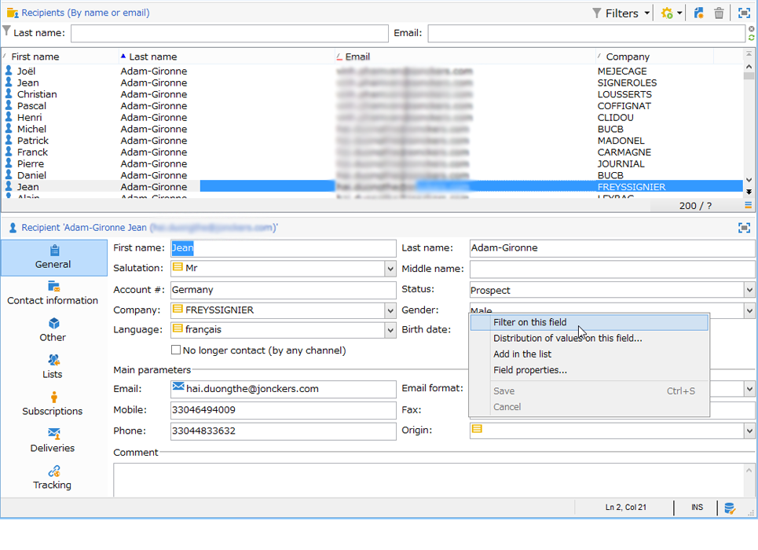

# Crear filtros{#creating-filters}

Cuando navega por el árbol de Adobe Campaign (en el menú **[!UICONTROL Explorer]** de la página principal), los datos contenidos en la base de datos se muestran en listas. Estas listas se pueden configurar para mostrar solo los datos necesarios para el operador. Se pueden realizar acciones sobre los datos filtrados. La configuración del filtro permite seleccionar datos de una lista **[!UICONTROL dynamically]**. Al modificar los datos, los datos filtrados se actualizan.

>[!NOTE]
>
>Los ajustes de configuración de la interfaz de usuario se definen localmente en el dispositivo. A veces puede ser necesario limpiar estos datos, especialmente si surgen problemas al actualizar los datos. Para ello, utilice el menú **[!UICONTROL File > Clear the local cache]**.

## Tipología de filtros disponibles {#typology-of-available-filters}

Adobe Campaign permite aplicar filtros a las listas de datos.

Estos filtros pueden utilizarse una vez o guardarse para su uso futuro. Puede aplicar varios filtros al mismo tiempo.

En Adobe Campaign, están disponibles estos tipos de filtros:

* **Filtros predeterminados**

   El **filtro predeterminado** es accesible a través de los campos situados encima de las listas. Permite filtrar campos predefinidos (para perfiles de destinatario, estos son el nombre y la dirección de email de forma predeterminada). Puede utilizar los campos para introducir los caracteres según los cuales filtrar o seleccionar las condiciones de filtro de una lista desplegable.

   
<!--
  >[!NOTE]
  >
  >The **%** character replaces any character string. For example, the string `%@yahoo.com` lets you display all the profiles with an e-mail address in the domain "yahoo.com".
-->
Puede cambiar el filtro predeterminado de una lista. Para obtener más información, consulte [Cambiar el filtro predeterminado](#altering-the-default-filter).

* **Filtros simples**

   Los **filtros simples** son filtros independientes de las columnas. Se definen con uno o más criterios de búsqueda simples en las columnas mostradas.

   Puede combinar varios filtros simples en la misma lista de datos para restringir la búsqueda. Los campos de filtro se muestran uno debajo del otro. Pueden eliminarse de forma independiente.

   

   Los filtros simples se detallan en [Crear un filtro simple](#creating-a-simple-filter).

* **Filtros avanzados**

   Los **filtros avanzados** se crean mediante una consulta o una combinación de consultas sobre los datos.

   Para obtener más información sobre la creación de un filtro avanzado, consulte [Crear un filtro avanzado](#creating-an-advanced-filter).

   Puede utilizar funciones para definir el contenido del filtro. Para obtener más información, consulte [Crear un filtro avanzado con funciones](#creating-an-advanced-filter-with-functions).

   >[!NOTE]
   >
   >Para obtener más información sobre la creación de consultas en Adobe Campaign, consulte [esta sección](../../platform/using/about-queries-in-campaign.md).

* **Filtros para usuarios**

   Un **filtro de aplicación** es un filtro avanzado que se ha guardado para utilizar y compartir su configuración con otros operadores.

   El botón **[!UICONTROL Filters]** situado encima de las listas ofrece un conjunto de filtros de aplicación que pueden combinarse para restringir el filtrado. El método para crear estos filtros se muestra en [Save a filter](#saving-a-filter).

## Cambiar el filtro predeterminado {#altering-the-default-filter}

Para cambiar el filtro predeterminado de una lista de destinatarios, haga clic en el nodo **[!UICONTROL Profiles and Targets > Pre-defined filters]** en el árbol.

Para el resto de tipos de datos, configure el filtro predeterminado mediante el nodo **[!UICONTROL Administration > Configuration > Predefined filters]**.

Siga estos pasos:

1. Seleccione el filtro que desea utilizar de forma predeterminada.
1. Haga clic en la pestaña **[!UICONTROL Parameters]** y seleccione **[!UICONTROL Default filter for the associated document type]**.

   

   >[!CAUTION]
   >
   >Si ya se ha aplicado un filtro predeterminado a la lista, es necesario deshabilitarlo antes de aplicar un filtro nuevo. Para ello, haga clic en la cruz roja a la derecha de los campos de filtro.

1. Haga clic en **[!UICONTROL Save]** para aplicar el filtro.

   >[!NOTE]
   >
   >La ventana de definición del filtro se detalla en [Crear un filtro avanzado](#creating-an-advanced-filter) y [Guardar un filtro](#saving-a-filter).

## Crear un filtro simple {#creating-a-simple-filter}

Para crear un **filtro simple**, siga los siguientes pasos:

1. Haga clic con el botón derecho en el campo que desee filtrar y seleccione **[!UICONTROL Filter on this field]**.

   

   Los campos de filtro predeterminados se muestran encima de la lista.

1. Seleccione la opción de filtro en la lista desplegable o introduzca los criterios de filtro que desee aplicar (el método para seleccionar o introducir criterios depende del tipo de campo: texto, enumerado, etc.).

   

1. Para activar el filtro, pulse Enter en el teclado o haga clic en la flecha verde a la derecha de los campos de filtro.

Si el campo en el que desea filtrar los datos no se muestra en forma de perfil, puede agregarlo en las columnas que se muestran y luego filtrar en esa columna. Para ello,

1. Haga clic en el icono **[!UICONTROL Configure the list]**.

   

1. Seleccione la columna que desea mostrar; por ejemplo, la edad de los destinatarios.

   

1. Haga clic con el botón derecho en la columna **Age** de la lista de destinatarios y seleccione **[!UICONTROL Filter on this column]**.

   

   A continuación, puede seleccionar las opciones de filtrado de edad.

   

## Crear un filtro avanzado {#creating-an-advanced-filter}

Para crear un **filtro avanzado**, siga los siguientes pasos:

1. Haga clic en el botón **[!UICONTROL Filters]** y seleccione **[!UICONTROL Advanced filter...]**.

   

   También puede hacer clic con el botón derecho del ratón en la lista de datos para filtrar y seleccionar **[!UICONTROL Advanced filter...]**.

   Se muestra la ventana de definición de la condición de filtrado.

1. Haga clic en la columna **[!UICONTROL Expression]** para definir el valor de entrada.
1. Haga clic en **[!UICONTROL Edit expression]** para seleccionar el campo al que se aplicará el filtro.

   

1. En la lista, seleccione el campo en el que desea filtrar los datos. Haga clic en **[!UICONTROL Finish]** para confirmar.
1. Haga clic en la columna **[!UICONTROL Operator]** y seleccione el operador que se aplicará en la lista desplegable.
1. Seleccione un valor esperado de la columna **[!UICONTROL Value]**. Puede combinar varios filtros para restringir la consulta. Para añadir una condición de filtro, haga clic en **[!UICONTROL Add]**.

   

1. Puede asignar una jerarquía a las expresiones o cambiar el orden de las expresiones de consulta mediante las flechas de la barra de herramientas.
1. El operador predeterminado entre expresiones es **y**, pero puede cambiarlo haciendo clic en el campo. Puede seleccionar un operador **o**.

   

1. Haga clic en **[!UICONTROL OK]** para confirmar la creación del filtro y aplicarlo a la lista.

El filtro aplicado se muestra encima de la lista.

Para editar o modificar este filtro, haga clic en su etiqueta.

Para cancelar este filtro, haga clic en el icono **[!UICONTROL Remove this filter]** situado a la derecha del filtro.

Se puede guardar un filtro avanzado para utilizarlo en el futuro. Para obtener más información sobre este tipo de filtro, consulte [Guardar un filtro](#saving-a-filter).

### Crear un filtro avanzado con funciones {#creating-an-advanced-filter-with-functions}

Los filtros avanzados pueden utilizar funciones; los **filtros con funciones** se crean mediante un editor de expresiones que permite crear fórmulas con los datos de la base de datos y las funciones avanzadas. Para crear un filtro con funciones, repita los pasos 1, 2 y 3 de creación de filtros avanzados y luego siga este procedimiento:

1. En la ventana de selección de campos, haga clic en **[!UICONTROL Advanced selection]**.
1. Seleccione el tipo de fórmula que desea utilizar: acumulado, filtro de usuario existente o expresión.

   

   Estas son las opciones disponibles:

   * **[!UICONTROL Field only]** para seleccionar un campo. Este es el modo predeterminado.
   * **[!UICONTROL Aggregate]** para seleccionar la fórmula de adición que se va a utilizar (cuenta, suma, promedio, máximo, mínimo).
   * **[!UICONTROL User filter]** para seleccionar uno de los filtros de usuario existentes. Los filtros de usuario se detallan en [Guardar un filtro](#saving-a-filter).
   * **[!UICONTROL Expression]** para acceder al editor de expresiones.

      El editor de expresiones permite definir un filtro avanzado. Tiene el siguiente aspecto:

      

      Permite seleccionar campos en las tablas de base de datos y adjuntarles funciones avanzadas: seleccione la función que desea utilizar en la **[!UICONTROL List of functions]**. Las funciones disponibles se detallan en [Lista de funciones](../../platform/using/defining-filter-conditions.md#list-of-functions). A continuación, seleccione el campo o campos concernidos por las funciones y haga clic en **[!UICONTROL OK]** para aprobar la expresión.

      >[!NOTE]
      >
      >Para ver un ejemplo de creación de filtros basado en una expresión, consulte [esta sección](../../workflow/using/sending-a-birthday-email.md#identifying-recipients-whose-birthday-it-is).

## Guardar un filtro {#saving-a-filter}

Los filtros son específicos de cada operador y se reinician cada vez que el operador borra la caché de su consola de cliente.

Puede crear un **application filter** guardando un filtro avanzado: puede volver a utilizarlo haciendo clic con el botón derecho en cualquier lista o mediante el botón **[!UICONTROL Filters]** ubicado encima de las listas.

También se puede acceder a estos filtros directamente a través del asistente de entregas en el paso de selección de objetivo (consulte [esta sección](../../delivery/using/creating-an-email-delivery.md) para obtener más información sobre la creación de entregas). Para crear el filtro de aplicación, puede:

* Convertir un filtro avanzado en un filtro de aplicación. Para ello, haga clic en **[!UICONTROL Save]** antes de cerrar el editor de filtros avanzado.

   

* Cree este filtro de aplicación a través del nodo **[!UICONTROL Administration > Configuration > Predefined filters]** (o **[!UICONTROL Profiles and targets > Predefined filters]** para los destinatarios) del árbol. Para ello, haga clic con el botón derecho en la lista de filtros y seleccione **[!UICONTROL New...]**. El procedimiento es el mismo que para crear filtros avanzados.

   El campo **[!UICONTROL Label]** permite asignar un nombre a este filtro. Este nombre aparece en el cuadro combinado del botón **[!UICONTROL Filters...]**.

   

Se pueden eliminar todos los filtros de la lista actual haciendo clic con el botón derecho del ratón y seleccionando **[!UICONTROL No filter]** o a través del icono **[!UICONTROL Filters]** situado encima de la lista.

Se pueden combinar los filtros haciendo clic en el botón **[!UICONTROL Filters]** y utilizando el menú **[!UICONTROL And...]**.

## Filtrar destinatarios {#filtering-recipients}

Los filtros predefinidos (consulte [Save a filter](#saving-a-filter)) permiten filtrar los perfiles de los destinatarios contenidos en la base de datos. Puede editar filtros desde el nodo del árbol **[!UICONTROL Profiles and Targets > Predefined filters]**. Los filtros se muestran en la sección superior del espacio de trabajo, a través del botón **[!UICONTROL Filters]**.

Seleccione un filtro para mostrar su definición y para acceder a una previsualización de los datos filtrados.

>[!NOTE]
>
>Para ver un ejemplo detallado de la creación de filtros predefinidos, consulte [Caso de uso](../../platform/using/use-case.md).

Los filtros predefinidos son:

<table> 
 <tbody> 
  <tr> 
   <td> <strong>Etiqueta</strong>  </td> 
   <td> <strong>Consulta</strong>  </td> 
  </tr> 
  <tr> 
   <td> Abierto  </td> 
   <td> Selecciona los destinatarios que han abierto una entrega.  </td> 
  </tr> 
  <tr> 
   <td> Abierto pero sin clic  </td> 
   <td> Selecciona los destinatarios que han abierto una entrega, pero no han hecho clic en un vínculo.  </td> 
  </tr> 
  <tr> 
   <td> Destinatarios inactivos  </td> 
   <td> Selecciona destinatarios que no han abierto una entrega en X meses.  </td> 
  </tr> 
  <tr> 
   <td> Última actividad por tipo de dispositivo  </td> 
   <td> Selecciona los destinatarios que han hecho clic o abierto la entrega Y con el dispositivo X en los últimos Z días.  </td> 
  </tr> 
  <tr> 
   <td> Última actividad por tipo de dispositivo (seguimiento).  </td> 
   <td> Selecciona los destinatarios que han hecho clic o abierto la entrega Y con el dispositivo X en los últimos Z días.  </td> 
  </tr> 
  <tr> 
   <td> Destinatarios no específicos  </td> 
   <td> Selecciona los destinatarios que nunca se han identificado a través del canal Y en los meses X.  </td> 
  </tr> 
  <tr> 
   <td> Destinatarios muy activos  </td> 
   <td> Selecciona destinatarios que han hecho clic en una entrega por lo menos X veces en los últimos Y meses.  </td> 
  </tr> 
  <tr> 
 <td> Dirección de correo electrónico incluida en la lista de bloqueados  </td> 
    <td> Selecciona destinatarios cuya dirección de correo electrónico se encuentra en la de lista de bloqueados.  </td>
  </tr> 
  <tr> 
   <td> Dirección de correo en cuarentena  </td> 
   <td> Selecciona destinatarios cuya dirección de correo está en cuarentena.  </td> 
  </tr> 
  <tr> 
   <td> Direcciones de correo duplicadas en la carpeta  </td> 
   <td> Selecciona destinatarios cuya dirección de correo está duplicada en la carpeta.  </td> 
  </tr> 
  <tr> 
   <td> No se ha abierto ni se ha hecho clic  </td> 
   <td> Selecciona los destinatarios que no han abierto ninguna entrega ni han hecho clic en una entrega.  </td> 
  </tr> 
  <tr> 
   <td> Nuevos destinatarios (días)  </td> 
   <td> Selecciona los destinatarios creados en los últimos X días.  </td> 
  </tr> 
  <tr> 
   <td> Nuevos destinatarios (minutos)  </td> 
   <td> Selecciona los destinatarios creados en los últimos X minutos.  </td> 
  </tr> 
  <tr> 
   <td> Nuevos destinatarios (meses)  </td> 
   <td> Selecciona los destinatarios creados en los últimos X meses.  </td> 
  </tr> 
  <tr> 
   <td> Por suscripción  </td> 
   <td> Selecciona los destinatarios por suscripción.  </td> 
  </tr> 
  <tr> 
   <td> Al hacer clic en un vínculo específico  </td> 
   <td> Selecciona los destinatarios que hicieron clic en una URL determinada de una entrega.  </td> 
  </tr> 
  <tr> 
   <td> Por comportamiento tras la entrega  </td> 
   <td> Selecciona los destinatarios según su comportamiento tras recibir una entrega.  </td> 
  </tr> 
  <tr> 
   <td> Por fecha de creación  </td> 
   <td> Selecciona los destinatarios por fecha de creación, durante un periodo que abarca desde X meses (fecha actual menos n meses) hasta Y meses (fecha actual menos n meses).  </td> 
  </tr> 
  <tr> 
   <td> Por lista  </td> 
   <td> Selecciona los destinatarios por lista.  </td> 
  </tr> 
  <tr> 
   <td> Por número de clics  </td> 
   <td> Selecciona los destinatarios que hicieron clic en una entrega en los últimos X meses.  </td> 
  </tr> 
  <tr> 
   <td> Por número de mensajes recibidos  </td> 
   <td> Selecciona los destinatarios según el número de mensajes recibidos.  </td> 
  </tr> 
  <tr> 
   <td> Por número de aperturas  </td> 
   <td> Selecciona los destinatarios que abrieron entre X e Y entregas durante la cantidad de tiempo Z.  </td> 
  </tr> 
  <tr> 
   <td> Por nombre o email  </td> 
   <td> Selecciona los destinatarios según su nombre o correo electrónico.  </td> 
  </tr> 
  <tr> 
   <td> Por intervalo de edad  </td> 
   <td> Selecciona los destinatarios según su edad.  </td> 
  </tr> 
 </tbody> 
</table>

>[!NOTE]
>
>Todas las comparaciones relacionadas con la cuenta y los periodos se deben entender en un sentido general (los destinatarios que corresponden a los límites de consulta se incluyen en la comparación).

Ejemplos de cómo se calculan los datos:

* Selecciona los destinatarios con menos de 30 años de edad:

   

* Selecciona los destinatarios que tienen 18 años de edad o más:

   

* Selecciona los destinatarios que tienen entre 18 y 30 años:

   

## Configuración avanzada de los filtros de datos {#advanced-settings-for-data-filters}

Haga clic en la pestaña **[!UICONTROL Settings]** para acceder a las siguientes opciones:

* **[!UICONTROL Default filter for the associated document type]**: esta opción permite sugerir este filtro de forma predeterminada en el editor de las listas que le interesen.

   Por ejemplo, el filtro **[!UICONTROL By name or login]** se aplica a los operadores. Esta opción está seleccionada y, por lo tanto, el filtro siempre se ofrece en todas las listas de operadores.

* **[!UICONTROL Filter shared with other operators]**: esta opción permite poner el filtro a disposición del resto de operadores de la base de datos actual.
* **[!UICONTROL Use parameter entry form]**: esta opción permite definir los campos de filtro que se muestran encima de la lista cuando se selecciona este filtro. Estos campos permiten definir la configuración del filtro. Este formulario debe introducirse en formato XML mediante el botón **[!UICONTROL Form]**. Por ejemplo, el filtro preconfigurado **[!UICONTROL Recipients who have opened]**, disponible en la lista de destinatarios, muestra un campo de filtro que le permite seleccionar la entrega a la que se dirige el filtro.

   El botón **[!UICONTROL Preview]** muestra los resultados del filtro seleccionado.

* El vínculo **[!UICONTROL Advanced parameters]** permite definir ajustes adicionales. En concreto, le permite asociar una tabla SQL con el filtro para que sea común a todos los editores que compartan la tabla.

   Seleccione la opción **[!UICONTROL Do not restrict the filter]** si desea que el usuario anule este filtro.

   Esta opción está habilitada para los filtros “Destinatarios de una entrega” y “Destinatarios de entregas pertenecientes a una carpeta”, los cuales se ofrecen en el asistente de entregas y que no se pueden sobrecargar.

   

