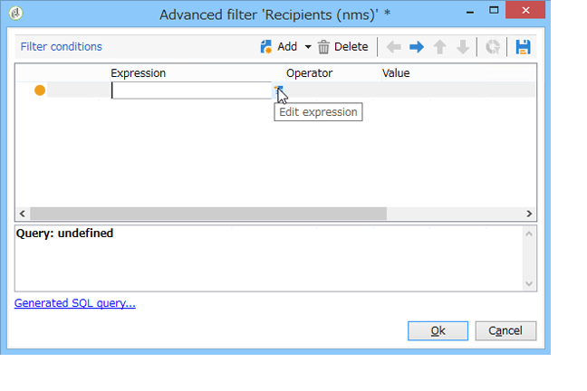

# Creación de filtros{#creating-filters}

## Introducción {#introduction}

When you navigate in the Adobe Campaign tree (from the **[!UICONTROL Explorer]** menu in the home page), the data contained in the database is displayed in lists. Estas listas se pueden configurar para mostrar solo los datos necesarios para el operador. Se pueden realizar acciones sobre los datos filtrados. Filter configuration lets you select data from a list **[!UICONTROL dynamically]**. Al modificar los datos, los datos filtrados se actualizan.

>[!NOTE]
>
>Las configuraciones de la lista se definen localmente al nivel de la estación de trabajo. Se almacenan en archivos ocultos y a veces es necesario limpiar estos datos, especialmente si surgen problemas al actualizar datos. Para ello, utilice el **[!UICONTROL File > Clear the local cache]** menú.

## Tipología de filtros disponibles {#typology-of-available-filters}

Adobe Campaign permite aplicar filtros a las listas de datos.

Estos filtros pueden utilizarse una vez o guardarse para su uso futuro. Puede aplicar varios filtros al mismo tiempo.

En Adobe Campaign, hay disponibles dos tipos de listas:

* Filtros predeterminados

   El **filtro predeterminado** es accesible a través de los campos situados encima de las listas. Permite filtrar campos predefinidos (para perfiles de destinatario, estos son el nombre y la dirección de email de forma predeterminada). Puede utilizar los campos para introducir los caracteres según los cuales filtrar o seleccionar las condiciones de filtro de una lista desplegable.

   
<!--
  >[!NOTE]
  >
  >The **%** character replaces any character string. For example, the string `%@yahoo.com` lets you display all the profiles with an e-mail address in the domain "yahoo.com".
-->
Puede cambiar el filtro predeterminado de una lista. Para obtener más información sobre esto, consulte [Alteración del filtro](#altering-the-default-filter)predeterminado.

* Filtros simples

   Los **filtros simples** son filtros independientes de las columnas. Se definen con uno o más criterios de búsqueda simples en las columnas mostradas.

   Puede combinar varios filtros simples en la misma lista de datos para restringir la búsqueda. Los campos de filtro se muestran uno debajo del otro. Pueden eliminarse de forma independiente.

   

   Los filtros simples se detallan en [Creación de un filtro](#creating-a-simple-filter)sencillo.

* Filtros avanzados

   Los **filtros avanzados** se crean mediante una consulta o una combinación de consultas sobre los datos.

   Para obtener más información sobre la creación de un filtro avanzado, consulte [Creación de un filtro](#creating-an-advanced-filter)avanzado.

   Puede utilizar funciones para definir el contenido del filtro. Para obtener más información sobre esto, consulte [Creación de un filtro avanzado con funciones](#creating-an-advanced-filter-with-functions).

   >[!NOTE]
   >
   >Para obtener más información sobre la creación de consultas en Adobe Campaign, consulte [esta sección](../../platform/using/about-queries-in-campaign.md).

* Filtros para usuarios

   Un **filtro de aplicación** es un filtro avanzado que se ha guardado para utilizar y compartir su configuración con otros operadores.

   The **[!UICONTROL Filters]** button located above the lists offers a set of application filters that can be combined to refine the filtering. The method for creating these filters is presented in [Saving a filter](#saving-a-filter).

## Modificación del filtro predeterminado {#altering-the-default-filter}

To change the default filter for a recipient list, click the **[!UICONTROL Profiles and Targets > Pre-defined filters]** node of the tree.

For all other types of data, configure the default filter via the **[!UICONTROL Administration > Configuration > Predefined filters]** node.

Siga estos pasos:

1. Seleccione el filtro que desea utilizar de forma predeterminada.
1. Haga clic en la **[!UICONTROL Parameters]** ficha y seleccione **[!UICONTROL Default filter for the associated document type]**.

   

   >[!CAUTION]
   >
   >Si ya se ha aplicado un filtro predeterminado a la lista, es necesario deshabilitarlo antes de aplicar un filtro nuevo. Para ello, haga clic en la cruz roja a la derecha de los campos de filtro.

1. Haga clic **[!UICONTROL Save]** para aplicar el filtro.

   >[!NOTE]
   >
   >La ventana de definición del filtro se detalla en [Creación de un filtro](#creating-an-advanced-filter) avanzado y [Guardado de un filtro](#saving-a-filter).

## Creación de un filtro simple {#creating-a-simple-filter}

Para crear un **filtro simple**, siga los siguientes pasos:

1. Right-click the field you want to filter and select **[!UICONTROL Filter on this field]**.

   

   Los campos de filtro predeterminados se muestran encima de la lista.

1. Seleccione la opción de filtro en la lista desplegable o introduzca los criterios de filtro que desee aplicar (el método para seleccionar o introducir criterios depende del tipo de campo: texto, enumerado, etc.).

   

1. Para activar el filtro, pulse Enter en el teclado o haga clic en la flecha verde a la derecha de los campos de filtro.

Si el campo en el que desea filtrar los datos no se muestra en forma de perfil, puede agregarlo en las columnas que se muestran y luego filtrar en esa columna. Para ello,

1. Haga clic en el **[!UICONTROL Configure the list]** icono.

   

1. Seleccione la columna que desea mostrar; por ejemplo, la edad de los destinatarios.

   

1. Right-click the **Age** column in the recipient list, and select **[!UICONTROL Filter on this column]**.

   

   A continuación, puede seleccionar las opciones de filtrado de edad.

   

## Creación de un filtro avanzado {#creating-an-advanced-filter}

Para crear un **filtro avanzado**, siga los siguientes pasos:

1. Haga clic en el **[!UICONTROL Filters]** botón y seleccione **[!UICONTROL Advanced filter...]**.

   

   You can also right-click the list of data to filter and select **[!UICONTROL Advanced filter...]**.

   Se muestra la ventana de definición de la condición de filtrado.

1. Click the **[!UICONTROL Expression]** column to define the input value.
1. Click **[!UICONTROL Edit expression]** to select the field to which the filter will be applied.

   

1. En la lista, seleccione el campo en el que desea filtrar los datos. Click **[!UICONTROL Finish]** to confirm.
1. Click the **[!UICONTROL Operator]** column and select the operator to be applied from the drop-down list.
1. Select an expected value from the **[!UICONTROL Value]** column. Puede combinar varios filtros para restringir la consulta. To add a filter condition, click **[!UICONTROL Add]**.

   

1. Puede asignar una jerarquía a las expresiones o cambiar el orden de las expresiones de consulta mediante las flechas de la barra de herramientas.
1. El operador predeterminado entre expresiones es **y**, pero puede cambiarlo haciendo clic en el campo. Puede seleccionar un operador **o**.

   

1. Click **[!UICONTROL OK]** to confirm filter creation and apply it to the list.

El filtro aplicado se muestra encima de la lista.

Para editar o modificar este filtro, haga clic en su etiqueta.

To cancel this filter, click the **[!UICONTROL Remove this filter]** icon to the right of the filter.

Se puede guardar un filtro avanzado para utilizarlo en el futuro. For further information about this type of filter, see [Saving a filter](#saving-a-filter).

### Creación de filtros avanzados con funciones {#creating-an-advanced-filter-with-functions}

Los filtros avanzados pueden utilizar funciones; los **filtros con funciones** se crean mediante un editor de expresiones que permite crear fórmulas con los datos de la base de datos y las funciones avanzadas. Para crear un filtro con funciones, repita los pasos 1, 2 y 3 de creación del filtros avanzados y luego siga este procedimiento:

1. In the field selection window, click **[!UICONTROL Advanced selection]**.
1. Seleccione el tipo de fórmula que desea utilizar: acumulado, filtro de usuario existente o expresión.

   

   Estas son las opciones disponibles:

   * **[!UICONTROL Field only]** para seleccionar un campo. Este es el modo predeterminado.
   * **[!UICONTROL Aggregate]** para seleccionar la fórmula agregada que se va a utilizar (recuentos, suma, promedio, máximo, mínimo).
   * **[!UICONTROL User filter]** para seleccionar uno de los filtros de usuario existentes. Los filtros de usuario se detallan en [Guardar un filtro](#saving-a-filter).
   * **[!UICONTROL Expression]** para acceder al editor de expresiones.

      El editor de expresiones permite definir un filtro avanzado. Tiene el siguiente aspecto:

      

      Permite seleccionar campos en las tablas de base de datos y adjuntarles funciones avanzadas: Seleccione la función que se va a utilizar en la **[!UICONTROL List of functions]**. Las funciones disponibles se detallan en [Lista de funciones](../../platform/using/defining-filter-conditions.md#list-of-functions). Next, select the field or fields concerned by the functions and click **[!UICONTROL OK]** to approve the expression.

      >[!NOTE]
      >
      >Para ver un ejemplo de creación de filtros basado en una expresión, consulte [Identificación de destinatarios según su cumpleaños](../../workflow/using/sending-a-birthday-email.md#identifying-recipients-whose-birthday-it-is).

## Guardar un filtro {#saving-a-filter}

Los filtros son específicos de cada operador y se reinician cada vez que el operador borra la caché de su consola de cliente.

You can create an **application filter** by saving an advanced filter: it can be re-used by right-clicking in any list or via the **[!UICONTROL Filters]** button located above the lists.

También se puede acceder a estos filtros directamente a través del asistente de envíos en el paso de selección de objetivo (consulte [esta sección](../../delivery/using/creating-an-email-delivery.md) para obtener más información sobre la creación de envíos). Para crear el filtro de aplicación, puede:

* Convertir un filtro avanzado en un filtro de aplicación. To do this, click **[!UICONTROL Save]** before closing the advanced filter editor.

   

* Cree este filtro de aplicación a través del nodo **[!UICONTROL Administration > Configuration > Predefined filters]** (o **[!UICONTROL Profiles and targets > Predefined filters]** para destinatarios) del árbol. To do this, right-click the list of filters, and select **[!UICONTROL New...]**. El procedimiento es el mismo que para crear filtros avanzados.

   The **[!UICONTROL Label]** field enables you to name this filter. This name will appear in the combo box of the **[!UICONTROL Filters...]** button.

   

You can delete all filters on the current list by right-clicking and selecting **[!UICONTROL No filter]** or via the **[!UICONTROL Filters]** icon located above the list.

You can combine filters by clicking the **[!UICONTROL Filters]** button and using the **[!UICONTROL And...]** menu.

## Filtrado de destinatarios {#filtering-recipients}

Predefined filters (see [Saving a filter](#saving-a-filter)) enable you to filter the profiles of recipients contained in the database. You can edit filters from the **[!UICONTROL Profiles and Targets > Predefined filters]** node of the tree. The filters are listed in the upper section of the workspace, via the **[!UICONTROL Filters]** button.

Seleccione un filtro para mostrar su definición y para acceder a una previsualización de los datos filtrados.

>[!NOTE]
>
>For a detailed example of predefined filter creation, refer to [Use case](../../platform/using/use-case.md).

Los filtros predefinidos son:

<table> 
 <tbody> 
  <tr> 
   <td> <strong>Etiqueta</strong>  </td> 
   <td> <strong>Consulta</strong>  </td> 
  </tr> 
  <tr> 
   <td> Abierto  </td> 
   <td> Selecciona los destinatarios que han abierto un envío.  </td> 
  </tr> 
  <tr> 
   <td> Abierto pero sin clic  </td> 
   <td> Selecciona los destinatarios que han abierto un envío, pero no han hecho clic en un enlace.  </td> 
  </tr> 
  <tr> 
   <td> Destinatarios inactivos  </td> 
   <td> Selecciona destinatarios que no han abierto un envío en X meses.  </td> 
  </tr> 
  <tr> 
   <td> Última actividad por tipo de dispositivo  </td> 
   <td> Selecciona los destinatarios que han hecho clic o abierto el envío Y con el dispositivo X en los últimos Z días.  </td> 
  </tr> 
  <tr> 
   <td> Última actividad por tipo de dispositivo (seguimiento).  </td> 
   <td> Selecciona los destinatarios que han hecho clic o abierto el envío Y con el dispositivo X en los últimos Z días.  </td> 
  </tr> 
  <tr> 
   <td> Destinatarios no específicos  </td> 
   <td> Selecciona los destinatarios que nunca se han identificado a través del canal Y en los meses X.  </td> 
  </tr> 
  <tr> 
   <td> Destinatarios muy activos  </td> 
   <td> Selecciona destinatarios que han hecho clic en un envío por lo menos X veces en los últimos Y meses.  </td> 
  </tr> 
  <tr> 
   <td> Correo en una lista negra  </td> 
   <td> Selecciona destinatarios cuya dirección de correo está en una lista negra.  </td> 
  </tr> 
  <tr> 
   <td> Dirección de correo en cuarentena  </td> 
   <td> Selecciona destinatarios cuya dirección de correo está en cuarentena.  </td> 
  </tr> 
  <tr> 
   <td> Direcciones de correo duplicadas en la carpeta  </td> 
   <td> Selecciona destinatarios cuya dirección de correo está duplicada en la carpeta.  </td> 
  </tr> 
  <tr> 
   <td> No se ha abierto ni se ha hecho clic  </td> 
   <td> Selecciona los destinatarios que no han abierto ningún envío ni han hecho clic en un envío.  </td> 
  </tr> 
  <tr> 
   <td> Nuevos destinatarios (días)  </td> 
   <td> Selecciona los destinatarios creados en los últimos X días.  </td> 
  </tr> 
  <tr> 
   <td> Nuevos destinatarios (minutos)  </td> 
   <td> Selecciona los destinatarios creados en los últimos X minutos.  </td> 
  </tr> 
  <tr> 
   <td> Nuevos destinatarios (meses)  </td> 
   <td> Selecciona los destinatarios creados en los últimos X meses.  </td> 
  </tr> 
  <tr> 
   <td> Por suscripción  </td> 
   <td> Selecciona los destinatarios por suscripción.  </td> 
  </tr> 
  <tr> 
   <td> Al hacer clic en un enlace específico  </td> 
   <td> Selecciona los destinatarios que hicieron clic en una URL determinada de un envío.  </td> 
  </tr> 
  <tr> 
   <td> Por comportamiento tras el envío  </td> 
   <td> Selecciona los destinatarios según su comportamiento tras recibir un envío.  </td> 
  </tr> 
  <tr> 
   <td> Por fecha de creación  </td> 
   <td> Selecciona los destinatarios por fecha de creación, durante un período que abarca desde X meses (fecha actual menos n meses) hasta Y meses (fecha actual menos n meses).  </td> 
  </tr> 
  <tr> 
   <td> Por lista  </td> 
   <td> Selecciona los destinatarios por lista.  </td> 
  </tr> 
  <tr> 
   <td> Por número de clics  </td> 
   <td> Selecciona los destinatarios que hicieron clic en un envío en los últimos X meses.  </td> 
  </tr> 
  <tr> 
   <td> Por número de mensajes recibidos  </td> 
   <td> Selecciona los destinatarios según el número de mensajes recibidos.  </td> 
  </tr> 
  <tr> 
   <td> Por número de aperturas  </td> 
   <td> Selecciona los destinatarios que abrieron entre X e Y envíos durante la cantidad de tiempo Z.  </td> 
  </tr> 
  <tr> 
   <td> Por nombre o email  </td> 
   <td> Selecciona los destinatarios según su nombre o correo electrónico.  </td> 
  </tr> 
  <tr> 
   <td> Por intervalo de edad  </td> 
   <td> Selecciona los destinatarios según su edad.  </td> 
  </tr> 
 </tbody> 
</table>

>[!NOTE]
>
>Todas las comparaciones relacionadas con la cuenta y los períodos se deben entender en un sentido general (los destinatarios que corresponden a los límites de consulta se incluyen en la comparación).

Ejemplos de cómo se calculan los datos:

* Selecciona los destinatarios con menos de 30 años de edad:

   

* Selecciona los destinatarios que tienen 18 años de edad o más:

   

* Selecciona los destinatarios que tienen entre 18 y 30 años:

   

## Configuración avanzada de los filtros de datos {#advanced-settings-for-data-filters}

Click the **[!UICONTROL Settings]** tab to access the following options:

* **[!UICONTROL Default filter for the associated document type]**:: esta opción le permite sugerir este filtro de forma predeterminada en el editor de las listas afectadas por la clasificación.

   Por ejemplo, el **[!UICONTROL By name or login]** filtro se aplica a los operadores. Esta opción está seleccionada y, por lo tanto, el filtro siempre se ofrece en todas las listas de operadores.

* **[!UICONTROL Filter shared with other operators]**:: esta opción le permite hacer que el filtro esté disponible para todos los demás operadores de la base de datos actual.
* **[!UICONTROL Use parameter entry form]**:: esta opción le permite definir los campos de filtro que se mostrarán encima de la lista cuando se seleccione este filtro. Estos campos permiten definir la configuración del filtro. This form must be entered in XML format via the **[!UICONTROL Form]** button. For example, the preconfigured filter **[!UICONTROL Recipients who have opened]**, available from the recipients list, displays a filter field that lets you select the delivery at which the filter is aimed.

   The **[!UICONTROL Preview]** button displays the result of the selected filter.

* The **[!UICONTROL Advanced parameters]** link lets you define additional settings. En concreto, le permite asociar una tabla SQL con el filtro para que sea común a todos los editores que compartan la tabla.

   Select the **[!UICONTROL Do not restrict the filter]** option if you want to stop the user from overriding this filter.

   Esta opción está habilitada para los filtros “Destinatarios de una entrega” y “Destinatarios de envíos pertenecientes a una carpeta”, los cuales se ofrecen en el asistente de envíos y que no se pueden sobrecargar.

   

