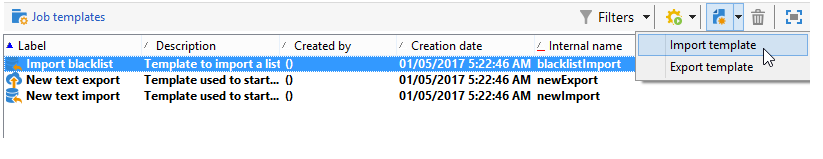

# Creación de plantillas de importación y exportación {#creating-import-export-templates}

Las plantillas de importación y exportación se almacenan en el directorio **[!UICONTROL Resources > Templates > Job templates]** del árbol de Adobe Campaign.

De forma predeterminada, hay tres plantillas de importación y una plantilla de exportación en este directorio. No deben modificarse.

* La plantilla nativa **[!UICONTROL Import denylist]** ya está configurada para importar una lista de direcciones de correo electrónico que se incluyeron a la de lista de bloqueados.

* Las plantillas **[!UICONTROL New text import]** y **[!UICONTROL New text export]** permiten configurar una importación o exportación desde cero.

Puede duplicarlas para crear sus propias plantillas o crear una nueva plantilla a través del menú **[!UICONTROL New > Import template]** / **[!UICONTROL Export template]**.

El proceso para configurar una plantilla es el mismo que el que se presenta en estas secciones:

* [Configuración de un trabajo de importación](../../platform/using/executing-import-jobs.md)
* [Configuración de un trabajo de exportación](../../platform/using/executing-export-jobs.md)
