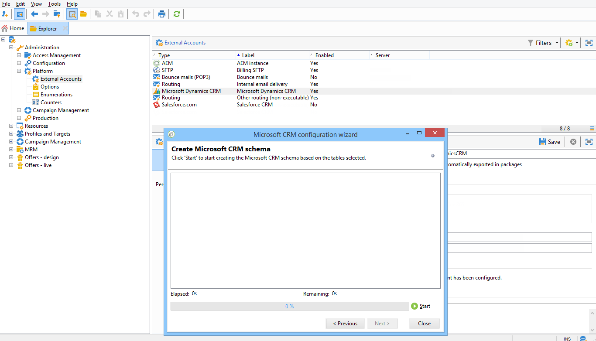
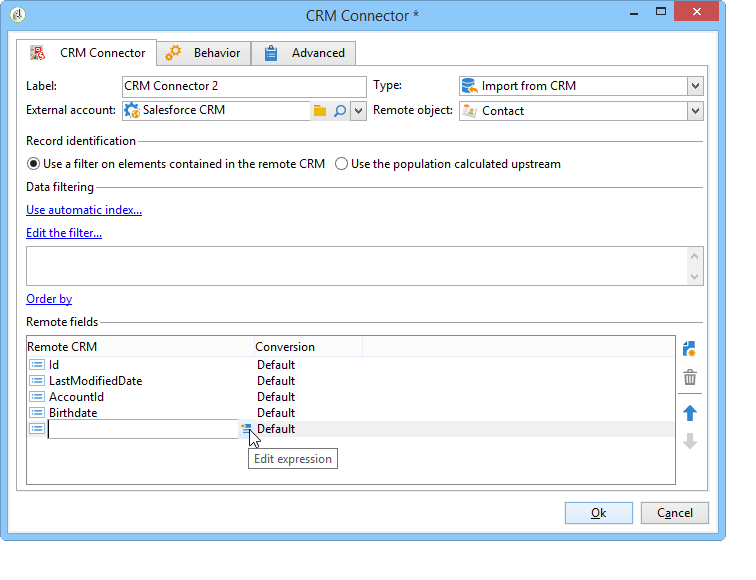
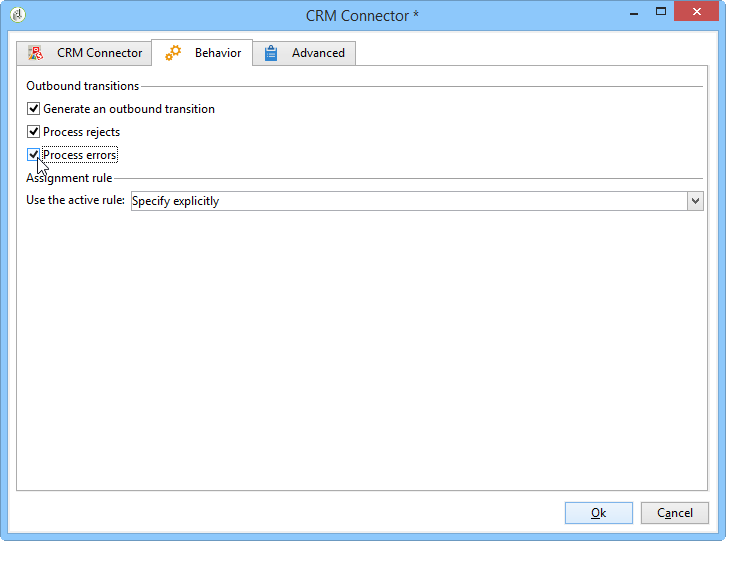

# Conectores CRM{#crm-connectors}

## Acerca de los conectores CRM {#about-crm-connectors}

Adobe Campaign ofrece varios conectores CRM para vincular la plataforma de Adobe Campaign a los sistemas de terceros. Estos conectores de CRM le permiten sincronizar contactos, cuentas, compras, etc., para facilitar la integración de la aplicación con diversas aplicaciones de terceros y de negocios.

Estos conectores permiten una integración de datos rápida y sencilla: Adobe Campaign proporciona un asistente dedicado para recopilar y seleccionar de las tablas disponibles en CRM. De este modo, se garantiza la sincronización bidireccional para garantizar que los datos estén actualizados en todo momento a lo largo de los sistemas.

>[!NOTE]
>
>Esta función está disponible en Adobe Campaign a través del paquete de **conectores de CRM** dedicados.

La conexión a CRM se realiza mediante actividades de flujo de trabajo dedicadas. Estas actividades se describen en el capítulo presentado en  [esta sección](../../workflow/using/crm-connector.md).

### Limitaciones y sistemas CRM compatibles {#compatible-crm-systems-and-limitations}

Los CRM enumerados a continuación se pueden integrar en Adobe Campaign.

Las versiones compatibles se detallan en la [matriz de compatibilidad](https://helpx.adobe.com/campaign/kb/compatibility-matrix.html).

* **Salesforce.com**

   Consulte [esta sección](#example-for-salesforce-com) para aprender a configurar la conexión con Salesforce.com.

   >[!CAUTION]
   >
   >Al conectar Adobe Campaign con Salesforce.com, las limitaciones son:
   >
   >    
   >    
   >    * Compatible con las instancias de producción de prueba.
   >    * Compatible con las reglas de asignación.
   >    * Adobe Campaign no permite varias enumeraciones de selección.

* **Oracle On Demand**

   Consulte [esta sección](#example-for-oracle-on-demand) para aprender a configurar la conexión con Oracle On Demand.

   >[!CAUTION]
   >
   >Al conectar Adobe Campaign con Oracle On Demand, las limitaciones son:
   >
   >    
   >    
   >    * Adobe Campaign puede sincronizar cualquier objeto disponible en las plantillas estándar de Oracle On Demand. Si ha agregado tablas personalizadas en Oracle On Demand, estas no se recuperan en Adobe Campaign.
   >    * La versión v1.0 de la API permite ordenar o filtrar datos durante una consulta, pero no permite realizar ambas operaciones simultáneamente.
   >    * Las fechas enviadas por Oracle On Demand no contienen información de zona horaria.
   >    * Adobe Campaign no permite varias enumeraciones de selección.

* **MS Dynamics CRM** y **MS Dynamics Online**

   Consulte [esta sección](#example-for-microsoft-dynamics) para aprender a configurar la conexión con Microsoft Dynamics.

   Consulte varios ejemplos de integración de Adobe Campaign y Microsoft Dynamics en [este vídeo](https://helpx.adobe.com/campaign/kt/acc/using/acc-integrate-dynamics365-with-acc-feature-video-set-up.html).

   >[!CAUTION]
   >
   >Al conectar Adobe Campaign con Microsoft Dynamics, las limitaciones son:
   >
   >    
   >    
   >    * La instalación de complementos puede cambiar el comportamiento de CRM, lo que puede dar lugar a problemas de compatibilidad con Adobe Campaign.
   >    * Adobe Campaign no permite varias enumeraciones de selección.

## Configuración de la conexión {#setting-up-the-connection}

Para utilizar conectores CRM en Adobe Campaign, siga los siguientes pasos:

1. Cree la cuenta externa
1. Recopile las tablas CRM
1. Sincronice las enumeraciones
1. Cree el flujo de trabajo de sincronización

>[!NOTE]
>
>Los conectores de CRM solo funcionan con una URL segura (https).

### Ejemplo para Salesforce.com {#example-for-salesforce-com}

Para configurar el conector de **Salesforce.com** con Adobe Campaign, siga los pasos a continuación:

1. Create a new external account via the **[!UICONTROL Administration > Platform > External accounts]** node of the Adobe Campaign tree.
1. Ejecute el asistente de configuración para generar las tablas de CRM disponibles.

   

   El asistente de configuración le permite recopilar tablas y crear el esquema coincidente.

   Click **[!UICONTROL Start]** to run the execution.

   

   >[!NOTE]
   >
   >Para aprobar la configuración, debe cerrar la sesión y volver a iniciarla en la consola de Adobe Campaign.

1. Check the schema generated in Adobe Campaign in the **[!UICONTROL Administration > Configuration > Data schemas]** node.

   

1. Una vez creado el esquema, puede sincronizar las enumeraciones automáticamente con Adobe Campaign a través de CRM.

   To do this, click the **[!UICONTROL Synchronizing enumerations...]** link and select the Adobe Campaign enumeration that matches the CRM enumeration.

   You can replace all values of an Adobe Campaign enumeration with those of the CRM: to do this, select **[!UICONTROL Yes]** in the **[!UICONTROL Replace]** column.

   

   Haga clic **[!UICONTROL Next]** y luego **[!UICONTROL Start]** para empezar a importar la lista.

1. Compruebe los valores importados en el **[!UICONTROL Administration > Platform > Enumerations]** menú.

   

1. To import Salesforce data or to export Adobe Campaign data to Salesforce, you need to create a workflow and use the **[!UICONTROL CRM connector]** activity.

   

### Ejemplo de Oracle On Demand {#example-for-oracle-on-demand}

Para configurar el conector de **Oracle On Demand** para que funcione con Adobe Campaign, siga los pasos siguientes:

1. Create a new external account via the **[!UICONTROL Administration > Platform > External accounts]** node of the Adobe Campaign tree.

   

1. Abra el asistente de configuración: Adobe Campaign muestra automáticamente las tablas del modelo de datos de Oracle. Seleccione las tablas que desea recopilar.

   

1. Click **[!UICONTROL Next]** to start creating the matching schema.

   El esquema de datos coincidente está disponible en Adobe Campaign.

   

1. Inicie la sincronización de las enumeraciones entre Adobe Campaign y Oracle On Demand.

   

1. Para importar los datos de Oracle On Demand en Adobe Campaign, cree el siguiente tipo de flujo de trabajo:

   

   Este flujo de trabajo importa contactos a través de Oracle On Demand, los sincroniza con los datos existentes de Adobe Campaign, elimina los contactos duplicados y actualiza la base de datos de Adobe Campaign.

   The **[!UICONTROL CRM Connector]** activity needs to be configured as shown here:

   

1. Para exportar datos de Adobe Campaign a Oracle On Demand, cree el flujo de trabajo siguiente:

   

   Este flujo de trabajo recopila los datos pertinentes mediante consultas y después lo exporta a la tabla de contactos de Oracle On Demand.

### Ejemplo de Microsoft Dynamics {#example-for-microsoft-dynamics}

Para configurar el conector de Microsoft Dynamics para que funcione con Adobe Campaign, siga los siguientes pasos:

1. Create a new external account via the **[!UICONTROL Administration > Platform > External accounts]** node of the Adobe Campaign tree.

   

1. Seleccione el tipo **de** implementación: **[!UICONTROL On-premise]**, **[!UICONTROL Office 365]** o **[!UICONTROL Web API]**, según el conector que desee configurar.

   Adobe Campaign Classic es compatible con la interfaz Dynamics 365 REST con el protocolo de autenticación OAuth.

   If you select a **[!UICONTROL WebAPI]** deployment, you need to register an app on Azure Directory and get the **clientId** from the Azure Directory. Este registro está documentado en [esta página](https://msdn.microsoft.com/en-us/library/mt622431.aspx).

   >[!NOTE]
   >
   >Adobe Campaign Classic no requiere el parámetro redirectURL.

   El valor **clientId** se utiliza con el nombre de usuario y la contraseña para obtener el token de portador mediante la contraseña de tipo de concesión. Esto se denomina **Concesión de credenciales de contraseña de propietario de recursos**. Para obtener más información, consulte [esta página](https://blogs.msdn.microsoft.com/wushuai/2016/09/25/resource-owner-password-credentials-grant-in-azure-ad-oauth/).

   

   Para obtener más información sobre la compatibilidad con la versión de CRM, consulte la [matriz de compatibilidad](https://helpx.adobe.com/campaign/kb/compatibility-matrix.html).

1. Abra el asistente de configuración. Adobe Campaign detecta automáticamente las tablas de la plantilla de datos de Microsoft Dynamics.

   

   Seleccionar las tablas que se van a recuperar.

   

1. Click **[!UICONTROL Next]** and start creating the corresponding schema.

   

   >[!NOTE]
   >
   >Para aprobar la configuración, debe desconectarse y volver a conectarse a la consola de Adobe Campaign.

   El esquema de datos coincidente está disponible en Adobe Campaign.

   

1. Inicie la sincronización de las enumeraciones entre Adobe Campaign y Microsoft Dynamics.

   

1. Para importar los datos de Microsoft Dynamics en Adobe Campaign, cree el siguiente tipo de flujo de trabajo:

   

   Este flujo de trabajo importa los contactos a través de Microsoft Dynamics, los sincroniza con los datos de Adobe Campaign existentes, elimina los contactos duplicados y actualiza la base de datos de Adobe Campaign.

   The **[!UICONTROL CRM Connector]** activity needs to be configured as below:

   

## Sincronización de datos {#data-synchronization}

Synchronization between Adobe Campaign and the CRM is carried out via a dedicated workflow activity: [CRM connector](../../workflow/using/crm-connector.md).

Esta actividad le permite:

* Importar desde CRM (consulte [Importación desde CRM](#importing-from-the-crm)),
* Exportar a CRM (consulte [Exportación a CRM](#exporting-to-the-crm)),
* Importar objetos eliminados en la CRM (consulte [Importación de objetos eliminados en la CRM](#importing-objects-deleted-in-the-crm)),
* Eliminar objetos en CRM (consulte [Eliminación de objetos en CRM](#deleting-objects-in-the-crm)).

Seleccionar la cuenta externa que coincide con el CRM con el que desea configurar la sincronización y, a continuación, seleccione el objeto que se va a sincronizar (cuentas, oportunidades, posibles clientes, contactos, etc.).

La configuración de esta actividad depende del proceso que se realice. A continuación se describen varias configuraciones.

### Importación desde CRM {#importing-from-the-crm}

Para importar datos a través de CRM en Adobe Campaign, debe crear el siguiente tipo de flujo de trabajo:

Para una actividad de importación, los pasos de configuración de actividad del **conector CRM** son:

1. Seleccione una **[!UICONTROL Import from the CRM]** operación.
1. Go to the **[!UICONTROL Remote object]** drop-down list and select the object concerned by the process. Este objeto coincide con una de las tablas creadas en Adobe Campaign durante la configuración del conector.
1. Go to the **[!UICONTROL Remote fields]** section and enter the fields to be imported.

   To add a field, click the **[!UICONTROL Add]** button in the toolbar, then click the **[!UICONTROL Edit expression]** icon.

   

   If necessary, alter the data format via the drop-down list of the **[!UICONTROL Conversion]** columns. Possible conversion types are detailed in [Data format](#data-format).

   >[!CAUTION]
   >
   >El identificador del registro en CRM es obligatorio para enlazar objetos en CRM y en Adobe Campaign. Se añade automáticamente cuando se aprueba el cuadro.
   >
   >La fecha de modificación del servidor CRM también es obligatoria para las importaciones de datos incrementales.

1. También puede filtrar los datos para importarlos según sus necesidades. Para ello, haga clic en el **[!UICONTROL Edit the filter...]** vínculo.

   En el siguiente ejemplo, Adobe Campaign sólo importa contactos para los que se haya registrado alguna actividad desde el 1 de noviembre de 2012.

   

   >[!CAUTION]
   >
   >The limitations linked to data filtering modes are detailed in [Filtering data](#filtering-data).

1. The **[!UICONTROL Use automatic index...]** option enables you to automatically manage incremental object synchronization between the CRM and Adobe Campaign, depending on the date and their last modification.

   For more on this, refer to [Variable management](#variable-management).

#### Administración de variables {#variable-management}

Enabling the **[!UICONTROL Automatic index]** option lets you collect only objects modified since the last import.

The date of the last synchronization is stored in an option specified in the configuration window, by default: **LASTIMPORT_&lt;%=instance.internalName%>_&lt;%=activityName%>**.

>[!NOTE]
>
>This note only applies to the generic **[!UICONTROL CRM Connector]** activity. Para otras actividades CRM, el proceso es automático.
>
>This option has to be manually created and populated under **[!UICONTROL Administration]** > **[!UICONTROL Platform]** > **[!UICONTROL Options]**. Debe ser una opción de texto y su valor debe coincidir con el siguiente formato: **aaaa/MM/dd hh:mm:ss**.
> 
>Debe actualizar manualmente esta opción para una importación posterior.

Puede especificar el campo remoto CRM que desea tener en cuenta para identificar los cambios más recientes.

De forma predeterminada, se utilizan los campos siguientes (en el orden especificado):

* Para Microsoft Dynamics: **modificado**,
* Para Oracle On Demand: **ÚltimaActualización**, **FechaDeModificación**, **ÚltimoInicioDeSesión**,
* Para Salesforce.com: **LastModifiedDate**, **SystemModstamp**.

Activating the **[!UICONTROL Automatic index]** option generates three variables that can be used in the synchronization workflow via a **[!UICONTROL JavaScript code]** type activity. Estas actividades son:

* **vars.crmOptionName**: representa el nombre de la opción que contiene la última fecha de importación.
* **vars.crmStartImport**: representa la fecha de inicio (incluida) de la última recuperación de datos.
* **vars.crmEndDate**: representa la fecha de finalización (excluida) de la última recuperación de datos.

   >[!NOTE]
   >
   >Estas fechas se muestran en el siguiente formato: **aaaa/MM/dd hh:mm:ss**.

#### Filtrado de datos {#filtering-data}

Para garantizar una operación eficaz con los distintos CRM, es necesario crear filtros con las siguientes reglas:

* Cada nivel de filtrado solo puede utilizar un tipo de operador.
* No se admite el operador AND NOT.
* Las comparaciones solo pueden tener como resultado valores nulos (“está vacío”/“no está vacío”) o números. Esto significa que el valor (columna derecha) se evalúa y el resultado de esta evaluación debe ser un número. Por lo tanto, no se admiten comparaciones de tipo JOIN.
* El valor contenido en la columna derecha se evalúa en JavaScript.
* No se admiten comparaciones JOIN.
* La expresión de la columna de la izquierda debe ser un campo. No puede ser una combinación de varias expresiones, un número, etc.

Por ejemplo, las siguientes condiciones de filtrado NO serán válidas para una importación de CRM, ya que el operador OR se coloca en el mismo nivel que los operadores AND:

* El operador OR se coloca en el mismo nivel que los operadores AND
* Las comparaciones se llevan a cabo en cadenas de texto.

#### Ordenar por {#order-by}

En Microsoft Dynamics y Salesforce.com, puede ordenar los campos remotos para que se importen en orden ascendente o descendente.

To do this, click the **[!UICONTROL Order by]** link and add the columns to the list.

El orden de las columnas de la lista es el orden de clasificación:

#### Identificación de registro {#record-identification}

En lugar de importar elementos incluidos (y posiblemente filtrados) en CRM, puede utilizar una población calculada con anterioridad en el flujo de trabajo.

To do this, select the **[!UICONTROL Use the population calculated upstream]** option and specify the field that contains the remote identifier.

A continuación, seleccione los campos de la población entrante que desea importar, como se muestra a continuación:

### Exportación a CRM {#exporting-to-the-crm}

Exportar los datos de Adobe Campaign en CRM permite copiar todo el contenido en una base de datos de CRM.

Para exportar datos a CRM, debe crear el siguiente tipo de flujo de trabajo:

Para una exportación, aplique la configuración siguiente en la actividad del **conector de CRM** :

1. Seleccione una **[!UICONTROL Export to CRM]** operación.
1. Go to the **[!UICONTROL Remote object]** drop-down list and select the object concerned by the process. Este objeto coincide con una de las tablas creadas en Adobe Campaign durante la configuración del conector.

   >[!CAUTION]
   >
   >La función de exportación de la actividad de **conectores de CRM** puede insertar o actualizar campos en el lado del CRM. Para activar las actualizaciones de campo en el CRM, debe especificar la clave principal de la tabla remota. Si falta la clave, se insertan los datos (en lugar de actualizarse).

1. In the **[!UICONTROL Mapping]** section, specify the fields to be exported and their mapping in the CRM.

   

   To add a field, click the **[!UICONTROL Add]** button in the toolbar, then click the **[!UICONTROL Edit expression]** icon.

   >[!NOTE]
   >
   >En un campo determinado, si no hay ninguna coincidencia definida en el lado del CRM, los valores no se pueden actualizar: se insertan directamente en el CRM.

   If necessary, alter the data format via the drop-down list of the **[!UICONTROL Conversion]** columns. Possible conversion types are detailed in [Data format](#data-format).

   >[!NOTE]
   >
   >La lista de registros que se van a exportar y el resultado de la exportación se guardan en un archivo temporal que permanece accesible hasta que el flujo de trabajo termina o se reinicia. Esto le permite volver a iniciar el proceso en caso de errores sin correr el riesgo de exportar el mismo registro varias veces o perder datos.

### Configuraciones adicionales {#additional-configurations}

#### Formato de datos {#data-format}

Puede convertir el formato de los datos sobre la marcha al importarlos desde o hacia CRM.

Para ello, seleccione la conversión que se aplica en la columna correspondiente.

The **[!UICONTROL Default]** mode applies automatic data conversion, which in most cases equals a copy/paste of the data. Sin embargo, se aplica la administración de zona horaria.

Otras conversiones posibles son:

* **[!UICONTROL Date only]**:: este modo elimina los campos de tipo Fecha + Hora.
* **[!UICONTROL Without time offset]**:: este modo cancela la administración de huso horario aplicada en el modo predeterminado.
* **[!UICONTROL Copy/Paste]**:: este modo utiliza datos sin procesar como cadenas (sin conversión).

#### Error de procesamiento {#error-processing}

Dentro del marco de las importaciones o exportaciones de datos, puede aplicar un proceso específico a errores y rechazos. Para ello, seleccione las opciones **[!UICONTROL Process rejects]** y **[!UICONTROL Process errors]** en la **[!UICONTROL Behavior]** ficha.

Estas opciones colocan las transiciones de salida coincidentes.

A continuación, coloque las actividades relevantes para los procesos que desee aplicar.

Por ejemplo, para procesar errores puede añadir un cuadro de espera y planificar los reintentos.

Los rechazos se recopilan junto con el código de error y el mensaje relacionado, lo que significa que puede configurar el seguimiento de rechazos para optimizar el proceso de sincronización.

>[!NOTE]
>
>Even when the **[!UICONTROL Process rejects]** option isn&#39;t enabled, a warning is generated for each rejected column with an error code and message.

The **[!UICONTROL Reject]** output transition lets you access the output schema that contains the specific columns relevant to error messages and codes. Estas columnas son:

* For Oracle On Demand: **errorLogFilename** (name of the log file on the Oracle side), **errorCode** (error code), **errorSymbol** (error symbol, different from the error code), **errorMessage** (description of the error context).
* For Salesforce.com: **errorSymbol** (error symbol, different from the error code), **errorMessage** (description of the error context).

### Importación de objetos eliminados en CRM {#importing-objects-deleted-in-the-crm}

Para habilitar la configuración de un proceso de sincronización de datos extenso, puede importar los objetos eliminados en el CRM a Adobe Campaign.

Para ello, siga los siguientes pasos:

1. Seleccione una **[!UICONTROL Import objects deleted in the CRM]** operación.
1. Go to the **[!UICONTROL Remote object]** drop-down list and select the object concerned by the process. Este objeto coincide con una de las tablas creadas en Adobe Campaign durante la configuración del conector.
1. Specify the deletion period to be taken into account in the **[!UICONTROL Start date]** and the **[!UICONTROL End date]** fields. Estas fechas se incluyen en el período.

   

   >[!CAUTION]
   >
   >El período de eliminación de elementos debe coincidir con las limitaciones específicas del CRM. Esto significa que para Salesforce.com, por ejemplo, los elementos eliminados hace más de 30 días no se pueden recuperar.

### Eliminación de objetos en CRM {#deleting-objects-in-the-crm}

Para eliminar objetos en CRM, debe especificar la clave principal de los elementos remotos que desea eliminar.

The **[!UICONTROL Behavior]** tab lets you enable the processing of rejects. This option generates a second output transition for the **[!UICONTROL CRM connector]** activity. For more on this, refer to [Error processing](#error-processing).

>[!NOTE]
>
>Even when the **[!UICONTROL Process rejects]** option is disabled, a warning is generated for each rejected column.

