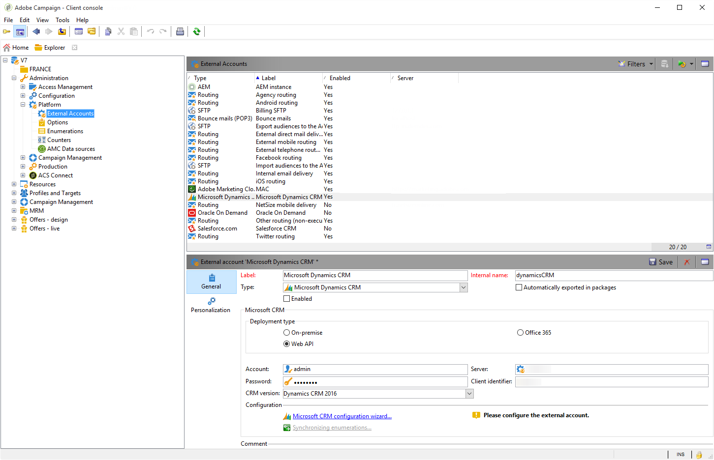

# Conectores CRM{#crm-connectors}

## Acerca de los conectores CRM {#about-crm-connectors}

Adobe Campaign ofrece varios conectores CRM para vincular la plataforma de Adobe Campaign a los sistemas de terceros. Estos conectores de CRM le permiten sincronizar contactos, cuentas, compras, etc., para facilitar la integración de la aplicación con diversas aplicaciones de terceros y de negocios.

Estos conectores permiten una integración de datos rápida y sencilla: Adobe Campaign proporciona un asistente dedicado para recopilar y seleccionar de las tablas disponibles en CRM. De este modo, se garantiza la sincronización bidireccional para garantizar que los datos estén actualizados en todo momento a lo largo de los sistemas.

>[!NOTE]
>
>Esta función está disponible en Adobe Campaign a través del paquete de **conectores de CRM** dedicados.

La conexión a CRM se realiza mediante actividades de flujo de trabajo dedicadas. Estas actividades se describen en el capítulo presentado en [esta sección](../../workflow/using/crm-connector.md).

### Limitaciones y sistemas CRM compatibles {#compatible-crm-systems-and-limitations}

Los CRM enumerados a continuación se pueden integrar en Adobe Campaign.

Las versiones admitidas se detallan en la Campaña [Tabla de compatibilidad](../../rn/using/compatibility-matrix.md).

* **Salesforce.com**

   Consulte [esta sección](#example-for-salesforce-com) para aprender a configurar la conexión con Salesforce.com.

   >[!IMPORTANT]
   >
   >Al conectar Adobe Campaign con Salesforce.com, las limitaciones son:
   >
   >    
   >    
   >    * Compatible con las instancias de producción de prueba.
   >    * Compatible con las reglas de asignación.
   >    * Adobe Campaign no permite varias enumeraciones de selección.

* **Oracle On Demand**

   Consulte [esta sección](#example-for-oracle-on-demand) para aprender a configurar la conexión con Oracle On Demand.

   >[!IMPORTANT]
   >
   >Al conectar Adobe Campaign con Oracle On Demand, las limitaciones son:
   >
   >    
   >    
   >    * Adobe Campaign puede sincronizar cualquier objeto disponible en las plantillas estándar de Oracle On Demand. Si ha agregado tablas personalizadas en Oracle On Demand, estas no se recuperan en Adobe Campaign.
   >    * La versión v1.0 de la API permite ordenar o filtrar datos durante una consulta, pero no permite realizar ambas operaciones simultáneamente.
   >    * Las fechas enviadas por Oracle On Demand no contienen información de zona horaria.
   >    * Adobe Campaign no permite varias enumeraciones de selección.

* **MS Dynamics CRM** y **MS Dynamics Online**

   Consulte [esta sección](#example-for-microsoft-dynamics) para aprender a configurar la conexión con Microsoft Dynamics.

    Consulte varios ejemplos de integración de Adobe Campaign y Microsoft Dynamics en [este vídeo](https://helpx.adobe.com/campaign/kt/acc/using/acc-integrate-dynamics365-with-acc-feature-video-set-up.html).

   >[!IMPORTANT]
   >
   >Al conectar Adobe Campaign con Microsoft Dynamics, las limitaciones son:
   >
   >    
   >    
   >    * La instalación de complementos puede cambiar el comportamiento de CRM, lo que puede dar lugar a problemas de compatibilidad con Adobe Campaign.
   >    * Adobe Campaign no permite varias enumeraciones de selección.

## Configuración de la conexión {#setting-up-the-connection}

Para utilizar conectores CRM en Adobe Campaign, siga los siguientes pasos:

1. Cree la cuenta externa
1. Recopile las tablas CRM
1. Sincronice las enumeraciones
1. Cree el flujo de trabajo de sincronización

>[!NOTE]
>
>Los conectores de CRM solo funcionan con una URL segura (https).

### Ejemplo para Salesforce.com {#example-for-salesforce-com}

Para configurar el conector de **Salesforce.com** con Adobe Campaign, siga los pasos a continuación:

1. Cree una nueva cuenta externa a través del nodo **[!UICONTROL Administration > Platform > External accounts]** en el árbol de Adobe Campaign.
1. Ejecute el asistente de configuración para generar las tablas de CRM disponibles.

   

   El asistente de configuración le permite recopilar tablas y crear el esquema coincidente.

   Haga clic en **[!UICONTROL Start]** para comenzar la ejecución.

   

   >[!NOTE]
   >
   >Para aprobar la configuración, debe cerrar la sesión y volver a iniciarla en la consola de Adobe Campaign.

1. Compruebe el esquema generado en Adobe Campaign en el nodo **[!UICONTROL Administration > Configuration > Data schemas]**.

   

1. Una vez creado el esquema, puede sincronizar las enumeraciones automáticamente con Adobe Campaign a través de CRM.

   Para ello, haga clic en el enlace  **[!UICONTROL Synchronizing enumerations...]** y seleccione la lista desglosada de Adobe Campaign que coincida con la de CRM.

   Puede reemplazar todos los valores de una enumeración de Adobe Campaign con los del CRM: para hacerlo, seleccione **[!UICONTROL Yes]** en la columna **[!UICONTROL Replace]**.

   

   Haga clic en **[!UICONTROL Next]** y a continuación **[!UICONTROL Start]** para iniciar la importación de la lista.

1. Compruebe los valores importados en el menú **[!UICONTROL Administration > Platform > Enumerations]**.

   

1. Para importar datos de Salesforce o exportar datos de Adobe Campaign a Salesforce, debe crear un flujo de trabajo y utilizar la actividad **[!UICONTROL CRM connector]**.

   

### Ejemplo de Oracle On Demand {#example-for-oracle-on-demand}

Para configurar el conector de **Oracle On Demand** para que funcione con Adobe Campaign, siga los pasos siguientes:

1. Cree una nueva cuenta externa a través del nodo **[!UICONTROL Administration > Platform > External accounts]** en el árbol de Adobe Campaign.

   

1. Abra el asistente de configuración: Adobe Campaign muestra automáticamente las tablas del modelo de datos de Oracle. Seleccione las tablas que desea recopilar.

   

1. Haga clic en **[!UICONTROL Next]** para comenzar a crear el esquema coincidente.

   El esquema de datos coincidente está disponible en Adobe Campaign.

   

1. Inicie la sincronización de las enumeraciones entre Adobe Campaign y Oracle On Demand.

   

1. Para importar los datos de Oracle On Demand en Adobe Campaign, cree el siguiente tipo de flujo de trabajo:

   

   Este flujo de trabajo importa contactos a través de Oracle On Demand, los sincroniza con los datos existentes de Adobe Campaign, elimina los contactos duplicados y actualiza la base de datos de Adobe Campaign.

   La actividad **[!UICONTROL CRM Connector]** debe configurarse como se muestra aquí:

   

1. Para exportar datos de Adobe Campaign a Oracle On Demand, cree el flujo de trabajo siguiente:

   

   Este flujo de trabajo recopila los datos pertinentes mediante consultas y después lo exporta a la tabla de contactos de Oracle On Demand.

### Ejemplo de Microsoft Dynamics {#example-for-microsoft-dynamics}

Para configurar el conector de Microsoft Dynamics para que funcione con Adobe Campaign, siga los siguientes pasos:

1. Cree una nueva cuenta externa a través del nodo **[!UICONTROL Administration > Platform > External accounts]** en el árbol de Adobe Campaign.

   

1. Seleccionar el **tipo de implementación**: **[!UICONTROL On-premise]**, **[!UICONTROL Office 365]** o **[!UICONTROL Web API]**, según el conector que desee configurar.

   Adobe Campaign Classic es compatible con la interfaz Dynamics 365 REST con el protocolo de autenticación OAuth.

   Si selecciona una implementación **[!UICONTROL WebAPI]**, es necesario registrar una aplicación en Azure Directory y obtener la **clientId** del directorio. Este registro está documentado en [esta página](https://docs.microsoft.com/en-us/powerapps/developer/common-data-service/walkthrough-register-app-azure-active-directory).

   >[!NOTE]
   >
   >Adobe Campaign Classic no requiere el parámetro redirectURL.

   El valor **clientId** se utiliza con el nombre de usuario y la contraseña para obtener el token de portador mediante la contraseña de tipo de concesión. Esto se denomina **Concesión de credenciales de contraseña de propietario de recursos**. Para obtener más información, consulte [esta página](https://docs.microsoft.com/en-us/azure/active-directory/develop/v2-oauth-ropc).

   

   Para obtener más información sobre la compatibilidad con la versión de CRM, consulte la [matriz de compatibilidad](https://helpx.adobe.com/es/campaign/kb/compatibility-matrix.html).

1. Abra el asistente de configuración. Adobe Campaign detecta automáticamente las tablas de la plantilla de datos de Microsoft Dynamics.

   

1. Seleccionar las tablas que se van a recuperar.

   

1. Haga clic en **[!UICONTROL Next]** y empiece a crear el esquema correspondiente.

   

   >[!NOTE]
   >
   >Para aprobar la configuración, debe desconectarse y volver a conectarse a la consola de Adobe Campaign.

   El esquema de datos coincidente está disponible en Adobe Campaign.

   

1. Inicie la sincronización de las enumeraciones entre Adobe Campaign y Microsoft Dynamics.

   

1. Para importar los datos de Microsoft Dynamics en Adobe Campaign, cree el siguiente tipo de flujo de trabajo:

   

   Este flujo de trabajo importa los contactos a través de Microsoft Dynamics, los sincroniza con los datos de Adobe Campaign existentes, elimina los contactos duplicados y actualiza la base de datos de Adobe Campaign.

   La actividad **[!UICONTROL CRM Connector]** debe configurarse de la siguiente manera:

   

## Sincronización de datos {#data-synchronization}

La sincronización entre Adobe Campaign y CRM se lleva a cabo mediante una actividad de flujo de trabajo dedicada: [Conector de CRM](../../workflow/using/crm-connector.md).

Esta actividad le permite:

* Importar desde CRM (consulte [Importación desde CRM](#importing-from-the-crm)),
* Exportar a CRM (consulte [Exportación a CRM](#exporting-to-the-crm)),
* Importar objetos eliminados en CRM (consulte [Importación de objetos eliminados en CRM](#importing-objects-deleted-in-the-crm)),
* Eliminar objetos en CRM (consulte [Eliminación de objetos en CRM](#deleting-objects-in-the-crm)).

Seleccionar la cuenta externa que coincide con el CRM con el que desea configurar la sincronización y, a continuación, seleccione el objeto que se va a sincronizar (cuentas, oportunidades, posibles clientes, contactos, etc.).

La configuración de esta actividad depende del proceso que se realice. A continuación se describen varias configuraciones.

### Importación desde CRM {#importing-from-the-crm}

Para importar datos a través de CRM en Adobe Campaign, debe crear el siguiente tipo de flujo de trabajo:

Para una actividad de importación, los pasos de configuración de actividad del **conector CRM** son:

1. Seleccione una operación **[!UICONTROL Import from the CRM]**.
1. Ir a la lista desplegable **[!UICONTROL Remote object]** y seleccionar el objeto afectado en el proceso. Este objeto coincide con una de las tablas creadas en Adobe Campaign durante la configuración del conector.
1. Vaya a la sección **[!UICONTROL Remote fields]** e introduzca los campos que desea importar.

   Para agregar un campo, haga clic en el botón **[!UICONTROL Add]** en la barra de herramientas y, a continuación, haga clic en el icono **[!UICONTROL Edit expression]**.

   

   Si es necesario, modifique el formato de los datos mediante la lista desplegable de las columnas de **[!UICONTROL Conversion]**. Los tipos de conversión posibles se encuentran detallados en [Formato de datos](#data-format).

   >[!IMPORTANT]
   >
   >El identificador del registro en CRM es obligatorio para enlazar objetos en CRM y en Adobe Campaign. Se añade automáticamente cuando se aprueba el cuadro.
   >
   >La fecha de modificación del servidor CRM también es obligatoria para las importaciones de datos incrementales.

1. También puede filtrar los datos para importarlos según sus necesidades. Para ello, haga clic en el vínculo **[!UICONTROL Edit the filter...]**.

   En el siguiente ejemplo, Adobe Campaign sólo importa contactos para los que se haya registrado alguna actividad desde el 1 de noviembre de 2012.

   

   >[!IMPORTANT]
   >
   >Las limitaciones vinculadas a los modos de filtrado de datos se describen en [Datos de filtro](#filtering-data).

1. La opción **[!UICONTROL Use automatic index...]** ... permite administrar automáticamente la sincronización de objetos incrementales entre CRM y Adobe Campaign, en función de la fecha y la última modificación.

   Para obtener más información, consulte [Administración variable](#variable-management).

#### Administración de variables {#variable-management}

La activación de la opción **[!UICONTROL Automatic index]** solo permite recopilar objetos modificados desde la última importación.

La fecha de la última sincronización se almacena de forma predeterminada en una opción especificada en la ventana de configuración, por defecto: **LASTIMPORT_&lt;%=instance.internalName%>_&lt;%=activityName%>**.

>[!NOTE]
>
>Esta nota solo se aplica a la actividad genérica **[!UICONTROL CRM Connector]**. Para otras actividades CRM, el proceso es automático.
>
>Esta opción debe crearse manualmente y rellenarse en **[!UICONTROL Administration]** > **[!UICONTROL Platform]** > **[!UICONTROL Options]**. Debe ser una opción de texto y su valor debe coincidir con el siguiente formato: **aaaa/MM/dd hh:mm:ss**.
> 
>Debe actualizar manualmente esta opción para una importación posterior.

Puede especificar el campo remoto CRM que desea tener en cuenta para identificar los cambios más recientes.

De forma predeterminada, se utilizan los campos siguientes (en el orden especificado):

* Para Microsoft Dynamics: **modificado**,
* Para Oracle a petición: **LastUpdated**, **ModifiedDate**, **LastLoggedIn**,
* Para Salesforce.com: **LastModifiedDate**, **SystemModstamp**.

La activación de la opción **[!UICONTROL Automatic index]** genera tres variables que se pueden utilizar en el flujo de trabajo de sincronización a través de una actividad de tipo **[!UICONTROL JavaScript code]**. Estas actividades son:

* **vars.crmOptionName**: representa el nombre de la opción que contiene la última fecha de importación.
* **vars.crmStartImport**: representa la fecha de inicio (incluida) de la última recuperación de datos.
* **vars.crmEndDate**: representa la fecha de finalización (excluida) de la última recuperación de datos.

   >[!NOTE]
   >
   >Estas fechas se muestran en el siguiente formato: **aaaa/MM/dd hh:mm:ss**.

#### Filtrado de datos {#filtering-data}

Para garantizar una operación eficaz con los distintos CRM, es necesario crear filtros con las siguientes reglas:

* Cada nivel de filtrado solo puede utilizar un tipo de operador.
* No se admite el operador AND NOT.
* Las comparaciones solo pueden tener como resultado valores nulos (“está vacío”/“no está vacío”) o números. Esto significa que el valor (columna derecha) se evalúa y el resultado de esta evaluación debe ser un número. Por lo tanto, no se admiten comparaciones de tipo JOIN.
* El valor contenido en la columna derecha se evalúa en JavaScript.
* No se admiten comparaciones JOIN.
* La expresión de la columna de la izquierda debe ser un campo. No puede ser una combinación de varias expresiones, un número, etc.

Por ejemplo, las siguientes condiciones de filtrado NO serán válidas para una importación de CRM, ya que el operador OR se coloca en el mismo nivel que los operadores AND:

* El operador OR se coloca en el mismo nivel que los operadores AND
* Las comparaciones se llevan a cabo en cadenas de texto.

#### Ordenar por {#order-by}

En Microsoft Dynamics y Salesforce.com, puede ordenar los campos remotos para que se importen en orden ascendente o descendente.

Para ello, haga clic en el vínculo **[!UICONTROL Order by]** y añada las columnas a la lista.

El orden de las columnas de la lista es el orden de clasificación:

#### Identificación de registro {#record-identification}

En lugar de importar elementos incluidos (y posiblemente filtrados) en CRM, puede utilizar una población calculada con anterioridad en el flujo de trabajo.

Para ello, seleccione la opción **[!UICONTROL Use the population calculated upstream]** y especifique el campo que contiene el identificador remoto.

A continuación, seleccione los campos de la población entrante que desea importar, como se muestra a continuación:

### Exportación a CRM {#exporting-to-the-crm}

Exportar los datos de Adobe Campaign en CRM permite copiar todo el contenido en una base de datos de CRM.

Para exportar datos a CRM, debe crear el siguiente tipo de flujo de trabajo:

Para una exportación, aplique la configuración siguiente en la actividad del **conector de CRM**:

1. Seleccione una operación **[!UICONTROL Export to CRM]**.
1. Ir a la lista desplegable **[!UICONTROL Remote object]** y seleccionar el objeto afectado en el proceso. Este objeto coincide con una de las tablas creadas en Adobe Campaign durante la configuración del conector.

   >[!IMPORTANT]
   >
   >La función de exportación de la actividad de **conectores de CRM** puede insertar o actualizar campos en el lado del CRM. Para activar las actualizaciones de campo en el CRM, debe especificar la clave principal de la tabla remota. Si falta la clave, se insertan los datos (en lugar de actualizarse).

1. En la sección **[!UICONTROL Mapping]**, especifique los campos que se exportan y su asignación en CRM.

   

   Para agregar un campo, haga clic en el botón **[!UICONTROL Add]** en la barra de herramientas y, a continuación, haga clic en el icono **[!UICONTROL Edit expression]**.

   >[!NOTE]
   >
   >En un campo determinado, si no hay ninguna coincidencia definida en el lado del CRM, los valores no se pueden actualizar: se insertan directamente en el CRM.

   Si es necesario, modifique el formato de los datos mediante la lista desplegable de las columnas de **[!UICONTROL Conversion]**. Los tipos de conversión posibles se encuentran detallados en [Formato de datos](#data-format).

   >[!NOTE]
   >
   >La lista de registros que se van a exportar y el resultado de la exportación se guardan en un archivo temporal que permanece accesible hasta que el flujo de trabajo termina o se reinicia. Esto le permite volver a iniciar el proceso en caso de errores sin correr el riesgo de exportar el mismo registro varias veces o perder datos.

### Configuraciones adicionales {#additional-configurations}

#### Formato de datos {#data-format}

Puede convertir el formato de los datos sobre la marcha al importarlos desde o hacia CRM.

Para ello, seleccione la conversión que se aplica en la columna correspondiente.

El modo **[!UICONTROL Default]** aplica la conversión automática de datos, que en la mayoría de los casos es igual a una copia o pegado de los datos. Sin embargo, se aplica la administración de zona horaria.

Otras conversiones posibles son:

* **[!UICONTROL Date only]**: este modo elimina los campos de tipo Fecha + Hora.
* **[!UICONTROL Without time offset]**: este modo cancela la administración de zona horaria aplicada en el modo predeterminado.
* **[!UICONTROL Copy/Paste]**: este modo utiliza datos sin procesar como cadenas (sin conversión).

#### Error de procesamiento {#error-processing}

Dentro del marco de las importaciones o exportaciones de datos, puede aplicar un proceso específico a errores y rechazos. Para ello, en la pestaña **[!UICONTROL Behavior]** , seleccione la opción **[!UICONTROL Process rejects]** y **[!UICONTROL Process errors]**.

Estas opciones colocan las transiciones de salida coincidentes.

A continuación, coloque las actividades relevantes para los procesos que desee aplicar.

Por ejemplo, para procesar errores puede añadir un cuadro de espera y planificar los reintentos.

Los rechazos se recopilan junto con el código de error y el mensaje relacionado, lo que significa que puede configurar el seguimiento de rechazos para optimizar el proceso de sincronización.

>[!NOTE]
>
>Incluso cuando la opción **[!UICONTROL Process rejects]** no está activada, se genera una advertencia para cada columna rechazada con un código de error y un mensaje.

La transición de salida **[!UICONTROL Reject]** permite acceder al esquema de salida que contiene las columnas específicas de los mensajes de error y los códigos. Estas columnas son:

* **errorLogFilename** (nombre del archivo de registro en Oracle), **errorCode** (código de error), **errorSymbol** (símbolo de error, distinto del código de error), **errorMessage** (descripción del contexto del error).
* **errorSymbol** (símbolo de error, distinto del código de error), **errorMessage** (descripción del contexto del error).

### Importación de objetos eliminados en CRM {#importing-objects-deleted-in-the-crm}

Para habilitar la configuración de un proceso de sincronización de datos extenso, puede importar los objetos eliminados en el CRM a Adobe Campaign.

Para ello, siga los siguientes pasos:

1. Seleccione una operación **[!UICONTROL Import objects deleted in the CRM]**.
1. Ir a la lista desplegable **[!UICONTROL Remote object]** y seleccionar el objeto afectado en el proceso. Este objeto coincide con una de las tablas creadas en Adobe Campaign durante la configuración del conector.
1. Especifique el período de eliminación a tener en cuenta en los campos **[!UICONTROL Start date]** y **[!UICONTROL End date]**. Estas fechas se incluyen en el periodo.

   

   >[!IMPORTANT]
   >
   >El periodo de eliminación de elementos debe coincidir con las limitaciones específicas del CRM. Esto significa que para Salesforce.com, por ejemplo, los elementos eliminados hace más de 30 días no se pueden recuperar.

### Eliminación de objetos en CRM {#deleting-objects-in-the-crm}

Para eliminar objetos en CRM, debe especificar la clave principal de los elementos remotos que desea eliminar.

La pestaña **[!UICONTROL Behavior]** permite activar el procesamiento de los rechazos. Esta opción genera una segunda transición de salida para la actividad **[!UICONTROL CRM connector]**. Para obtener más información, consulte [Error de procesamiento](#error-processing).

>[!NOTE]
>
>Incluso cuando la opción **[!UICONTROL Process rejects]** está desactivada, se genera una advertencia para cada columna rechazada.

